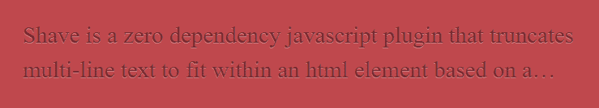

# 用钩子反应普通的 JS 库

> 原文：<https://dev.to/droopytersen/reactify-vanilla-js-libraries-with-hooks-fgd>

React 挂钩使得用 React 组件包装一个普通的 javascript 库变得非常容易，这样你就可以很容易地在整个应用程序中重用，并保持“React 模式”。

在这次演练中，我将只关注一个库， [Shave.js](https://dollarshaveclub.github.io/shave/) ，但是这些技术和思想应该适用于任何更新 javascript 库的 DOM。

## 范例库:Shave.js

由 Dollar Shave Club 开源的, [shave.js](https://dollarshaveclub.github.io/shave/) 有助于在你达到指定高度时用省略号截断多行文本(这是一个令人惊讶的复杂问题)。

给定你的风格和指定的高度，Shave.js 清楚地计算出多少行适合。
[T5】](https://res.cloudinary.com/practicaldev/image/fetch/s--tMG9RENg--/c_limit%2Cf_auto%2Cfl_progressive%2Cq_auto%2Cw_880/https://thepracticaldev.s3.amazonaws.com/i/de5temujs1pm225nsupa.PNG)

## 普通 JS 用法

首先要做的是弄清楚如何使用这个库，而不用担心任何反应。

Shave.js 好看又简单。告诉它要刮哪个元素，并给它一个最大高度。

```
shave(".selector", maxHeight); 
```

也可以传递一个 DOM 元素(而不是`string`选择器)。这在反应地会派上用场。

```
let elem = document.querySelector(".selector");
shave(elem, maxHeight); 
```

## `Shave`反应元件:基本

让我们创建一个名为`Shave`的 React 组件。

我们将让人们在`Shave`中放入他们想要的任何内容，并让他们通过`maxHeight`道具。

用法大概是这样的:

```
<Shave maxHeight={100}>
 Offal vice etsy heirloom bitters selvage prism. Blue bottle forage
 flannel bushwick jianbing kitsch pabst flexitarian mlkshk whatever you
 probably havent heard of them selvage crucifix. La croix typewriter
 blue bottle drinking vinegar yuccie, offal hella bicycle rights iPhone
 pabst edison bulb jianbing street art single-origin coffee cliche. YOLO
 twee venmo, post-ironic ugh affogato whatever tote bag blog artisan.
</Shave> 
```

### 组件样板文件

我们将从创建一个 React 函数组件开始。在 React 中，通过使用特殊的`children`道具，你可以轻松地呈现开发人员放入组件中的任何内容。

```
function Shave({ children, maxHeight }) {
    return (
      <div>{children}</div>
    )
} 
```

### 添加行为

在这一点上，我们有一个组件接受内容，并呈现它。还不是超级有用。我们真正想做的是通过调用`shave`来更新渲染的`div`(传递我们的`maxHeight`属性值)。

换句话说，*我们想要在我们渲染的*的`div`上强加一个**效果**。

我们需要的反应挂钩是:

*   `useRef`获取对我们`div`的引用
*   `useEffect`来影响我们渲染后的`div`。

让我们从简单的步骤开始，连接对我们的 DOM 元素容器(`div`)的引用。

1.  使用`useRef`钩子创建一个变量`elemRef`
2.  将`elemRef`设置为容器`div`上的`ref`道具

```
function Shave({ children, maxHeight }) {
  // keep track of the DOM element to shave
  let elemRef = useRef();

  // apply our elemRef to the container div
  return <div ref={elemRef}>{children}</div>;
} 
```

下一步是多一点...奇怪。

对我自己来说，学习 React Hooks 最难的部分是使用效果，以及从“生命周期”心态转换到“保持效果同步”心态。

很容易说，*“当我们的组件第一次挂载时，我们想要运行 shave 函数”*。但这是旧的“生命周期”思维方式，不能随着复杂性的增加而扩展。

相反，让我们说，*“我们的 shave 应该总是尊重传入的 maxHeight，所以每当我们有一个新的 maxHeight 值时，我们都希望(重新)运行我们的‘shave’效果”*。

*   在初始渲染时，我们从无到有，所以我们的效果会运行(有效地`componentDidMount`)
*   如果`maxHeight`道具改变，我们的效果将再次运行(实际上是`componentDidUpdate`)

`useEffect`是一个接受两个参数的函数

1.  功能-效果的实际代码
2.  一个数组-数组中的任何一个元素改变时，效果都会重新运行。
    *   作为一个经验法则，你的效果函数代码引用的任何东西都应该在这个数组中指定(一些例外是 globals 和 refs)。

*【剃光】效果*

```
// Run a shave every time maxHeight changes
useEffect(() => {
  shave(elemRef.current, maxHeight);
}, [maxHeight]); 
```

随着剃须效果在我们的`div` ref 上调用`shave`，我们有了一个工作组件！

*基本`Shave`组件*T3】

```
function Shave({ children, maxHeight }) {
  // keep track of the DOM element to shave
  let elemRef = useRef();

  // Run an effect every time maxHeight changes
  useEffect(() => {
    shave(elemRef.current, maxHeight);
  }, [maxHeight]);

  // apply our elemRef to the container div
  return <div ref={elemRef}>{children}</div>;
} 
```

你可以在[这个代码沙箱](https://codesandbox.io/s/reactify-shave-part-1-37wq1)中玩一个基本组件`Shave`的演示。

## `Shave`反应元件:高级

先前的`Shave`组件完成了它的工作。我们指定一个最大高度，我们的组件得到截止。但是，让我们想象一下，在我们的应用程序中的几个不同的地方使用它之后，2 个新的需求出现了。

1.  技术负责人提到，它可能会允许开发人员更加语义化。组件不应该总是呈现一个`div`，而是应该允许开发人员指定一个更加语义化的 dom 元素(比如`article`)。
2.  您将`Shave`组件用于 card 'ish 组件的细节部分，并且您需要在用户单击“阅读更多”按钮时切换“剃须”的开关。

### 覆盖 DOM 元素

我们将向`Shave`组件添加一个“元素”属性(默认值为“div”)。然后，如果开发者想要指定一个不同的 html 元素，他们可以使用这个语法:

```
<Shave maxHeight={150} element="article">
  Multiline text content...
</Shave> 
```

要更新`Shave`组件:

1.  接受一个额外的析构属性元素，默认为“div”
2.  创建一个名为`Element`的变量，并将其用作返回的 JSX 中的容器元素

```
function Shave({ children, maxHeight, element = "div" }) {
  // keep track of the DOM element to shave
  let elemRef = useRef();

  // Set our container element to be whatever was passed in (or defaulted to div)
  let Element = element;

  // Run an effect every time maxHeight changes
  useEffect(() => {
    shave(elemRef.current, maxHeight);
  }, [maxHeight]);

  // apply our elemRef to the container element
  return <Element ref={elemRef}>{children}</Element>;
} 
```

这个解决方案的巧妙之处在于，它实际上既支持本地 HTML 元素(作为字符串值)，也可以传递对自定义 React 组件的引用。

```
// Renders the default, a DIV
<Shave maxHeight={150}>
  Multiline text content...
</Shave>

// Renders an ARTICLE
<Shave maxHeight={150} element="article">
  Multiline text content...
</Shave>

// Renders a custom BodyText react component
<Shave maxHeight={150} element={BodyText}>
  Multiline text content...
</Shave> 
```

### 允许“剃毛”切换

要支持在`Shave`组件中切换:

1.  添加一个`enabled`道具，默认为 true。
2.  更新剃须效果代码，仅在`enabled`时剃须。
3.  更新 shave effect references 数组以包含`enabled`，这样如果`enabled`改变，它也会重新运行。
4.  将`enabled`作为`key`添加到我们的容器元素中，这样如果`enabled`发生变化，React 将呈现一个全新的 DOM 节点，导致我们的“shave”效果再次运行。这就是“不刮胡子”的诀窍。

```
function Shave({ children, maxHeight, element = "div", enabled = true }) {
  // keep track of the DOM element to shave
  let elemRef = useRef();
  // Allow passing in which dom element to use
  let Element = element;

  // The effect will run anytime maxHeight or enabled changes
  useEffect(() => {
    // Only shave if we are supposed to
    if (enabled) {
      shave(elemRef.current, maxHeight);
    }
  }, [maxHeight, enabled]);

  // By using enabled as our 'key', we force react to create a
  // completely new DOM node if enabled changes.
  return (
    <Element key={enabled} ref={elemRef}>
      {children}
    </Element>
  );
} 
```

最后，我们需要更新父组件，以跟踪它是否应该被剔除。我们将为此使用`useState`钩子，并连接一个按钮来切换值。

```
function ParentComponent() {
  // Keep track of whether to shave or not
  let [isShaved, setIsShaved] = useState(true);

  return (
    <div>
      <h1>I have shaved stuff below</h1>
      <Shave maxHeight={70} element="p" enabled={isShaved}>
        Mutliline content...
      </Shave>

      <button type="button" onClick={() => setIsShaved(!isShaved)}>
        Toggle Shave
      </button>
    </div>
  );
} 
```

你可以在[这个代码沙箱](https://codesandbox.io/s/reactify-shave-part-2-gzeq2?fontsize=14)中玩一个增强组件`Shave`的演示。

最后，如果你还在这里，并且有兴趣更进一步，[这里有`Shave`组件的另一个迭代](https://codesandbox.io/s/reactify-shave-part-3-wmdef)，它会在每次窗口调整大小时重新运行 shave。它演示了如何通过在适当的时候移除`resize`事件监听器来适当地清理一个效果。

任何评论带有指向分叉 CodeSandbox 的链接的人都将获得 1000 点奖励，该链接包括去抖动 resize 事件！