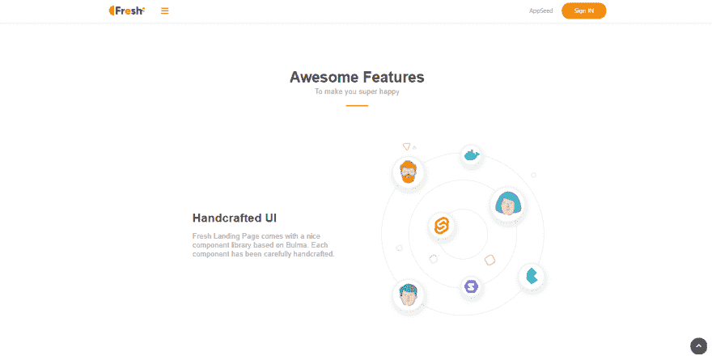
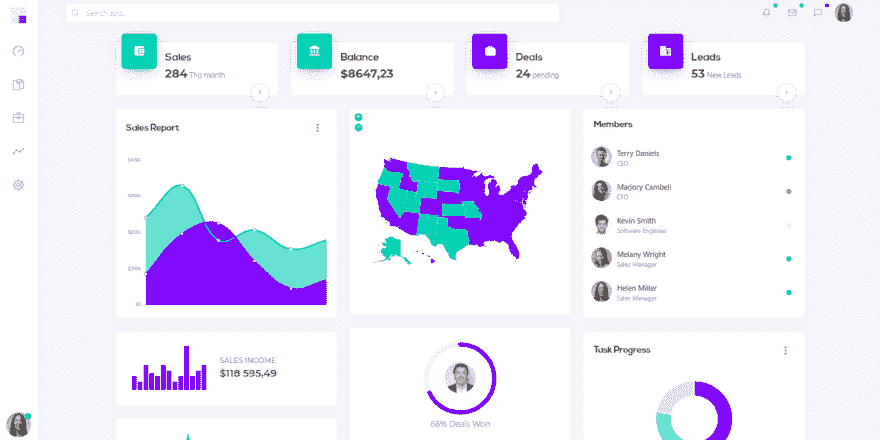
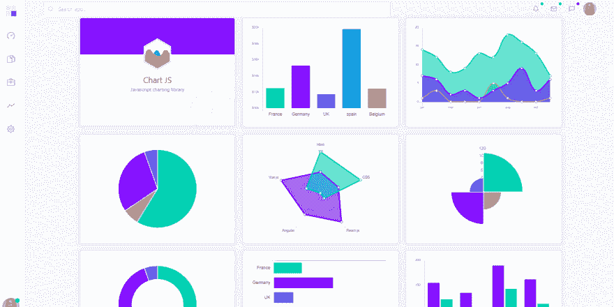
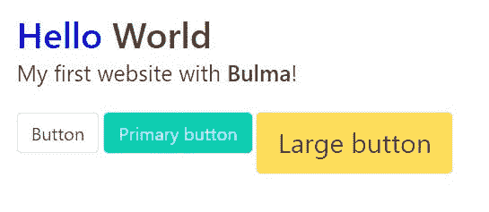
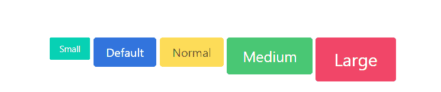
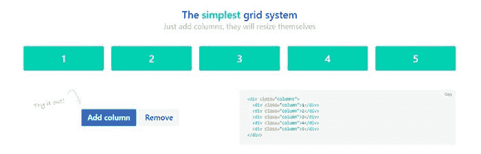
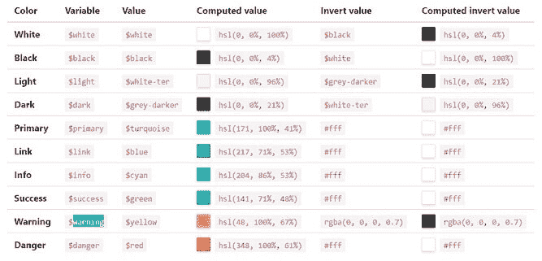
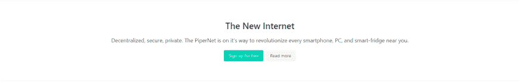
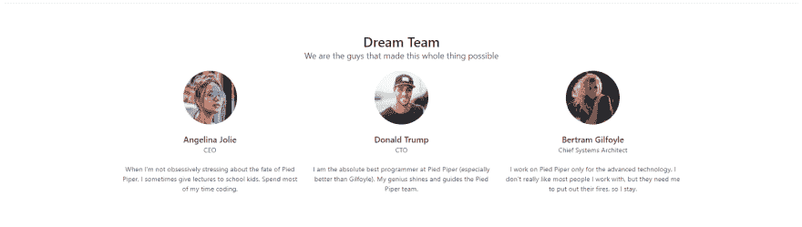

# 布尔玛 CSS -资源和简介

> 原文：<https://dev.to/sm0ke/bulma-css-a-tutorial-for-beginners-af2>

各位编码员好，

在这篇文章中，我将介绍一些关于 **[布尔玛 Css](https://appseed.us/apps/bulma-css/bulmaplay)** 的资源和基本信息——基于 Flexbox 的开源 **CSS 框架**。
**布尔玛**在 CSS 框架的战场上是一个相对较新的进入者，并在短时间内为自己赢得了声誉。

> *感谢阅读！*

* * *

## [布尔玛出场](https://appseed.us/apps/bulma-css/bulmaplay)

一个简单的单页入门程序，采用布尔玛 v0.9.1 风格，在 Github 上以麻省理工学院的许可发布。作为一个简单的 Flask starter，这种基于布尔玛的设计可以轻松集成到任何基于 Python 的框架中，如 Django、FastAPI。

* * *

*   [BulmaPlay](https://appseed.us/apps/bulma-css/bulmaplay) -产品页面
*   [BulmaPlay 演示](https://bulmaplay.appseed-srv1.com/) -实时部署

* * *

[](https://res.cloudinary.com/practicaldev/image/fetch/s--4jqiYRpt--/c_limit%2Cf_auto%2Cfl_progressive%2Cq_auto%2Cw_880/https://raw.githubusercontent.com/app-generator/bulmaplay/master/media/bulmaplay-screen-features.png)

* * *

## 新鲜泡沫

这是一个超级简单的单页启动程序，带有一个汉堡菜单和一个认证表单弹出窗口。UI 由 Css Ninja agency 制作，代码可以在 MIT 许可下直接从 Github 下载。

* * *

*   [布尔玛新鲜出炉](https://github.com/cssninjaStudio/fresh) -源代码
*   [布尔玛新鲜演示](https://cssninjastudio.github.io/fresh/) -现场部署

* * *

[](https://res.cloudinary.com/practicaldev/image/fetch/s--L6vDoL-7--/c_limit%2Cf_auto%2Cfl_progressive%2Cq_auto%2Cw_880/https://raw.githubusercontent.com/app-generator/bulma-css/master/media/fresh-screen-product.png)

* * *

## 布尔玛氪

Krypton 是由 Css Ninja Studio 构建的单页登录页面启动器。氪是在麻省理工学院的许可下授权的，基于这个许可，用户界面可以用于无限的爱好和商业项目

* * *

*   [布尔玛氪](https://github.com/cssninjaStudio/krypton) -源代码

* * *

[](https://res.cloudinary.com/practicaldev/image/fetch/s--m_7fYSjn--/c_limit%2Cf_auto%2Cfl_progressive%2Cq_auto%2Cw_880/https://raw.githubusercontent.com/app-generator/bulma-css/master/media/krypton-screen.png)

* * *

## [烧瓶缓冲装置](https://appseed.us/admin-dashboards/flask-dashboard-dashkit-pro)

CssNinja 设计的 **Dashkit 仪表板**设计(专业版)顶部的 Flask 框架中编码的管理仪表板。

* * *

*   [Flask Dashkit PRO](https://appseed.us/admin-dashboards/flask-dashboard-dashkit-pro) -产品页面
*   [Flask Dashkit PRO - Demo](https://flask-dashboard-dashkit-pro.appseed.us/) -现场部署

* * *

[](https://res.cloudinary.com/practicaldev/image/fetch/s--cSHkE_7I--/c_limit%2Cf_auto%2Cfl_progressive%2Cq_auto%2Cw_880/https://raw.githubusercontent.com/app-generator/flask-dashboard-dashkit-pro/master/media/flask-dashboard-dashkit-pro-screen.png)

* * *

## [姜戈](https://appseed.us/admin-dashboards/django-dashboard-dashkit-pro)

管理仪表板在 Django 框架中编码，位于由 CssNinja 设计的 **Dashkit 仪表板**设计(专业版)之上。

* * *

*   [Django Dashkit PRO](https://appseed.us/admin-dashboards/django-dashboard-dashkit-pro) -产品页面
*   [Django Dashkit PRO - Demo](https://django-dashboard-dashkit-pro.appseed.us/) -实时部署

* * *

[](https://res.cloudinary.com/practicaldev/image/fetch/s--6xwRUHNA--/c_limit%2Cf_auto%2Cfl_progressive%2Cq_auto%2Cw_880/https://raw.githubusercontent.com/app-generator/django-dashboard-dashkit-pro/master/media/django-dashboard-dashkit-pro-screen-4.png)

* * *

## 布尔玛 Css

> 入门指南

用布尔玛编写一个基本的网页非常简单。我们需要包含 CSS 文件，可在 CDN:

```
<!DOCTYPE html>
<html lang="en">
<head>
    Bulma CSS - Starter Page
    <link rel="stylesheet" href="https://cdn.jsdelivr.net/npm/bulma@0.9.1/css/bulma.min.css"  crossorigin="anonymous" />
    <link rel="stylesheet" href="https://cdnjs.cloudflare.com/ajax/libs/font-awesome/5.15.1/css/all.min.css" crossorigin="anonymous" />

</head>
<body>
    <div class="container is-fluid">
        <!-- Add here Bulma Stuff -->
    </div>
</body>
</html> 
```

Enter fullscreen mode Exit fullscreen mode

* * *

布尔玛和字体-Awesome 通过 CDN 加载(无需下载):

*   布尔玛 0.9.1 的缩小版
*   [字体-牛逼](https://cdnjs.cloudflare.com/ajax/libs/font-awesome/5.15.1/css/all.min.css) -缩小版 v5.15

* * *

### 布尔玛语法

> 修饰语

关于布尔玛你应该学习的第一件事是修改器类。这些允许你为几乎所有的布尔玛元素设置不同的风格。都是以**是-** *或者**有-** *开头，然后你把*替换成你想要的样式。例如，让我们添加一些样式按钮:

```
<!DOCTYPE html>
<html>
  <head>
  <body>
  ...
        <p>
            <button class="button">
              Button
            </button>

            <button class="button is-primary">
              Primary button
            </button>

            <button class="button is-large is-warning">
              Large button
            </button>
        </p>
  ...
  </body>
</html> 
```

Enter fullscreen mode Exit fullscreen mode

* * *

> 结果呢

[](https://res.cloudinary.com/practicaldev/image/fetch/s--hc7Tag0L--/c_limit%2Cf_auto%2Cfl_progressive%2Cq_auto%2Cw_880/https://raw.githubusercontent.com/app-generator/static/master/css-frameworks/bulma-css-starter-with-buttons.jpg)

* * *

### 更...小跟班

编写一些简单按钮的代码片段相当简单:

```
<button class="button is-primary is-small">Small</button>
<button class="button is-link">Default</button>
<button class="button is-warning is-normal">Normal</button>
<button class="button is-success is-medium">Medium</button>
<button class="button is-danger  is-large">Large</button> 
```

Enter fullscreen mode Exit fullscreen mode

该代码的输出如下图所示:

* * *

[](https://res.cloudinary.com/practicaldev/image/fetch/s--Tjl48r1k--/c_limit%2Cf_auto%2Cfl_progressive%2Cq_auto%2Cw_880/https://raw.githubusercontent.com/app-generator/bulma-css/master/media/bulma-css-buttons.png)

* * *

### 布尔玛反应迅速

布尔玛的每个元素都是移动优先的，并针对垂直阅读进行了优化，因此默认情况下，在移动设备上使用 5 个[断点](https://bulma.io/documentation/overview/responsiveness/#breakpoints):移动设备(最高 768 像素)、平板电脑(769 像素起)、台式机(1024 像素起)、宽屏:1216 像素起

[](https://res.cloudinary.com/practicaldev/image/fetch/s--QuL_FXBe--/c_limit%2Cf_auto%2Cfl_progressive%2Cq_auto%2Cw_880/https://github.com/app-generator/static/blob/master/css-frameworks/bulma-css-grid.jpg%3Fraw%3Dtrue)

* * *

### Bulma Colors

要设置一个元素的颜色，我们需要使用**前面的【是】-***:

```
.is-danger
.is-warning 
```

Enter fullscreen mode Exit fullscreen mode

* * *

[](https://res.cloudinary.com/practicaldev/image/fetch/s--try0C_1x--/c_limit%2Cf_auto%2Cfl_progressive%2Cq_auto%2Cw_880/https://raw.githubusercontent.com/app-generator/static/master/css-frameworks/bulma-css-colors.jpg)

* * *

### 布尔玛——英雄组件

该组件可以通过使用类“hero”作为主容器来调用，这将在页面上编码一个全幅横幅。

* * *

[](https://res.cloudinary.com/practicaldev/image/fetch/s--Ww-Ve3w9--/c_limit%2Cf_auto%2Cfl_progressive%2Cq_auto%2Cw_880/https://raw.githubusercontent.com/app-generator/bulma-css/master/media/bulma-css-hero-component.png)

* * *

### 布尔玛-团队卡

为我们的团队或定价使用卡片是许多模板中非常常见的组件。布尔玛帮助我们使用最小的 CSS 代码编写团队部分:

* * *

[](https://res.cloudinary.com/practicaldev/image/fetch/s--mlrxJxeF--/c_limit%2Cf_auto%2Cfl_progressive%2Cq_auto%2Cw_880/https://raw.githubusercontent.com/app-generator/bulma-css/master/media/bulma-css-team-cards.png)

* * *

先来看看第一张卡，分析一下相关的 CSS 类:

```
<div class="column is-4">
    <div class="level">
        <div class="level-item">
            <figure class="image is-128x128">
                
            </figure>
        </div>
    </div>
    <h5 class="title is-5">Angelina Jolie</h5>
    <p class="subtitle is-6">CEO</p>
    <p>When I'm not obsessively stressing ...</p>
</div> 
```

Enter fullscreen mode Exit fullscreen mode

*   卡片宽度有 **4 个单元格**(我们一行需要三张卡片)
*   该图像有一个**图形**容器，内部的**为圆角**图像
*   描述符“**是-5** ”和“**是-6** ”是为[标题](https://bulma.io/documentation/elements/title/)对象定义的类

* * *

> 感谢阅读！欲了解更多资源，请访问:

*   [Bulma.io](https://bulma.io/) -官方网站
*   AppSeed 提供的更多[布尔玛 CSS](https://appseed.us/apps/bulma-css) 启动器

* * *

> 顺便说一下，我的(昵称)名字是 **Sm0ke** ，我在[推特](https://twitter.com/Sm0keDev)上也很活跃。