# 将 Spring Boot + MongoDB 应用程序部署到 Azure Web Apps + CosmosDB

> 原文：<https://dev.to/azure/deploying-a-spring-boot-mongodb-application-to-azure-web-apps-cosmosdb-52ki>

## 一个 Spring Boot 和 MongoDB 的应用故事

* * *

**更新:**这篇文章的后续[在这里](https://dev.to/azure/going-full-reactive-with-spring-webflux-and-the-new-cosmosdb-api-v3-1n2a)，我们将这个应用程序迁移到 Spring Webflux 和新的 CosmosDB SQL SDK，以实现完全反应，并研究这种迁移的利弊。

* * *

这篇博客文章来自与一个客户的讨论，这个客户广泛地使用 [JHipster](https://www.jhipster.tech/) 来生成 Spring Boot 微服务，使用 MongoDB 数据库。由于他是 Azure 客户，我们有几个问题:

*   他能“作为服务”托管他的整个架构吗？Spring Boot 的应用程序将由 Azure Web Apps 和他的数据库使用 T2 的 CosmosDB 自动管理和扩展。这对他来说意味着更少的工作、压力和问题！
*   CosmosDB 支持 MongoDB API，但是这种支持有多好呢？他可以在 CosmosDB 上使用当前的应用程序吗？
*   CosmosDB 性能如何，预期价格如何？

因此，我创建了一个示例 Spring Boot + MongoDB 应用程序，可在 https://github.com/jdubois/jhipster-cosmosdb-mongodb 获得。这个应用程序是用 [JHipster](https://www.jhipster.tech/) 构建的，并且使用了我们的一个样本模型，叫做“bug tracker”，在这里可以找到它[。](https://github.com/jhipster/jdl-samples)

## 从 MongoDB 迁移到 CosmosDB

我们的应用程序并不简单:它有几个集合，它们之间有关系。然而，所有这些 API 调用都受 CosmosDB 的支持，所以迁移到 CosmosDB 非常简单:只需使用正确的连接字符串，仅此而已！

首先，我使用 [Azure 门户](https://portal.azure.com/?WT.mc_id=devto-blog-judubois)创建了一个 CosmosDB 实例，并确保它使用了 MongoDB API:

[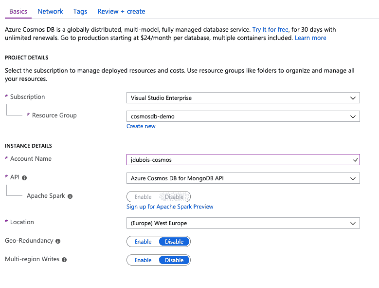](https://res.cloudinary.com/practicaldev/image/fetch/s--8nTu8-2E--/c_limit%2Cf_auto%2Cfl_progressive%2Cq_auto%2Cw_880/https://thepracticaldev.s3.amazonaws.com/i/huheofuhvo96shxnh1ie.png)

然后，我选择该实例来获取到我的 CosmosDB 实例的连接字符串:

[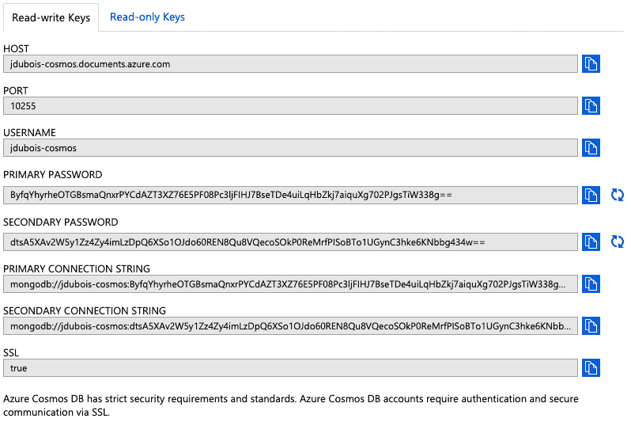](https://res.cloudinary.com/practicaldev/image/fetch/s--bHqk6_O4--/c_limit%2Cf_auto%2Cfl_progressive%2Cq_auto%2Cw_880/https://thepracticaldev.s3.amazonaws.com/i/j83hkcm1mz1wrwhccqxr.png)

在[这个提交](https://github.com/jdubois/jhipster-cosmosdb-mongodb/commit/2e68dfb3ff49d4ba8b397b17d2b789563d2a9a2e)中，我需要做的就是使用 Spring Boot 的连接字符串。

请注意，我们在这里使用的是 Spring 数据 MongoDB，它与 CosmosDB 配合得非常好。

## 收藏数量和定价注意事项

生成的数据库有 8 个集合:

[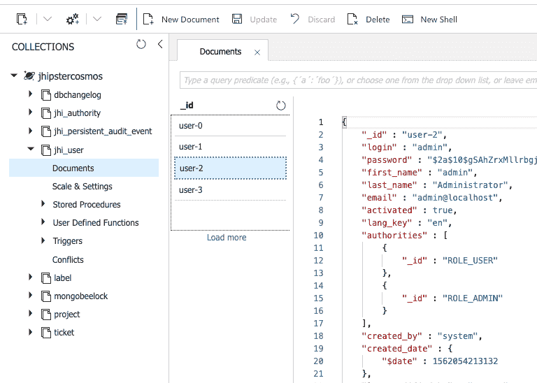](https://res.cloudinary.com/practicaldev/image/fetch/s--gyryUzpz--/c_limit%2Cf_auto%2Cfl_progressive%2Cq_auto%2Cw_880/https://thepracticaldev.s3.amazonaws.com/i/748xzjyhhizop86mqs8p.png)

请注意其中的两个集合，`dbchangelog`和`mongobeelock`被 JHipster 用来自动更新数据库(如果您来自 SQL 数据库世界，您可能知道 Liquibase，它做同样的事情)。此外，我们有两个由 JHipster 创建的系列，`jhi_authority`和`jhi_persistent_audit_event`，它们并不是 100%有用。

使用 CosmosDB，您可以按集合付费，也可以按数据库付费:默认配置是按集合付费，如果您没有定价问题，也推荐这样做，因为这将有助于您的应用程序更好地伸缩。但在这种情况下，我们刚刚注意到的 4 个集合，并不真正有用，会让你花钱。

因此，如果您从 MongoDB 迁移到 CosmosDB，要做的一件重要的事情就是收集的数量:只保留真正有用的，否则这会让您在没有商业价值的情况下花钱。

## 部署到 Azure Web 应用

正如在 [JHipster 文档](https://www.jhipster.tech/azure/)中解释的，这只是添加正确插件的问题，这是在[这个提交](https://github.com/jdubois/jhipster-cosmosdb-mongodb/commit/15b7628ad794391ebad8351d21a2ebe6a44511e9)中完成的。

我们在这里使用 [Azure Web Apps](https://azure.microsoft.com/en-us/services/app-service/?WT.mc_id=devto-blog-judubois) ,因为我们希望拥有完全托管的应用程序。请注意，这允许“向上扩展”(=使用更大的服务器)或“向外扩展”(=动态添加更多服务器)，我们将使用后一个选项来扩展，无需编写任何代码。

## 第一次测试，有 100 个用户

部署我们的应用程序非常容易，但是它的伸缩性好吗？为此，让我们使用 [Gatling 负载测试工具](https://gatling.io/)，因为 JHipster 在 [src/test/gatling](https://github.com/jdubois/jhipster-cosmosdb-mongodb/tree/master/src/test/gatling) 中自动生成了一个负载测试配置。

我们将关注`Product`实体:

*   一旦实体被使用，CosmosDB 就会为它生成一个集合。要小心，因为默认情况下它会有 1，000 RU/s，所以要花一些钱。
*   这个实体也有一个问题:它没有分页！从业务的角度来看，分页是有用的(如果我们有 10，000 个项目，不可能将它们全部显示给最终用户)，但从性能的角度来看，分页也是有用的。因为我们每秒的请求单元数量有限，所以不要因为请求太多数据而浪费它们！因此，我们将请求限制为 20 个项目，在[这个提交](https://github.com/jdubois/jhipster-cosmosdb-mongodb/commit/741c3ce29133785b96e9f634c9af56001dad8878)中。

我们的第一个测试只使用了 100 个并发用户，峰值为每秒 21 个请求。这不是一个很大的负载，所以一切都很好:

[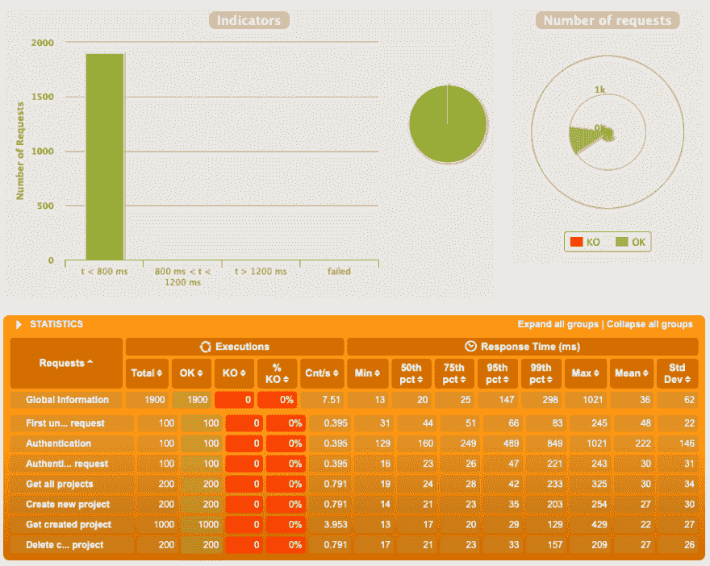](https://res.cloudinary.com/practicaldev/image/fetch/s--dg_1smoa--/c_limit%2Cf_auto%2Cfl_progressive%2Cq_auto%2Cw_880/https://thepracticaldev.s3.amazonaws.com/i/seowmxi3c4zgtrklj7z1.png)

## 打算 500 个用户

由于第一次测试过于简单，我们决定将该系统推给 500 名用户。一切都很顺利，我们达到了每秒 136 个请求的峰值，但是应用程序开始出现一些问题。

[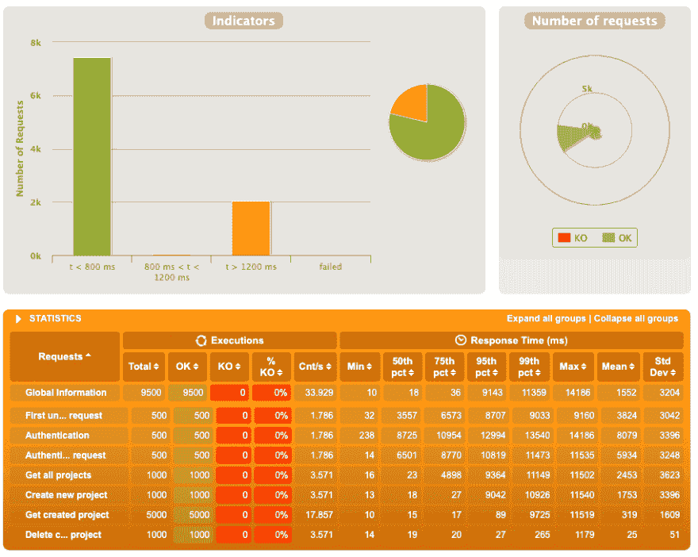](https://res.cloudinary.com/practicaldev/image/fetch/s--9y9SAY4H--/c_limit%2Cf_auto%2Cfl_progressive%2Cq_auto%2Cw_880/https://thepracticaldev.s3.amazonaws.com/i/pii9xql169de6p6ezuz4.png)

事实上，系统有一些缓慢的请求，因为身份验证过程花费了太多时间:

[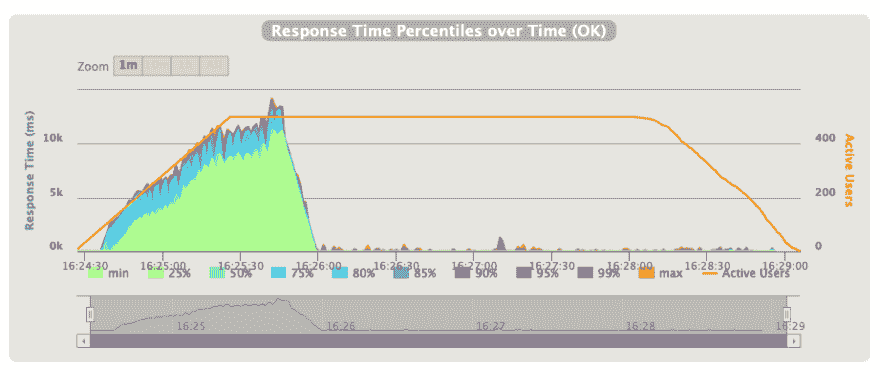](https://res.cloudinary.com/practicaldev/image/fetch/s--J4_xNgc3--/c_limit%2Cf_auto%2Cfl_progressive%2Cq_auto%2Cw_880/https://thepracticaldev.s3.amazonaws.com/i/kypd37zjjgpaoxdsnbwn.png)

## 达到 1000 个用户

为了更高，我们决定将身份验证集合和`Project`集合的 RU/秒升级到 5000。这就是按集合付费的好处:您可以根据自己的业务需求选择要优先考虑的集合。

这使我们能够接触到 1，000 个用户，但是我们仍然有身份验证问题，可能是因为这个过程对于一个 Web 应用程序实例来说成本太高了。这就是为什么最初的请求很慢，然后我们变得更快，峰值达到每秒 308 个请求:

[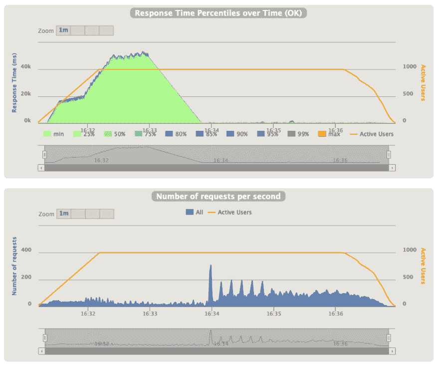](https://res.cloudinary.com/practicaldev/image/fetch/s--oWKolCUI--/c_limit%2Cf_auto%2Cfl_progressive%2Cq_auto%2Cw_880/https://thepracticaldev.s3.amazonaws.com/i/mds1wvpoiqtves6c75bl.png)

## 最多 10000 个用户

在以前的配置中，不可能超过 2，500 个用户，因为应用服务器无法处理这样的负载。Azure Web App 的好处是，你可以使用它来自动缩放你的 Web 应用程序，只需使用一个简单的屏幕:

[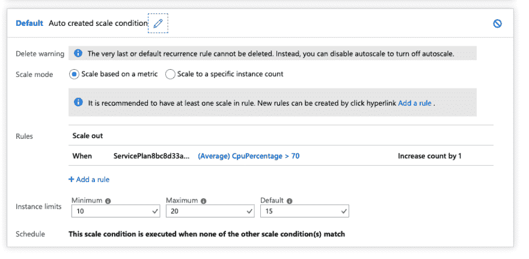](https://res.cloudinary.com/practicaldev/image/fetch/s--8NnYv-4W--/c_limit%2Cf_auto%2Cfl_progressive%2Cq_auto%2Cw_880/https://thepracticaldev.s3.amazonaws.com/i/owuujs58timwg9hijqh9.png)

这解决了需要一些处理能力的认证问题，因为我们在几个服务器之间共享它。这也允许我们支持更多的并发请求。

使用这种设置，我们能够接触到 10，000 名活跃用户:

[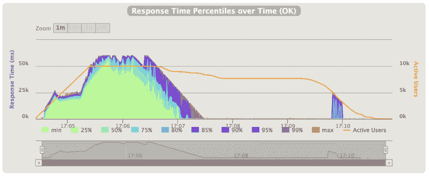](https://res.cloudinary.com/practicaldev/image/fetch/s--bxLdqHeP--/c_limit%2Cf_auto%2Cfl_progressive%2Cq_auto%2Cw_880/https://thepracticaldev.s3.amazonaws.com/i/o6juyruykdas37lel7f4.png)

此外，我们的峰值为 1，029 个请求/秒:

[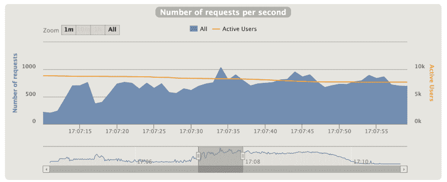](https://res.cloudinary.com/practicaldev/image/fetch/s--XfehTdl---/c_limit%2Cf_auto%2Cfl_progressive%2Cq_auto%2Cw_880/https://thepracticaldev.s3.amazonaws.com/i/wyurxdkyst4wignz43sr.png)

然而，我们在这里有 2%的错误，因为我们到达 10，000 个用户的速度太快，系统无法正确处理所有这些用户。

## 达到 900 请求/秒没有任何问题

由于我们这里的问题是身份验证过程，并且只使用原始的 Web 应用程序功能，我们再次对 1，000 个用户进行了类似的测试，但这次每个用户的请求量增加了 10 倍。在这里，我们有一个非常流畅和稳定的应用程序，它持续提供每秒 900 个请求:

[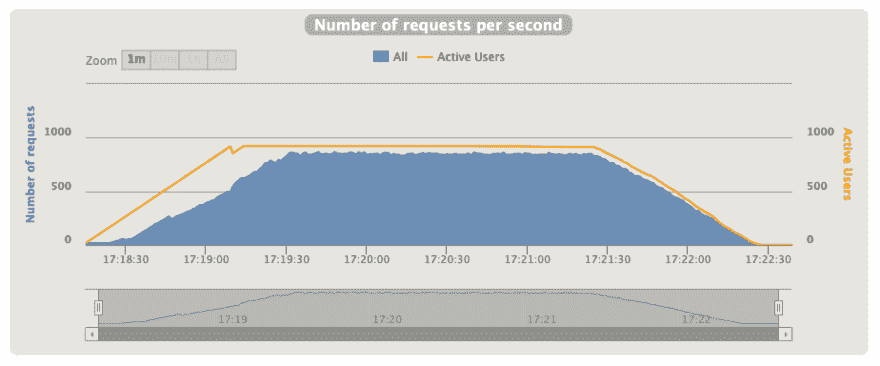](https://res.cloudinary.com/practicaldev/image/fetch/s--AyGB07kw--/c_limit%2Cf_auto%2Cfl_progressive%2Cq_auto%2Cw_880/https://thepracticaldev.s3.amazonaws.com/i/sm56qyc5v3zys8g5lvge.png)

## 结论和想法

我们的测试表明:

*   使用 MongoDB API 运行 CosmosDB 在 API 级别上工作得非常好，并且完全能够扩展以处理负载
*   Azure Web Apps 允许轻松托管和扩展 Spring Boot 应用程序

我们从 100 个用户增加到 10，000 个用户并没有太多问题，只是我们不得不增加 CosmosDB 的请求单元数量，并为 Azure Web 应用配置自动扩展。这允许我们像往常一样继续使用 Spring Boot 和 Spring Data MongoDB:两者都有许多人喜欢的开发人员友好的、简洁的 API。如果我们需要，我们可能会走得更远，处理更多的用户，只要我们愿意为此付费:好消息是可伸缩性工作得很好，似乎是线性的。