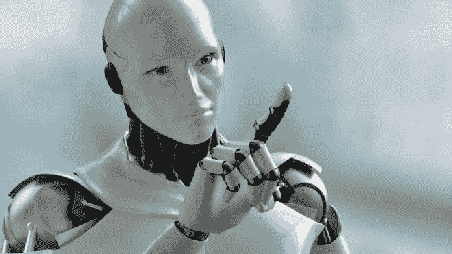
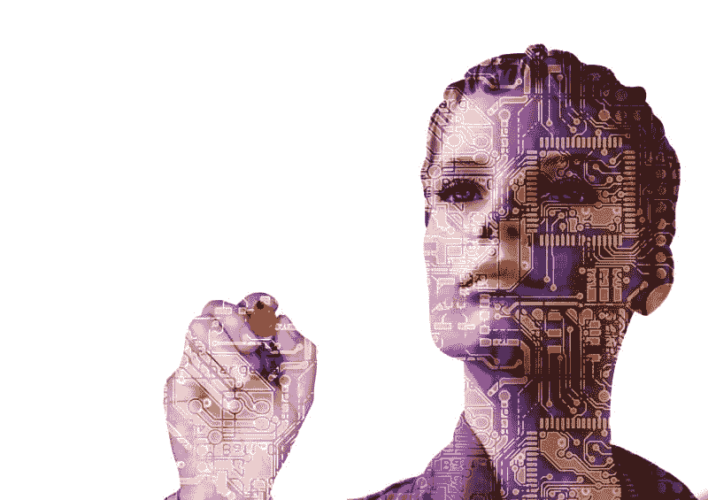

# 人工智能的类型

> 原文：<https://dev.to/jay_tillu/types-of-artificial-intelligence-2167>

自 20 世纪 40 年代以来，我们一直在研究人工智能，所以我们可以说人工智能是一项非常广泛的技术，它有着非常悠久的历史。基本上，人工智能可以分为三个主要类别。这是基于它的智力水平:

1.  狭义人工智能
2.  通用人工智能
3.  超级人工智能

### 狭义人工智能

* * *

狭义 AI 是人类迄今为止实现的人工智能形式。这就是我们今天在周围看到的那种人工智能。狭义人工智能是一种专注于特定狭义任务的人工智能。这种人工智能系统基本上是为解决特定的一类问题而设计的，如过滤垃圾邮件或下棋等。

狭义人工智能在非常有限的环境中工作。这种人工智能擅长执行它被设计的任务。但是如果你给它任何其他的任务，它将无法完成。例如，为下棋而设计的人工智能是下棋的大师，但它不能玩任何其他游戏。

狭义人工智能的一些现实世界的例子:

*   在类似*(我们最后一个，F.E.A.R，《我的世界》，)*等电子游戏中。
*   在类似*(亚马逊 Alexa，谷歌助手，苹果 Siri，微软 Cortana)* 等个人助理中。
*   在亚马逊、Flipkart、Ebay 等销售预测系统中。
*   来理解 Google 相册中的人脸和物体。
*   预测天气预报。
*   预测谷歌造成的疾病损害。
*   谷歌和苹果地图中的旅行时间预测。
*   标记脸书、YouTube、Twitter 等社交网站上的不当内容。
*   预测 Gmail 和 Google Message 中的智能回复。

T3】Gmail 智能回复

 
Gmail 垃圾邮件过滤器

 
谷歌地图

### 人工通用智能

* * *

人工通用智能非常不同，它可能是整个人类历史上最复杂的发明。人工通用智能是人类级别的 AI。意思是**“像人一样能干的机器”**。就像人类可以做计划，理解事物和物体，学习新的东西，把我们自己的智能用于执行某些任务等等。当人工智能能够完成所有的任务时，它就被称为人工智能。

人工智能是人类中发现的一种适应性智能。一种灵活的智能形式，能够学习如何执行完全不同的任务。这是一种在《终结者》、《复仇者联盟:奥创时代》、《T1》等电影中最常见的人工智能。但是人工通用智能还没有出现。今天，人工智能专家们对于它多久会成为现实存在严重分歧。

人工智能研究人员在 2012/2013 年对四组专家进行的一项调查报告称，人工通用智能有 50%的可能性在 2040 年至 2050 年之间被开发出来。但是有些人仍然认为人工智能领先几个世纪。

但是我们越深入研究，就越意识到在计算机中实现人脑是多么困难，也越欣赏人脑背后的奇迹。

最后，我们只能说，很难预测人工智能会对我们的未来产生什么样的影响，以及会产生多大的影响。

### 人工超级智能

* * *

人工智能专家尼克·博斯特罗姆(Nick Bostrom)表示，当人工智能在科学、数学、工程、艺术、规划、理解、社交技能和新事物创造等每个领域都变得比人类聪明时，我们就实现了人工超级智能。

现在，如果我们谈论从人工普通智能到人工超级智能的升级，那么它可以在一周内发生，或者一个月内发生，甚至可以在你眨眼之间发生。

一些科学家，如斯蒂芬·霍金，认为全人工智能的发展是人类的末日。而另一些人认为，随着变得更聪明，它将更有助于人类解决大问题，如环境污染，治疗疾病，探索宇宙，降低犯罪率等。

***AI 的实现是无止境的，它绝对是整个人类历史上最大的革命，这只是一个开始……***

今天就到这里，伙计们。感谢阅读。敬请关注更多内容。

在那之前，继续编码，继续爱。

> 想和我联系吗？以下是链接。我很乐意成为你的朋友。T3】😊
> [推特](https://twitter.com/jay_tillu)
> [脸书](https://www.facebook.com/jaytillu.1314/)
> [insta gram](https://www.instagram.com/jay.tillu/)
> 或者直接发邮件给我[jayviveki13@gmail.com](mailto:jayviveki13@gmail.com)