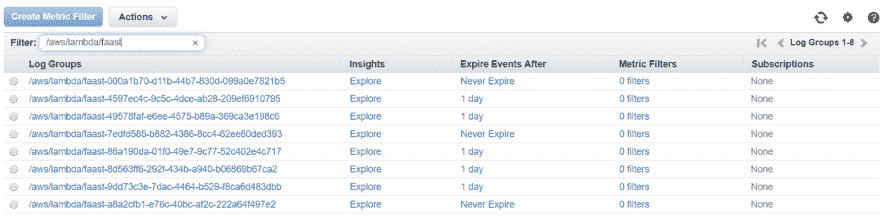

# 使用 Faast.js 分析无服务器功能的成本

> 原文：<https://dev.to/cloudforecast/analyzing-the-cost-of-your-serverless-functions-using-faast-js-4oai>

### faast . js 是什么？

Faast.js 是一个开源项目，它简化了像 AWS Lambda 这样的无服务器函数的调用。它允许您调用无服务器函数，就像它们是日常代码中的常规函数一样。但好处不止于此。它允许您在实际调用该函数时启动无服务器基础设施。无需再为您的无服务器环境进行前期配置。

这是一个有趣的将基础设施作为代码的观点。有了 faast，我们不再用像 HCL 或 YAML 这样的语言来定义我们的基础设施。相反，这更类似于 Pulumi，我们的基础设施存在于我们在服务中实际使用的代码中。但是最大的不同是，我们的基础设施是在调用函数时提供的。

但是，等等，如果我的基础设施是为我的无服务器管道按需分配的，我怎么知道运行它的成本是多少？

Faast.js 也有你的报道。您可以使用成本快照功能实时估算您的成本。如果您需要更深入的了解，您可以使用成本分析器并行估算许多配置的成本。

在这篇文章中，我们将探讨如何使用 faast.js 在 AWS Lambda 中提供无服务器功能。我们将创建一个简单的无服务器函数，并使用 faast.js 调用它，以查看我们的工作负载是如何动态创建和销毁的。我们还将深入探讨一些巧妙的功能，如成本分析。

### 我们的无服务器功能使用 faast.js

要开始，我们首先需要配置 AWS CLI。faast.js 需要知道我们的无服务器功能正在使用哪个云提供商。通过使用正确的访问密钥安装 CLI，我们的 faast 设置将会检测到我们在环境中使用了 AWS Lambda。

一旦我们都配置好使用 AWS 作为我们的云提供商，我们就可以通过将这个库安装到我们的项目中来开始使用 faast。

```
$ npm install faastjs 
```

Enter fullscreen mode Exit fullscreen mode

接下来，让我们在名为`functions.js`的文件中创建我们的无服务器函数实现。对于这篇博文，我们的函数将非常简单。我们希望专注于 faast 提供的好处，但我们需要一个现实的无服务器功能来做到这一点。

使用 faast 时需要记住的一件重要事情是，我们的无服务器函数必须是幂等的。这意味着它接受一个输入，并在每次调用时产生相同的输出。这是因为 faast 提供的抽象为重试函数敞开了大门。

出于我们的目的，让我们创建一个简单的函数，它接受一个数字数组并将它们相乘，然后返回结果。这是一个简单的例子，但是它将允许我们演示如何使用 faast 来扩展我们的调用以及估计我们函数的成本。这也是幂等性的一个基本例子，相同的两个输入将总是产生相同的乘积。

让我们深入研究一下无服务器函数的代码。

```
exports.multiply = function(numbers) {
    return numbers.reduce((currTotal, num) => currTotal * num);
} 
```

Enter fullscreen mode Exit fullscreen mode

很简单，对吧？我们有一个单行函数，它接受一个数字数组，并返回所有数字的最终乘积。

现在我们有了基本的无服务器功能，让我们将 faast.js 合并到我们的设置中。在我们的`index.js`文件中，我们将从创建一些随机数数组开始。然后，我们可以使用这些数组多次并行调用我们的无服务器函数。

```
const { faast }  = require("faastjs");
const funcs = require("./functions");

async function main() {
    const testArrays = [];
    for(let i = 0; i <= 1000; i++) {
        var randomLength = Math.floor((Math.random() * 10) + 1);
        var arr = [];

        for(let k = 1; k <= randomLength; k++) {
            arr.push(k);

        testArrays.push(arr);

    console.log("Invoking serverless functions");
    await invokeFunctions(testArrays);
    console.log("Done invoking serverless functions");
} 
```

Enter fullscreen mode Exit fullscreen mode

这里我们生成 1000 个随机长度的数组，然后将它们传递给我们的`invokeFunctions`函数。正是这个函数利用 faast 来并行调用我们的乘法无服务器函数。

```
async function invokeFunctions(arrays) {
    const invoker = await faast("aws", funcs);
    const promises = []
    for(let i = 0; i < arrays.length; i++) {
        promises.push(invoker.functions.multiply(arrays[i]))

    const results = await Promise.all(promises);
    await invoker.cleanup();
    console.log("Invocation results");
    console.log(results);
} 
```

Enter fullscreen mode Exit fullscreen mode

我们的`invokeFunctions`方法创建我们的 faast 调用者。然后，它为我们传递给它的每个测试数组调用我们的`multiply`函数。我们的函数调用返回一个承诺，这个承诺被添加到一个`promises`数组中，在这里我们可以`await`所有的调用。一旦我们所有的无服务器函数完成，我们就在调用者上调用`cleanup`方法来破坏创建的基础设施。

### 运行我们的无服务器功能

现在我们已经有了无服务器函数和 faast 将用来调用它的外部调用逻辑，是时候进行测试了。

这是通过调用我们的入口点脚本来完成的。从我们的代码所在的根目录，运行以下命令。请注意。js 应该替换为 faast js 调用者调用您的无服务器函数的文件名。

```
$ npm install
$ node src/<your-entry-point>.js 
```

Enter fullscreen mode Exit fullscreen mode

就是这样！我们只是通过 faast.js 框架调用了我们的无服务器功能。我们应该在输出中看到类似这样的日志。

```
$ node src/index.js
Invoking serverless functions
Invocation results
[ 720,
  6,
  40320,
  720,
  3628800,
  120,
  3628800,
.....] 
```

Enter fullscreen mode Exit fullscreen mode

很酷吧？我们能够在自己的模块中编写我们的无服务器函数，然后使用 faast.js 从我们的代码中调用它，就像调用任何旧函数一样。我们的 AWS 基础架构没有预先配置。不需要处理重试或错误，一切都为我们清理干净。

我们可以通过查看为每个函数创建的 CloudWatch 日志组来了解这一点。你可以通过进入你的 AWS 账户中的 CloudWatch 日志，然后过滤前缀`/aws/lambda/faast`来查看这些日志。

[](https://res.cloudinary.com/practicaldev/image/fetch/s--BHDd6j_Y--/c_limit%2Cf_auto%2Cfl_progressive%2Cq_auto%2Cw_880/https://www.cloudforecast.io/blog/asseimg/posts/lambdafaast.png)

这是一个令人兴奋的将基础设施作为代码的尝试。它消除了提前配置基础架构的需要。我们不必提前配置这些 Lambda 函数，它们是在调用 faast 模块时动态创建的。仅此一点就非常令人兴奋，因为它允许开发人员调用无服务器工作负载，就像它们是我们日常代码中的函数一样。

但是还有更好的。

### 我们的调用花费了多少？

权力越大，做错事的风险就越大。或者从 AWS 的角度来说，因为某些配置错误，月底会收到高额账单。

事实证明，faast 及其内置的成本分析器可以帮助我们解决这个问题。让我们更新我们的逻辑，以利用成本分析器，这样我们就可以看到我们的调用成本的分解。

我们需要做的就是在 faast invoker 上调用一个名为`costSnapshot`的函数。所以我们在下面添加了这个来查看我们的无服务器调用的开销。下面是处理这个问题的更新代码。

```
async function invokeFunctions(arrays) {
    const invoker = await faast("aws", funcs);
    const promises = []
    for(let i = 0; i < arrays.length; i++) {
        promises.push(invoker.functions.multiply(arrays[i]))

    const results = await Promise.all(promises);
    await invoker.cleanup();
    console.log(results);

    const costSnapshot = await invoker.costSnapshot();
    console.log(costSnapshot.toString());
} 
```

Enter fullscreen mode Exit fullscreen mode

那么，我们当前的无服务器管道成本是多少？下面是调用`costSnapshot`的日志输出。

```
functionCallDuration  $0.00002813/second          100.1 seconds    $0.00281588    91.9%  [1]
functionCallRequests  $0.00000020/request          1001 requests   $0.00020020     6.5%  [2]
outboundDataTransfer  $0.09000000/GB         0.00052891 GB         $0.00004760     1.6%  [3]
sqs                   $0.00000040/request             0 request    $0              0.0%  [4]
sns                   $0.00000050/request             0 request    $0              0.0%  [5]
logIngestion          $0.50000000/GB                  0 GB         $0              0.0%  [6]
--------------------------------------------------------------------------------------------
                                                                   $0.00306368 (USD)

  * Estimated using highest pricing tier for each service. Limitations apply.
 ** Does not account for free tier.

[6]: https://aws.amazon.com/cloudwatch/pricing/ - Log ingestion costs not currently included. 
```

Enter fullscreen mode Exit fullscreen mode

这里我们看到有 1001 个总持续时间为 100 秒的函数请求，以及一小部分出站数据传输。所有这些总共是 0.003 美元。

### 把所有的东西放在一起

我们所展示的是，我们可以构建一个不需要前期基础设施的无服务器功能。我们的乘法功能是通过 faast 动态提供的。我们甚至可以从 faast 中转储成本快照，以查看我们的调用作为一个整体以及基于每个请求的成本。

这使得我们作为开发人员可以抽象出无服务器的世界，但仍然可以获得它的所有优势。

想象一下，如果我们的调用器包装器不是一个从命令行运行的脚本，而是在我们构建的 API 中调用的另一个函数。API 的开发者只需要知道如何在 JavaScript 中调用我们的函数。所有无服务器的知识和基础设施都完全从它们中抽象出来。对他们的代码来说，这只不过是另一个功能。

对于不熟悉无服务器世界的人来说，这是一个很好的抽象层。它为您提供了 It 的所有优势，而无需攀登一些学习曲线。

但是，这是有代价的。如果做错了，我们的无服务器成本可能会飙升。如果 API 开发者在一个`while`循环中调用我们的函数，而没有理解其中的后果，我们在月底的 AWS 账单会让我们哭泣。

### 结论

从无服务器和基础设施的角度来看，Faast.js 是一个非常酷的想法。最好的代码是你永远不用写的代码。Faast 通过在我们需要时为我们调配基础架构，为我们提供了这一点。它还允许我们将无服务器工作负载视为代码中的另一个函数。

它确实会带来成本和一些可能不适合所有用例的问题。例如，为 Lambda 函数创建的角色具有管理员访问权限，但没有办法进行配置。这不是安全最佳实践。还有一种情况是，如果没有调用`cleanup`方法，其他资源可能会留在您的帐户中。

这些都是我确信这个项目要解决的问题。与此同时，我建议在开发/测试环境中试用 Faast，以了解无服务器工作负载在规模上的成本。

如果你有任何关于 Faast.js 或无服务器的问题，请随时通过 twitter [@kylegalbraith](https://dev.to/kylegalbraith) 联系我或在下面留言。此外，查看我每周的[边做边学简讯](https://kylegalbraith.com/learn-by-doing)或我的[通过使用 It 学习 AWS 课程](https://kylegalbraith.com/learn-aws)来了解更多关于云、编码和 DevOps 的信息。

如果您有关于 CloudForecast 的问题，以帮助您监控和优化 AWS 成本，请随时 ping Tony:[Tony @ cloud forecast . io](mailto:tony@cloudforecast.io)