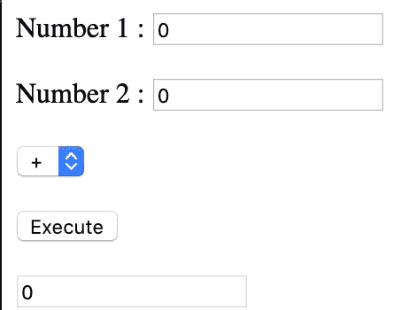

# 酷小孩用钩子处理状态

> 原文：<https://dev.to/amirmoh10/cool-kids-handle-state-with-hooks-52p3>

React 应用程序基本上是一组 React 组件，它们被放在一起服务于应用程序的目的。这些组件可以是功能性的，也可以是类。 **Functional** 组件是接收道具(属性)并返回渲染到屏幕上的 JSX 代码的函数。它们被归类为无状态组件，因为它们不使用状态和生命周期方法。

然而，在 16.8 之前，如果你想在你的组件中有一个状态或者想使用生命周期方法，你需要使你的组件成为一个基于**类的**组件。创建应用程序时，使用这两种类型的组件各有优势。然而，它们之间的转换真的很烦人，当涉及到复杂的应用程序时，知道使用哪个生命周期、何时以及如何正确使用它真的很有挑战性。

React 16.8 引入了一个新特性:**钩子**。React 钩子是一个根本性的改变，因为它们使得创建有状态(带状态)的函数组件成为可能！

这篇文章旨在展示 React 中状态管理的当前状态。我们将以一个简单的计算器应用程序为例，使用类组件逻辑实现它，然后使用两个不同的 React 钩子:`useState`和`useReducer`。通过这样做，我们将经历类和函数组件中的状态操作。

* * *

我们计算器应用程序的最终结果将如下所示:

[](https://res.cloudinary.com/practicaldev/image/fetch/s--fmIf9mno--/c_limit%2Cf_auto%2Cfl_progressive%2Cq_66%2Cw_880/https://cdn-images-1.medium.com/max/1600/1%2AEWxHgl3Ek64DGyHfCPPYWw.gif)

计算器接受两个输入数字，根据选定的运算符执行算术运算。

```
class App extends React.Component {
  constructor(props) {
    super(props);
    this.state = {
     ....
    };
  }
  ...
  };
  render() {
    return (
      <form>
        <label>
          <div>
            Number 1 : <input type="text" onChange={this.firstNumUpdate} />
          </div>
          <br />
          <div>
            Number 2 : <input type="text" onChange={this.secondNumUpdate} />
          </div>
          <br />
          <div>
            <select onChange={this.operatorUpdate}>
              <option value="+">+</option>
              <option value="-">-</option>
              <option value="*">*</option>
              <option value="/">/</option>
            </select>
            <br />
            <br />
          </div>
          <input type="button" onClick={this.executeComputation} value="Execute" />
          <div />
          <br />
          <input type="text" value={this.state.result} />
        </label>
      </form>
    );
  }
} 
```

<svg width="20px" height="20px" viewBox="0 0 24 24" class="highlight-action crayons-icon highlight-action--fullscreen-on"><title>Enter fullscreen mode</title></svg> <svg width="20px" height="20px" viewBox="0 0 24 24" class="highlight-action crayons-icon highlight-action--fullscreen-off"><title>Exit fullscreen mode</title></svg>

* * *

# I-使用一个类组件

再次提醒您，我们借助基于**类的**类型组件来创建我们的应用程序，以便捕捉用户输入并相应地更新状态值。我们的应用程序的状态包括以下内容:

*   **firstnumber** :用户输入的数字 1，
*   **第二个数字**:用户输入的第二个数字，
*   **操作员**:用户选择的操作员，
*   **结果**:用运算符计算数字 1 和数字 2 的最终结果。

```
class App extends React.Component {
  constructor(props) {
    super(props);
    this.state = {
      firstnumber: 0,
      secondnumber: 0,
      operator: "+",
      result: 0
    };
    this.firstNumUpdate = this.firstNumUpdate.bind(this);
    this.secondNumUpdate = this.secondNumUpdate.bind(this);
    this.operatorUpdate = this.operatorUpdate.bind(this);
  }
  ...
} 
```

<svg width="20px" height="20px" viewBox="0 0 24 24" class="highlight-action crayons-icon highlight-action--fullscreen-on"><title>Enter fullscreen mode</title></svg> <svg width="20px" height="20px" viewBox="0 0 24 24" class="highlight-action crayons-icon highlight-action--fullscreen-off"><title>Exit fullscreen mode</title></svg>

我们还有我们的`onChange`和`onClick`处理程序，它们调用`this.setState`来更新 **this.state** 中的动态存储值:

*   `firstNumUpdate`:根据数字 1 用户输入更新状态值 firstnumber 的函数，
*   `secondNumUpdate`:根据数字 2 用户输入更新状态值 secondnumber 的函数，
*   `operatorUpdate`:根据操作员用户选择更新状态值操作员的功能。
*   `executeComputation`:根据数字 1、数字 2 和所选运算符计算结果的函数。

```
firstNumUpdate(evt) {
    this.setState({ firstnumber: Number(evt.target.value) });
  }
  secondNumUpdate(evt) {
    this.setState({ secondnumber: Number(evt.target.value) });
  }
  operatorUpdate(evt) {
    this.setState({ operator: evt.target.value });
  }

  executeComputation = () => {
    let z = null;
    let operator = this.state.operator;
    let firstnumber = this.state.firstnumber;
    let secondnumber = this.state.secondnumber;

    switch (operator) {
      case "+":
        z = firstnumber + secondnumber;
        break;
      case "-":
        z = firstnumber - secondnumber;
        break;
      case "/":
        z = firstnumber / secondnumber;
        break;
      case "*":
        z = firstnumber * secondnumber;
        break;
      default:
        throw new Error();
    }

    this.setState({ ...this.state, result: z });
  }; 
```

<svg width="20px" height="20px" viewBox="0 0 24 24" class="highlight-action crayons-icon highlight-action--fullscreen-on"><title>Enter fullscreen mode</title></svg> <svg width="20px" height="20px" viewBox="0 0 24 24" class="highlight-action crayons-icon highlight-action--fullscreen-off"><title>Exit fullscreen mode</title></svg>

总而言之，我们的类组件的返回方法是这样的:

```
class App extends React.Component {
  constructor(props) {
    super(props);
    this.state = {
      firstnumber: 0,
      secondnumber: 0,
      operator: "+",
      result: 0
    };
    this.firstNumUpdate = this.firstNumUpdate.bind(this);
    this.secondNumUpdate = this.secondNumUpdate.bind(this);
    this.operatorUpdate = this.operatorUpdate.bind(this);
  }

  firstNumUpdate(evt) {
    this.setState({ firstnumber: Number(evt.target.value) });
  }
  secondNumUpdate(evt) {
    this.setState({ secondnumber: Number(evt.target.value) });
  }
  operatorUpdate(evt) {
    this.setState({ operator: evt.target.value });
  }

  executeComputation = () => {
    let z = null;
    let operator = this.state.operator;
    let firstnumber = this.state.firstnumber;
    let secondnumber = this.state.secondnumber;

    switch (operator) {
      case "+":
        z = firstnumber + secondnumber;
        break;
      case "-":
        z = firstnumber - secondnumber;
        break;
      case "/":
        z = firstnumber / secondnumber;
        break;
      case "*":
        z = firstnumber * secondnumber;
        break;
      default:
        throw new Error();
    }

    this.setState({ ...this.state, result: z });
  };

  render() {
    return (
      <form>
        <label>
          <div>
            Number 1 : <input type="text" onChange={this.firstNumUpdate} />
          </div>
          <br />
          <div>
            Number 2 : <input type="text" onChange={this.secondNumUpdate} />
          </div>
          <br />
          <div>
            <select onChange={this.operatorUpdate}>
              <option value="+">+</option>
              <option value="-">-</option>
              <option value="*">*</option>
              <option value="/">/</option>
            </select>
            <br />
            <br />
          </div>
          <input
            type="button"
            onClick={this.executeComputation}
            value="Execute"
          />
          <div />
          <br />
          <input type="text" value={this.state.result} />
        </label>
      </form>
    );
  }
} 
```

<svg width="20px" height="20px" viewBox="0 0 24 24" class="highlight-action crayons-icon highlight-action--fullscreen-on"><title>Enter fullscreen mode</title></svg> <svg width="20px" height="20px" viewBox="0 0 24 24" class="highlight-action crayons-icon highlight-action--fullscreen-off"><title>Exit fullscreen mode</title></svg>

我们的类组件到此为止！你可以在这里查看代码[。](https://codesandbox.io/s/classcalculator-f581y)

现在我们已经看到了计算器作为一个类组件的样子，让我们使用钩子来实现它。

* * *

# II-使用功能组件

## a)使用 useState 钩子

现在让我们使用一个功能组件和`useState`钩子来实现同一个应用程序。我们不能再使用 **this.state** 或 **this.setState** 属性，因为我们不会使用基于类的组件。然而，我们的**功能**组件在钩子的帮助下将存储和更新状态。如前所述，钩子是 React 助手函数，用来创建&操作组件的状态。

首先让我们从 React 导入`useState`。

```
import React, { useState } from "react"; 
```

<svg width="20px" height="20px" viewBox="0 0 24 24" class="highlight-action crayons-icon highlight-action--fullscreen-on"><title>Enter fullscreen mode</title></svg> <svg width="20px" height="20px" viewBox="0 0 24 24" class="highlight-action crayons-icon highlight-action--fullscreen-off"><title>Exit fullscreen mode</title></svg>

然后，我们使用以下语法将基于类的应用程序组件编写为功能组件:

```
function App() { 
```

<svg width="20px" height="20px" viewBox="0 0 24 24" class="highlight-action crayons-icon highlight-action--fullscreen-on"><title>Enter fullscreen mode</title></svg> <svg width="20px" height="20px" viewBox="0 0 24 24" class="highlight-action crayons-icon highlight-action--fullscreen-off"><title>Exit fullscreen mode</title></svg>

然后我们调用`useState`钩子函数，它为用户输入获取一个初始状态，并返回一个包含两个元素的数组:

```
const initialState = {
  firstnumber: 0,
  secondnumber: 0,
  operator: "+",
  result: 0
};

function App() {
  const [state, setState] = useState(initialState);
  ...
} 
```

<svg width="20px" height="20px" viewBox="0 0 24 24" class="highlight-action crayons-icon highlight-action--fullscreen-on"><title>Enter fullscreen mode</title></svg> <svg width="20px" height="20px" viewBox="0 0 24 24" class="highlight-action crayons-icon highlight-action--fullscreen-off"><title>Exit fullscreen mode</title></svg>

*   数组的第一个元素是对象的**状态，**
*   第二个元素是用于更新状态的函数。对于**初始状态**，我们可以传递任何东西，一个空字符串，0，null，一个空数组，一个空对象，任何你想要初始管理的状态。

```
const [state, setState] = useState(initialState); 
```

<svg width="20px" height="20px" viewBox="0 0 24 24" class="highlight-action crayons-icon highlight-action--fullscreen-on"><title>Enter fullscreen mode</title></svg> <svg width="20px" height="20px" viewBox="0 0 24 24" class="highlight-action crayons-icon highlight-action--fullscreen-off"><title>Exit fullscreen mode</title></svg>

在我们的例子中，我们决定将第一个数字、第二个数字和结果输入元素的初始值设为“0”，而操作符选择输入元素的初始值为“+”。

> *我们当然可以使用一个单独的`useState`调用，并将我们所有的状态(包括数字、结果和操作符)放在一个单独的对象中。然而，明智的方法是使用多个调用，这样你可以分开你的状态，独立地改变它们，并且一次一个状态地关注**。***

 **当一个事件被触发时(例如，第一个数字输入的 onChange 事件)，我们使用其对应的状态更新器函数来执行状态更新。

```
const operatorUpdate = evt => {
  setState({ ...state, operator: evt.target.value });
};

const firstNumUpdate = evt => {
  setState({ ...state, firstnumber: Number(evt.target.value) });
};

const secondNumUpdate = evt => {
  setState({ ...state, secondnumber: Number(evt.target.value) });
};

const executeComputation = () => {
  let z = null;
  let operator = state.operator;
  let firstnumber = state.firstnumber;
  let secondnumber = state.secondnumber;

  switch (operator) {
    default:
      z = firstnumber + secondnumber;
      break;
    case "-":
      z = firstnumber - secondnumber;
      break;
    case "/":
      z = firstnumber / secondnumber;
      break;
    case "*":
      z = firstnumber * secondnumber;
      break;
  }

  setState({ ...state, result: z });
}; 
```

<svg width="20px" height="20px" viewBox="0 0 24 24" class="highlight-action crayons-icon highlight-action--fullscreen-on"><title>Enter fullscreen mode</title></svg> <svg width="20px" height="20px" viewBox="0 0 24 24" class="highlight-action crayons-icon highlight-action--fullscreen-off"><title>Exit fullscreen mode</title></svg>

瞧🎉！点击查看我们的计算器应用程序的外观

## b)使用 useReducer 挂钩

并不是我们唯一可以用来操作组件状态的钩子。我们现在将看到另一个钩子，`useReducer`，它用不同的语法帮助实现相同的结果。这个钩子使用带有两个参数的 reducer:一个状态和一个动作，并返回应用程序的新状态。如果你曾经使用过 Redux 状态管理库，你会发现`useReducer`钩子对 Redux 的 reducer 非常熟悉。

> *`useReducer`采用一个函数(称为 reducer ),它有两个参数:**状态**和**动作**。根据传递给 reducer 的动作，返回应用程序的新状态。我们一会儿将回到减速器。*

### 步骤 1:配置用户用户

我们先导入`useReducer` :

```
import React, { useReducer } from "react"; 
```

<svg width="20px" height="20px" viewBox="0 0 24 24" class="highlight-action crayons-icon highlight-action--fullscreen-on"><title>Enter fullscreen mode</title></svg> <svg width="20px" height="20px" viewBox="0 0 24 24" class="highlight-action crayons-icon highlight-action--fullscreen-off"><title>Exit fullscreen mode</title></svg>

然后我们这样定义钩子:

```
const [state, dispatch] = useReducer(reducer, initialState); 
```

<svg width="20px" height="20px" viewBox="0 0 24 24" class="highlight-action crayons-icon highlight-action--fullscreen-on"><title>Enter fullscreen mode</title></svg> <svg width="20px" height="20px" viewBox="0 0 24 24" class="highlight-action crayons-icon highlight-action--fullscreen-off"><title>Exit fullscreen mode</title></svg>

### 第二步:定义用户输入的逻辑

让我们再来看看我们的问题:我们希望将两个数相加、相减、相乘或相除。为此，用户首先输入 2 个数字。因此，让我们来看看我们的 1 号和 2 号输入字段。

> *由于树的复杂性不是很高，用户输入的数据不需要从一个组件传递到另一个嵌入的组件，我们可以添加一个`useState`钩子，就像我们上面做的那样，来操作用户输入。然而，为了举例，让我们用`useReducer`来表示**的一切**，也就是说，用**来处理用户输入**和计算器的**逻辑。***

我们在我们的 reducer 中定义了两个动作:`FIRST_NUM_UPDATE`和`SECOND_NUM_UPDATE`，分别代表当用户输入**数字 1** 或**数字 2**:
时要调度或“触发”的动作

```
function reducer(state, action) {
  const firstnumber = Number(action.firstnumber);
  const secondnumber = Number(action.secondnumber);

  switch (action.type) {
    // User Input actions
    case "FIRST_NUM_UPDATE":
      return {
        ...state,
        firstnumber: firstnumber
      };
    case "SECOND_NUM_UPDATE":
      return {
        ...state,
        secondnumber: secondnumber
      };
    case "OPERATOR_UPDATE":
      return {
        ...state,
        operator: action.operator
      };
    // Computing actions
    case "ADD":
      return {
        ...state,
        result: firstnumber + secondnumber
      };
    case "SUBTRACT":
      return { ...state, result: firstnumber - secondnumber };
    case "MULTIPLY":
      return { ...state, result: firstnumber * secondnumber };
    case "DIVIDE":
      return { ...state, result: firstnumber / secondnumber };
    default:
      throw new Error();
  }
} 
```

<svg width="20px" height="20px" viewBox="0 0 24 24" class="highlight-action crayons-icon highlight-action--fullscreen-on"><title>Enter fullscreen mode</title></svg> <svg width="20px" height="20px" viewBox="0 0 24 24" class="highlight-action crayons-icon highlight-action--fullscreen-off"><title>Exit fullscreen mode</title></svg>

> *输入的**第一个数字**或**第二个数字**的值通过动作参数传递。根据输入的数字，`FIRST_NUM_UPDATE`或`SECOND_NUM_UPDATE`随后被调度以返回一个**新状态**，该状态包含新输入的**第一数字**和**第二数字**的值。*

现在我们的 reducer 处理这些动作，让我们实际上在用户更改第一个和第二个数字的输入时触发它们。

```
const firstNumUpdate = evt => {
    dispatch({
      type: "FIRST_NUM_UPDATE",
      firstnumber: evt.target.value
    });
  };

const secondNumUpdate = evt => {
    dispatch({
      type: "SECOND_NUM_UPDATE",
      secondnumber: evt.target.value
    });
  }; 
```

<svg width="20px" height="20px" viewBox="0 0 24 24" class="highlight-action crayons-icon highlight-action--fullscreen-on"><title>Enter fullscreen mode</title></svg> <svg width="20px" height="20px" viewBox="0 0 24 24" class="highlight-action crayons-icon highlight-action--fullscreen-off"><title>Exit fullscreen mode</title></svg>

我们知道我们想要在 1 号和 2 号输入字段的`onChange`期间调度它们。因此，让我们为每个数字输入字段调用`onChange`处理程序中的`firstNumUpdate`和`secondNumUpdate`，如下所示:

```
<div> Number 1 :
  <input type="text" onChange={evt => firstNumUpdate(evt)} value={state.firstnumber} /> </div> <br /> 
<div> Number 2 :
  <input type="text" onChange={evt => secondNumUpdate(evt)} value={state.secondnumber} /> </div> 
```

<svg width="20px" height="20px" viewBox="0 0 24 24" class="highlight-action crayons-icon highlight-action--fullscreen-on"><title>Enter fullscreen mode</title></svg> <svg width="20px" height="20px" viewBox="0 0 24 24" class="highlight-action crayons-icon highlight-action--fullscreen-off"><title>Exit fullscreen mode</title></svg>

现在，我们已经成功地使用我们的 reducer 将状态更新为用户在数字输入字段中输入的内容！让我们对操作符选择元素做同样的事情:

*   我们定义了`OPERATOR_UPDATE`动作来返回我们的 reducer 函数中选择的操作符

```
case "OPERATOR_UPDATE":
      return {
        ...state,
        operator: action.operator
      }; 
```

<svg width="20px" height="20px" viewBox="0 0 24 24" class="highlight-action crayons-icon highlight-action--fullscreen-on"><title>Enter fullscreen mode</title></svg> <svg width="20px" height="20px" viewBox="0 0 24 24" class="highlight-action crayons-icon highlight-action--fullscreen-off"><title>Exit fullscreen mode</title></svg>

*   我们定义一个助手方法`operatorUpdate`来分派`OPERATOR_UPDATE`动作:

```
const operatorUpdate = evt => {
    const operator = evt.target.value;
    dispatch({
      type: "OPERATOR_UPDATE",
      operator: operator
    });
  }; 
```

<svg width="20px" height="20px" viewBox="0 0 24 24" class="highlight-action crayons-icon highlight-action--fullscreen-on"><title>Enter fullscreen mode</title></svg> <svg width="20px" height="20px" viewBox="0 0 24 24" class="highlight-action crayons-icon highlight-action--fullscreen-off"><title>Exit fullscreen mode</title></svg>

*   我们从操作符 select 元素中的 onChange 句柄调用`operatorUpdate`:

```
<select onChange={evt => operatorUpdate(evt)}>
      <option value="+">+</option>
      <option value="-">-</option>
      <option value="*">*</option>
      <option value="/">/</option>
</select> 
```

<svg width="20px" height="20px" viewBox="0 0 24 24" class="highlight-action crayons-icon highlight-action--fullscreen-on"><title>Enter fullscreen mode</title></svg> <svg width="20px" height="20px" viewBox="0 0 24 24" class="highlight-action crayons-icon highlight-action--fullscreen-off"><title>Exit fullscreen mode</title></svg>

酷，现在让我们用计算器的逻辑来弄脏我们的手吧！

### 第三步:定义计算器的逻辑

我们的计算器使用户能够将两个数相加、相减、相乘或相除。仅仅从陈述问题开始，我们已经有 4 个减速器动作了！

*   代表我们人数总和的行动

```
case "ADD":
      return {
        ...state,
        result: Number(action.firstnumber) + Number(action.secondnumber)
      }; 
```

<svg width="20px" height="20px" viewBox="0 0 24 24" class="highlight-action crayons-icon highlight-action--fullscreen-on"><title>Enter fullscreen mode</title></svg> <svg width="20px" height="20px" viewBox="0 0 24 24" class="highlight-action crayons-icon highlight-action--fullscreen-off"><title>Exit fullscreen mode</title></svg>

*   `SUBTRACT`代表我们的数字相减的动作:

```
case "MULTIPLY":
      return { ...state, result: firstnumber * secondnumber }; 
```

<svg width="20px" height="20px" viewBox="0 0 24 24" class="highlight-action crayons-icon highlight-action--fullscreen-on"><title>Enter fullscreen mode</title></svg> <svg width="20px" height="20px" viewBox="0 0 24 24" class="highlight-action crayons-icon highlight-action--fullscreen-off"><title>Exit fullscreen mode</title></svg>

*   `DIVIDE`代表我们人数划分的行动:

```
case "DIVIDE":
      return { ...state, result: firstnumber / secondnumber }; 
```

<svg width="20px" height="20px" viewBox="0 0 24 24" class="highlight-action crayons-icon highlight-action--fullscreen-on"><title>Enter fullscreen mode</title></svg> <svg width="20px" height="20px" viewBox="0 0 24 24" class="highlight-action crayons-icon highlight-action--fullscreen-off"><title>Exit fullscreen mode</title></svg>

最终，我们的 reducer 函数看起来像这样:

```
function reducer(state, action) {
  const firstnumber = Number(action.firstnumber);
  const secondnumber = Number(action.secondnumber);

  switch (action.type) {
    // User Input actions
    case "FIRST_NUM_UPDATE":
      return {
        ...state,
        firstnumber: firstnumber
      };
    case "SECOND_NUM_UPDATE":
      return {
        ...state,
        secondnumber: secondnumber
      };
    case "OPERATOR_UPDATE":
      return {
        ...state,
        operator: action.operator
      };
    // Computing actions
    case "ADD":
      return {
        ...state,
        result: firstnumber + secondnumber
      };
    case "SUBTRACT":
      return { ...state, result: firstnumber - secondnumber };
    case "MULTIPLY":
      return { ...state, result: firstnumber * secondnumber };
    case "DIVIDE":
      return { ...state, result: firstnumber / secondnumber };
    default:
      throw new Error();
  }
} 
```

<svg width="20px" height="20px" viewBox="0 0 24 24" class="highlight-action crayons-icon highlight-action--fullscreen-on"><title>Enter fullscreen mode</title></svg> <svg width="20px" height="20px" viewBox="0 0 24 24" class="highlight-action crayons-icon highlight-action--fullscreen-off"><title>Exit fullscreen mode</title></svg>

然后，我们定义我们的助手方法`executeComputation`来根据所使用的操作符
分派这些动作

```
const executeComputation = () => {
    const operator = state.operator;

    switch (operator) {
      case "+":
        dispatch({
          type: "ADD",
          firstnumber: state.firstnumber,
          secondnumber: state.secondnumber
        });
        break;

      case "-":
        dispatch({
          type: "SUBTRACT",
          firstnumber: state.firstnumber,
          secondnumber: state.secondnumber
        });
        break;

      case "*":
        dispatch({
          type: "MULTIPLY",
          firstnumber: state.firstnumber,
          secondnumber: state.secondnumber
        });
        break;

      case "/":
        dispatch({
          type: "DIVIDE",
          firstnumber: state.firstnumber,
          secondnumber: state.secondnumber
        });
        break;

      default:
        throw new Error();
    }
  }; 
```

<svg width="20px" height="20px" viewBox="0 0 24 24" class="highlight-action crayons-icon highlight-action--fullscreen-on"><title>Enter fullscreen mode</title></svg> <svg width="20px" height="20px" viewBox="0 0 24 24" class="highlight-action crayons-icon highlight-action--fullscreen-off"><title>Exit fullscreen mode</title></svg>

现在我们只需要使用 **state.result** :
来显示结果

```
<input type="text" value={state.result} /> 
```

<svg width="20px" height="20px" viewBox="0 0 24 24" class="highlight-action crayons-icon highlight-action--fullscreen-on"><title>Enter fullscreen mode</title></svg> <svg width="20px" height="20px" viewBox="0 0 24 24" class="highlight-action crayons-icon highlight-action--fullscreen-off"><title>Exit fullscreen mode</title></svg>

我们结束了🎉！你可以在这里查看我们刚刚做了什么

* * *

# 结论

根据 [React 文档](https://reactjs.org/docs/hooks-intro.html)，如果你已经在使用类组件，你就不必切换到钩子。但是，您不再需要仅仅为了在组件中拥有状态而使用类。`useState`和`useReducer` React 钩子提供了一个很好的语法来实现函数组件中的创建&操作状态。

关于 React 钩子使用规则的重要注意事项。

> 例如，钩子用在你的组件的顶层；不能调用嵌套在另一个函数、if 语句或循环中的 hook 函数。此外，它们必须是接受道具并返回 JSX 的组件函数。

其他一些值得一看的很酷的例子是:

*   `useContext`:接受一个`React.createContext`上下文对象并返回该上下文的当前上下文值。
*   `useEffect`:类似于`componentDidMount`和`componentDidUpdate`。
*   `useCallback`:返回一个记忆化的回调。

要阅读更多关于钩子的内容，请查看钩子 API 。

你喜欢这篇文章吗？有帮助吗？有什么改进的建议吗？如果您有任何想法或意见，我们很乐意倾听！

> ***通知**:我和我妹妹 [@anssamghezala](https://dev.to/anssamghezala) 都在学习 React，每个月发文章**。在 twitter 上关注我们 [@amir_ghezala](https://twitter.com/amir_ghezala) 和 [@anssam_ghezala](https://twitter.com/anssam_ghezala) 联系我们吧！:)*****