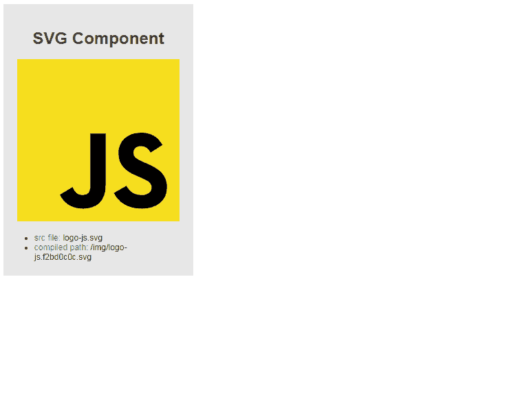

# Vue.js SVG 响应组件

> 原文：<https://dev.to/drozerah/vue-js-svg-responsive-component-318f>

> 简单地演示一个 Vue.js 组件，它返回一个作为属性传递给该组件的`.svg`文件，并使用 CSS 规则将`img` html 标记转换成一个响应性/适应性元素

**方法:**

*   我们使用一个计算属性将 SVG 文件处理到组件中。

**注意:** *计算属性*介于数据对象属性和方法之间:我们可以像访问数据对象属性一样访问它们**，但是它们被指定为函数...**

*   我们创建了一个计算属性函数，使用`require()`方法访问`assets`文件夹，返回`.svg`文件路径
*   我们使用作为组件`this.SVGFile`的属性(props)存储/传递的值来创建`.svg`源文件的完整路径
*   我们使用 ES6 模板文字语法来动态构建完整路径...
*   我们将 computed 属性的值绑定到`img` html 标签的`src`属性...
*   CSS 类将让标签自动适应其父容器的大小

组件`src\components\SVG-image.vue`

```
<template>
    
</template>

<script>
export default {
  name: 'SVG-image',
  props: {
    SVGFile: String
  },
  computed: {
    path(){
      return require( `@/assets/svg/${this.SVGFile}`)
    }
  }
}
</script>

<style lang="scss" scoped>

.responsive-img{
  max-width: 100%;
  height: auto;
}

</style> 
```

使用`src\App.vue`组件

```
<template>
  <div id="app">
    <main>
      <SVGImage SVGFile='logo-js.svg'/>
    </main>
  </div>
</template>

<script>
import SVGImage from './components/SVG-image.vue'

export default {
  name: 'app',
  components: {
    SVGImage,
  }
}
</script>
//... 
```

[](https://res.cloudinary.com/practicaldev/image/fetch/s--KuD1qCTs--/c_limit%2Cf_auto%2Cfl_progressive%2Cq_66%2Cw_880/https://raw.githubusercontent.com/Drozerah/MyGitHubStorage/master/gif/svg-component/vue-svg-component.gif)

## 看看吧！

### 获取该存储库的本地副本

```
$ git clone https://github.com/Drozerah/vue-svg-responsive-component.git 
```

### 项目设置

```
$ npm install 
```

### 编译并热加载用于开发

```
$ npm run serve 
```

### 编译并缩小用于生产

```
$ npm run build 
```

一旦你完成了编译，简单地:

```
$ cd dist 
```

然后在本地开发服务器上运行您的`index.html`...

就是这样！

[Vue.js SVG 响应组件](https://github.com/Drozerah/vue-svg-responsive-component)

感谢阅读！

下次见！

德罗泽拉