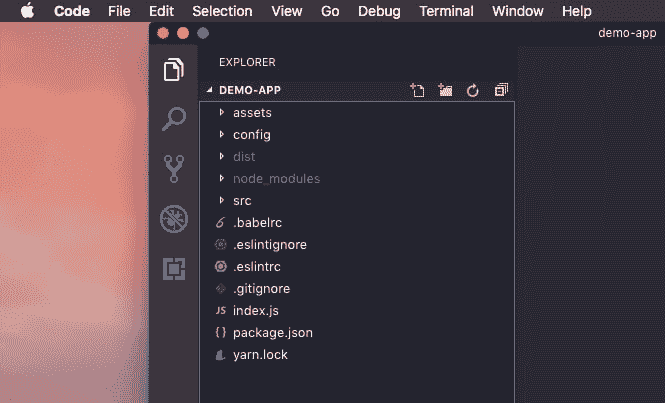
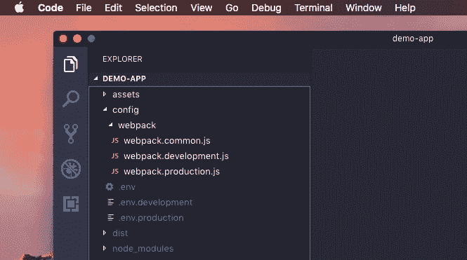

# 设计 React 应用程序——我作为 Web 开发人员的经验之谈

> 原文：<https://dev.to/rishikc/architecting-react-applications-what-i-learned-from-my-experience-as-a-web-developer-4ma5>

React 因其较短的学习曲线和易于使用的 API 而一直广受欢迎。但是如果你已经使用这个[流行的 javascript 库](https://reactjs.org/)有一段时间了，你可能也会同意我的观点——如果你不注意它的结构，它很快就会变得难以维护。

在加入我的第一份工作之前，我有一些自由职业者的经验，但除了我在网上或开发时遇到的，我不太了解最佳实践和架构。即使作为一名自由职业者，我也没有处理如此大规模的应用程序的经验，我们不得不在工作的后期进行处理。这是我开始更加关注建筑的时候。在开始的时候，事情有时会变得有点混乱——主要是因为我比以前更加关注我的代码——这很明显，因为我现在是团队的一部分，而不是一个单独的自由职业者。

于是我开始翻遍 GitHub，网上的文章，论文，书籍。随着我越来越大规模地与 React 合作，我意识到

> 一个健壮、可伸缩且易于维护的 React 应用程序的关键是架构。

这适用于任何应用程序或软件，但是对于 React，抽象比其他库/框架更难一些。这是在[钩子被引入](https://reactjs.org/docs/hooks-intro.html)之前的事情——但是我们现在将它排除在上下文之外，因为它仍然相当新，而且大多数应用程序仍然是用 React 的旧版本构建的。此外，还有许多需要改进的地方；随着它的使用，许多该做和不该做的事情将被发现。

到目前为止，我认为我所遵循的构造 React 应用程序的原则对 Hooks 也同样适用！因为重点是可伸缩的 web 应用程序架构——而不仅仅是 React。

让我们快速地看一下设置，然后我将带您浏览一下，并尝试解释为什么是这样的结构。所以项目的根看起来像这样:

[](https://res.cloudinary.com/practicaldev/image/fetch/s--FyDcITIe--/c_limit%2Cf_auto%2Cfl_progressive%2Cq_auto%2Cw_880/https://thepracticaldev.s3.amazonaws.com/i/cbtdcexf4ka1k26uo0w9.png)

`src`目录(当然，它将包含我们应用程序的所有源代码)的结构如下:

[](https://res.cloudinary.com/practicaldev/image/fetch/s--nzghBwAd--/c_limit%2Cf_auto%2Cfl_progressive%2Cq_auto%2Cw_880/https://thepracticaldev.s3.amazonaws.com/i/3tdgfh322vv6fzacp9xk.png)

你可能会注意到的第一件事，也许会想——如果你没有注意到，我建议你再看一看——我们的项目中有两个名为`config`的目录。不，这不是错误！它有一个(极其)简单的原因。

## 一个 web 应用有两个配置目录？！为什么呢？？

根目录下的`config`目录包含所有与构建相关的配置文件——比如我们的应用程序的 webpack 配置或我们可能使用的任何其他捆绑器、环境文件和其他配置。

[](https://res.cloudinary.com/practicaldev/image/fetch/s--eEJEI_d1--/c_limit%2Cf_auto%2Cfl_progressive%2Cq_auto%2Cw_880/https://thepracticaldev.s3.amazonaws.com/i/1twwvxasthjnqgz9cb3j.png)

您可能还会注意到它是嵌套的，webpack 配置位于它自己的目录中。这使得配置更有条理，更易于管理。这可能看起来微不足道，但当应用程序开始增长时，构建过程也可能变得复杂——这就需要一个组织良好的地方。此外，这也让您在使用它时感到安心——在生产环境中部署应用程序时，您最不希望看到的就是一大堆杂乱的配置文件！👀

在我们的`src`文件夹中的另一个`config`目录用于与我们的应用程序相关的配置，即与运行时相关的配置。这可能包含我们的 json 文件(或任何其他文件)，这些文件可能会影响我们应用程序的行为或功能。虽然，这可能是或可能不是你所需要的，但对我来说，我在大多数项目中都有这个文件夹。

## 但是等等，`resources`和`assets`目录呢？资产不也是 react 应用程序的“资源”的一部分吗？

[](https://res.cloudinary.com/practicaldev/image/fetch/s--3NeZwmVs--/c_limit%2Cf_auto%2Cfl_progressive%2Cq_auto%2Cw_880/https://thepracticaldev.s3.amazonaws.com/i/kcru8h1hobcji7k0jr0j.jpg)

嗯，这里的`assets`目录是指 ***只有*** 用于图片和其他媒体*，咄，*

然而，`resources`是我们的 web 应用程序可能需要的数据，例如，常量和其他静态数据，它们基本上没有任何或很多与之相关的逻辑。你也可以添加一些小方法来返回数据，也许是根据特定的需求格式化的，和/或在那里对它们执行 ***小*** 操作，这些操作可以被我们的应用程序的一部分使用，顺便说一句——*相信我*——这将使你的代码更加整洁和有组织。

该目录还可能包含数据和其他“资源”,这些数据和资源有时会被提取、存储和更新；并且在我们的 web 应用程序的某些部分使用它们之前，可能会对它们进行一些处理。嗯，我想-你明白了。

## 那么我们的页面和所有的 react 组件呢？？

所以，有趣的部分来了。至少我是这样认为的。这是从其他一些关于设计 react 应用程序和其他 web 应用程序的解决方案以及我自己的一些实践经验中得来的。到目前为止，我对它相当满意！🤓

首先，让我们假设我们的 web 应用程序包含一个主页，一个用户的个人资料页面，为了在这个例子中不只有两个页面，我们将第三个页面称为另一个页面。所以目录结构看起来应该是这样的:

```
-- src
----- components
----- config
---------- pages
-------------- home
---------------- index.js
---------------- index.scss    // Mandatory sass file (wanted to make this look realistic!!)
-------------- profile
---------------- index.js
-------------- other-page
---------------- components
---------------- index.js
---------- resources 
```

Enter fullscreen mode Exit fullscreen mode

注意，所有的页面都有自己单独的目录和入口点。以及“其他”页面如何有一个组件文件夹？为什么我们需要另一个组件文件夹？我们不是已经在`src`目录的根目录下有一个组件文件夹了吗？

等等，等一下！我会很快解释的！☝️

这就是我所说的“分支”结构。每个页面都有自己的目录、自己的组件集(除了在特定页面中，其他地方都不会用到这些组件)、自己的样式规则和其他只与该页面相关的东西。如果两个页面共享任何组件，猜猜它们会去哪里？是的，你猜对了——我们的`src`目录根目录下的`components`目录！

但是..你可能会想..做那件事有什么意义？

比方说，有一天你和你的队友决定去掉“其他”页面- *也许这个名字不够好？* -那你是做什么的？花一整个下午或一天的时间删除代码、破坏和修复应用程序？**没有**。

您只需继续删除该目录，并从 web 应用程序中附加/使用它的位置删除它的引用。瞧，完成了！💁🏻‍♂️

你的应用不会因为删除了一堆代码而崩溃！一切都是独立于彼此的存在，即使它们在某些时候是捆绑在一起的！少了很多工作和烦恼，不是吗？是的，这个原则可以应用于几乎任何应用程序/软件，而不仅仅是一些 react 应用程序。

[](https://res.cloudinary.com/practicaldev/image/fetch/s--nhYmOlIw--/c_limit%2Cf_auto%2Cfl_progressive%2Cq_auto%2Cw_880/https://thepracticaldev.s3.amazonaws.com/i/lk0v387uovf7b9wdjkt5.jpg)

你们中的一些人可能会想——不，我们的应用程序/软件非常复杂，东西之间的联系太紧密了。他们 ***共享*** 代码，被 ***桥接*** 等在一起。但是我想如果你试着把这个原则应用到“共享代码”和“桥”上，你现在可能明白该怎么做了！这只是一个简单的例子，演示并给你一个概念，如何组织产品的各个部分，以方便维护。

## 一个小提示——我在用 GatsbyJS 开发渐进式 web 应用程序时学到的一些东西

你也可以继续添加另一个目录到`src` -叫做`layouts`(或者可能添加到`components`目录，无论哪个对你来说更合适)，它包含一个布局文件，这个布局文件对应用程序是全局的，或者甚至有多个布局；每个都与应用程序的某些部分相关联。例如，让我们假设我们的应用程序也有一个漂亮的导航条和一个体面的页脚，它会出现在我们所有的页面中。我们可以有一个布局文件，包含导航栏和页脚，并呈现传递给它的`children`，就像这样:

```
 <Layout>
  <div>
    Yayy! This is my fancy home page!!
  </div>
</Layout>

// And in the profile page :

<Layout>
  <div>
    This is the page of the user whose data we're secretly trying to steal! 
    Please read our privacy policies (not so) carefully!!
  </div>
</Layout> 
```

Enter fullscreen mode Exit fullscreen mode

在我们的布局文件中，我们可以有类似这样的东西:

```
const Layout = ({ children }) => (
  <>
    <Navbar />
    {children}
    <Footer />
  </>
);

export default Layout; 
```

Enter fullscreen mode Exit fullscreen mode

这使得你的代码更有组织性和逻辑性。此外，这将有助于保持页面的一致性。

## 但是等等..react 应用程序的架构远不止这些！！

是的，我没有忘记 reducers，冗长的传奇，服务，大量的动作创造者等等！但这是本文的第二部分，因为我不想让它变得太长，读起来太累。此外，这第一部分可以作为初学者或其他新开发人员的良好起点。

*感谢您的阅读！让我知道你对这篇文章的看法。*😄

也可以通过 [Twitter](https://twitter.com/rishiikc) 和我联系。

黑客快乐！干杯！🎉