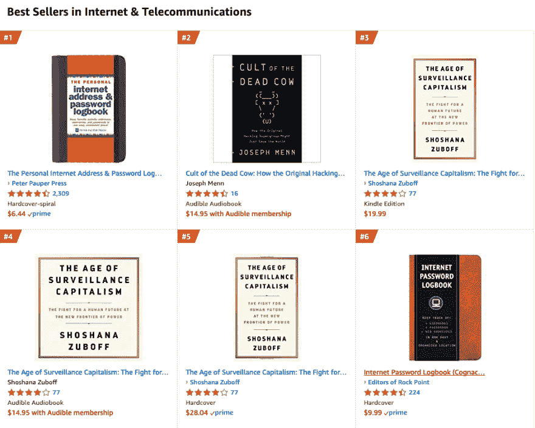
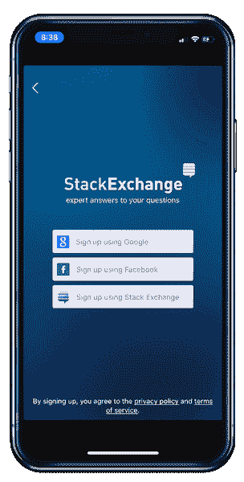
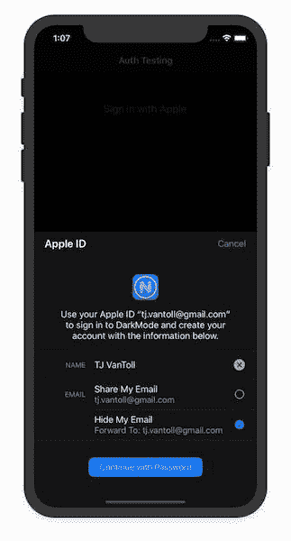

# 为什么“登录苹果”真的很棒

> 原文：<https://dev.to/progress/why-sign-in-with-apple-is-actually-pretty-great-31fl>

我相信苹果最近宣布的“登录苹果”工作流程是提高登录界面安全性和可用性的重要一步。

在这篇文章中，我将解释“登录苹果”是什么，为什么我相信它对用户来说是一件好事，围绕苹果实施的戏剧，以及我一直以来的一些担忧。

我的论点的关键是，苹果的新工作流程为每个人都讨厌的流程——登录——提供了急需的创新。即使苹果的实现有缺陷(我们将会谈到)，希望这一努力将激发其他科技巨头的其他想法作为回应，理想地使登录过程对每个人都更好。为了说明我所说的，让我们从一些背景开始。

## 为什么密码最差

LastPass 在 2018 年进行的一项调查显示，59%的人总是或大部分时候使用同一个密码——无论在哪里。同一项研究发现，45%的人在他们的账户遭到黑客攻击时不会费事更改密码，42%的人会将密码保存在一个文件中，比如 Word doc 或 Excel 电子表格。

当我写这篇文章时，亚马逊“互联网&电信”类别中最畅销的书是*互联网地址&密码日志*。同类产品中排名第六的是*网络密码日志*，老实说，它的设计比最畅销的还要好。

 
*我们失败了。失败的**硬**。*

像这样嘲笑书是很容易的，重要的是要记住这些书是在解决一个真正的问题。使用独一无二的密码很重要，但是在脑子里记住多个密码是不可能的，而且不是每个人都有足够的资金和技术来使用密码管理器。

有趣的是，你可以提出一个令人信服的论点，即物理密码本用户比密码重用者更安全，假设物理密码本用户为他们使用的每个服务创建唯一的密码。

不管怎样，这些书的存在本身就表明了今天大多数用户的登录过程是多么的糟糕。

## 让登录更好

每个人都知道我们目前的登录方式并不理想，许多科技公司都试图让这一过程变得更好。登录界面可用性的一个重大改进是单点登录的出现，用户使用一个帐户来验证多个应用程序或服务。

 
*一个 iOS 应用单点登录的例子。用户可以使用谷歌或脸书认证。*

SSO 的主要吸引力在于用户不必创建和记住一组新的凭证，允许他们保持一个密码的生活方式，而没有密码重复使用的通常缺点。

然而，尽管它很吸引人，SSO 也有它的缺点。具体来说，大多数 SSO 提供商要求您向正在进行身份验证的服务提供您的电子邮件地址(有时还有其他信息)。

虽然提供电子邮件地址似乎无伤大雅，但可疑服务通常会向广告商或垃圾邮件发送者出售电子邮件地址列表，从而大大增加了您必须处理的垃圾邮件的数量。更糟糕的是，即使某项服务没有恶意，数据泄露也会让你的电子邮件暴露给世界各地的黑客，为你用同一封电子邮件在网上创建的账户遭到攻击打开了方便之门。

## 输入苹果

在这种背景下，本月早些时候，苹果宣布了一项新的“登录苹果”功能，乍一看，该功能与谷歌、脸书和其他数以千计的应用程序今天使用的单点登录机制非常相似。

然而，苹果的新认证工作流程提供了一个创新:当你登录苹果时，你可以选择是否要与你注册的服务共享你的电子邮件，或者是否要隐藏它。

 
*示例应用程序中“登录苹果”的一个例子。*

如果您选择隐藏您的电子邮件，Apple 将创建一个随机生成的 Apple 托管的电子邮件地址，它将代表您接收所有邮件，并将它们转发到您的合法电子邮件地址。

这个工作流程减轻了许多与谷歌和脸书等公司的类似单点登录解决方案相关的隐私问题。如果一个可疑的服务将你的电子邮件卖给一个广告商，你可以很容易地关闭电子邮件转发来阻止不想要的垃圾邮件。更好的是，如果你生成的电子邮件地址在数据泄露中暴露，你可以放心，因为你的苹果生成的电子邮件地址是唯一的，因此黑客将无法在随后的攻击中使用该地址。

这是一个普通问题的优雅解决方案；像谷歌和脸书这样的公司可能不愿意复制这种解决方案，因为它们的大部分收入来自广告商——广告商非常喜欢通过用户在网络上的电子邮件地址来跟踪用户。因为苹果不依赖类似的收入模式，他们在创新和为用户提供注重隐私的认证选项方面处于独特的地位。话虽如此，苹果也不是没有自己的动机。

## 戏剧

苹果在被视为一家关注隐私的公司方面有着既得利益，因此，对他们来说，创建和推广“登录苹果”工作流程是非常有意义的。

更有趣的是 WWDC 会议后不久爆出的新闻，当时开发者发现文件称苹果将**要求**支持第三方登录的应用程序提供登录苹果的方式。以下是来自苹果网站的[确切措辞。](https://developer.apple.com/news/?id=06032019j)

> “登录苹果将于今年夏天进行测试。当它在今年晚些时候上市时，它将成为支持第三方登录的应用程序中的用户的一个选项。”

这一有争议的决定立即在科技界引发了激烈的争论。反对苹果决定的人认为，苹果正在利用其对 iOS 平台的垄断控制来推进自己的单点登录解决方案。

> 利用他们作为社区门卫的地位来推销他们自己的单点登录产品？是的，这至少会受到欧盟的关注。不管它是不是一个额外的选项，它是必需的这一事实就足够了...
> 
> — Richard Price ([@richardprice](https://dev.to/richardprice) ) [June 3, 2019](https://twitter.com/RichardPrice/status/1135680325244182528?ref_src=twsrc%5Etfw)

> 哇哦。像这样的“围墙花园”让我很高兴我写了网络应用程序。
> 
> — Jared Beck (@jaredowenbeck) [June 3, 2019](https://twitter.com/jaredowenbeck/status/1135674803850022912?ref_src=twsrc%5Etfw)

> 垄断者将要垄断
> 
> — Caitlin Fitzharris (@caitlintackles) [June 5, 2019](https://twitter.com/caitlintackles/status/1136101790112395265?ref_src=twsrc%5Etfw)

这个时机的确很有意思，因为苹果正因为其应用商店政策而被开发者和消费者起诉。你可能会认为该公司会避免潜在的垄断行为，而 iOS 的其他部分则有积极的反垄断诉讼悬而未决——但显然苹果并不担心，或者他们不相信他们在这里的行为是垄断的。

另一方面，那些支持苹果要求“登录苹果”的决定的人认为，苹果*已经*要求他们的新工作流程应用程序实际使用该功能。

> “登录苹果”的问题在于，它的隐私安全令人欣喜，开发者不会提供。他们渴望得到你的真实电子邮件地址，以便再次参与活动。Fb 很乐意提供。
> 
> — Josh Constine (@JoshConstine) [June 3, 2019](https://twitter.com/JoshConstine/status/1135648571196239872?ref_src=twsrc%5Etfw)

> 似乎必须如此。否则它会和所有 BrowserID，OpenID 一类的东西有着同样的命运。我认为应用程序通常支持 SSO，因为它们想要随之而来的数据。大多数人从来没有兴趣支持一个没有数据的选项。
> 
> — Moxie Marlinspike ([@moxie](https://dev.to/moxie) ) [June 4, 2019](https://twitter.com/moxie/status/1135769100305592326?ref_src=twsrc%5Etfw)

这一方的论点很有说服力。不管是好是坏，个别应用程序几乎没有动力为用户实现以隐私为中心的功能，因此有理由认为，如果可以的话，大多数应用程序只会忽视苹果的新 API。

记得 BrowserID 吗？这是 Mozilla 支持的一个功能，可以使用你的电子邮件地址提供跨网络的单点登录。这是一个伟大的想法，对用户有一些真正的好处，但它从未起飞，因为[很少有开发者真正集成它](https://techcrunch.com/2014/03/08/mozilla-stops-developing-its-persona-sign-in-system-because-of-low-adoption/)。

如果你是一个应用程序开发者，当你有一个充满积压任务的路线图时，你为什么要实现 BrowserID 或“登录苹果”呢？此外，基于苹果的工作流程旨在防止你的服务收集用户数据——除非被迫，否则所有营销和销售部门都很难放弃这些数据。

因此，尽管“登录苹果”并不完美，尽管让苹果对 iOS 用户拥有更多控制权令人担忧，但至少这项命令将迫使所有使用第三方登录的应用认真重新评估它们如何处理用户数据。

## 广义点

更广泛地说，我希望苹果在这方面的努力将会导致密码管理领域的进一步发展。现在是 2019 年，大多数人都在购买密码管理器，购买书籍来写下他们的密码，或者干脆放弃，用他们的猫的名字登录网络。我认为我们完全有权利要求更多的科技巨头来帮助解决这个问题。

例如，谷歌和脸书都声称关心他们用户的隐私，并且都有资源来创建类似的系统，那么我们为什么不要求他们提供一种方法来认证具有类似隐私保护的第三方应用呢？更好的是，如果一家科技公司重新设想一个类似 BrowserID 的解决方案，避免一家公司拥有完全控制权，那会怎么样？

这里没有轻松的胜利，但希望苹果的果断举动将引发创新，推动用户安全和隐私向前发展。

* * *

在 [Progress](https://www.progress.com/) 中，我们已经介绍了你如何使用苹果的新 API。 [NativeScript](https://www.nativescript.org/) 用户今天就可以使用新的 [nativescript-apple-sign-in 插件](https://github.com/EddyVerbruggen/nativescript-apple-sign-in)开始体验“登录苹果”。

因为“登录苹果”是基于 OAuth 2.0，今年秋天晚些时候， [Kinvey](https://www.progress.com/kinvey) 用户将能够通过 [Kinvey 的移动身份连接](https://devcenter.kinvey.com/nativescript/guides/mobile-identity-connect)使用苹果的新工作流程。