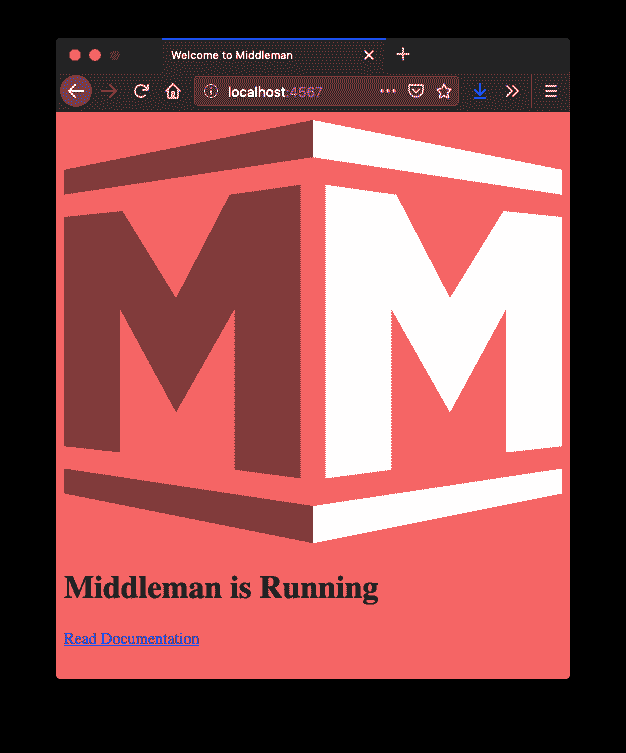

# 中间人+ TailwindCSS + Webpack

> 原文：<https://dev.to/lxxxvi/middleman-tailwindcss-webpack-ap3>

我真的很喜欢为我维护的一些网站使用中间人。在我的一个项目中，我想加入 [TailwindCSS](https://tailwindcss.com/) ，并开始在谷歌上搜索如何做到这一点。我找到了[这本指南](https://vcavallo.github.io/css/static_site_generator/how_to/2017/12/06/setting-up-middleman-with-tailwind-css.html)，但它似乎有点过时了。

这激发了我写一个更新版本的灵感。

因此，在本指南中，我试图描述我是如何设法建立一个中间人项目并使用 Webpack 集成 TailwindCSS 的。

它使用这些版本:

*   中间人`4.3.4`
*   顺风`1.0.4`
*   网络包`4.35.2`

**免责声明** : *我不是 Webpack 等的专家*。所以下面的说明可能不准确，不完整或者误导。我希望它不是太糟糕，但是，请评论，如果你觉得有什么可怕的错误。

我们开始吧...

## 设置中间人项目

首先，安装中间人并创建一个项目

```
gem install middleman
middleman init project
cd ./project
middleman serve 
```

Enter fullscreen mode Exit fullscreen mode

一旦`middleman serve`开始运行，你应该会在`http://localhost:4567`上看到一个默认页面。您可以再次中止该过程，因为我们现在要更改一些配置...

另外，从现在开始，本指南假设工作目录是项目的根目录。

(这些说明摘自[中间人安装页面](https://middlemanapp.com/basics/install/))

### 添加 Livereload(可选)

每次我们修改代码时，Livereload 都会自动在浏览器中重新加载页面，这在以后会很有用。

1.  将`gem 'middleman-livereload'`添加到`./Gemfile`
2.  将`activate :livereload`添加到`./config.rb`
3.  运行`bundle install`

(这些说明摘自[中间人基础页面](https://middlemanapp.com/basics/development-cycle/#livereload))

## 添加 npm 包

现在我们到了我不太了解的第一部分。经过一些实验后，我总结了这个包列表

```
yarn init
yarn add autoprefixer css-loader mini-css-extract-plugin postcss postcss-import postcss-loader style-loader tailwindcss webpack webpack-cli 
```

Enter fullscreen mode Exit fullscreen mode

(你可以用`npm`代替`yarn`。用`npm install`代替`yarn add`

## 准备 CSS 文件

中间人来与 SCSS，但我决定不使用 SCSS 一起顺风。这就是我重命名样式表文件名的原因:

```
mv ./source/stylesheets/site.css.scss ./source/stylesheets/site.css 
```

Enter fullscreen mode Exit fullscreen mode

然后我把`./source/stylesheets/site.css`的内容改成了这个:

```
@import "tailwindcss/base";
@import "tailwindcss/components";
@import "tailwindcss/utilities";

body {
  @apply bg-red-500;
} 
```

Enter fullscreen mode Exit fullscreen mode

这将导入顺风定义，并使用顺风的`@apply`指令将规则应用于`body`标签。在本指南的最后，我们希望页面的背景颜色是红色(-左右)。

(本说明摘自[顺风的安装页面](https://tailwindcss.com/docs/installation#2-add-tailwind-to-your-css))

## 创造`postcss.config.js`

接下来，我们将创建一个文件`./postcss.config.js`，其内容为:

```
module.exports = {
  plugins: [
    require('postcss-import'),
    require('tailwindcss'),
    require('autoprefixer'),
  ]
} 
```

Enter fullscreen mode Exit fullscreen mode

(本说明摘自[顺风的安装页面](https://tailwindcss.com/docs/installation#using-tailwind-with-postcss))

## 配置 webpack

对我来说，配置 webpack 是最困难的部分。网络上有很多这样的例子，作为一个新手，我不知道哪种方式是最好的。但这是我想到的。

创建一个包含以下内容的文件【T0:】T1

```
const MiniCssExtractPlugin = require('mini-css-extract-plugin');

module.exports = {
  plugins: [
    new MiniCssExtractPlugin()
  ],
  entry: {
    application: './source/javascripts/site.js',
    styles: './source/stylesheets/site.css',
  },
  output: {
    path: __dirname + '/.tmp/dist',
    filename: '[name].js',
  },
  module: {
    rules: [
      {
        test: /\.css$/,
        exclude: /node_modules/,
        use: [
          {
            loader: MiniCssExtractPlugin.loader,
            options: {
              hmr: process.env.NODE_ENV === 'development',
            },
          },
          'css-loader',
          'postcss-loader',
        ]
      }
    ]
  }
} 
```

Enter fullscreen mode Exit fullscreen mode

当我创建这个文件时，我做了一些观察，我想分享一下:

*   `entry: { ... }` ( `application`和`styles`)中的键将被用作文件名。所以会有一个名为`application.js`的文件和一个名为`styles.js`(是的...样式文件的扩展名将是`.js`，我想它不会被使用，也许我可以用某种方式摆脱它？)
*   `output.path`显然得是`/.tmp/dist`(！)，不然中间人不会用在开发上？
*   最后，`.css`文件的规则或多或少是从`MiniCssExtractPlugin` [项目页面](https://github.com/webpack-contrib/mini-css-extract-plugin#minimal-example)复制/粘贴的。我假设这个插件负责在输出路径中处理/创建一个`styles.css`文件？注意，这个插件替换了一个名为`extract-text-webpack-plugin`的插件。

你看，在这个领域我有多个问号。因此，如果你有任何修改，我邀请你在评论中发表。

## 激活网络包为`:external_pipeline`

现在让我们将 webpack 连接到中间人管道。

将这些行添加到`./config.rb`和

```
activate :external_pipeline,
  name: :webpack,
  command: build? ? './node_modules/webpack/bin/webpack.js --bail' : './node_modules/webpack/bin/webpack.js --watch -d --color',
  source: ".tmp/dist",
  latency: 1 
```

Enter fullscreen mode Exit fullscreen mode

这确保了在开发期间或我们构建项目时，只要项目中有任何变化，webpack 就会运行。

(该指令摘自[中间商文件](https://middlemanapp.com/advanced/external-pipeline/#webpack-example))

## 更改`./source/layouts/layout.erb`中的样式表和 javascript 路径

还记得我们配置了 webpack，所以我们得到一个名为`application.js`的文件和一个名为`styles.css`的文件作为输出吗？我们需要在页面的`head`部分更改这些文件名。

在`./source/layouts/layout.rb`中改变

```
<%= stylesheet_link_tag "site" %>
<%= javascript_include_tag "site" %> 
```

Enter fullscreen mode Exit fullscreen mode

至

```
<%= stylesheet_link_tag "styles" %>
<%= javascript_include_tag "application" %> 
```

Enter fullscreen mode Exit fullscreen mode

## 关键时刻...

运行

```
middleman serve 
```

Enter fullscreen mode Exit fullscreen mode

检查`http://localhost:4567`处页面的背景是否为红色(-ish)。如果是这样，这个指南是值得信赖的，你可以愉快地开始在你的项目中使用 Tailwind。如果没有，把责任推给我，分享一下你的经历。

[](https://res.cloudinary.com/practicaldev/image/fetch/s--zE401ADP--/c_limit%2Cf_auto%2Cfl_progressive%2Cq_auto%2Cw_880/https://thepracticaldev.s3.amazonaws.com/i/o5age2s4t98nm5ljic6c.png)

## 学分

[封面图片](https://www.flickr.com/photos/30478819@N08/46074804494)由 Marco Verch 拍摄