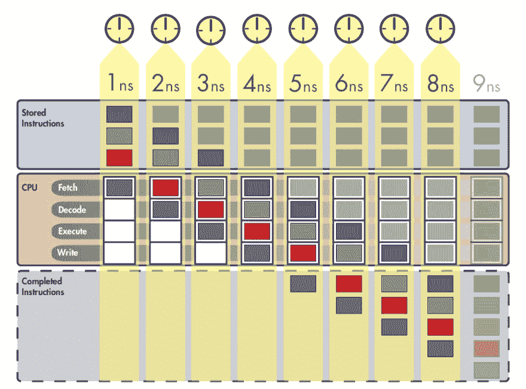
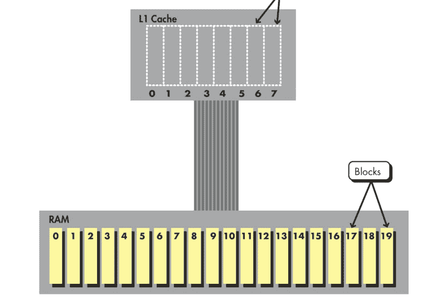
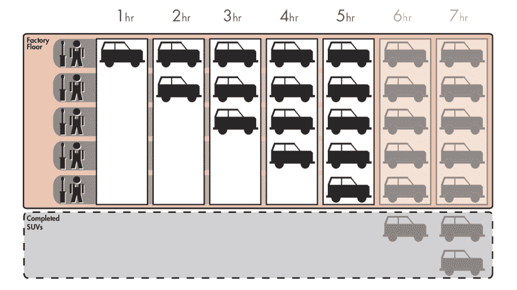
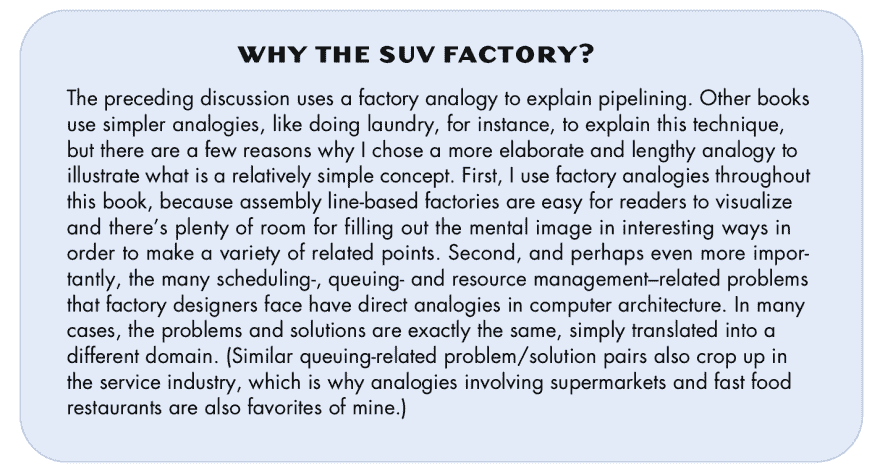
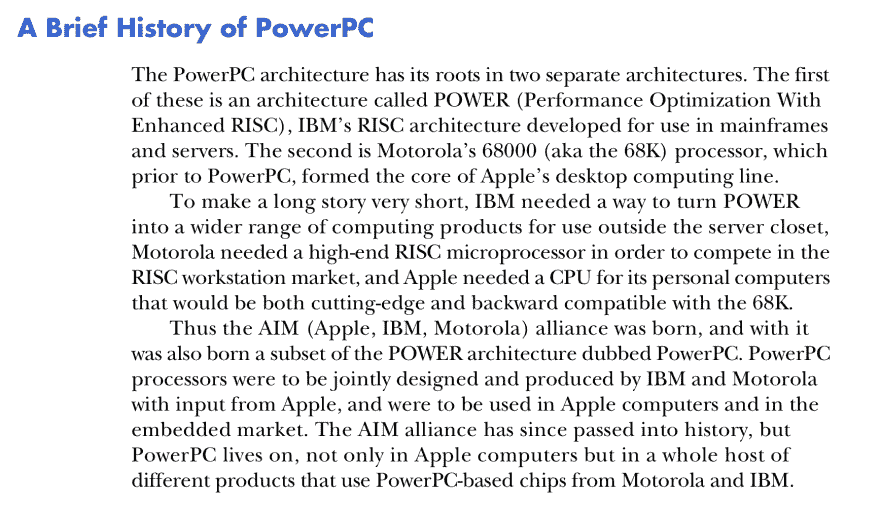

# 作为开发人员的最佳读物

> 原文：<https://dev.to/taillogs/the-best-book-to-read-as-a-developer-1h4m>

我能够确定这本书现在是开源的，这里有一个在线的 pdf。如果是在看书和看我的帖子之间，那就看书吧。

作为一名软件开发人员，我做过的最好的选择之一是阅读《机器内部》，这是一本几乎完全关于硬件的书。作为一个对“教科书”过敏的人，这本书是向软件开发人员解释硬件的大量措辞不当、误导性尝试中的一片绿洲。

机器内部几乎涵盖了软件/硬件关系的所有方面。这本书从向你介绍令人难以置信的原始微处理器结构开始，比如 ALU。最后，你将学习和理解极其复杂的微处理器设计和架构。

> 有趣的事实:机器内部是由 Ars Technica 的创始人和 Wired 的简要编辑 Jon Stokes 撰写的！

## 为什么是这本书？

### 很简单明了

这本书减少了废话。信息以最少的废话呈现，以使其易于理解。它的一致性令人难以置信，并且使用一些基本的类比来解释几乎每一个概念。在机器内部，做每一本伟大的教学书籍应该做的，迎合读者。这本书的导言对此做了最好的解释:

> 《机器内部》是对计算机的介绍，旨在填补经典但更具挑战性的计算机体系结构介绍(如 John L. Hennessy 和 David A.
> Patterson 的流行教科书)与越来越多对有兴趣的非专业读者来说过于基础的作品之间的空白。有一些计算机使用经验的读者，即使只有最少的脚本或编程经验，也应该对现代计算机的高级组织有一个彻底和高级的理解。如果他们这样选择的话，这些读者将能够很好地阅读更高级的作品，比如前面提到的经典著作，无论是自己阅读还是作为正式课程的一部分。
> 
> 这本书的比较方法，如下所述，通过与早期旨在解决相同问题的功能进行比较，引入了新的设计功能。因此，我们鼓励初级和中级读者按顺序阅读这些章节，因为每一章都假定读者熟悉之前章节中介绍的概念和处理器设计。

TL；DR:如果你不是一个伟大的程序员，我更推荐这本书。我在开发生涯的早期(当我很糟糕的时候)读过这本书，我相信它极大地塑造了我未来的成长。

### 它让你尊重发生在引擎盖下的事情

这本书最伟大的一点是，到最后，你会真正理解现代编程的“为什么”。即使对于大多数有经验的开发人员来说，底层计算机的工作方式本质上也是神奇的。用这个比喻，这本书就是该死的霍格沃茨。你可能一个咒语也不会施，但最终你会成为一名成熟的巫师。对于一些人来说，我建议学习硬件将有助于你编写软件，这可能有点奇怪。但是你必须记住，归根结底，软件只是硬件的抽象。

### 真性感

这本书很漂亮。作为一个有点完美主义的人，我真的很欣赏这本书的努力，不仅是插图，还有整体风格和设计。插图真正提供了有意义的价值，而不是普通教科书提供的经常是人为的“数字”。例如，下面是作者在向读者讲授缓存时使用的一个例子。

另一个用来解释流水线的很好的例子。

### 它意识到了

书中对自我意识的大量灌输是我最喜欢的一个方面。作者预测之前的图片可能会有一些混乱，实际上为他的选择提供了一个非常人性化的合理化。

### 真是铆足了劲

我不会撒谎说整本书是一个“惊险之旅”，但有几节涵盖了处理器的历史，令人难以置信地惊心动魄。阅读关于 PowerPC 和 x86 的政治非常有趣。为了量化它，我会看 HBO 系列。

### 结论

无论你是刚刚进入软件开发，还是已经是一个有经验的开发人员，这本书都有适合你的东西。信息以快乐的方式呈现，所以你会渴望(而不是害怕)读到下一章。

更新:我想添加我在 Reddit 上收到的来自 [/u/DingBat99999](https://old.reddit.com/user/DingBat99999) 的评论，因为他们有一些我希望自己写的惊人见解。

> 推荐的书看起来很棒。但是它说明了一个我以前没有考虑过的问题。
> 
> 我从事软件工作已经有 40 年了。当我开始使用汇编语言时，这是不可避免的。那时候你和裸机之间没有那么多。结果，每个人都自然地了解了计算机是如何在底层工作的，即使没有以硬件为中心的课程。
> 
> 我上大学已经有很长时间了，所以我不确定他们现在教什么，但考虑到我看到的这种新毕业生，至少他们中的一些人毕业时根本没有接触过硬件。这完全没问题。没有它，你也可以在这个行业做得很好。但是，正如 OP 的书所展示的，无论如何，学习它都是有趣和好玩的。
> 
> 总结一下，对我来说，有几本书影响了我对创建软件的看法。它们是鲍伯·马丁的《干净的代码》和迈克尔·费哲的《有效地使用遗留代码》。

[该书的免费 PDF 文件](http://joe90.yolasite.com/resources/InsidetheMachine.pdf)

作者甚至开始将这本书移植到 Github！

 [T3】](https://twitter.com/taillogs)