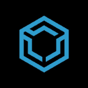

# 介绍我们 2019 年 7 月的赞助商

> 原文：<https://dev.to/devteam/introducing-our-july-2019-sponsors-1604>

这个月，我们退回了两个赞助商，并为本月介绍了一个新的合作伙伴。感谢这些公司成为有价值的开发社区合作伙伴和支持者。

请花几分钟时间探索他们的产品，并考虑将其用于您的公司或下一个项目。

## **数字海洋**

[DigitalOcean](https://do.co/devto) 是一个备受喜爱的云计算平台。我总是对数字海洋核心产品的良好构建*和良好记录*印象深刻。说起来容易做起来难，他们已经能够保持领先。

迄今为止，DigitalOcean 一直是我们最长期的支持者，我们非常感谢他们的一贯支持。他们对开发者生态系统的承诺非常明确。

作为一个组织，看到他们服务的发展和他们多年来保持领先地位的非凡能力是令人敬畏的。

## [数字海洋](/digitalocean) <button name="button" type="button" data-info="{&quot;className&quot;:&quot;Organization&quot;,&quot;style&quot;:&quot;full&quot;,&quot;id&quot;:175,&quot;name&quot;:&quot;DigitalOcean&quot;}" class="crayons-btn follow-action-button whitespace-nowrap c-btn--secondary fs-base " aria-label="Follow organization: DigitalOcean" aria-pressed="false">跟随</button>

[DigitalOcean is the cloud of choice for developers around the world to create modern applications.](/digitalocean)

## [T1**GoCD**](#gocd)

GoCD 是一个由 Thoughtworks 开发的持续交付工具，Thoughtworks 是我们合作过的最著名的软件开发公司之一。

这是一个功能丰富的工具，具有一些真正难以置信的可视化。绝对值得为您的组织或项目考虑。该产品通过文档、资源，当然还有开源社区得到了很好的支持。非常值得一试。

他们还制作了一个新的页面，允许你带着 GoCD 去试驾。

Thoughtworks 一直是如此令人敬畏的支持者，非常感谢！

## [GoCD](/gocd)T2 跟随

[Easily model and visualize complex workflows with GoCD.](/gocd)

## [t1**三重交换**](#triplebyte)

Triplebyte 允许开发者参加一次测试，如果你符合条件，就可以立即进入顶级科技公司的面试程序。这应该是任何开发人员求职过程的一部分。

我亲自参加了三字节测验，这些问题感觉像是对真实世界软件开发原则的真正测试。就工作而言，我是有发言权的，你可能也是，但我建议无论如何都要给这个测验一个旋转。

## [三字节](/triplebyte) <button name="button" type="button" data-info="{&quot;className&quot;:&quot;Organization&quot;,&quot;style&quot;:&quot;full&quot;,&quot;id&quot;:158,&quot;name&quot;:&quot;Triplebyte&quot;}" class="crayons-btn follow-action-button whitespace-nowrap c-btn--secondary fs-base " aria-label="Follow organization: Triplebyte" aria-pressed="false">跟随</button>

[Take our 30 minute multiple-choice coding quiz to connect with your next big opportunity and join our community of 200,000 engineers.](/triplebyte)

* * *

这些组织正在帮助我们尽可能建立最好的社区。如果你想购买他们的服务，我建议你去看看他们的产品。

快乐编码