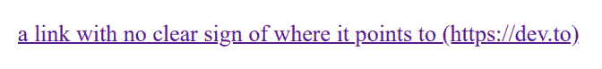

# 了解伪元素:在打印文档中显示 hrefs

> 原文：<https://dev.to/boyum/understanding-pseudo-elements-display-hrefs-in-printed-documents-5epe>

你有没有尝试过阅读一个打印出来的网站，然后当你试图点击链接时立刻变得沮丧？伪元素在这方面帮不了你多少，但是它们可以通过显示链接的 URL 来帮你一点忙！你会问，这是怎么做到的？让我向您展示伪元素和`attr()`函数的威力。

打印出来的文档只有两个维度，甚至不能点击？！我们如何告诉用户带下划线的文本是什么？

通过使用`content`属性和`attr()` CSS 函数，我们可以显示任何属性的值。由于`href`是`a`元素的一个属性，我们当然也可以显示它，对吗？当然啦！

```
<a href="https://dev.to">a link with no clear sign of where it points to</a> 
```

<svg width="20px" height="20px" viewBox="0 0 24 24" class="highlight-action crayons-icon highlight-action--fullscreen-on"><title>Enter fullscreen mode</title></svg> <svg width="20px" height="20px" viewBox="0 0 24 24" class="highlight-action crayons-icon highlight-action--fullscreen-off"><title>Exit fullscreen mode</title></svg>

```
@media print {
  a::after {
    content: ' (' attr(href) ') ';
  }
} 
```

<svg width="20px" height="20px" viewBox="0 0 24 24" class="highlight-action crayons-icon highlight-action--fullscreen-on"><title>Enter fullscreen mode</title></svg> <svg width="20px" height="20px" viewBox="0 0 24 24" class="highlight-action crayons-icon highlight-action--fullscreen-off"><title>Exit fullscreen mode</title></svg>

这段代码将产生以下结果:
[](https://res.cloudinary.com/practicaldev/image/fetch/s--I4qtlEwf--/c_limit%2Cf_auto%2Cfl_progressive%2Cq_auto%2Cw_880/https://thepracticaldev.s3.amazonaws.com/i/lz5xppyhg3j7gmm6y3dm.png)

尽管打印文档已经变得很少了，但对于我们这些从事大量文章网站工作的人来说，这仍然是一个巧妙的技巧！