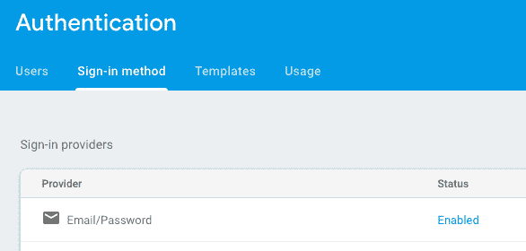

# Svelete 和 Firebase 用户身份验证

> 原文：<https://dev.to/jorgealvarez/svelete-firebase-user-authentication-2ca6>

用户管理是任何 web 应用程序的重要组成部分。让我们看看如何使用 Firebase 和 Svelte 来管理用户。这篇文章中的所有例子都可以在这个[免费模板](https://svelte-firebase-template.web.app/)中找到，以便使用 Svelte 和 Firebase 轻松创建 web 应用程序。

在这篇文章中，我将涉及以下主题

*   Firebase 认证
*   签约雇用
*   登录
*   管理区
*   会话管理
*   摘要

## 简介

很难找到没有任何用户管理的 web 或移动应用程序。大多数时候，我们鼓励我们应用程序的访问者创建一个帐户并登录。管理用户数据是一个微妙的话题。经常会读到公司遭受攻击以及用户信息被泄露的故事。通过使用 Firebase，我们可以最大限度地减少这些问题，因为所有用户的敏感数据和认证过程都由谷歌管理。我们可以利用谷歌的经验和资源来保护数据安全。

## Firebase 认证

Firebase 为我们提供了一种健壮、安全的用户管理方式。它有大量的认证方法，从标准的电子邮件/密码到电话认证，或者使用第三方提供商，如脸书、Twitter 或微软。在我们的 web 应用程序中，我们将使用最常见的方式，我们将使用电子邮件和密码来管理我们的用户。

您需要做的第一件事是在 Firebase 项目中启用电子邮件/密码访问。

[](https://res.cloudinary.com/practicaldev/image/fetch/s--bMe_ctm_--/c_limit%2Cf_auto%2Cfl_progressive%2Cq_auto%2Cw_880/https://alvareznavarro-images.s3.eu-central-1.amazonaws.com/firebase-email-password-auth.png)

一旦启用电子邮件/密码，我们就可以在我们的应用程序中注册用户。

## 报名

当一个新用户注册时，我们将为该用户和所有数据(团队，员工，行动)创建一个公司...)将被分配到那个公司。

该用户将成为公司的管理员，并能够为其他用户创建帐户来访问该应用程序。

检查完整的代码以[生成注册表单](https://github.com/jorgegorka/svelte-firebase/tree/master/src/views/public/signup)。

访客输入他们的姓名、电子邮件和密码后，我们将尝试使用以下代码为他们创建一个帐户:

```
const { user } = await Auth.createUserWithEmailAndPassword(email, password) 
```

Enter fullscreen mode Exit fullscreen mode

这就是我们在 Firebase 中创建用户所需的全部内容。再简单不过了。不过，这个方法做了两件事。它会创建一个新用户，但也会自动让该用户登录。

现在我们有了一个用户，我们想创建一个公司，并让他们成为该公司的管理员。为了做到这一点，我们将使用 Firebase 云函数。代码如下:

```
 const createCompany = Functions.httpsCallable('createCompany')
  createCompany({ companyName: name })
    .then(() => {
      notificationMessage.set({
        message: 'Your account was created successfully. Please log in',
        type: 'success-toast'
      })
      // We logout the user to generate a new jwt with right token info
      Auth.signOut().then(() => {
        navigateTo('/login')
      })
    })
    .catch(error => {
      notificationMessage.set({ message: error.message, type: 'danger-toast' })
      console.log(error)
    }) 
```

Enter fullscreen mode Exit fullscreen mode

我们正在调用一个名为 *createCompany* 的函数，并将一个对象作为参数发送。该对象将公司名称作为属性。

在该函数中，我们将创建一个新公司，我们还将创建一个新员工并将其分配给当前用户。之后，我们将为我们的用户分配 companyId 和一个角色 *admin* 作为自定义令牌(用户声明)。

在另一篇文章中，我将讨论用户声明，以及为什么它们对于保护我们的应用程序至关重要。

检查 [createCompany 函数](https://github.com/jorgegorka/svelte-firebase/blob/master/functions/index.js#L7-L35)的代码

当 *createCompany* 函数返回时，我们将注销当前用户(记住这是由*createUserWithEmailAndPassword*自动登录的)。我们需要这样做，因为用户声明不会自动更新，并且因为我们的方法确实更改了它们，所以我们需要要求用户再次登录以刷新这些令牌。

## 登录

登录用户非常容易。我们只需要向用户询问他们的电子邮件和密码，然后调用方法*signInWithEmailAndPassword*就可以了。

```
 Auth.signInWithEmailAndPassword(email, password)
    .then(() => {
      notificationMessage.set({ message: 'Welcome back!', type: 'success-toast' })
      disableAction = false
      navigateTo('admin')
    })
    .catch(error => {
      notificationMessage.set({ message: error.message, type: 'danger-toast' })
      disableAction = false
    }) 
```

Enter fullscreen mode Exit fullscreen mode

如您所见，我们需要做的就是调用该方法，然后如果用户和密码正确，我们会显示一条欢迎消息，并将用户重定向到管理区域。如果有错误，我们向用户显示错误消息。

如果凭证(用户/密码)有效，将自动创建一个会话，因此，如果用户关闭浏览器并再次打开它，他们不必再次输入凭证。

这是登录的[完整代码](https://github.com/jorgegorka/svelte-firebase/tree/master/src/views/public/login)

## 管理区

我们的管理区是一个受保护的部分，只有登录的用户可以访问它。让我们通过一个例子来看看这是如何做到的:

首先，我们利用了[svelet Router SPA](https://github.com/jorgegorka/svelte-router)对布局和嵌套布局的强大支持。我们做的第一件事是在 */admin* 下创建所有受保护的路由。这是它在我们的 routes 文件中的样子:

```
const protectedRoutes = [
  {
    name: 'admin',
    component: AdminLayout,
    nestedRoutes: [
      { name: 'index', component: DashboardIndex },
      {
        name: 'employees',
        component: EmployeesLayout,
        nestedRoutes: [{ name: 'index', component: EmployeesIndex }, { name: 'show/:id', component: EmployeesShow }]
      },
      {
        name: 'teams',
        component: TeamsIndex
      },
      { name: 'teams/show/:id', component: TeamsShow }
    ]
  }
] 
```

Enter fullscreen mode Exit fullscreen mode

现在，所有受保护的路由都将嵌套在 admin 中， **AdminLayout** 将是第一个呈现的组件。我们将利用这一点，我们只需检查在 **AdminLayout** 中是否有有效用户。

为了进行这种检查，我们使用了一个[反应语句](https://svelte.dev/docs#3_%24_marks_a_statement_as_reactive)。这是一个非常简单的功能，每当语句所依赖的值发生变化时，它就会运行语句中的代码。

```
$: if (!$currentUser) {
   showPage = false
 } else {
   if ($currentUser.id === 0) {
     notificationMessage.set({ message: 'Please log in first in order to access this page.', type: 'warning-toast' })
     navigateTo('/login')
   } else {
     showPage = true
   }
 } 
```

Enter fullscreen mode Exit fullscreen mode

我们正在检查 currentUser，如果它存在，我们将检查是否有用户 id。如果有，那么我们知道用户已经成功登录。如果用户 id 为零，那么我们知道没有活动用户，我们显示一条消息并将用户重定向到登录页面。

由于 currentUser 只是一个[细长的存储库](https://svelte.dev/docs#svelte_store)并且存储库是异步的，所以它可能不存在，因为它仍在被加载。当它被加载时，我们使用一个名为 *showPage* 的变量来呈现一个加载指示器，这样访问者就可以看到正在发生的事情。

```
{#if !showPage}
 <Loading />
{:else}
 <div>Page content</div>
{/if} 
```

Enter fullscreen mode Exit fullscreen mode

## 会话管理

为了控制用户何时/是否登录或注销，我们依赖于另一个惊人的 Firebase 方法，名为 *onAuthStateChanged* 。当活动会话发生变化时，Firebase Auth 将自动触发此方法。

这就是我们所做的:

```
Auth.onAuthStateChanged(() => {
  if (Auth.currentUser) {
    const userInfo = {
      email: Auth.currentUser.email,
      id: Auth.currentUser.uid,
      phoneNumber: Auth.currentUser.phoneNumber,
      photoUrl: Auth.currentUser.photoUrl
    }

    Employees.findOne(Auth.currentUser.uid).then(doc => {
      userInfo.employee = doc.data()
      userInfo.employee.id = doc.id
      userInfo.displayName = userInfo.employee.name

      Auth.currentUser.getIdTokenResult().then(idToken => {
        userInfo.companyId = idToken.claims.companyId
        userInfo.isAdmin = idToken.claims.role === 'admin' || idToken.claims.role === 'superAdmin'

        currentUser.set(userInfo)
      })
    })
  } else {
    currentUser.set({ id: 0 })
  }
}) 
```

Enter fullscreen mode Exit fullscreen mode

当 *onAuthStateChanged* 改变时，我们首先检查是否有当前用户。如果是，那么我们知道用户有一个活动的会话。如果没有 currentUser，那么我们将 id 设置为零，以表示没有活动会话，用户需要输入他们的凭据来再次创建新的有效会话。

如果有一个有效的用户，那么我们创建一个[瘦商店](https://svelte.dev/docs#svelte_store)，我们给它命名为 currentUser，并用关于用户及其角色的有用信息填充它。我们将在应用程序中使用这个存储来检查用户信息。

## 总结

用户管理是 web 应用程序的关键部分。将所有用户信息存储在 Firebase 中会减少数据泄露的机会。

我们实施了完整的用户工作流程(注册、登录、认证)。完整的代码以及更多的特性可以在 [Firebase &苗条模板](https://github.com/jorgegorka/svelte-firebase)库中下载。