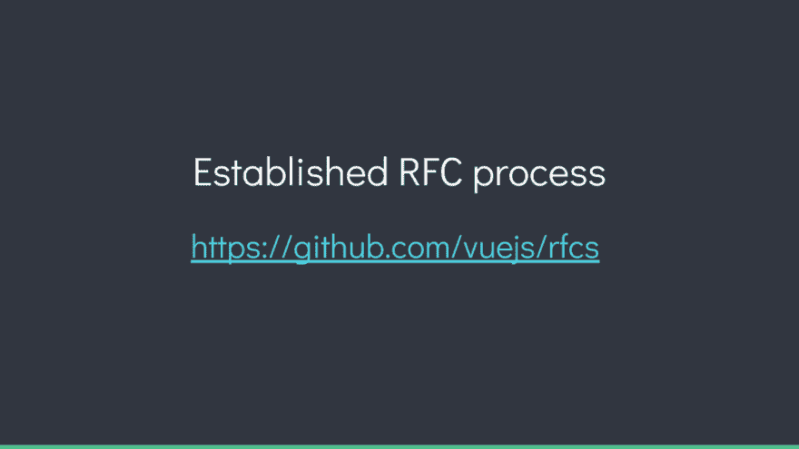
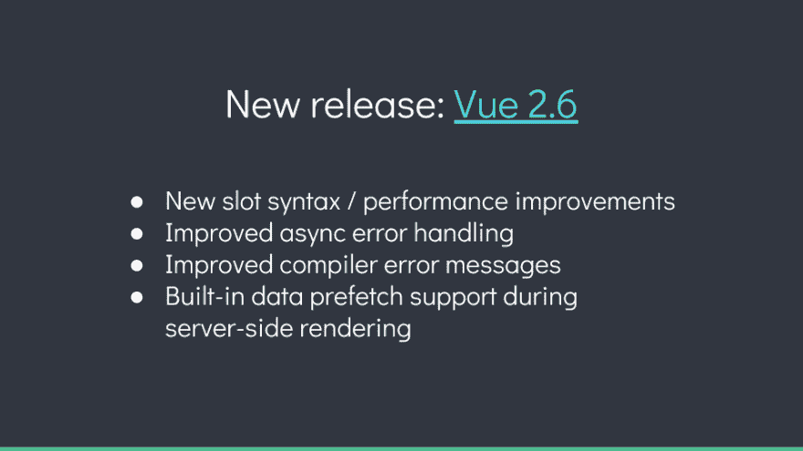
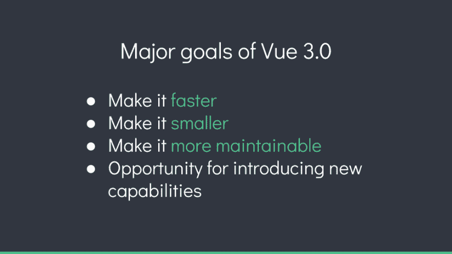
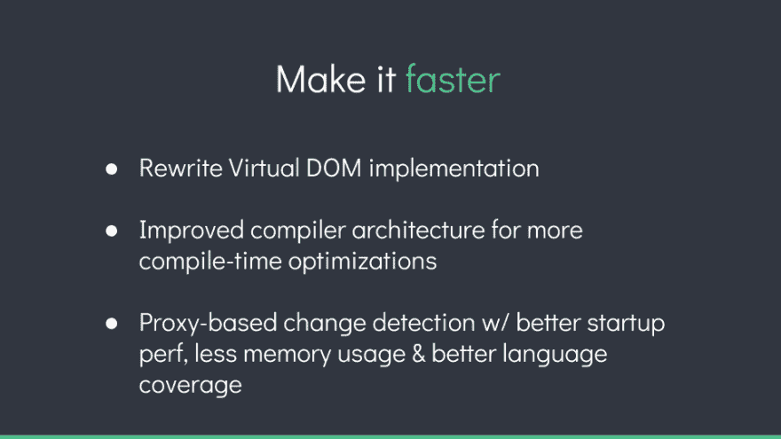
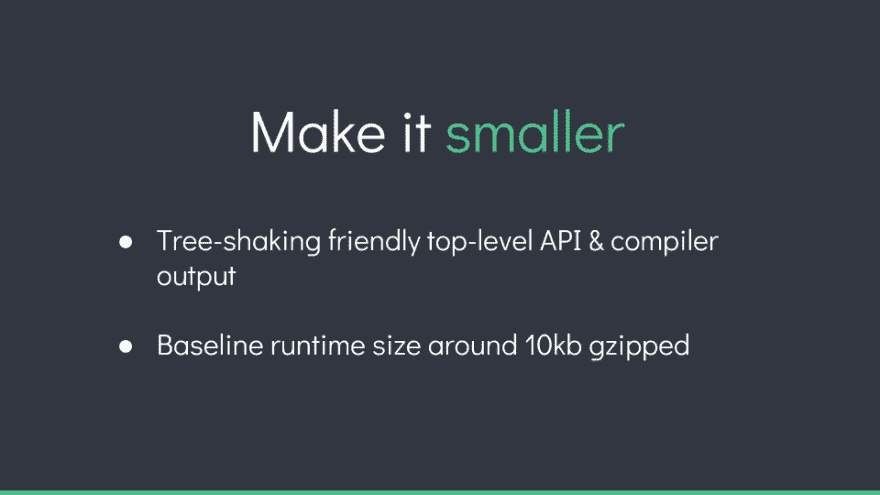
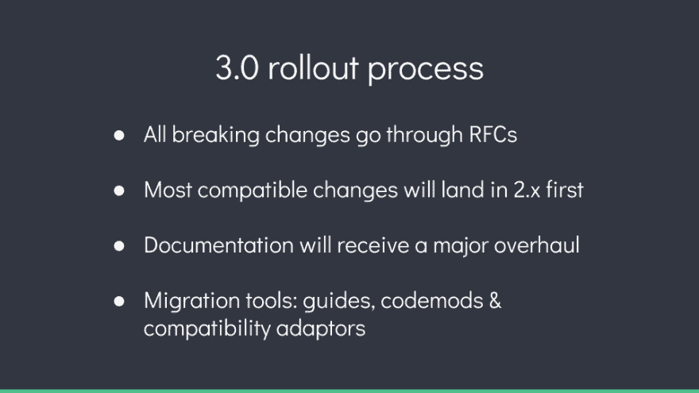

# 这个。JavaScript:框架状态- Vue 更新

> 原文：<https://dev.to/thisdotmedia/this-javascript-state-of-frameworks-vue-update-coe>

由这个主持。JavaScript，这是一个在线活动，开发者可以从中了解 JavaScript、框架和库的最新消息，涵盖了框架领域的所有突发新闻。

2 月 19 日，State of Frameworks 的演讲者，包括许多来自开发世界的最优秀和最聪明的人，给了我们关于所有框架的更新。

这是 Vue 的创造者尤雨溪的一些作品。JS ，不得不说 Vue 即将发生的事情。

## 尤雨溪 Vue 的创造者。JS- @youyuxi

在接下来的几个月里，Vue 将会有重大的变化。最重要的是，Vue 开发人员一直在努力开发一个主要版本。

## RFC 流程

仿照 Ember、Rust 和 React，Vue 最近开发了一个新的 RFC 过程，将用于在未来几个月和几年内对框架进行实质性的更改。Vue 3.0 中的所有变化都将使用这个过程来实现，如果用户想了解更多关于即将到来的应用程序变化的信息，他们应该关注 Vue 的 C-repo。

## 视图 2.6

在 3.0 的预期中，Vue 最近发布了 2.0 的次要版本。x，Vue 2.6。

Vue 开发者发布了一个新的 slot 语法，解决了现有语法的一些问题。新的语法是完全兼容的，这就是为什么开发人员能够在次要版本中发布它。

旧语法仍然有效，但是用户可以选择在他们认为合适的时候迁移到新语法。这个新语法将用于 Vue 3.0。

除了新的语法，Vue 2.6 还带来了其他的性能改进。例如，一个新特性确保了当父组件将插槽传递给子组件时，变更检测更加准确。这意味着，在某些情况下，Vue 只能更新父组件，而不会强制子组件也进行更新。

Vue 2.6 还改进了异步错误处理。因此，如果用户在其组件的生命周期挂钩中使用异步函数，那么在异步过程中捕获的任何错误都将被 Vue 的错误处理机制捕获，因此 Vue 可以决定向服务报告这些错误，或者显示替代内容来告诉用户。

Vue 2.6 还改进了编译器错误消息，所以当开发人员犯语法错误时，错误消息现在只是提供一个指向确切错误的代码框架。

Vue 2.6 还在服务器端渲染过程中提供内置的数据预取支持。这实际上是一个钩子，它允许树中的任何组件(不仅仅是在路由级别)在服务器端呈现期间预取服务器上的数据。反过来，在调用回调或解析呈现承诺之前，呈现过程将一直等到获取数据。

此功能将所有数据从路由器的预取渲染中分离出来，因此不再依赖于路由器，从而简化了过程。Apollo integration 和下一个 JS 框架都使用这种底层机制来大大简化他们的 API。

## 视图 3.0

Vue 3.0 目前正在开发中。当然，它的主要目标是让 Vue 更快更小——从根本上说，通过主要的设计，而不仅仅是像 Vue 2.6 这样的次要版本那样逐渐增加。Vue 3.0 还旨在使代码库本身更易于维护。

### 重写 DOM 实现

对于 3.0，开发人员正在重写虚拟 DOM 实现，并改进编译器架构以进行更多的编译时优化。

有很多提示可以给虚拟 DOM 算法，使它更快。在编译模板时，可以对这些提示进行静态分析。开发人员正在利用这种能力来进行更多的时间优化，收集关于运行时行为的提示，并留下它们，以便运行时可以利用这一点并跳过许多不必要的工作。

### 提高运行时间和内存

Vue 3.0 还会将其变更检测机制从 ES5 的 getters 和 setters 切换到 ES6 代理。根据目前的基准测试，这种做法将使 Vue 3.0 具有更好的启动性能和更少的内存使用。它还将提供完整的语言覆盖。

Vue 已经看到了巨大的改进:在不到一半的内存使用量下，速度提高了一倍多。这只是一个基准，但是 Vue 开发者希望在未来有类似的全面改进。

目前，Vue 运行时只是一个大的全局对象:它包含了开发人员在运行时提供的所有 API。这在 3.0 中会有所改变。有了一个足够智能的捆绑器，它就可以很容易地导入 API。

新的基线运行时大小大约为 10 KB gzipped，这是对当前运行时的一个很大的改进:现在超过 20k。Vue 3.0 的目标是将运行时间缩减到基线的一半，使其更易于维护。

### 流向打字稿和编码文档

Vue 3.0 也在从 Flow 切换到 TypeScript。切换到 TypeScript 的决定是基于工具和生态系统的巨大改进。

在编码管理方面，Vue 3.0 也将在这方面做出改进。每个包都有自己的一套内部 API 和测试套件，所以很容易委托给团队成员，这样他们就可以维护和拥有一段代码。这将包括为内部架构编写更好的文档，从而降低贡献的门槛。

在其他将提高性能的变化中，包括改进编译器架构，文档将在 Vue 3.0 中得到重大修改。总的来说，这将降低参与的门槛，允许更多的人在未来对代码做出贡献，而不必了解它的整个历史。Vue 也在探索使用时间切片工具来允许渐进水合的可能性。

大多数兼容的变化将首先出现在 2.x 中，所以你可以在这些变化第一次实现时就开始使用它们！这将使向 3.0 的过渡更加顺利，同时还有一些迁移工具和专用的兼容性适配器。

需要 JavaScript 咨询、指导或培训帮助吗？在 [This Dot Labs](//thisdot.co) 查看我们的服务列表。