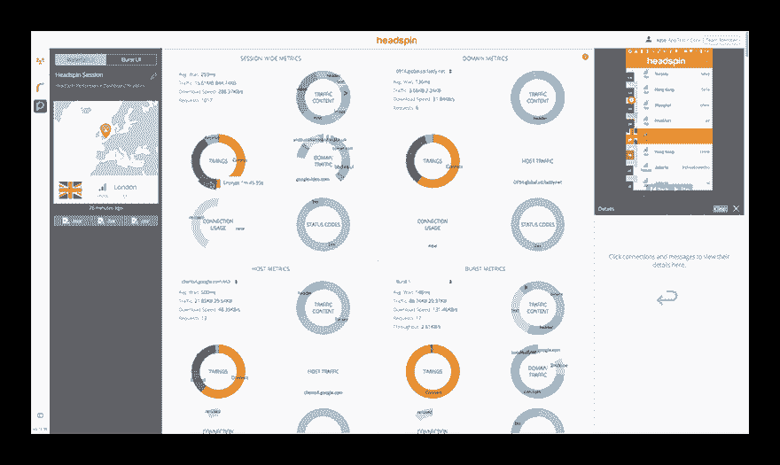

# 为什么性能很重要？

> 原文：<https://dev.to/headspin_io/why-does-performance-matter-3189>

移动应用程序测试和性能领域正受到越来越多的关注，这就引出了一个问题:**为什么性能很重要？**

在屏幕上，我们以前都经历过糟糕的用户体验。我们都经历过滞后(甚至空白)的屏幕，也许会降低我们对某些应用程序的亲和力。当谈到移动应用程序时，性能描述了应用程序工作的效率和使用的流畅程度。

考虑性能时，需要记住三个注意事项:

**1。用户参与度**
追溯到 20 世纪 60 年代的人类参与度研究表明，不到 100 毫秒的动作被认为是即时的，而需要一秒或更长时间的动作会导致人类思维分散。因此，即使是对应用程序缓慢的感知也可能是应用程序参与度的一大杀手。

**2。销售和应用内购买**
以一个带有电子商务组件的应用为例。公司分析显示，平均购物时间为 5 分钟，商品 UI 视图中的每件商品需要 10 秒钟加载，平均需要 30 次浏览才能完成销售。

将每个产品 UI 视图的加载时间减少一秒钟，就可以在一个平均会话中加载三个额外的产品屏幕视图，从而允许客户向购物车中添加更多商品，或者将整个交易的完成时间总共加快 30 秒。性能对潜在交易有重大影响。

**3。节省基础设施成本**
移动应用程序从远程服务器下载大量内容，因此减少请求数量或减小每个请求的大小可以极大地提高应用程序的速度。采取这两个步骤还会大幅减少后端流量，让您以更低的成本发展基础设施。

## 头旋表演环节

在 HeadSpin，我们开发了一个名为 Performance Sessions 的工具，它允许您探索和了解您的应用程序的特性。性能会议有助于确定应用程序中需要改进的地方，从而提升整体用户体验。

最厉害的部分？您可以通过远程控制会话或平台上的手动会话来进行头旋表演会话，在该平台上，您可以从您的 web 浏览器舒适地使用真正的 Android 或 iOS 设备。你也可以通过像 Appium、Espresso 或 XCUI 这样的自动化测试来触发它。

在这些会议期间，我们将捕获四个组成部分:

来自单元接口的网络流量
测试会话的视频
客户端-服务器数据
客户端数据

这些输入然后被馈送到我们基于人工智能的问题检测引擎，该引擎生成下面的仪表板，展示我们的*瀑布 UI* 。

该控制面板提供了如何提高应用性能的高级视图。这需要:

项目信息面板，它传达了进行测试的位置，以及来自测试会话的底层数据。

度量图形面板，显示测试会话的实时视频。当您在瀑布中滚动时，您会注意到数据在测试执行期间与视频相关联。

问题面板，它为每个检测到的问题生成一个问题卡，以及如何解决问题的建议。例如，我们的平台可以检测会话期间哪些服务器速度慢，哪些下载花费的时间比预期的长，以及是什么导致这些下载速度慢。

网络时间线，提供时间序列数据和网络事务的叠加。

Detail palette，帮助您理解请求和响应头，这对调试和理解您的应用在真实网络中的性能至关重要。

点击以下链接获取:

*   更深入地了解指标面板的功能
*   为什么网络很重要
*   文件缓存
*   绩效策略

[查看完整帖子](https://www.headspin.io/blog/improving-mobile-app-quality-through-performance-testing?utm_source=devto&utm_medium=referral&utm_campaign=rss)

