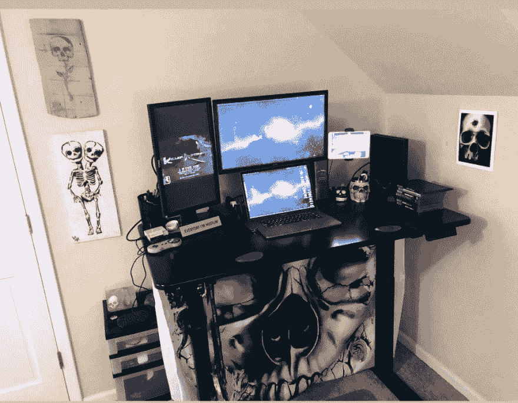

# 给你的桌子一些酷的风格，同时隐藏它的勇气！

> 原文：<https://dev.to/dechamp/give-your-desk-some-cool-style-while-hiding-it-s-guts-3l01>

我的新朋友斯科特发了一篇关于你办公桌布置的帖子。在这里检查一下。

 [## 让我们看看你的工作空间！

### Scott Simon tis 3 月 31 日 191 分钟阅读

#homelabs #showoffsunday #noplacelikelocalhost](/ssimontis/let-s-see-your-awesome-workspaces-3n2n)

我把我的设置贴在了他的帖子上，这让我思考它如何对别人有用，这是一个很酷的话题！

所以我买了一张立式办公桌，我很喜欢它...除了我的绳索和内脏挂在那里。它看起来很丑，我讨厌它。

所以我开始考虑用窗帘把它遮起来。但我希望它很酷，不要太贵。所以我去了亚马逊，查了一些浴帘！

嘣！风格和低成本。只是把它钉在我的桌子上，就这样！

让我知道你用什么聪明的方法来保持你的桌子/办公室整洁，看起来很酷。