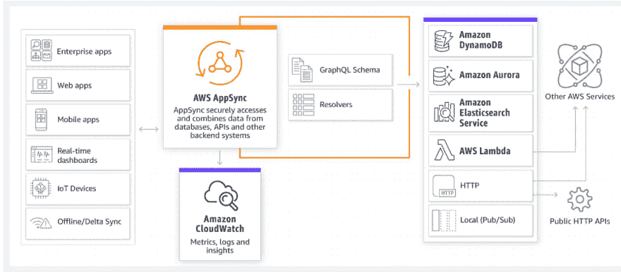
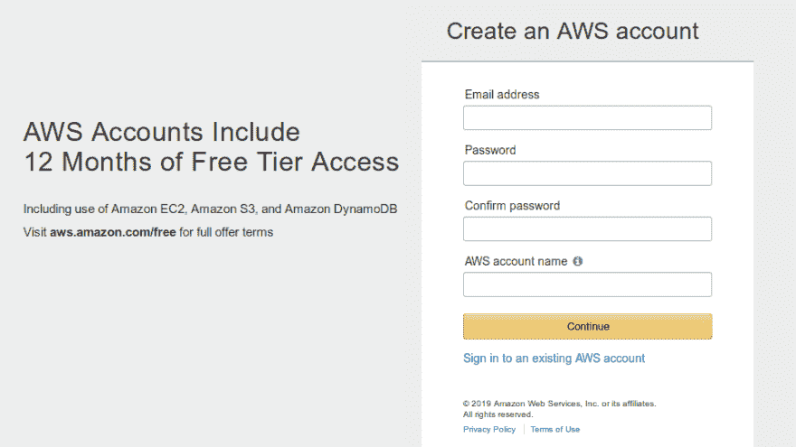
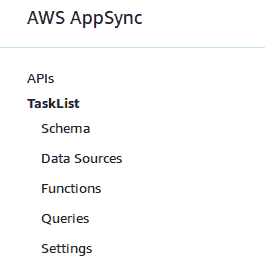
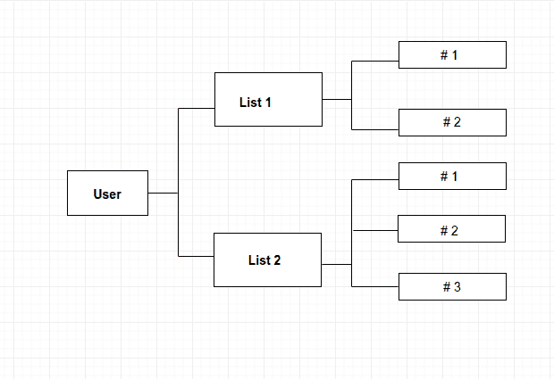
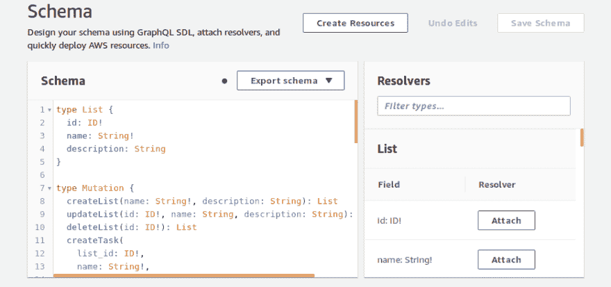
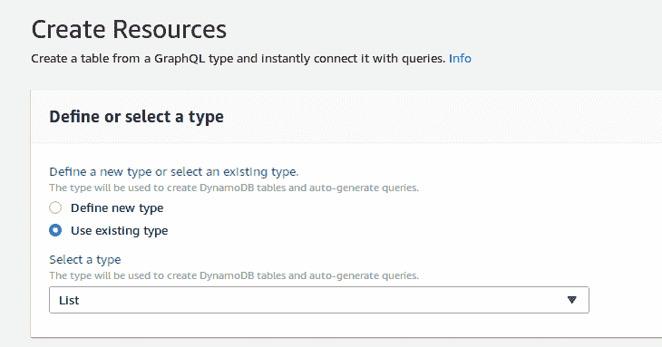
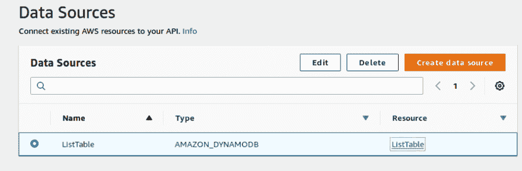

# 使用 AWS AppSync

> 原文：<https://dev.to/thisdotmedia/working-with-aws-appsync-4k5b>

## 简介

AWS AppSync 是 AWS(Amazon Web Services)中托管的应用程序开发服务，有助于为实时移动和 Web 开发开发灵活的 API。它支持来自不同数据源的数据操作和组合。该服务还使最终用户能够更新应用程序中的数据，即使他们的计算机或移动设备离线，然后在连接恢复时执行同步。

## AWS app sync 如何工作

[](https://res.cloudinary.com/practicaldev/image/fetch/s--Vbiy7QMN--/c_limit%2Cf_auto%2Cfl_progressive%2Cq_auto%2Cw_880/https://thepracticaldev.s3.amazonaws.com/i/4lcj0v3xq9hlvfyxj7hn.png)

(图片参考:[https://aws.amazon.com/appsync/](https://aws.amazon.com/appsync/))

## AWS app sync 入门

如果您已经有一个 AWS 帐户，请登录该帐户。否则，请转到 AWS 注册页面并创建一个新帐户。

[](https://res.cloudinary.com/practicaldev/image/fetch/s--RGWJEBHq--/c_limit%2Cf_auto%2Cfl_progressive%2Cq_auto%2Cw_880/https://thepracticaldev.s3.amazonaws.com/i/ec2o612opov3gc72ja1g.png)

登录后，打开 AWS AppSync 服务，点击“创建 API ”,选择“从头构建”选项，并命名 API(例如:TaskList)。点击“创建”后，您将被重定向到下面的页面，点击“下载配置”按钮，您将获得“ **API URL** 和“ **API 密钥**”。
[](https://res.cloudinary.com/practicaldev/image/fetch/s--yAbbJkf2--/c_limit%2Cf_auto%2Cfl_progressive%2Cq_auto%2Cw_880/https://thepracticaldev.s3.amazonaws.com/i/juxmabi87rt49gno5sjz.png)

在左侧导航栏中，您有以下 5 个链接:

[](https://res.cloudinary.com/practicaldev/image/fetch/s--QRPFAx4a--/c_limit%2Cf_auto%2Cfl_progressive%2Cq_auto%2Cw_880/https://thepracticaldev.s3.amazonaws.com/i/415cc358l36kywux30o3.png)

我们将创建一个 TaskList 应用程序，用户可以在其中创建 n 个任务的多个列表。

## 特性

*   待办事项列表(创建、读取、更新、删除)
*   列表项目(创建、读取、更新、删除)

## 设计模式

[](https://res.cloudinary.com/practicaldev/image/fetch/s--88zv32kF--/c_limit%2Cf_auto%2Cfl_progressive%2Cq_auto%2Cw_880/https://thepracticaldev.s3.amazonaws.com/i/lwkyul0em5sy2jua2gjr.png)

AWS 中的模式是我们定义类型、查询和变化的地方。GraphQL 类型用于定义 GraphQL 可访问的字段。

对于我们的应用，我们有:

## 类型

1.**列表类型**

```
 type List {

    id: ID!

    name: String!

    description: String

} 
```

2.**项目类型**

```
type Task {

    id: ID!

    list_id: ID!

    name: String!

    description: String

    date: String

    status: Boolean!

} 
```

## 查询

GraphQL 具有用于对数据执行 GET 请求的查询。

1.  Lists->将返回一个列表数组
2.  List->将返回单个列表
3.  Tasks->将返回一个任务数组
4.  任务->将返回单个任务

```
type Query {

    lists: [List]

    list(id: ID!): List

    tasks: [Task]

    task(id: ID!): Task

} 
```

## 突变

突变对数据库中的数据执行插入、更新和删除。

1.  创建列表

2.  更新列表

3.  删除列表

4.  createTask(创建任务)

5.  更新任务

6.  deleteTask

```
type Mutation {

    createTaskList(name: String!, description: String): List

    updateTaskList(id: ID!, name: String, description: String): List

    deleteTaskList(id: ID!): List

    createTask(

        list_id: ID!,

        name: String!,

        description: String,

        date: String,

        status: Boolean

    ): Task

    updateTask(

        id: ID!,

        list_id: ID,

        name: String,

        description: String,

        date: String,

        status: Boolean

    ): Task

    deleteTask(id: ID!): Task

} 
```

## 使用 AppSync 服务的优势

1.  **连接解析器**

AppSync 服务为我们创建所有资源，对于我们在模式中定义的所有类型，AppSync 为我们创建一个 DynamoDB 表。

创建完模式后，单击 CreateResource 按钮，如图所示。

[](https://res.cloudinary.com/practicaldev/image/fetch/s--6R4TjIJF--/c_limit%2Cf_auto%2Cfl_progressive%2Cq_auto%2Cw_880/https://thepracticaldev.s3.amazonaws.com/i/gv6d1qs5r9e2mf0c92y1.png)

继续选择我们创建的类型之一，就像我选择*列表*一样。

[](https://res.cloudinary.com/practicaldev/image/fetch/s--882rlLuK--/c_limit%2Cf_auto%2Cfl_progressive%2Cq_auto%2Cw_880/https://thepracticaldev.s3.amazonaws.com/i/mgshcbh3zqzbzmze4f4a.png)

现在，您可以标记主键，并列出该实体上的查询、变异和订阅。

现在，如果我们转到左侧导航栏上的**数据源**，我们会看到已经为我们创建了列表。

[](https://res.cloudinary.com/practicaldev/image/fetch/s--5i53IQBo--/c_limit%2Cf_auto%2Cfl_progressive%2Cq_auto%2Cw_880/https://thepracticaldev.s3.amazonaws.com/i/24o84t6pwiadwjmho8e0.png)

现在让我们通过从左侧导航栏移动到查询来创建一个列表。我们的创建查询看起来像:

```
mutation {

  createTaskList(name:"Shopping List",description:"Birthday Party") {

    id

    name

    description

  }

} 
```

它返回的输出:

```
{

  "data": {

    "createTaskList": null

  }

} 
```

什么也没发生，那是因为我们还没有将我们的突变链接到解析器(数据库)，让我们这样做吧。

1.  转到方案页面
2.  在“解析器输入突变”下方的文本框中，将仅列出突变。
3.  点击 createTaskList 旁边的“ **Attach** ”按钮。
4.  它会将您重定向到一个新页面，您可以在其中选择解析程序之前为您创建的列表。
5.  现在让我们再次运行 createTaskList 变异，看看输出是什么样子的。

```
{

  "data": {

    "createTaskList": {

      "id": "2a75af52-64fb-458a-8f1d-6976eb899a98",

      "name": "Shopping List",

      "description": "Birthday Party"

    }

  }

} 
```

1.  我们对 updateTaskList 和 deleteTaskList 执行类似的任务。我们还为查询 list:[list]和 List(...):列表。
2.  对任务重复这些步骤。
3.  在运行列表查询时，我们得到下面的输出

```
{

  "data": {

    "lists": [

      {

        "id": "0d8afdc0-d67e-4fd7-afc5-db3535d8ae1f",

        "name": "Shopping List",

        "description": "Birthday Party"

      },

      {

        "id": "af6d0c21-f62c-4ad8-81fb-eba167d8574a",

        "name": "Shopping",

        "description": "Birthday Party List"

      },

      {

        "id": "2a75af52-64fb-458a-8f1d-6976eb899a98",

        "name": "Shopping List",

        "description": "Birthday Party"
  }

    ]

  }

} 
```

**2。高级解析器**

为了找到列表，我们运行列表，为了找到任务，我们运行任务表，如果我们需要找到列表中的任务怎么办。GraphQL 有助于通过稍微更新模式来实现这一点。

模式更改将是:

```
type Task {

    id: ID!

    list_id: ID!

    name: String!

    description: String

    date: String

    status: Boolean!

            list: List

}

type List {

    id: ID!

    name: String!

    description: String

            tasks: [Task]

} 
```

这包括对解析器的更改，例如:为列表附加解析器:类型任务的列表字段，下面的查询现在将为您提供任务列表中的任务列表。

```
query {

  tasks {

    id

    name

    date

    list {

      id

      name

      description

    } 
```

至此，我们结束了使用 AWS AppSync 创建后端，要在您的应用程序中使用它，您可以根据需求修改模式，并使用 API URL 和 API 键将此后端集成到您的项目中。

*这篇文章是由 [ThisDot](https://www.thisdot.co/) 的 Megha Sachdev 写的。*

需要 JavaScript 咨询、指导或培训帮助吗？在 [This Dot Labs](//thisdot.co) 查看我们的服务列表。