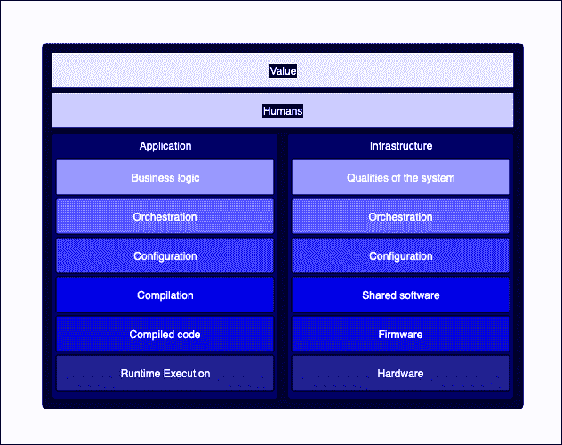
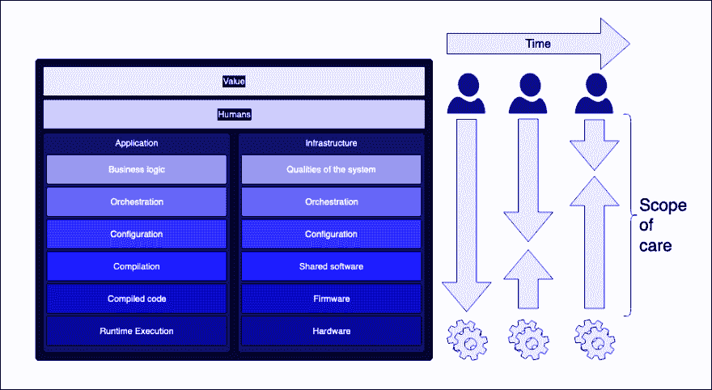

# 多一点问答

> 原文：<https://dev.to/defmyfunc/being-a-little-more-qa-bip>

作为一名顾问，在利益相关者的恶作剧结束后，我通常做的第一件事就是去和 QA 社区谈谈。一个组织内 QA 社区的健康状况通常是一个关键指标，它表明该组织是否能够完成我们被要求做的任何事情。QAs 不管他们是否受到他们运行的系统的约束，都必须理解将工作软件提供给用户的依赖和过程，即使在最孤立的组织中也是如此。

我的观点是，软件开发的未来在于每个人都变得“更加 QA 化”，在他们思考的方式以及他们每天执行的活动中。随着机器生成的代码在“堆栈”中向上移动，我们越来越多的“开发”责任将在于定义、观察和验证系统的质量及其行为，而不是键入使其工作的字母。实际上，在不久的将来，软件开发商...是一个 QA。

## 【过分】简化了一个“开发者”的顾虑层次

虽然这是一个过于简化的模型(也许到了无用的地步...我实际上并不认为模型正确与否有什么关系...只是你可以基于这种概括为你的世界创建一个模型来理解你的世界正在发生什么...phew :S)一般来说，作为一个通过互联网提供服务的开发人员，当您试图开发可以向您的用户释放的价值时，在一些面向用户的事情上，您需要处理以下“堆栈”:

以下是表格形式的信息副本:

| 价值(我们努力实现的目标) |
| 人类(同意需要做什么的人类) |
| 应用程序(软件) | 基础设施(软件在其上运行) |
| 业务逻辑(正在创造的新事物) | 系统的品质(我们希望在系统中看到的品质) |
| 编排(我们需要粘合在一起发布新东西的东西) | 编排(粘合在一起产生那种质量的东西) |
| 配置(为使软件构建和运行，我们需要更改的值) | 配置(如何设置这些东西以实现该质量) |
| 编译(将人类可读代码转换成机器可读代码的步骤) | 共享软件(那些东西上运行的是什么) |
| 编译代码(机器运行的代码) | 固件(嵌入硬件的软件) |
| 运行时执行(在机器上运行代码的行为) | 硬件(运行这些东西的是什么) |

随着时间的推移，机器自动化/生成/供应/等等的能力不断提高，这些过程中涉及的任务急剧增加。目前，作为人类，我们可能会中途遇到机器...而在过去，我们更接近裸机。作为“参与开发工作的总人数”的一部分，越来越少的人在更低的位置工作，越来越多的人能够关注更高的位置。理论是...我们离底层机制越远，就越能专注于为用户创造价值...与致力于“促成因素”相反，这意味着我们可以*然后*专注于为我们的用户创造价值。

这里大概值得一提的是[沃德利地图](https://medium.com/wardleymaps)...因为，嘿，这就是所有酷孩子所做的来想象这个过程。

作为开发人员，我们必须更好地掌握这一关键技能，使我们开发的系统和服务更易于观察，特别是在我们对产生我们所寻求的效果的实际代码几乎没有发言权的情况下。在短期内，可怜的长期受苦的 QA 会感谢你，因为你创造了系统的品质和行为(有意或无意！)可观察。从长远来看，你会感谢你自己，通过帮助你自己发展发现你的服务和它的行为以及它对你的用户的影响所需要的技能。

随着关键技术使机器学习生成的系统变得越来越普遍，这只会变得更加明显。[正如我在这里写的](https://www.defmyfunc.com/2019-04-06_ai_ml_healthcare_and_observability)，如果我们不能让这些系统和服务可见，我们就不能让这些系统和服务*负责*，这将是算法做出任何决定的关键要求。

这就是为什么我喜欢像 [Honeycomb.io](https://www.honeycomb.io) 这样的工具，以及它将带来的变化，因为我们真正开始挖掘这对我们的职业和可观测性工具的未来意味着什么。

我写这篇文章是因为 [ThoughtWorks 技术雷达](https://www.thoughtworks.com/radar)中包含了 [Wardley Maps 和 Honeycomb.io](https://twitter.com/defmyfunc/status/1121094326745010176?s=20) ，并想开始阐明为什么我认为它们有价值。