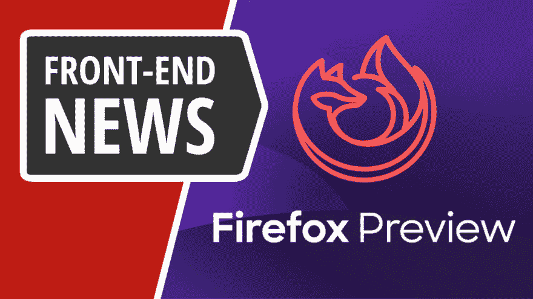
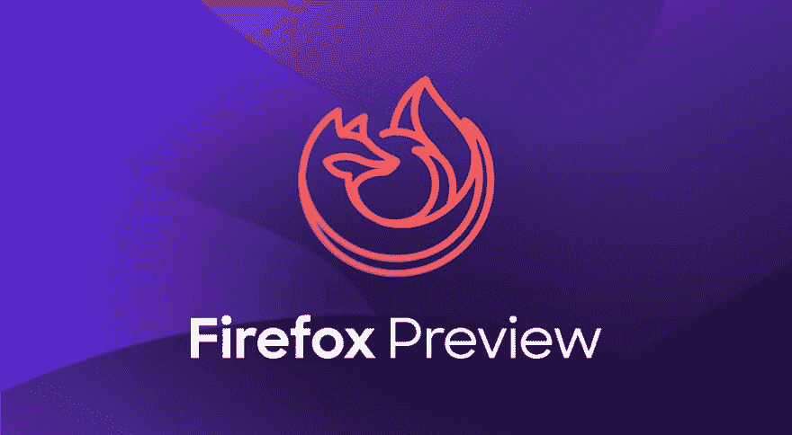
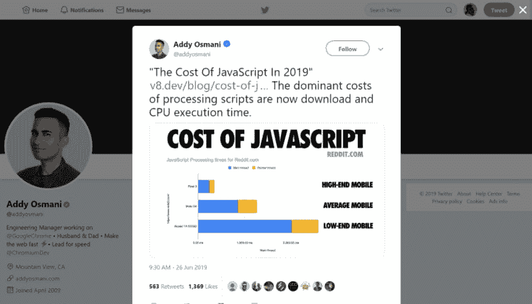
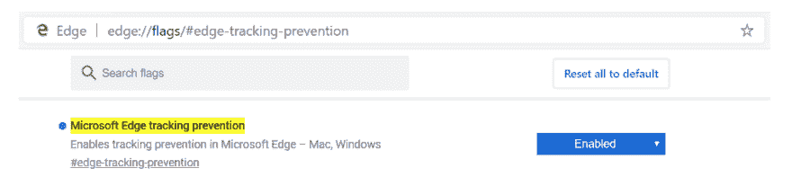
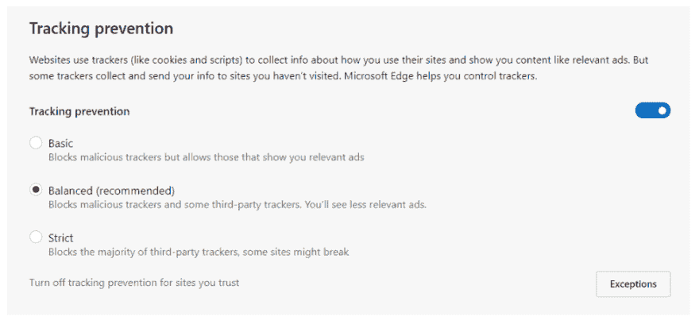

# 前端新闻#7: Firefox 预览版，2019 年 JavaScript 的成本，NodeJS 更新，以及跟踪…

> 原文：<https://dev.to/adriansandu/front-end-news-7-firefox-preview-the-cost-of-javascript-in-2019-nodejs-update-and-tracking-e1j>

<figure> 

<figcaption>在 YouTube 上查看该集:[https://youtu.be/IeiyBh1zWH0](https://youtu.be/IeiyBh1zWH0)</figcaption>

</figure>

大家好，欢迎来到另一个版本的前端新闻，这个节目将为您带来行业最新事件的信息。

以下是我今天为大家准备的重点内容:

*   Mozilla 发布了新的改进的移动 Firefox
*   Addy Osmani 告诉我们 2019 年 JavaScript 的成本是多少
*   NodeJS 收到新的更新
*   微软 Edge Chromium 发布了新的防跟踪功能

一如既往，我也为那些喜欢听而不是读的人准备了视频版本。如果你喜欢这种格式，如果你也能订阅 YouTube 频道，我将不胜感激。

[https://www.youtube.com/embed/IeiyBh1zWH0](https://www.youtube.com/embed/IeiyBh1zWH0)

### Mozilla 发布了新的改进的移动 Firefox

我再次以一个 Mozilla 的故事开始。这是我开始这个新闻节目以来的第四次了。我对此感到非常高兴，因为在我看来，多样性是网络的重要组成部分。反正回到手头的话题。

Mozilla 宣布发布一款名为 Firefox Preview 的新移动体验，这是 2016 年 Firefox Focus 开放之路的又一步。新的应用程序将提供与该公司自己的移动引擎 GeckoView 相同的快速和安全体验，并增加了增强隐私和安全的额外功能。

Google Play 商店现已提供早期版本。如果你是开发人员和/或早期采用者，Mozilla 有一条信息给你:下载它，试用它，并提供反馈以帮助他们做得更好。

来源:

为 Android 重塑 Firefox:预览版-未来版本

### 2019 年 JavaScript 的成本

“处理脚本的主要成本现在是下载和 CPU 执行时间”。这是 Addy Osmani 题为“2019 年 Javascript 的成本”的演讲的总体总结。这是在 4 月份的 PerfMatters 会议上制作的，但是我们现在在 V8 开发者博客上发布了视频和支持文章。

我认为花时间去看演示视频和阅读文章是非常值得的。对于 JavaScript 在现代网络中扮演的角色，有很多深刻的见解。是的，它们在台式机或顶级移动设备上运行时非常快。尽管在更便宜和更老的设备上，处理时间会增加很多。

在 JavaScript 框架为现代网络的很大一部分提供动力的时代，停下来意识到不是每个人都有最新的手机，他们可能没有最好的移动数据连接是一个好主意。#LetsMakeTheWebGreatAgain 为大家。

来源和参考资料:

*   [https://twitter.com/addyosmani/status/1143768354265559040](https://twitter.com/addyosmani/status/1143768354265559040)
*   [https://v8.dev/blog/cost-of-javascript-2019](https://v8.dev/blog/cost-of-javascript-2019)

### NodeJS 更新至 12.5.0

NodeJS 已经升级到版本 12.5.0，有许多值得一提的变化。最重要的是对 V8 和 OpenSSL 依赖项的更新，同时由于默认情况下启用了 V8 快照，启动时间也得到了改进。你可以在 NodeJS 博客公告上查看完整列表。

来源:

*   [https://nodejs . org/en/blog/release/v 12 . 5 . 0/](https://nodejs.org/en/blog/release/v12.5.0/)

### 微软 Edge Chromium 新增防跟踪功能

微软肯定会让新的 Chromium Edge 成为一款吸引人的浏览器。最新的预览版包含了一个新的跟踪预防机制。

您需要激活一个标志来启用这些功能。完成后，隐私设置区域会出现一个新的部分。有三个级别的跟踪预防，从基本到严格，中间选项是默认选项。

这仍然是一个实验性的特性，在它最终成型之前肯定会有变化。随着开发过程的继续，进一步的更新将继续推出。

来源:

*   [https://blogs . windows . com/msedgedev/2019/06/27/tracking-prevention-Microsoft-edge-preview/# iocpjpflyvsewaxy . 97](https://blogs.windows.com/msedgedev/2019/06/27/tracking-prevention-microsoft-edge-preview/#iocpjPflYvSEwAxY.97)

### 今日问题

你在手机上用的是什么浏览器？您使用的是设备自带的默认版本还是您下载的其他版本？请在下面的评论区告诉我们。Opera 移动用户将获得额外的印象分。

这一版就这么多了。在 https://twitter.com/frontendnexus[的 Twitter 上关注 Front End Nexus](https://twitter.com/frontendnexus)，一旦有新的更新，我们将立即通知您。我还想鼓励你在 https://www.youtube.com/channel/UCgACtqiDmnSaskDIBsK54ww[的](https://www.youtube.com/channel/UCgACtqiDmnSaskDIBsK54ww)订阅 YouTube 频道。一旦该频道达到 100 名订户，我可以解锁更多的选项，因此非常感谢您的支持。

祝您度过愉快而富有成效的一周，我们下次再见！

* * *