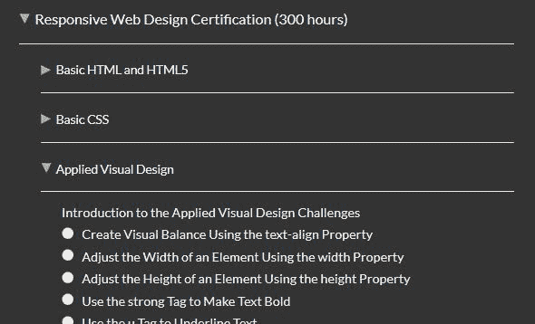
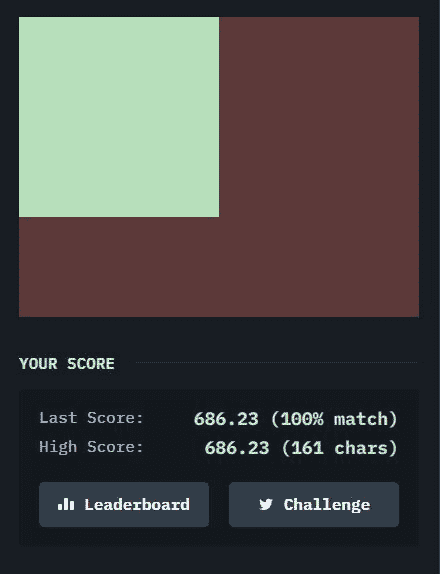

# 变换和动画

> 原文：<https://dev.to/tuxhedoh/transforms-and-animations-51mf>

今天的编码挑战要么是我第一次开始使用 FCC 时引入的，要么是我为了学习 javascript 而跳过的。我很高兴他们今天出现了。
 
应用视觉设计最初是作为一种复习，但很快就转移到学习变换和动画。除了尝试对别人的项目进行逆向工程之外，我以前没有花时间去学习这些。我也没有具体的例子。这没有任何意义。我希望在接下来的几天里，我能找到练习这些东西的方法。今天早上，当我为今天的课程感到兴奋时，我偶然看到了[这篇文章](https://dev.to/teamxenox/the-only-way-to-improve-your-css-game-1m2k)，并点击进入 [CSS 之战](https://cssbattle.dev/)网站，并说服自己，除了在 Firefox 中不起作用的页面之外，我将无法完成任何事情。我想我可以试一试，作为日常练习。

刚开始学 CSS 的时候，有哪些资源对你有帮助？

编辑:
在点击回到 CSS 战之后，我意识到我需要登录才能访问“完整的”集合。
