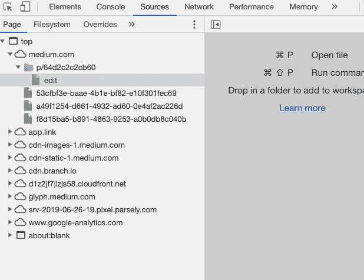
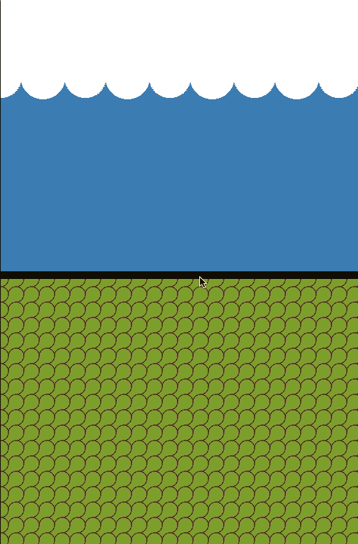

# 如何让你自己的 SplitPane 反应组件与 0 的依赖关系

> 原文：<https://dev.to/seif_ghezala/how-to-make-your-own-splitpane-react-component-with-0-dependencies-gjg>

SplitPane 是两个元素的集合，其高度可以通过拖动分隔它们的线条来更改。根据其布局，SplitPane 可以是水平的或垂直的。如果你曾经使用过 Chrome 开发工具，你可能会遇到两个版本的 SplitPane。
例如，开发工具的元素部分包含一个水平分割面板:

<figure>

<figcaption>Elements section of the Chrome Dev Tools showing a horizontal SplitPane componentt</figcaption>

</figure>

您还可以在开发工具的 Sources 部分找到一个垂直的 SplitPane:

<figure>

<figcaption>Sources section of the Chrome Dev Tools showing a vertical SplitPane component</figcaption>

</figure>

在本文中，我们将创建自己的 SplitPane 组件，没有任何依赖关系。虽然我们将只构建一个垂直版本，但是您可以应用相同的逻辑并稍微修改它来构建水平版本。这是我们最终的结果:

[ ](https://res.cloudinary.com/practicaldev/image/fetch/s--EdulR5qS--/c_limit%2Cf_auto%2Cfl_progressive%2Cq_66%2Cw_880/https://thepracticaldev.s3.amazonaws.com/i/6x4u131nzof8jkv448lj.gif) alt= "最终结果">

<figure>

<figcaption>最终结果</figcaption>

</figure>

最终的源代码可以在[这里](https://codesandbox.io/s/compassionate-meninsky-9x9kt?fontsize=14&view=preview)找到。

本文将涉及以下 React 概念:

*   使用 React useState 挂钩处理状态。
*   React 引用 React.createRef()和 React.useRef()。我们将使它们的应用程序引用 DOM 元素，但也处理变化的值。
*   创建一个 React 上下文并使用 useContext() React 挂钩订阅它。

如果您不熟悉这些概念，这是一个很好的实用指南，可以帮助您熟悉它们。

## 💡诀窍(剧透警报)

我们的垂直 SplitPane 有一个要求:无论何时拖动分隔符，顶部和底部窗格的大小都应该相应地改变。虽然这是真的，但还有另一种方式来看待它，这将使我们的实现更简单。
如果我们考虑一下，拖动分隔符只是修改 1 个元素的大小。另一个元素只是占据了剩余的空间。
当我们向上移动分隔符时，我们只是减小了顶部窗格的尺寸。底部窗格将占据所有剩余空间。

> 注意:我们花些时间理解这一点非常重要，因为这是我们以后逻辑的核心。

## 第一步:基本设置

让我们首先有一个非常基本的设置，我们可以在上面建立。首先，我们的 SplitPane 组件仅仅是一个 flex 容器 div。它呈现第一个子元素、分隔符 div 和第二个子元素。
SplitPane 有 2 个子组件:顶部和底部。子组件是简单的 div，它接受子组件，因此我们可以随意填充它们。
最初，顶部&底部平分 SplitPane 的高度。为了实现这一点，它们的样式中都有一个 flex:1(c . f ./style . CSS)。

```
// SplitPlane.js
export default function SplitPane({ children, ...props }) {
  return (
    <div {...props} className="split-pane">
      {children[0]}
      <div className="separator" />
      {children[1]}
    </div>
  );
}

SplitPane.Top = function SplitPaneTop(props) {
  return <div {...props} className="split-pane-top" />;
};

SplitPane.Bottom = function SplitPaneBottom(props) {
  return <div {...props} className="split-pane-bottom" />;
}; 
```

```
/* styles.css */
.split-pane {
  display: flex;
  flex-direction: column;
}

.split-pane-top,
.split-pane-bottom {
  flex: 1;
  overflow: hidden;
}

.split-pane-top {
  background: ...
}
.split-pane-bottom {
  background: ...
}

.separator {
  border: 5px solid black;
  cursor: row-resize;
} 
```

```
// index.js
function App() {
  return (
    <div className="App">
      <SplitPane>
        <SplitPane.Top />
        <SplitPane.Bottom />
      </SplitPane>
    </div>
  );
} 
```

## 第二步:获取顶部窗格高度

我们的逻辑是基于顶部窗格的高度。没有它，我们无法进行任何计算。

我们有两个选择:

1.  强制用户传递绝对高度值。
2.  一旦顶部窗格第一次呈现，我们自己计算高度。

如果您选择了第一个选项，您可以跳过此步骤的其余部分。

### 顶部窗格的高度应该在 SplitPane 中

我们的逻辑将基于 SplitPane 组件。因此，顶部的高度需要在 SplitPane 状态下可用。然后我们可以为 Splitpane 组件创建一个*上下文*来保存:

*   顶部窗格的高度。
*   一个更新高度函数。

```
// SplitPlane.js
const splitPaneContext = React.createContext();

export default function SplitPane({ children, ...props }) {
  const [topHeight, setTopHeight] = React.useState(null);

  return (
    <div {...props} className="split-pane">
      <splitPaneContext.Provider value={{ topHeight, setTopHeight }}>
        {children[0]}
        <div className="separator" />
        {children[1]}
      </splitPaneContext.Provider>
    </div>
  );
}

SplitPane.Top = function SplitPaneTop(props) {
  return <div {...props} className="split-pane-top" />;
};

SplitPane.Bottom = function SplitPaneBottom(props) {
  return <div {...props} className="split-pane-bottom" />;
}; 
```

### 那么，我们如何得到那个高度呢？

我们可以获得组件中顶部窗格的高度。为此，我们创建一个对 DOM 元素的引用，并在第一次渲染后使用`React.useEffect`获取它的`clientHeight`。
为了检测第一次渲染，我们可以看看我们的高度变量是否有它的初始空值。
我们可以使用`React.useContext`方法消耗顶部窗格的高度和它的 setter 函数。使用 setter 函数，我们可以在 SplitPane 组件的状态下设置顶部窗格的高度。

```
// SplitPlane.js
const splitPaneContext = React.createContext();

export default function SplitPane({ children, ...props }) {
  const [topHeight, setTopHeight] = React.useState(null);

  return (
    <div {...props} className="split-pane">
      <splitPaneContext.Provider value={{ topHeight, setTopHeight }}>
        {children[0]}
        <div className="separator" />
        {children[1]}
      </splitPaneContext.Provider>
    </div>
  );
}

SplitPane.Top = function SplitPaneTop(props) {
  const topRef = React.createRef();
  const { topHeight, setTopHeight } = React.useContext(splitPaneContext);

  React.useEffect(() => {
    if (!topHeight) {
      setTopHeight(topRef.current.clientHeight);
      topRef.current.style.flex = "none";
      return;
    }
  });

  return <div {...props} className="split-pane-top" ref={topRef} />; };

SplitPane.Bottom = function SplitPaneBottom(props) {
  return <div {...props} className="split-pane-bottom" />;
}; 
```

### 更新顶部窗格高度

到目前为止，我们设法计算了顶部窗格 DOM 元素的高度，并将其存储在 SplitPane 的状态中。现在，我们需要处理相反的情况。每当`topHeight`状态值改变时，我们需要改变顶部窗格 DOM 元素的高度。我们可以在之前创建的效果中这样做:

```
// SplitPlane.js
SplitPane.Top = function SplitPaneTop(props) {
  const topRef = React.createRef();
  const { topHeight, setTopHeight } = React.useContext(splitPaneContext);

  React.useEffect(() => {
    if (!topHeight) {
      setTopHeight(topRef.current.clientHeight);
      topRef.current.style.flex = "none";
      return;
    }

    topRef.current.style.height = `${topHeight}px`;
  });

  return <div {...props} className="split-pane-top" ref={topRef} />; }; 
```

我们创建的效果会在每次组件渲染时运行。我们不想在每次渲染时不必要地更新顶部窗格 DOM 元素的高度。为了避免这种情况，我们可以将`[topHeight]`作为第二个参数传递给`React.useEffect`。通过这样做，这个效果将只在`topHeight`状态值改变时运行:

```
// SplitPlane.js
SplitPane.Top = function SplitPaneTop(props) {
  const topRef = React.createRef();
  const { topHeight, setTopHeight } = React.useContext(splitPaneContext);

  React.useEffect(() => {
    if (!topHeight) {
      setTopHeight(topRef.current.clientHeight);
      topRef.current.style.flex = "none";
      return;
    }

    topRef.current.style.height = `${topHeight}px`;
  }, [topHeight]);

  return <div {...props} className="split-pane-top" ref={topRef} />; }; 
```

既然我们检测了顶部窗格的高度并相应地更新了它的 DOM 元素，那么是时候实现必要的更改了，当用户拖动 separator 元素时应该会发生这些更改。

## 第三步:检测阻力差

每当用户拖动分隔符时，我们希望检测分隔符被拖动的垂直距离。为此，我们需要跟踪 3 个鼠标事件:

*   **鼠标按下分隔符:**一旦用户按下分隔符，我们希望将该位置设置为拖动的初始垂直位置。
*   **鼠标在文档上移动:**我们如何检测用户拖动分隔符？如果初始拖动位置存在，并且有鼠标移动，则用户正在拖动分隔符。拖动距离是当前鼠标垂直位置和初始垂直拖动位置之间的差值。新的顶部窗格高度就是它的初始高度+阻力差。
*   **鼠标放在文档上:**这意味着用户释放了分隔符。此时，我们可以重置阻力初始值。

我们的组件函数在每次渲染时都会运行。那么我们如何在渲染中保持和改变初始拖动位置呢？为此，我们可以使用 React.useRef()。是的，React refs 不仅用于引用 DOM 元素。它们可以用来跨渲染维护可变值(很酷，不是吗？):

```
// SplitPane.js

const splitPaneContext = React.createContext();

export default function SplitPane({ children, ...props }) {
  const [topHeight, setTopHeight] = React.useState(null);
  const separatorYPosition = React.useRef(null);

  const splitPaneRef = React.createRef();

  const onMouseDown = e => {
    separatorYPosition.current = e.clientY;
  };

  const onMouseMove = e => {
    if (!separatorYPosition.current) {
      return;
    }

    const newTopHeight = topHeight + e.clientY - separatorYPosition.current;
    separatorYPosition.current = e.clientY;

    setTopHeight(newTopHeight);
  };

  const onMouseUp = () => {
    separatorYPosition.current = null;
  };

  React.useEffect(() => {
    document.addEventListener("mousemove", onMouseMove);
    document.addEventListener("mouseup", onMouseUp);

    return () => {
      document.removeEventListener("mousemove", onMouseMove);
      document.removeEventListener("mouseup", onMouseUp);
    };
  });

  return (
    <div {...props} className="split-pane" ref={splitPaneRef}>
      <splitPaneContext.Provider value={{ topHeight, setTopHeight }}>
        {children[0]}
        <div className="separator" onMouseDown={onMouseDown} />
        {children[1]}
      </splitPaneContext.Provider>
    </div>
  );
} 
```

### 👆还有一个小小的改进

SplitPane 有一个上限和下限。一旦用户拖动到这两个边框之外，就不再需要更新顶部窗格的高度。因此，我们可以做的一个改进是，当:
顶部窗格的新高度等于整个 SplitPane 组件的高度时，避免进行任何状态更改。
顶部窗格的新高度小于 0。

我们可以使用对它的引用来获得 SplitPane DOM 元素的高度，我们可以使用 React.createRef 创建该引用。然后，在对顶部高度进行任何状态更新之前，我们检查之前的两个条件:

```
// SplitPane.js

const splitPaneContext = React.createContext();

export default function SplitPane({ children, ...props }) {
  const [topHeight, setTopHeight] = React.useState(null);
  const separatorYPosition = React.useRef(null);

  const splitPaneRef = React.createRef();

  const onMouseDown = e => {
    separatorYPosition.current = e.clientY;
  };

  const onMouseMove = e => {
    if (!separatorYPosition.current) {
      return;
    }

    const newTopHeight = topHeight + e.clientY - separatorYPosition.current;
    separatorYPosition.current = e.clientY;

    if (newTopHeight <= 0) {
      return topHeight !== 0 && setTopHeight(0);
    }

    const splitPaneHeight = splitPaneRef.current.clientHeight;

    if (newTopHeight >= splitPaneHeight) {
      return topHeight !== splitPaneHeight && setTopHeight(splitPaneHeight);
    }

    setTopHeight(newTopHeight);
  };

  const onMouseUp = () => {
    separatorYPosition.current = null;
  };

  React.useEffect(() => {
    document.addEventListener("mousemove", onMouseMove);
    document.addEventListener("mouseup", onMouseUp);

    return () => {
      document.removeEventListener("mousemove", onMouseMove);
      document.removeEventListener("mouseup", onMouseUp);
    };
  });

  return (
    <div {...props} className="split-pane" ref={splitPaneRef}>
      <splitPaneContext.Provider value={{ topHeight, setTopHeight }}>
        {children[0]}
        <div className="separator" onMouseDown={onMouseDown} />
        {children[1]}
      </splitPaneContext.Provider>
    </div>
  );
} 
```