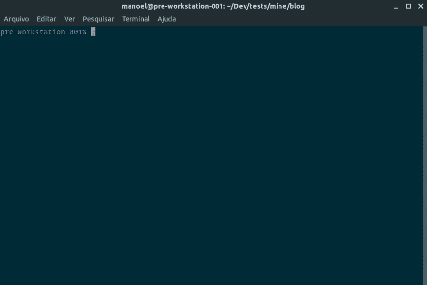
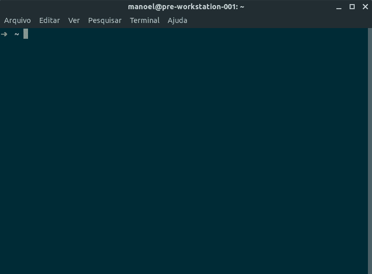
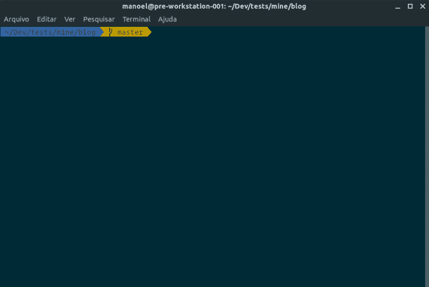
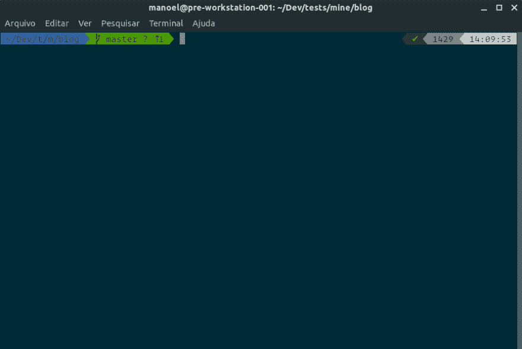
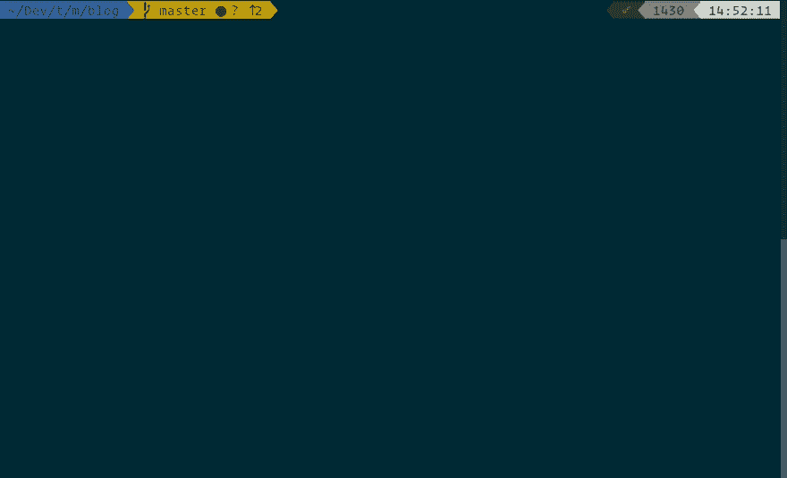

# 我的桌面设置-第 2 部分:外壳中的 Z

> 原文：<https://dev.to/manoeltlobo/my-desktop-setup-part-2-the-z-in-the-shell-3a2n>

在我的[上一篇文章](https://dev.to/manoeltlobo/my-desktop-setup-part-1-bn1)中，我谈到了根据我的喜好设置操作系统的外观。现在，来看看贝壳。

几年来，我用[鱼](https://fishshell.com)作为我的默认外壳。它非常用户友好，易于配置。但是它的语法与 bash 不兼容，我不得不绞尽脑汁想出一些变通办法来使用我需要经常使用的工具(有时没有相同的结果)。

我以前测试过 Zsh，但是直到最近才努力以一种让我满意和高效的方式来设置它。下面是我尝试的步骤。

## 安装 Zsh

要在 Ubuntu 中使用 Zsh，你需要安装它并设置为你的默认 shell:

```
$ sudo apt install zsh
$ chsh -s $(which zsh) 
```

完成这些步骤后，重新启动用户会话以验证更改。

下一次你打开你的终端时，你会看到新用户的配置功能，你可以按下`2`接受默认设置。这将显示一个略有不同的提示，但没有太多的天赋，但我们接下来将解决它。

[](https://res.cloudinary.com/practicaldev/image/fetch/s--Yu_A54y---/c_limit%2Cf_auto%2Cfl_progressive%2Cq_auto%2Cw_880/https://thepracticaldev.s3.amazonaws.com/i/cyvy30gmka5d3i4jn8dn.png)

## 天啊影响

定制终端可能是一项非常艰巨的任务。幸运的是，有很棒的工具可以让我们稍微缓解一下。我的选择是罗比·鲁塞尔和他的贡献者的框架。

要安装它:

```
$ sh -c "$(curl -fsSL https://raw.github.com/robbyrussell/oh-my-zsh/master/tools/install.sh)" 
```

> 你需要安装`curl`和`git`，如果还没有安装`sudo apt install curl git`。

[](https://res.cloudinary.com/practicaldev/image/fetch/s--veAGowB5--/c_limit%2Cf_auto%2Cfl_progressive%2Cq_auto%2Cw_880/https://thepracticaldev.s3.amazonaws.com/i/xa8tqq0wyayn44nef3s1.png)

它是...不一样。我们得到了 git 状态指示器，耶！。但还没什么吸引力。

### 主题

Oh My Zsh 框架有很多主题，比如我最喜欢的一个，agnoster。要设置其中之一，您只需编辑 zshrc 配置文件(`~/.zshrc` ):

```
ZSH_THEME="agnoster" 
```

[](https://res.cloudinary.com/practicaldev/image/fetch/s--QR4j9Pvs--/c_limit%2Cf_auto%2Cfl_progressive%2Cq_auto%2Cw_880/https://thepracticaldev.s3.amazonaws.com/i/1ghng9p2u05ilphr4ul0.png)

虽然我觉得这个主题很赏心悦目，但我还是决定使用`powerlevel9k`这个主题，并根据我的喜好将它放大一点。它与电力线字体协同工作，达到视觉上的完美。

[](https://res.cloudinary.com/practicaldev/image/fetch/s--lLBjjCUN--/c_limit%2Cf_auto%2Cfl_progressive%2Cq_auto%2Cw_880/https://thepracticaldev.s3.amazonaws.com/i/9vgwrh2h16bd0vlzhldd.png)

首先，安装它:

```
$ sudo apt install powerline powerline-fonts
$ git clone https://github.com/bhilburn/powerlevel9k.git ~/.oh-my-zsh/custom/themes/powerlevel9k 
```

然后，编辑`~/.zshrc`文件，再添加几行来调整主题:

```
# Hide the user from the prompt
DEFAULT_USER=$USER

# Shorten the folder breadcrumbs
# ~/my/extremely/long/fumbled/path becomes ~/my/e/l/f/path
POWERLEVEL9K_SHORTEN_DIR_LENGTH=1
POWERLEVEL9K_SHORTEN_DELIMITER=""
POWERLEVEL9K_SHORTEN_STRATEGY="truncate_from_right" 
```

### 不要脸的外挂(ins)

我必须承认我有点懒，所以我更喜欢我的工具为我工作。在终端情况下(没有双关语的意思)，我希望它能完成我的句子，记住我之前输入的内容，告诉我是否输入了错误，等等。幸运的是，有两个插件可以做到这一点:[zsh-自动建议](https://github.com/zsh-users/zsh-autosuggestions)和[zsh-语法突出显示](https://github.com/zsh-users/zsh-syntax-highlighting)。

要安装它们，将它们的 git repos 克隆到 Oh My Zsh:
的 plugins 文件夹中

```
$ git clone https://github.com/zsh-users/zsh-autosuggestions ${ZSH_CUSTOM:-~/.oh-my-zsh/custom}/plugins/zsh-autosuggestions
$ git clone https://github.com/zsh-users/zsh-syntax-highlighting.git ${ZSH_CUSTOM:-~/.oh-my-zsh/custom}/plugins/zsh-syntax-highlighting 
```

之后编辑你的`~/.zshrc`(再来！)并将它们添加到插件部分:

```
plugins=(
  zsh-autosuggestions
  zsh-syntax-highlighting
  # any other plugins come in here too
) 
```

看着它前进！

[](https://res.cloudinary.com/practicaldev/image/fetch/s--ECTPPqXt--/c_limit%2Cf_auto%2Cfl_progressive%2Cq_66%2Cw_880/https://thepracticaldev.s3.amazonaws.com/i/suogfdz9is7bz6dp1cgx.gif)

* * *

哇！在这个帖子里说了很多。该休息了，下次再见！

> 这篇文章最初发表在我的个人博客上， [manoel.tech](https://manoel.tech)