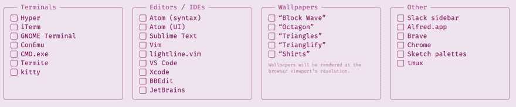

# 使用 themer 制作您自己的配色方案

> 原文：<https://dev.to/deusmxsabrina/using-themer-to-make-your-own-colorscheme-h5g>

我喜欢为我的笔记本电脑设计一个内聚的主题，当你每天都在使用许多不同的应用程序( [Slack](https://slack.com/intl/en-ca/) 、[终端](https://en.wikipedia.org/wiki/Terminal_emulator)、[文本编辑器](https://en.wikipedia.org/wiki/Text_editor)等等)时，创建内聚的主题体验可能会令人沮丧且耗时。

我也一直想尝试为 Vim 制作自己的配色方案，但被“从哪里开始麻痹”冻结了几次。

输入[主题](https://themer.dev)，这些问题的解决方案和允许我发布[我的第一个 vim 配色方案](http://vimcolors.com/949/garbage-oracle/light)的工具。

我使用网页版是因为设置调色板对我来说是一个新的任务，我喜欢这个视觉界面，尽管我可以用另一个视觉工具来代替这个体验。我发现这是对将来可能使用命令行主题工具的一个很好的介绍。

我的意思是，看看它给你的所有生成选项:
 
它也是[开源](https://github.com/mjswensen/themer)如果它缺少一个工具，你想[增加一个](https://github.com/mjswensen/themer#create-your-own-template)！

总之，这个工具节省了我花在编辑 vim 配色方案上的时间，为我生成了匹配的壁纸和其他编辑器主题，并产生了可读的代码，使我可以对所说的 vim 配色方案进行一些非常简单的调整，所以我想我应该分享一下，以防你也有兴趣制作自己的主题，但不知道从哪里开始。

作为试用主题的一部分，我生成的其余主题是这里的，主题中到它的唯一链接是这里的。