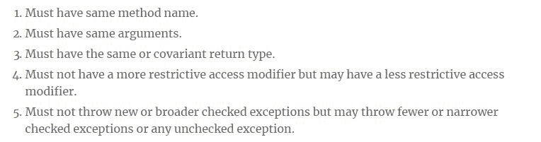

# 为什么我们应该遵循方法重写规则

> 原文：<https://dev.to/njnareshjoshi/why-we-should-follow-method-overriding-rules-31lo>

在我以前的文章[为什么我们应该遵循方法重载规则](https://programmingmitra.com/2017/12/why-to-follow-method-overloading-rules.html)中，我讨论了方法重载和重载方法需要遵循的规则。我还讨论了为什么我们需要遵循这些规则，为什么一些方法重载规则是必需的，而其他的是可选的。

以类似的方式，在本文中，我们将看到我们需要遵循什么规则来覆盖一个方法，以及为什么我们应该遵循这些规则。

## 法覆写及其规则

正如在[关于方法重载 Vs 方法覆盖的一切](https://programmingmitra.com/2017/05/everything-about-method-overloading-vs-method-overriding.html)中所讨论的，每个子类从其父类继承所有可继承的行为，但是子类也可以定义自己的新行为或者覆盖一些继承的行为。

重写意味着在子类中重新定义已经被其父类定义的行为(方法),但是要这样做，在子类中重写方法必须遵循一定的规则和准则。

对于它所重写的方法，重写方法必须遵循以下规则。

[T4】](////3.bp.blogspot.com/-hhpGgaXYUgg/WjqobOrC3PI/AAAAAAAAMr8/HMu27uIEnLg9MkvYSGfxYy_8mjc0ZEq8QCK4BGAYYCw/s1600/method-overriding-rules.JPG)

为了正确理解这些原因，让我们考虑下面的例子，我们有一个类`Mammal`，它定义了`readAndGet`方法，该方法读取一些文件并返回类`Mammal`的一个实例。

类`Human`扩展类`Mammal`并覆盖`readAndGet`方法以返回`Human`的实例而不是`Mammal`的实例。

```
class Mammal {
    public Mammal readAndGet() throws IOException {//read file and return Mammal`s object}
}

class Human extends Mammal {
    @Override
    public Human readAndGet() throws FileNotFoundException {//read file and return Human object}
} 
```

<svg width="20px" height="20px" viewBox="0 0 24 24" class="highlight-action crayons-icon highlight-action--fullscreen-on"><title>Enter fullscreen mode</title></svg> <svg width="20px" height="20px" viewBox="0 0 24 24" class="highlight-action crayons-icon highlight-action--fullscreen-off"><title>Exit fullscreen mode</title></svg>

我们知道在方法覆盖的情况下，我们可以进行多态调用。这意味着，如果我们将一个子实例赋给一个父引用，并在该引用上调用一个被覆盖的方法，最终将调用子类中的方法。让我们这样做

```
Mammal mammal = new Human();
try {
    Mammal obj = mammal.readAndGet();
} catch (IOException ex) {..} 
```

<svg width="20px" height="20px" viewBox="0 0 24 24" class="highlight-action crayons-icon highlight-action--fullscreen-on"><title>Enter fullscreen mode</title></svg> <svg width="20px" height="20px" viewBox="0 0 24 24" class="highlight-action crayons-icon highlight-action--fullscreen-off"><title>Exit fullscreen mode</title></svg>

正如在[中讨论的，JVM 如何处理方法重载和内部重写](https://programmingmitra.com/2017/05/how-does-jvm-handle-method-overriding-internally.html)，直到编译阶段编译器认为方法是从父类调用的。而字节码生成阶段编译器生成一个`constant pool`,将每个方法字符串和类引用映射到一个内存引用

在运行时，JVM 创建一个`vtable`或`virtual table`来识别哪个方法被准确地调用。JVM 为每个类创建一个`vtable`,它对该类的所有对象都是通用的。`vtable`中的哺乳动物行包含方法名和该方法的内存引用。

首先，JVM 为父类创建一个`vtable`,然后将父类的`vtable`复制到子类的`vtable`,只更新重载方法的内存引用，同时保持相同的方法名。

你可以在[上更清楚地阅读 JVM 如何处理方法重载和内部重写](https://programmingmitra.com/2017/05/how-does-jvm-handle-method-overriding-internally.html)如果看起来很难的话。所以到目前为止，我们很清楚

*   对于编译器来说`mammal.readAndGet()`意味着从类`Mammal`的实例中调用方法
*   对于 JVM 来说,`mammal.readAndGet()`正在从一个内存地址被调用，这个内存地址是`vtable`为`Mammal.readAndGet()`保存的，它指向来自类`Human`的方法调用。

## 为什么重写方法必须有相同的名称和相同的参数列表

从概念上讲，`mammal`指向了类`Human`的一个对象，我们在`mammal`上调用了`readAndGet`方法，所以为了在运行时解决这个调用，`Human`也应该有一个方法`readAndGet`。如果`Human`已经从`Mammal`继承了那个方法，那么就没有问题，但是如果`Human`正在覆盖`readAndGet`，它应该提供与`Mammal`相同的方法签名，因为该方法已经根据那个方法签名被调用。

但是你可能会问从`vtables`开始它是如何被物理处理的，所以我必须告诉你，JVM 为每个类创建一个`vtable`，当它遇到一个覆盖方法时，它保持相同的方法名(`Mammal.readAndGet()`)，同时只更新那个方法的内存地址。因此，重写方法和重写方法必须具有相同的方法和参数列表。

## 为什么重写方法必须有相同或协变的返回类型

我们知道，对于编译器来说，方法是从类`Mammal`中调用的，而对于 JVM 来说，方法是从类`Human`的实例中调用的，但是在这两种情况下，`readAndGet`方法调用必须返回一个可以分配给`obj`的对象。由于`obj`是`Mammal`类型的，它既可以保存`Mammal`类的实例，也可以保存`Mammal`子类的实例(对于`Mammal`，`Mammal`的子类是协变的)。

现在假设如果`Human`类中的`readAndGet`方法返回其他东西，那么在编译时`mammal.readAndGet()`不会产生任何问题，但在运行时，这将导致一个`ClassCastException`，因为在运行时`mammal.readAndGet()`将被解析为`new Human().readAndGet()`，并且这个调用不会返回一个类型为`Mammal`的对象。

这就是为什么编译器首先不允许不同的返回类型。

## 为什么重写方法不能有更严格的访问修饰符

同样的逻辑在这里也适用，对`readAndGet`方法的调用将在运行时被解析，正如我们所见`readAndGet`在类`Mammal`中是公共的，现在假设

*   如果我们在`Human`中将`readAndGet`定义为`default`或`protected`，而在另一个包中定义了人类
*   如果我们将`readAndGet`定义为`Human`中的`private`

在这两种情况下，代码都将成功编译，因为编译器`readAndGet`从类`Mammal`中被调用，但是在这两种情况下，JVM 将不能从`Human`中访问`readAndGet`，因为它将受到限制。

所以为了避免这种不确定性，根本不允许给子类中的重写方法分配限制性访问。

## 为什么重写方法可能有限制较少的访问修饰符

如果从`Mammal`可以访问`readAndGet`方法，并且我们能够执行`mammal.readAndGet()`，这意味着这个方法是可访问的。我们使`readAndGet`变得更少限制`Human`，这意味着它将更开放地被调用。

因此，减少重写方法的限制不会在将来产生任何问题，这是允许的。

## 为什么重写方法一定不能抛出新的或更广泛的检查过的异常

因为`IOException`是一个被检查的异常，所以每当我们在`mammal`上调用`readAndGet`时，编译器都会强制我们捕捉它

现在假设`Human`中的`readAndGet`正在抛出任何其他被检查的异常，例如`Exception`，我们知道`readAndGet`将从`Human`的实例中被调用，因为`mammal`正在持有`new Human()`。

因为对于编译器来说，方法是从`Mammal`开始调用的，所以编译器会强制我们只处理`IOException`，但是在运行时，我们知道方法会抛出`Exception`，而这并没有得到处理，如果方法抛出异常，我们的代码就会中断。

这就是为什么它在编译器级别被阻止，我们不允许抛出任何新的或更广泛的检查异常，因为它最终不会被 JVM 处理。

## 为什么重写方法可能抛出更窄的检查异常或任何未检查异常

但是如果`Human`中的`readAndGet`抛出了`IOException`的任何一个子异常，比如`FileNotFoundException`，就会被处理，因为`catch (IOException ex)`可以处理`IOException`的所有子异常。

我们知道未检查的异常(`RuntimeException`的子类)被称为未检查是因为我们不需要处理它们。

这就是为什么允许重写方法抛出更窄的检查异常和其他未检查异常。

为了强制我们的代码遵守方法覆盖规则，我们应该总是在我们的覆盖方法上使用`@Override`注释，`@Override`注释强制编译器检查该方法是否是有效的覆盖。

你可以在这个 [Github 库](https://github.com/njnareshjoshi/exercises/blob/master/src/org/programming/mitra/exercises/OverridingInternalExample.java)上找到完整的代码，请随时提供你的宝贵反馈。