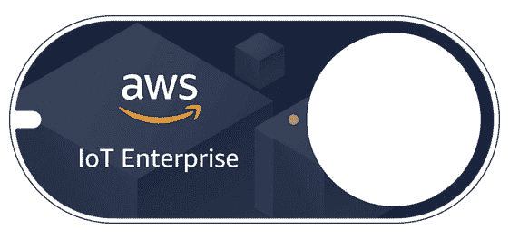
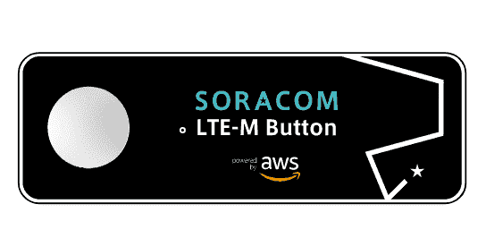
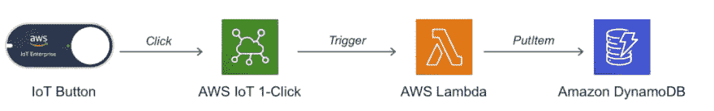

# 如何像专家一样 FaaS:在 Amazon Web Services 上调用无服务器功能的 12 种不常用方法(第 2 部分)

> 原文：<https://dev.to/aws/how-to-faas-like-a-pro-12-uncommon-ways-to-invoke-your-serverless-functions-on-aws-part-2-21hp>

<figure> 

<figcaption>有人告诉我，我的文章代码太多&我必须让它更甜【图片由[缬草辜](https://unsplash.com/photos/2N0enFKzDe8)上传[Unsplash](https://unsplash.com/)</figcaption>

</figure>

几周前，我分享了本系列的第一部分，其中我深入分析了一些不太常见的调用 AWS Lambda 的方法，如 *Cognito 用户池*、 *AWS 配置*、*亚马逊 Kinesis 数据消防软管*和 *AWS CloudFormation* 。你可以[在这里](https://dev.to/aws/how-to-faas-like-a-pro-12-less-common-ways-to-invoke-your-serverless-functions-on-aws-part-1-4nbb)找到【第一部分】！

在第二部分，我将描述另外四个:

1.  [AWS 物联网按钮](#5-aws-iot-button-1click) —一键式处理程序
2.  [亚马逊 Lex](#6-amazon-lex-fulfillment-activity) —履行活动
3.  [亚马逊云观察日志](#7-amazon-cloudwatch-logs-subscriptions) —订阅
4.  [亚马逊极光](#8-amazon-aurora-triggers-amp-external-data) —触发器和外部数据

### 5。AWS 物联网按钮(一键式)

从 2018 年初开始，你可以从简单的物联网设备中触发 Lambda 功能，一键操作。我们称之为 [AWS IoT 1-Click](https://aws.amazon.com/iot-1-click/) 。

<figure> 

<figcaption>AWS 物联网企业按钮([链接](https://www.amazon.com/dp/B075FPHHGG))、AT & T LTE-M 按钮([链接](https://marketplace.att.com/products/att-lte-m-button))、SORACOM LTE-M 按钮([链接](https://soracom.jp/products/gadgets/aws_button/))。</figcaption>

T12】</figure>

你需要的只是上面的一个物联网按钮和几行你最喜欢的编程语言代码来实现一个 Lambda 操作。

当然，这些设备使用 TLS 加密出站数据，并通过 API 与 AWS 通信以调用您的函数。

一旦你在 [AWS 控制台](https://console.aws.amazon.com/iot1click/)或通过[移动应用](https://docs.aws.amazon.com/iot-1-click/latest/developerguide/1click-mobile-app.html)认领了你的设备，它们就会出现在你的 AWS 控制台上，你可以将它们的点击事件映射到一个特定的动作。

有三种可能的操作类型:

*   **发送手机短信** —用于配置电话号码和信息
*   **发送电子邮件** —它允许您配置电子邮件地址、主题和正文
*   **触发 Lambda 函数** —允许您在任何区域选择 Lambda 函数

此外，您可以为每个部署的设备配置自定义属性(类似于标记)。

请注意，短信和电子邮件是 AWS 作为内置选项提供的两个非常常见的场景，但在引擎盖下总会有一个 Lambda 函数实现点击逻辑(在这两种情况下，使用 [Amazon SNS](https://aws.amazon.com/sns/) 来传递消息)。

如果你需要比短信或电子邮件更复杂的东西，你可以用 AWS Lambda 实现你自己的逻辑。例如，您可能想要调用第三方 API，发送由 [Amazon Polly](https://aws.amazon.com/polly/) 呈现的语音消息，或者只是在 Amazon DynamoDB 上存储一个新项目。

在我们开始编码之前，让我们提几个重要的细节:

*   我们的 Lambda 函数将接收两种类型的事件:buttonClicked 和 deviceHealthMonitor
*   输入事件总是包含关于设备的有用信息，如 ID、自定义属性、剩余寿命等。
*   对于 buttonClicked 事件，我们接收两条额外的信息:click type(***SINGLE***、 ***DOUBLE*** 或 ***LONG*** )和 reportedTime(一个 ISO 格式的日期)。这个想法是，我们可能希望为单击、双击和长时间单击实现不同的行为。或者，我们可以简单地忽略一些点击类型，或者甚至将它们视为普通的点击事件
*   可以想象，当健康参数低于给定的阈值时，就会触发 deviceHealthMonitor 事件；它们允许您在设备预期寿命过低时采取适当的措施

这是典型的点击事件的样子: