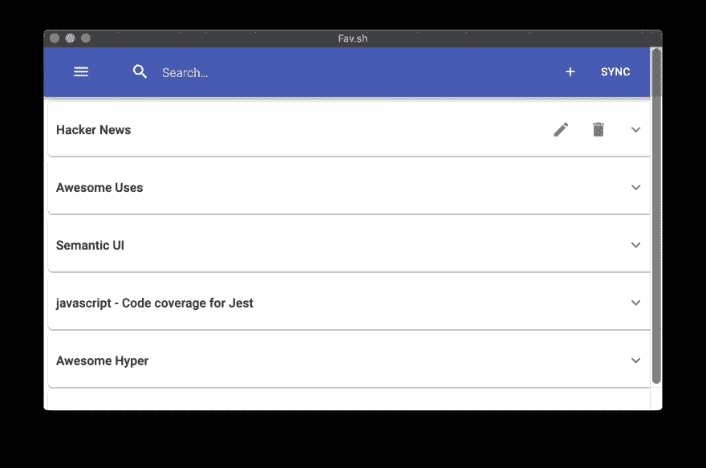

# 我建立了一个书签管理器

> 原文：<https://dev.to/sgolovine/i-built-a-bookmark-manager-1hin>

**更新**:自从发表这篇文章以来，我已经开源了这个扩展。你可以在这里找到源代码

几年前，当我还在上大学的时候，我有了一个“应用程序的想法”。这个应用程序是一个书签管理器，你可以在那里管理你很少使用的书签。这个想法很简单，你最常用的书签放在你的书签栏里。这些是像 Github、Gmail、Trello 等你经常访问的东西。

但是“其他”书签呢？您在网上找到的很酷的文章，您在浏览 HackerNews 时看到的整洁的 WebGL 演示，或者您觉得鼓舞人心的开发人员组合网站。对我们来说，这些书签中的大部分现在都在“其他书签”文件夹下，不幸的是，很多都在那个文件夹中丢失了。

简而言之，传统的书签和这些又酷又古怪的书签不能很好地融合。在许多浏览器中，除了将这些书签放在特定的文件夹中之外，您无法对它们进行排序甚至分类，即使您将它们放在了正确的文件夹中，您也必须记住将它们放在了哪里，否则就要冒无休止地浏览每个文件夹以找到您要找的内容的风险。更糟糕的是，书签共享并不友好。不要通过电子邮件或 Dropbox 向你的朋友发送你的书签，因为没有好的方法来分享你的书签收藏。

我想，如果有一个浏览器扩展或某种应用程序让你管理这些书签会怎么样？一个应用程序，你可以积累、分类，然后搜索所有这些酷的和古怪的网站，然后能够轻松地与朋友分享这些收藏。

早在大学时，当我第一次有这个想法时，我还在学习 Java 中的 if 语句，还没有准备好构建任何类型的功能应用程序。但快进到几个月前，这个想法又回到了我的脑海中，但这一次我已经做好了准备来开发这样一个应用程序。我最初认为我可以在一个周末内完成一些东西，但随着时间的推移，周一来了又去，我的努力从一个周末项目变成了一个全面的 3 个月的努力，在那里我了解了 Chrome 扩展的来龙去脉，成为了一名 Webpack 大师，可能比我愿意承认的多掉了一点头发，强调了如何在这个应用程序中建立我想要的功能。

结果呢？收藏. sh

Fav.sh 不仅是我作为一名 web 开发人员迄今为止所学到的一切的顶点，也是我很久以来一直想做的事情。Fav.sh 解决了我用浏览器书签发现的问题。Fav.sh 中的书签不再与浏览器的书签绑定，而是可以排序、搜索和共享。

每当您点击“+”按钮时，扩展会自动获取网站名称和 URL，让您填写描述并标记您认为合适的书签。在那里，书签可以通过侧边栏中的标签进行排序，也可以直接搜索。

至于共享，我决定将数据存储在 Github Gist 中，而不是构建自己的后端并管理那里的数据。将数据存储在 Gist 中给应用程序带来了一些好处，即，你可以快速备份和恢复你的书签到 Gist 文件，并与任何人分享书签集，只需给他们你的收藏的 Gist ID。

这款应用目前可以在 Chrome 网上商店买到，我计划一有时间就发布到 Firefox 和 Safari 上。我最近在应用程序中添加了搜索书签的功能，我还计划在今年添加一系列其他功能，使其更加有用。

如果你对 Chrome 中书签的工作方式感到沮丧，我鼓励你试试这个扩展，看看你会喜欢它。