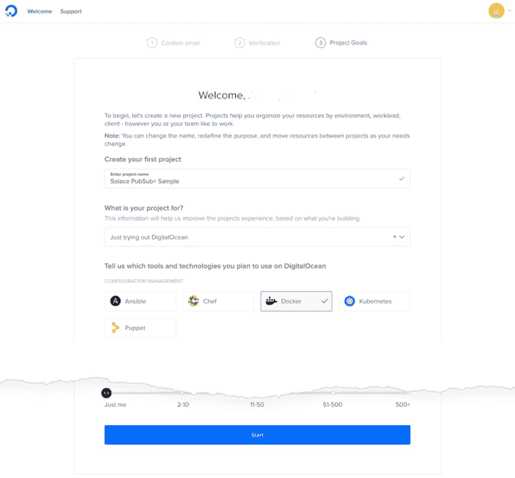
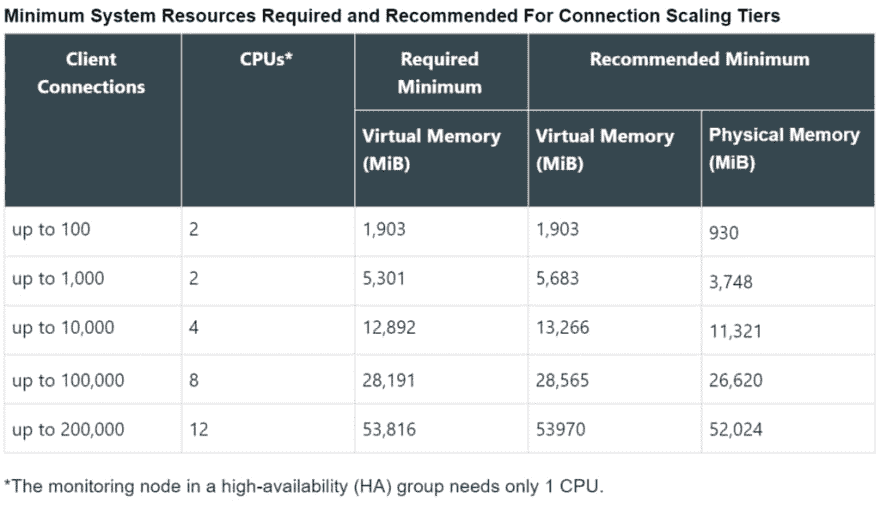
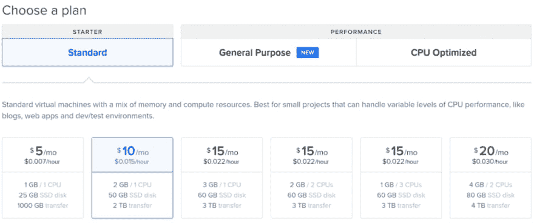
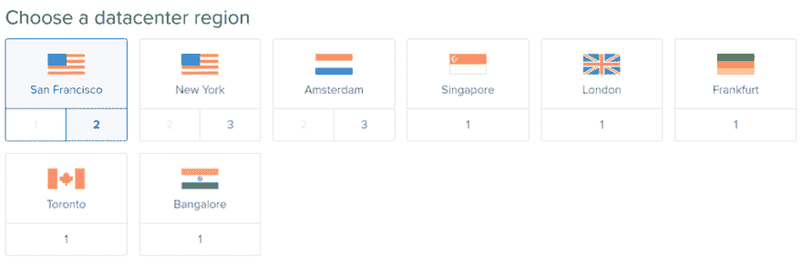
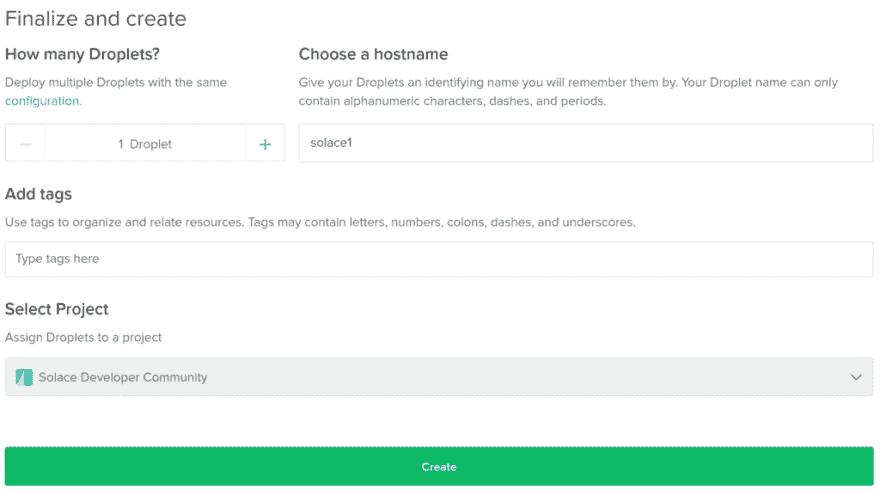
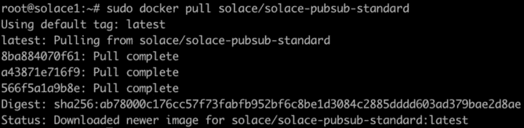
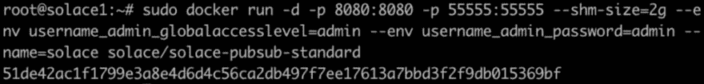
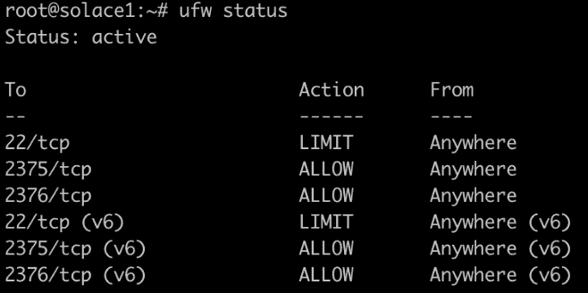
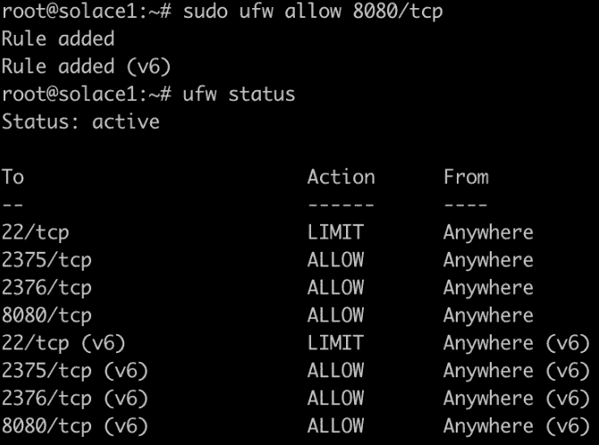
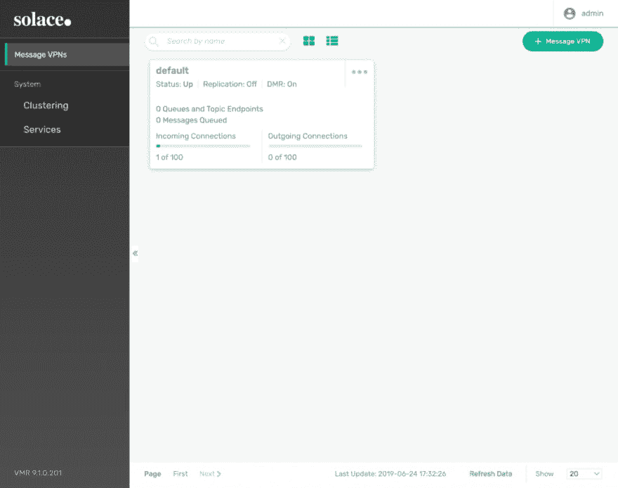

# 如何将 Solace PubSub+事件代理部署到数字海洋

> 原文：<https://dev.to/solacedevs/how-to-deploy-a-solace-pubsub-event-broker-to-digitalocean-1afc>

如果你还不知道， [DigitalOcean](https://digitalocean.com) 是一家云基础设施提供商，其目的是帮助“开发人员以前所未有的速度轻松构建、测试、管理和扩展任何规模的应用程序。”_ 它们使得为您的公司推出预构建的应用程序和环境以及构建您自己的应用程序和环境变得更加容易。当需要为这些应用程序提供发送和接收信息的能力时，即 [*事件驱动的通信*](https://docs.solace.com/Best-Practices/Monitoring-Events.htm) ，无论是使用 RESTful HTTP 还是使用 AMQP、JMS 或 MQTT 的 pub/sub 请求/回复，您都可以轻松地在它们旁边安装 PubSub+事件代理。

在这篇文章中，我们将设置我们的 DigitalOcean 帐户，选择要部署的环境，并将 PubSub+安装到 DigitalOcean droplet 上的 Docker 容器中。首先，请前往 [DigitalOcean](https://try.digitalocean.com/open-source/) ，使用用户名/密码或通过 SSO 使用您的 Google 帐户设置您的帐户。如果您已经有一个 DigitalOcean 帐户，您可以跳过此过程。

## 初始设置

数字海洋允许你建立帮助你组织资源、环境等的项目。你可以随时更改这些，但这对入门很有帮助。

[](https://solace.com/wp-content/uploads/2019/06/docker_new_project_torn.png)

一旦你到了仪表板，就该创建我们的 droplet 来安装 PubSub+。在本次活动中，我们将使用最新的 Docker droplet，在本例中为 *Docker 5:19.09.6* ，作为 Marketplace 的一部分，并默认使用 Ubuntu 18.04 x64 进行设置。

一旦选择了，我们需要选择标准的启动计划，我们有一些选择液滴大小的选项。如 [Docker for Linux Broker 设置页面](https://docs.solace.com/Solace-SW-Broker-Set-Up/Docker-Containers/Set-Up-Single-Linux-Container.htm)中所列，所需和推荐的最低系统资源为:

[](https://res.cloudinary.com/practicaldev/image/fetch/s--fWwf7szP--/c_limit%2Cf_auto%2Cfl_progressive%2Cq_auto%2Cw_880/https://solace.com/wp-content/uploads/2019/06/docker_system_reqs-1024x594.png)

出于本文的目的，我们将选择 10 美元/月计划:

[](https://res.cloudinary.com/practicaldev/image/fetch/s--43UkntGu--/c_limit%2Cf_auto%2Cfl_progressive%2Cq_auto%2Cw_880/https://solace.com/wp-content/uploads/2019/06/docker_image_size-1024x428.png)

注意:您只需根据使用 droplet 的时间付费。

接下来我们选择的是水滴的区域。我们将使用旧金山，但你可以使用任何你想要的地区。

[](https://res.cloudinary.com/practicaldev/image/fetch/s--AFLcScK_--/c_limit%2Cf_auto%2Cfl_progressive%2Cq_auto%2Cw_880/https://solace.com/wp-content/uploads/2019/06/docker_image_region-1024x339.png)

为了建立到 droplet 的控制台/终端连接，我们需要添加一个 SSH 密钥。如果你已经有一个 SSH 密钥，你可以在这里上传你的*公共*密钥。如果没有，你需要创建一个，而[数字海洋已经用这个过程覆盖了](https://www.digitalocean.com/community/tutorials/how-to-set-up-ssh-keys-on-ubuntu-1804)。

开始部署的最后一步是分配或接受主机名，并选择一个与 droplet 相关联的项目。我已经将这里的主机名改为`solace1`，并选择了我创建的默认项目，但是您可以使用自动生成的主机名或者输入您自己的主机名。

[](https://res.cloudinary.com/practicaldev/image/fetch/s--zDPrItav--/c_limit%2Cf_auto%2Cfl_progressive%2Cq_auto%2Cw_880/https://solace.com/wp-content/uploads/2019/06/docker_finish_droplet_setup-1024x574.png)

准备好后，点击创建！

[](https://res.cloudinary.com/practicaldev/image/fetch/s--LTosouLv--/c_limit%2Cf_auto%2Cfl_progressive%2Cq_66%2Cw_880/https://solace.com/wp-content/uploads/2019/06/build_droplet_anim1.gif)

## 在水滴容器上安装 PubSub+

一旦创建了 droplet，我们就可以安装 PubSub+ Docker 容器了。为此，您需要进入终端窗口，使用`ssh`通过列出的 IP 地址
连接到 droplet

```
ssh root@138.68.26.108 
```

Enter fullscreen mode Exit fullscreen mode

注意:虽然我们不会在这篇文章中深入讨论，但我不建议以 root 用户的身份运行任何东西，我强烈建议你遵循 DigitalOcean 的[初始服务器设置](https://www.digitalocean.com/community/tutorials/initial-server-setup-with-ubuntu-18-04)文章来保护你的 droplet。这篇文章仅被认为是设置 PubSub+的指南，而不是服务器通用实践的指南。

一旦我们连接好了，让我们拉下 Docker 容器:

```
sudo docker pull solace/solace-pubsub-standard 
```

Enter fullscreen mode Exit fullscreen mode

Docker 将开始下拉图像，这应该会很快发生:

[](https://res.cloudinary.com/practicaldev/image/fetch/s--Umz3Kokg--/c_limit%2Cf_auto%2Cfl_progressive%2Cq_auto%2Cw_880/https://solace.com/wp-content/uploads/2019/06/docker_pull-1024x250.png)

现在让我们用下载的图像创建 PubSub+ event broker 容器:

```
sudo docker run -d -p 8080:8080 -p 55555:55555 --shm-size=2g --env username\_admin\_globalaccesslevel=admin --env username\_admin\_password=admin --name=solace solace/solace-pubsub-standard 
```

Enter fullscreen mode Exit fullscreen mode

一旦它被创建，我们将为容器获得一个 UUID:

[](https://res.cloudinary.com/practicaldev/image/fetch/s--xUecLlds--/c_limit%2Cf_auto%2Cfl_progressive%2Cq_auto%2Cw_880/https://solace.com/wp-content/uploads/2019/06/docker_run-1024x122.png)

既然我们已经让容器工作了，我们需要告诉预装的 Linux 防火墙(ufw)允许连接到我们的 PubSub+ broker 管理工具。默认情况下，DigitalOcean droplet 为 SSH (22)和 Docker (2375/2376)打开 IPv4/IPv6 防火墙端口。我们的管理工具使用端口 8080，所以我们需要打开它。

[](https://res.cloudinary.com/practicaldev/image/fetch/s--aeLZi28v--/c_limit%2Cf_auto%2Cfl_progressive%2Cq_auto%2Cw_880/https://solace.com/wp-content/uploads/2019/06/linux_ufw_status.png)

我们发出以下命令来打开 tcp 端口 8080:

```
sudo ufw allow 8080/tcp 
```

Enter fullscreen mode Exit fullscreen mode

[](https://res.cloudinary.com/practicaldev/image/fetch/s--0tMnAfwT--/c_limit%2Cf_auto%2Cfl_progressive%2Cq_auto%2Cw_880/https://solace.com/wp-content/uploads/2019/06/linux_ufw_allow.png)

一旦我们启用了端口，我们就可以使用默认的管理员用户名(`admin`)和密码(`admin`)通过`http://<ip address>:8080`登录到代理，我们将看到下面的屏幕:

[](https://res.cloudinary.com/practicaldev/image/fetch/s--rR63piKz--/c_limit%2Cf_auto%2Cfl_progressive%2Cq_auto%2Cw_880/https://solace.com/wp-content/uploads/2019/06/solace_broker_admin-1024x807.png)

## 下一步

在以下主题中，您可以利用其他配置任务:

*   [软件消息代理的默认配置](https://docs.solace.com/Configuring-and-Managing/SW-Broker-Specific-Config/SW-Broker-Configuration-Defaults.htm)–查看消息代理服务的默认端口号。
*   [软件消息代理的扩展层](https://docs.solace.com/Configuring-and-Managing/SW-Broker-Specific-Config/Configuring-Conn-Scale-Tiers.htm)–了解消息代理连接扩展层。

此外，为了充分利用消息代理的特性，您应该熟悉 Solace PubSub+软件消息代理和设备的常见配置操作。该信息可在[配置](https://docs.solace.com/Configuration.htm)部分的主题中找到。

当您对消息代理感到满意时，可以使用 Solace SDKPerf 应用程序测试消息传递。您可以从[下载](https://solace.com/downloads/)页面的其他软件部分下载 SDKPerf，在我们的[文档网站](https://docs.solace.com/SDKPerf/SDKPerf.htm)上有关于如何使用 SDKPerf 和 Solace PubSub+的技术信息。

就是这样！您已经在 DigitalOcean 上成功设置了 Solace PubSub+活动代理。在 Twitter 上关注我们，地址是 [@solacedotcom](https://twitter.com/solacedotcom) 和 [@solacedevs](https://twitter.com/solacedevs) ，以及我们的 [YouTube 频道](https://www.youtube.com/user/SolaceSystems)获取新内容。

帖子[如何将 Solace PubSub+事件代理部署到数字海洋](https://solace.com/blog/how-to-deploy-a-solace-pubsub-event-broker-to-digitalocean/)首先出现在 [Solace](https://solace.com) 上。