# 使用 Swagger 和 Nest.js 向 REST API 添加实时文档

> 原文：<https://dev.to/itnext/adding-live-documentation-to-your-rest-api-with-swagger-and-nest-js-211e>

> 我们需要记录我们的代码和 API。阻止我们的通常是时间，或者我们知道文档和实际代码会有偏差，这比没有文档更糟糕。因此，我们需要一些与我们一起改变的东西，一些大摇大摆的东西，它使你能够对它进行查询的事实是一个额外的奖励。

这就是有时文档的感觉。你花了这么多时间写文档，然后有人，可能是你，可能是你的同事做了一个改变，突然，你不同步了，感觉像一场斗争，不是吗？

[](https://res.cloudinary.com/practicaldev/image/fetch/s--gJLmeAEX--/c_limit%2Cf_auto%2Cfl_progressive%2Cq_66%2Cw_880/https://thepracticaldev.s3.amazonaws.com/i/fj8sdvl2b2mcw6exavkm.gif)

虽然 Swagger 是实时文档，但它会随着代码的变化而变化。所以希望你在读完这篇文章后能尝试一下。

在本文中，我们将展示在 Nest.js 应用程序中设置 Swagger 是多么容易。只有一个配置位置和几个需要记录的 dto。

我们将展示以下内容:

*   一个 Nest.js 应用程序和一些需要的工件，比如模块、服务、dto
*   **设置** Swagger，看看记录您的端点有多简单
*   **探索** Swaggers 特性，如执行查询和检查结果
*   通过向 dto 添加装饰器来进一步改进我们的文档。

## 资源

*   [招摇规格](https://swagger.io/specification/)
*   [Swagger+nest . js 教程](https://docs.nestjs.com/recipes/swagger)
*   [我的第一个 Nest.js API](https://dev.to/softchris/nest-creating-a-rest-api-has-never-felt-so-good-4i1)
*   [Nest.js + GraphQL](https://dev.to/azure/how-you-can-use-nest-to-build-a-graphql-api-24ii)

## 搭建我们的 Nest.js 项目

让我们使用优秀的 Nest CLI 创建一个新的 Nest.js 项目。如果您还没有安装它，请在终端中运行以下命令来安装:

```
npm i -g @nestjs/cli 
```

Enter fullscreen mode Exit fullscreen mode

> 完成了吗？

好的，很好。我们继续。

要创建一个嵌套项目，我们只需调用`nest new [project name]`就可以了:

```
nest new swagger-demo 
```

Enter fullscreen mode Exit fullscreen mode

它应该是这样的:

[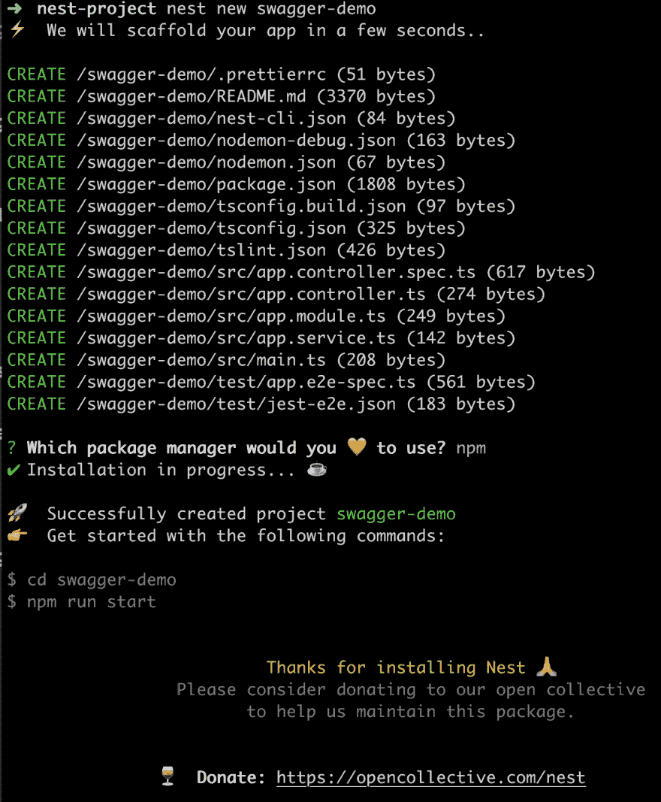](https://res.cloudinary.com/practicaldev/image/fetch/s--wxLB6tGu--/c_limit%2Cf_auto%2Cfl_progressive%2Cq_auto%2Cw_880/https://thepracticaldev.s3.amazonaws.com/i/8kc6o2sr5tjsq8tkykjk.png)

下一步是建立一条路线。让我们以模块化的方式完成这项工作，并创建一个模块、服务和一个 DTO。你说打字很多？没有，因为我们正在使用 CLI。让我们看看 CLI 可以做些什么:

```
nest --help 
```

Enter fullscreen mode Exit fullscreen mode

[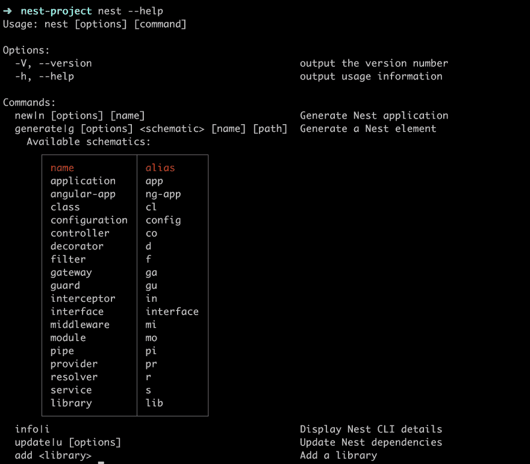](https://res.cloudinary.com/practicaldev/image/fetch/s--5764OoBK--/c_limit%2Cf_auto%2Cfl_progressive%2Cq_auto%2Cw_880/https://thepracticaldev.s3.amazonaws.com/i/wzvav90m32ubo0byp81x.png)

它告诉我们键入更多:

```
nest generate|g [options] <schematic> [name] [path] 
```

Enter fullscreen mode Exit fullscreen mode

听起来有点神秘，但是要创建一个模块，我们需要键入:

```
nest g mo cats 
```

Enter fullscreen mode Exit fullscreen mode

[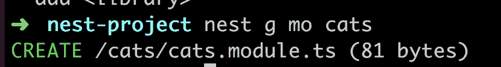](https://res.cloudinary.com/practicaldev/image/fetch/s--UvQmk_f6--/c_limit%2Cf_auto%2Cfl_progressive%2Cq_auto%2Cw_880/https://thepracticaldev.s3.amazonaws.com/i/uccd0brl3bmo56k00ll7.png)

我们还需要一个控制器来响应我们的请求。那么就是:

```
nest g co cats 
```

Enter fullscreen mode Exit fullscreen mode

[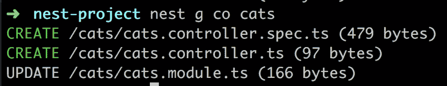](https://res.cloudinary.com/practicaldev/image/fetch/s--xG5Wf14D--/c_limit%2Cf_auto%2Cfl_progressive%2Cq_auto%2Cw_880/https://thepracticaldev.s3.amazonaws.com/i/vxtkbnvfiuhjqcoc6zgj.png)

对于服务，我们可以输入:

```
nest g s cats 
```

Enter fullscreen mode Exit fullscreen mode

[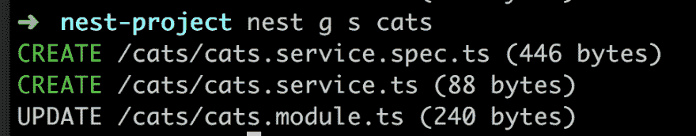](https://res.cloudinary.com/practicaldev/image/fetch/s--XlHpY6zo--/c_limit%2Cf_auto%2Cfl_progressive%2Cq_auto%2Cw_880/https://thepracticaldev.s3.amazonaws.com/i/42rw2e2g9fgjdy0kpeyw.png)

注意关于控制器+服务创建的两件事。它们是在`cats`目录下创建的，它们带有测试:)，并且它们都向模块注册了自己，请看最下面一行的`UPDATE`。

最后，我们想创建一个 DTO，一个保存我们属性的数据传输对象。我们通过键入以下命令来实现这一点:

```
nest g cl cat cats 
```

Enter fullscreen mode Exit fullscreen mode

在运行之前，让我们讨论一下我们正在输入什么。我们说要在路径`cats`下创建一个名为`cat`的类`cl`。我们这样做是为了确保所有相关的东西都集中在一个地方。

[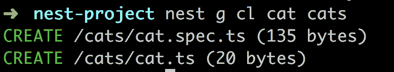](https://res.cloudinary.com/practicaldev/image/fetch/s--ctyqTTVF--/c_limit%2Cf_auto%2Cfl_progressive%2Cq_auto%2Cw_880/https://thepracticaldev.s3.amazonaws.com/i/ss0lyk0s5m4d696cntdp.png)

## 使路线工作

到目前为止，我们有一堆文件，但我们需要工作的路线，所以我们需要做以下工作:

1.  将`id`和`name`添加到我们的猫模型中
2.  确保服务有一个返回猫列表的`getCats()`方法
3.  让控制器注入`cats`服务并调用`getCats()`
4.  带着我们的 API 转一圈，确保`/cats`工作

### 向我们的模型添加`id`和`name`

确保`src/cats/cat.ts`看起来像这样:

```
export class Cat {
  id: number;
  name: string;
} 
```

Enter fullscreen mode Exit fullscreen mode

### 更新我们的服务

我们需要添加两个方法`getCats()`和`createCat()`，这将确保一旦我们添加 Swagger，我们就有一个`GET`和一个`POST`请求。

```
import { Injectable } from '@nestjs/common';
import { Cat } from './cat';

@Injectable()
export class CatsService {
  cats: Array<Cat> = [{ id: 1, name: 'Cat'}];

  getCats() {
    return this.cats;
  }

  createCat(cat: Cat) {
    this.cats = [ ...this.cats, {...cat}];
  }
} 
```

Enter fullscreen mode Exit fullscreen mode

### 使控制器使用服务

我们的控制器应该是这样的:

```
import { Controller, Get, Post, Body } from '@nestjs/common';
import { CatsService } from './cats.service';
import { Cat } from './cat';

@Controller('cats')
export class CatsController {
  constructor(private srv: CatsService) {}

  @Get()
  getCats() {
    return this.srv.getCats();
  }

  @Post()
  createCat(@Body() cat: Cat) {
    this.srv.createCat(cat);
  }
} 
```

Enter fullscreen mode Exit fullscreen mode

以上只是确保我们使用我们的`CatsService`来获取猫的列表或者添加一只猫。

### 带它兜一圈

在我们开始炫耀之前，我们需要确保我们的路线可行。如此运行:

```
npm start 
```

Enter fullscreen mode Exit fullscreen mode

并在`http://localhost:3000/cats`前往浏览器。它应该是这样的:

[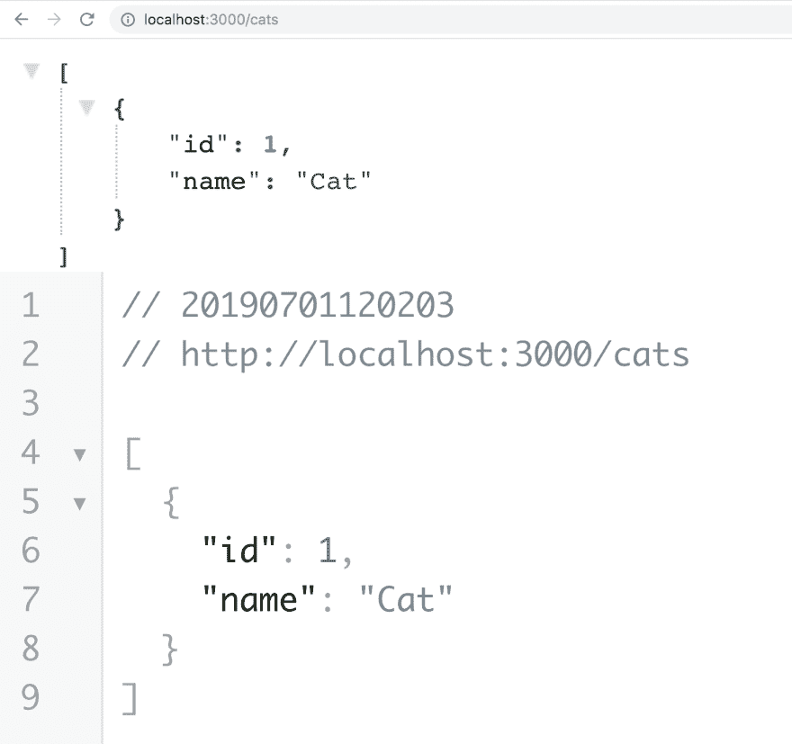](https://res.cloudinary.com/practicaldev/image/fetch/s--n8tBBxOc--/c_limit%2Cf_auto%2Cfl_progressive%2Cq_auto%2Cw_880/https://thepracticaldev.s3.amazonaws.com/i/yj0gp7z63mjslhdctf4t.png)

## 增添霸气

现在我们将加入霸气。为了让 Swagger 去工作，我们需要做到以下几点:

1.  **安装**所需的依赖项
2.  **配置**我们的引导程序开始使用 Swagger
3.  **确保** Swagger 正在浏览器中呈现

### 安装霸气

我们需要使用以下命令通过 NPM 进行安装:

```
npm install --save @nestjs/swagger swagger-ui-express 
```

Enter fullscreen mode Exit fullscreen mode

这应该很好地设置了我们，现在到我们的下一步，配置它。

### 配置

前往`main.ts`我们的引导文件。在我们的`bootstrap()`方法中，目前看起来是这样的:

```
async function bootstrap() {
  const app = await NestFactory.create(AppModule);

  await app.listen(3000); 
```

Enter fullscreen mode Exit fullscreen mode

我们需要在声明`app`和调用`listen()`之间添加以下内容，即:

```
 const options = new DocumentBuilder()
    .setTitle('My API')
    .setDescription('API description')
    .setVersion('1.0')
    .build();
  const document = SwaggerModule.createDocument(app, options);
  SwaggerModule.setup('api', app, document); 
```

Enter fullscreen mode Exit fullscreen mode

首先，我们创建一个`options`对象，它得到一个`title`、`description`、`version`，最后我们调用`build()`，它最终创建了一个选项对象。此后，我们通过在`SwaggerModule`上调用`createDocument()`来创建一个文档实例。它接受我们的`app`实例和我们刚刚创建的`options`对象。我们做的最后一件事是在 SwaggerModule 上调用`setup()`。第一个参数是一个路径，这意味着我们将在`http://localhost:3000/api`下找到我们的 API 文档。下一个参数是我们的`app`，最后一个参数是文档实例。我们的`main.ts`现在看起来应该是这样的整体:

```
// main.ts

import { NestFactory } from '@nestjs/core';
import { SwaggerModule, DocumentBuilder } from '@nestjs/swagger';
import { AppModule } from './app.module';

async function bootstrap() {
  const app = await NestFactory.create(AppModule);

  const options = new DocumentBuilder()
    .setTitle('My API')
    .setDescription('API description')
    .setVersion('1.0')
    .build();
  const document = SwaggerModule.createDocument(app, options);
  SwaggerModule.setup('api', app, document);

  await app.listen(3000);
}
bootstrap(); 
```

Enter fullscreen mode Exit fullscreen mode

### 试用文档

让我们首先启动我们的应用程序

```
npm start 
```

Enter fullscreen mode Exit fullscreen mode

此后前往`http://localhost:3000/api`。然后，您应该会看到以下内容:

[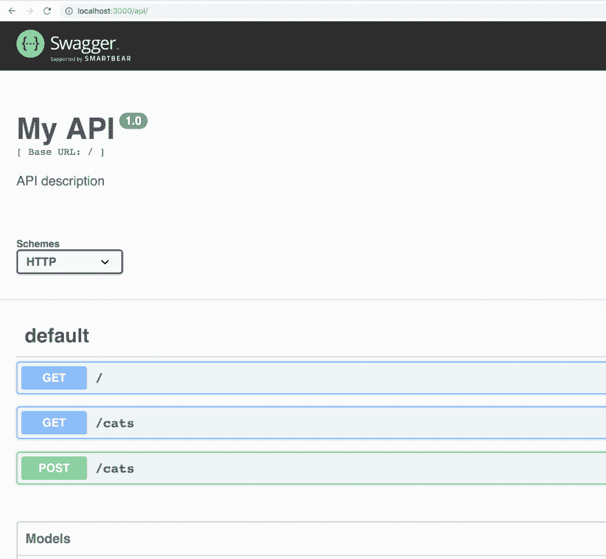](https://res.cloudinary.com/practicaldev/image/fetch/s--3WwvkkRw--/c_limit%2Cf_auto%2Cfl_progressive%2Cq_auto%2Cw_880/https://thepracticaldev.s3.amazonaws.com/i/9ivv70nih6qmmoim24kh.png)

这是意料之中的。我们在`app.controller`文件中设置了默认路线`/`。我们还有一个代表 T3 的 T2 和一个代表 T5 的 T4。到目前为止一切顺利。

那么，这个百万美元的问题有用吗？好吧，让我们从`GET`和`/cats`开始

[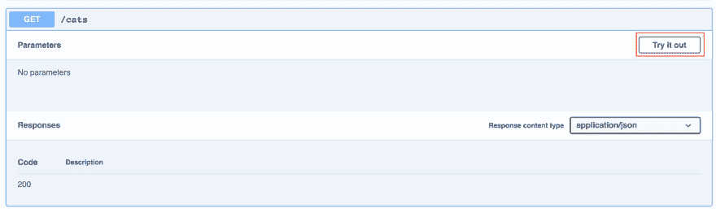](https://res.cloudinary.com/practicaldev/image/fetch/s--0GwIAOaB--/c_limit%2Cf_auto%2Cfl_progressive%2Cq_auto%2Cw_880/https://thepracticaldev.s3.amazonaws.com/i/ajxumo1mfkxwi3x73tpb.png)

点击`Try it out`按钮。此时，它将显示`Execute`按钮，同样点击该按钮。它应该给你下面的

[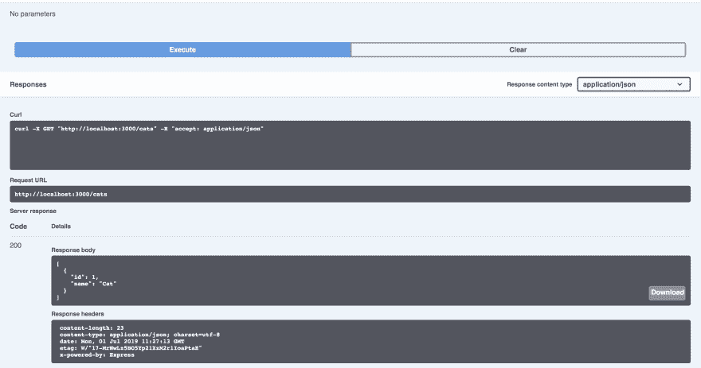](https://res.cloudinary.com/practicaldev/image/fetch/s--HOMNB1ah--/c_limit%2Cf_auto%2Cfl_progressive%2Cq_auto%2Cw_880/https://thepracticaldev.s3.amazonaws.com/i/rixc3e6m5ha0q8cukprp.png)

它与我们列出的猫相吻合。如果我们想使用这个版本，我们也可以得到一个很好的`cURL`版本。我们还可以看到我们得到的确切的响应头，如果我们想要验证的话。

我们的帖子请求呢？好吧，让我们点击那个和我们的`Try it out`。

[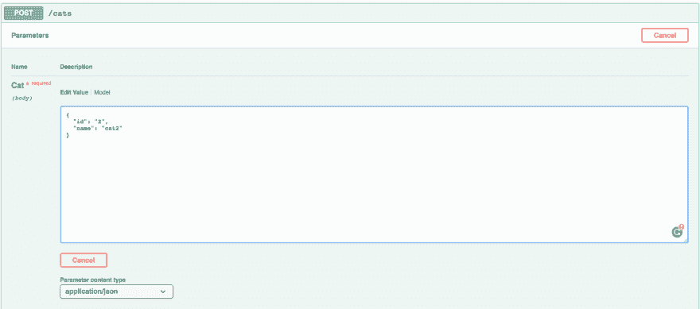](https://res.cloudinary.com/practicaldev/image/fetch/s--chkGRiqc--/c_limit%2Cf_auto%2Cfl_progressive%2Cq_auto%2Cw_880/https://thepracticaldev.s3.amazonaws.com/i/d6d2srnzim2mulf0us6a.png)

我们得到一个大的编辑窗口，我们在其中键入一些 JSON，对应于我们想要创建的一个新的 cat，所以:

```
{  "id":  "2",  "name":  "cat2"  } 
```

Enter fullscreen mode Exit fullscreen mode

点击我们的`Execute`按钮给出如下响应:

[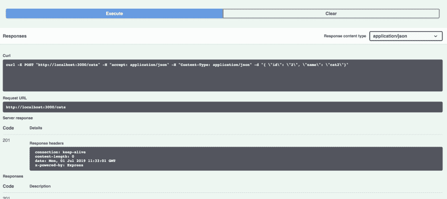](https://res.cloudinary.com/practicaldev/image/fetch/s--dKiUeJQP--/c_limit%2Cf_auto%2Cfl_progressive%2Cq_auto%2Cw_880/https://thepracticaldev.s3.amazonaws.com/i/fqvej4ffjc1xtz3o4rtl.png)

如你所见，我们得到了一个`201`，这意味着我们有了一只新的猫。让我们通过大摇大摆地点击我们的`GET` `/cats`来确保这一点:

[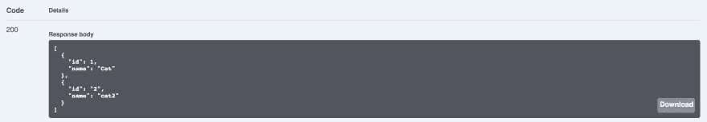](https://res.cloudinary.com/practicaldev/image/fetch/s--ibVkDtmQ--/c_limit%2Cf_auto%2Cfl_progressive%2Cq_auto%2Cw_880/https://thepracticaldev.s3.amazonaws.com/i/fc1waiyhsh3ttkx6quht.png)

成功了，现在有两只猫了。让我们看看接下来如何改进。

## 改进我们的文档

如果我们滚动到 Swagger docs 页面的底部，我们会看到一个类别`Models`。它包含`Cat`我们的 DTO 类。但它完全是空的，这让人读起来很悲伤。不过，我们可以很容易地解决这个问题。

[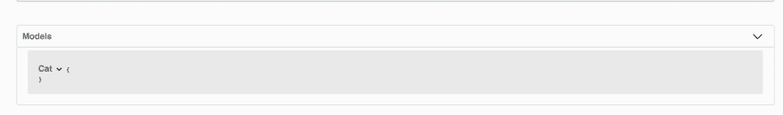](https://res.cloudinary.com/practicaldev/image/fetch/s--QeuxzIIJ--/c_limit%2Cf_auto%2Cfl_progressive%2Cq_auto%2Cw_880/https://thepracticaldev.s3.amazonaws.com/i/a3mvfay2bc5vcmt7v6ac.png)

我们需要做的是使用装饰器`@ApiModelProperty()`并将它们应用到`Cat`的每个属性，就像这样:

您的`cats/cat.ts`现在应该是这样的:

```
import { ApiModelProperty } from "@nestjs/swagger";

export class Cat {
  @ApiModelProperty()
  id: number;

  @ApiModelProperty()
  name: string;
} 
```

Enter fullscreen mode Exit fullscreen mode

再来看看我们的 app:

```
npm start 
```

Enter fullscreen mode Exit fullscreen mode

转到`http://localhost:3000/api`并滚动到底部:

[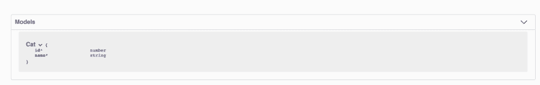](https://res.cloudinary.com/practicaldev/image/fetch/s--6bR8n9-W--/c_limit%2Cf_auto%2Cfl_progressive%2Cq_auto%2Cw_880/https://thepracticaldev.s3.amazonaws.com/i/md95mt3s0vrlajomdcwq.png)

现在，我们的类属性也包含在文档中了

## 总结

就是这样。我们又有机会使用可爱的小窝了。这一次我们使用了更多的命令来学习搭建我们需要的所有文件。最重要的是，我们学会了如何用 Swagger 记录我们的 API。随着代码变化而变化的文档值得保留。所以也给你的 API 一些文档吧。