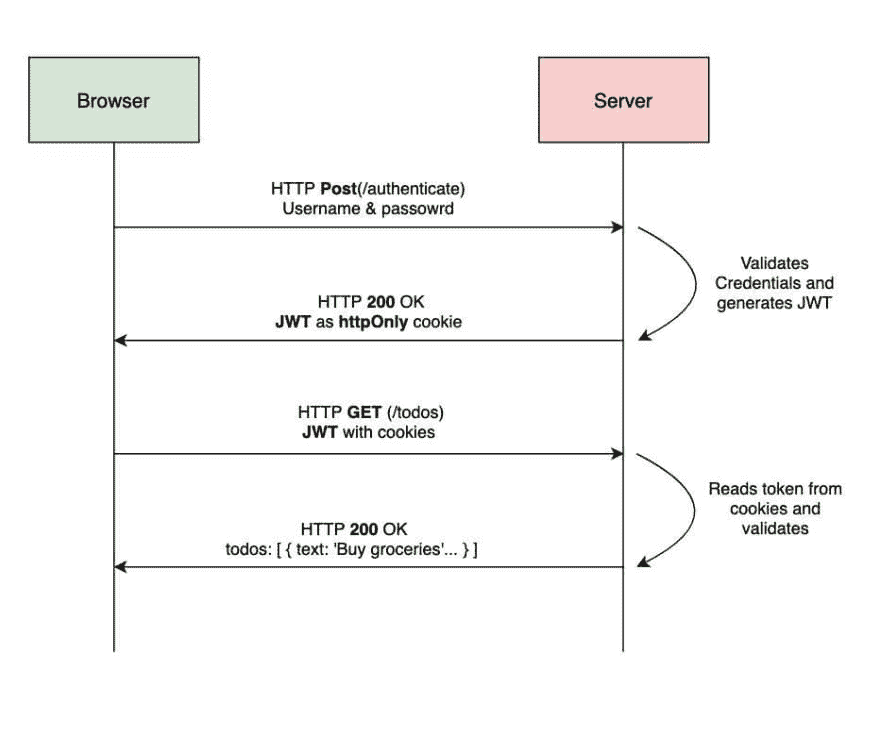
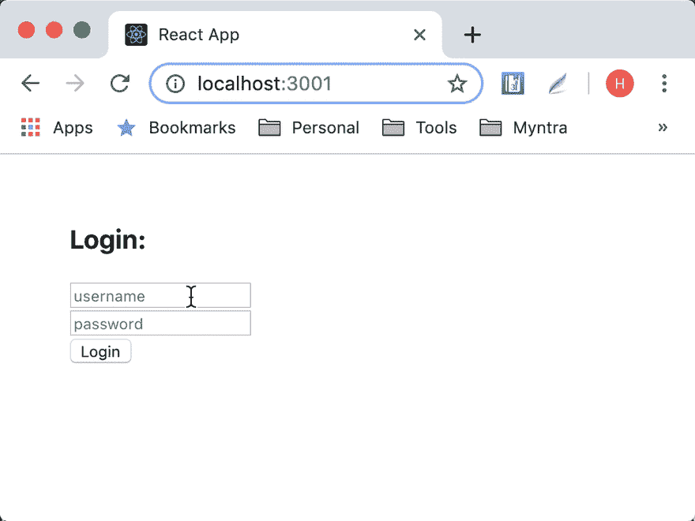
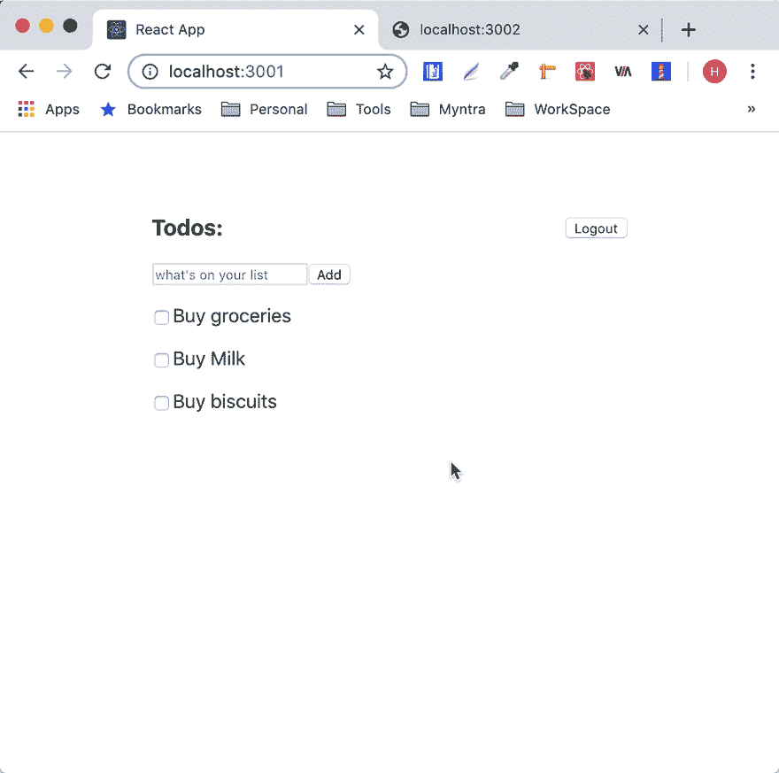
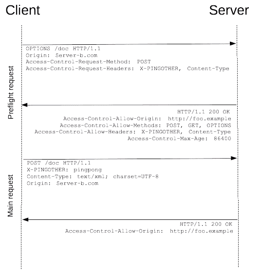
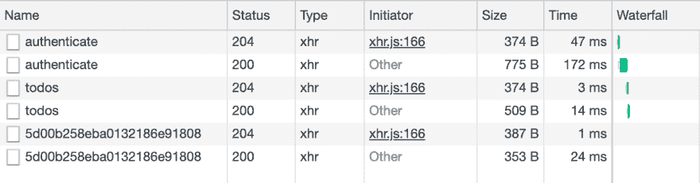
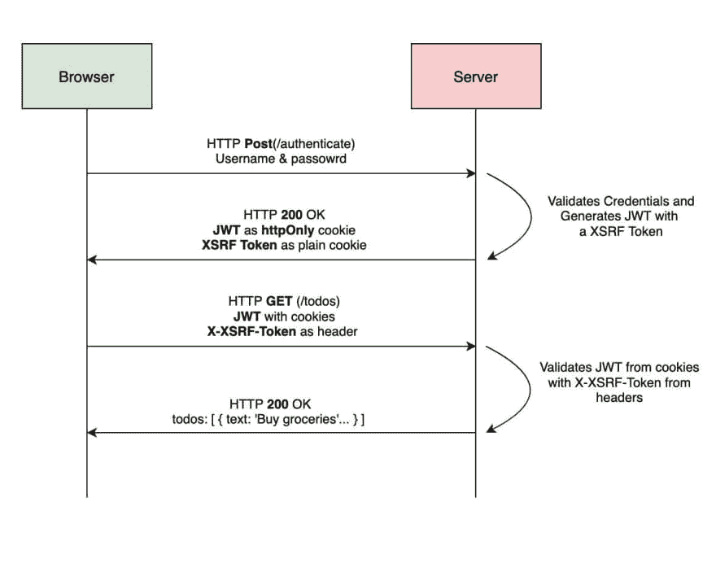
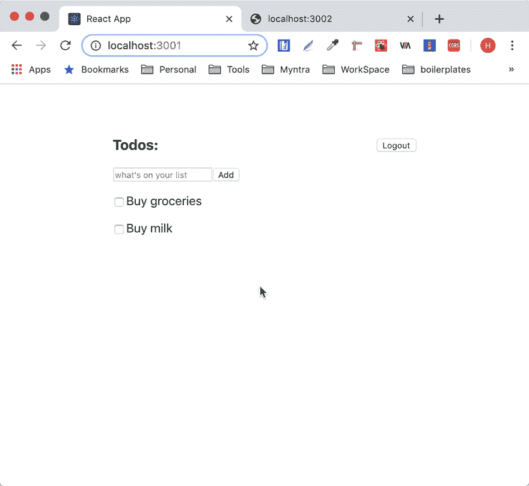

# CSRF 在行动🎭

> 原文：<https://dev.to/_smellycode/csrf-in-action-21n3>

> 最初发表于[https://smellycode.com/csrf-in-action/](https://smellycode.com/csrf-in-action/)

[跨站点请求伪造(CSRF/XSRF)](https://en.wikipedia.org/wiki/Cross-site_request_forgery) 是利用服务器的最流行的方式之一。它通过强制客户端执行不需要的操作来攻击服务器。这种攻击的目标是客户端/用户已经登录的应用程序。它主要通过无意中更新或传输数据来改变服务器的状态。例如，更新重要信息，如电子邮件和联系号码等。或者将数据从一个实体传输到另一个实体。

[](https://res.cloudinary.com/practicaldev/image/fetch/s--7mP9_Fol--/c_limit%2Cf_auto%2Cfl_progressive%2Cq_auto%2Cw_880/https://smellycode.com/static/0af882791a9890316f4527090a8cd1b6/19607/csrf-in-action-cover-img.jpg)

这篇文章展示了 CSRF 的攻击，并阐述了围绕它徘徊的概念。它使用一个简单的 todo 应用程序和一个邪恶的客户端——更新 todos 的状态——进行演示。使用的技术:

*   [客户端的反应](https://reactjs.org/)。
*   [ExpressJs](https://expressjs.com/) 和几个服务器中间件( [CORS](https://github.com/expressjs/cors) 、 [body-parser](https://github.com/expressjs/body-parser) 、 [cookie-parser](https://github.com/expressjs/cookie-parser) 等)。
*   [MongoDb](https://www.mongodb.com/) 作为数据库，[mongose](https://mongoosejs.com/)用于数据建模。
*   [JWT](https://jwt.io/) 用于无状态会话管理。
*   还有一些其他的东西。

示例 todo 应用程序使用 JSON Web 令牌进行无状态会话管理和身份验证。它将令牌存储在带有`httpOnly`标志的 cookie 中，使得客户端上运行的 JavaScript 无法访问令牌[。下图描绘了 app](https://developer.mozilla.org/en-US/docs/Web/HTTP/Cookies#Secure_and_HttpOnly_cookies) 的授权流程。

[](https://res.cloudinary.com/practicaldev/image/fetch/s--O4SZYAU9--/c_limit%2Cf_auto%2Cfl_progressive%2Cq_auto%2Cw_880/https://smellycode.com/static/9d9a303caf109383412d6d9474a645a0/dc6f3/basic-auth-flow.jpg)

让我们看看应用程序的代码组织。[代码库](https://github.com/hk-skit/csrf-in-action)有三个角色——服务器、客户端和邪恶客户端。

**服务器**为 user( `/users`)和 todo( `/todos`)上的 CRUD 操作公开了几个端点。它使用**mongose**在 **MongoDB** 中存储数据。它还支持来自运行在`localhost:3001`的客户端的[跨来源请求](https://developer.mozilla.org/en-US/docs/Web/HTTP/CORS)(中间件 [cors](https://github.com/expressjs/cors) 用于实现跨来源资源共享)。服务器运行在 [http://localhost:3000](http://localhost:3000) 。

**客户端**有一个简单的*登录表单*和一个*待办事项列表*。它使用 ReactJs 构建 UI，并使用 [axios](https://github.com/axios/axios) 进行 ajax 调用。当加载客户端时，它获取登录用户的 todos(GET，`/todos`)。如果出现身份验证错误(状态代码为 401)，它会引导用户登录。仅当用户登录时，才能成功提取待办事项。

[](https://res.cloudinary.com/practicaldev/image/fetch/s--thAqUsBS--/c_limit%2Cf_auto%2Cfl_progressive%2Cq_66%2Cw_880/https://smellycode.com/sample-todo-app-832053812a926b2348fe3ca17d5d336e.gif)

**邪恶客户端**在 [http-server](https://www.npmjs.com/package/http-server) 包的帮助下运行在 [http://locahost:3002](http://locahost:3002) 。它有一个普通的 HTML 页面和一个表单。表单在一个隐藏的 *iframe* 中为[静默提交](https://stackoverflow.com/questions/17940811/example-of-silently-submitting-a-post-form-csrf)打开它的动作。该应用程序引诱用户点击一个按钮，刺激表单提交。表单提交对[http://localhost:3000/todos/complete](http://localhost:3000/todos/complete)进行 **post** 调用，将属于登录用户的 todos 标记为完成。

```
<!DOCTYPE html>
<html>
  <body>
    <h1>Hey There!</h1>
    <p
      >Having a rough day! Don't worry, I have got a picture of a cute cat to
      cheer you up. <button id="btn_cat">Show me 🐱</button>
    </p>
    <iframe style="display:none" name="csrf-frame"></iframe>
    <form
      method="POST"
      action="http://localhost:3000/todos/complete"
      target="csrf-frame"
      id="csrf-form"
    >
    </form>
    <script type="text/javascript">
      document.getElementById('btn_cat').addEventListener('click', () => {
        document.getElementById('csrf-form').submit();
      });
    </script>
  </body>
</html> 
```

<svg width="20px" height="20px" viewBox="0 0 24 24" class="highlight-action crayons-icon highlight-action--fullscreen-on"><title>Enter fullscreen mode</title></svg> <svg width="20px" height="20px" viewBox="0 0 24 24" class="highlight-action crayons-icon highlight-action--fullscreen-off"><title>Exit fullscreen mode</title></svg>

邪恶的客户在行动:

[](https://res.cloudinary.com/practicaldev/image/fetch/s--vgpDWBlx--/c_limit%2Cf_auto%2Cfl_progressive%2Cq_66%2Cw_880/https://smellycode.com/evil-client-in-action-1ea7dda2ae58b69982bc7d632d5b990d.gif)

让我们来解决引起混乱的问题。

**问:为什么没有认证错误？**🤔

服务器不会抛出任何身份验证错误，因为请求包含有效的 JWT 令牌。请求从 cookies 中获取令牌。

> 当接收到 HTTP 请求时，服务器可以发送一个带有响应的`Set-Cookie`头。cookie 通常由浏览器存储，然后 cookie 在一个`Cookie` HTTP 头中与对同一服务器的请求一起发送。~ [莫兹拉](https://developer.mozilla.org/en-US/docs/Web/HTTP/Cookies)

当用户登录时，JWT 被存储在一个`httpOnly` cookie 中(参见[认证流](#basicAuthFlow))。*cookie 会随着每个请求发送到同一个服务器*。正因为如此，JWT 成为每个请求的一部分🤖。

问:CORS 的设置不应该有所帮助吗？

在跳到答案之前，我们先来谈谈 [CORS](https://developer.mozilla.org/en-US/docs/Web/HTTP/CORS) 。浏览器限制加载在一个源(协议、域和端口的元组)上的脚本或文档与另一个源的交互，以避免丛林统治。用于施加这种限制的机制被称为[同源策略](https://developer.mozilla.org/en-US/docs/Web/Security/Same-origin_policy)。它确保应用程序在隔离的环境中运行。有时，开发人员需要放宽同源策略，以便应用程序可以相互交互。这就是罗斯(CORS)的想法的来源。只有在`site-b`同意的情况下，CORS 才允许`site-a`与`site-b`进行交互——用适当的 HTTP 头进行响应。为了启用 CORS，服务器需要做一些工作(示例 todo 应用程序使用 [cors](https://github.com/expressjs/cors) 中间件来实现相同的功能)。

在浏览器领域，ajax 请求分为三类:

1.  简单的请求
2.  非简单请求
3.  印前检查请求

更多细节可以在[这里](https://frontendian.co/cors)找到。

每当使用非简单请求请求跨来源资源时，浏览器都会发出一个飞行前`OPTIONS`请求。服务器用适当的响应报头来响应飞行前请求。如果来源和请求方法出现在`Access-Control-Allow-Origin`和`Access-Control-Allow-Methods`中，浏览器发起主请求。否则，将抛出一个 cors 错误和一条相关消息。

[](https://res.cloudinary.com/practicaldev/image/fetch/s--Ma9tTgUn--/c_limit%2Cf_auto%2Cfl_progressive%2Cq_auto%2Cw_880/https://smellycode.com/static/380c0d72b7d2e187c8a39468756dc16b/26dcc/preflight_.png)

带有预检请求的待办事项应用程序的网络日志。

[](https://res.cloudinary.com/practicaldev/image/fetch/s--29pUkH7t--/c_limit%2Cf_auto%2Cfl_progressive%2Cq_auto%2Cw_880/https://smellycode.com/static/c96b52fff3097ed31ce6a4e084f97c5e/e199c/prefligh_request_logs.png)

对于简单的请求，浏览器不会发起任何优先请求。恶意客户端利用这一事实，在 HTML 表单的帮助下绕过同源策略。这就是为什么 CORS 在这里没有设置帮助🤯。

[](https://res.cloudinary.com/practicaldev/image/fetch/s--EHCR-Q39--/c_limit%2Cf_auto%2Cfl_progressive%2Cq_auto%2Cw_880/https://smellycode.com/static/63958e7743ea262c379f4466c52844a6/42fef/simple_req.png)

问:如果 WebStorage 用来存储 JWT 而不是 httpOnly cookie 会怎么样？

将 JWT 存储在[网络存储器](https://developer.mozilla.org/en-US/docs/Web/API/Web_Storage_API)中会使应用程序不那么容易受到 CSRF 的攻击。但是它增加了令牌被破坏的机会。这是因为客户端上运行的任何 JavaScript 都可以访问 web 存储。这是危险的🛑.

**问:如何预防 CSRF？**

服务器面临的挑战是验证令牌和请求的来源，即起源。令牌验证已经实现。服务器需要验证 CSRF 保护请求的来源。可以借助于 **CORS 来源报头**或 **XSRF 令牌**来验证来源。用 XSRF 令牌(CSRF 令牌)屏蔽服务器比 [CORS 原点头](https://stackoverflow.com/questions/24680302/csrf-protection-with-cors-origin-header-vs-csrf-token)更可靠，更受欢迎。

XSRF 令牌的实现非常简单。当客户端表示有效凭证时，服务器生成一个随机的不可访问的唯一字符串，名为`xsrfToken`。它把 JWT 的`xsrfToken`和其他索赔放在一起。服务器还在 cookie 中添加了一个`xsrfToken`(为什么是 cookie？原因*cookie 受同源政策限制*。这里有一个带有`xsrfToken` :
的 JWT 有效载荷样本

```
{  "sub":  "hk",  "xsrfToken":  "cjwt3tcmt00056tnvcfvnh4n1",  "iat":  1560336079  } 
```

<svg width="20px" height="20px" viewBox="0 0 24 24" class="highlight-action crayons-icon highlight-action--fullscreen-on"><title>Enter fullscreen mode</title></svg> <svg width="20px" height="20px" viewBox="0 0 24 24" class="highlight-action crayons-icon highlight-action--fullscreen-off"><title>Exit fullscreen mode</title></svg>

客户端从 cookies 中读取令牌，并在发出请求之前将令牌作为`X-XSRF-TOKEN`添加到请求头中。当服务器收到请求时，它从 JWT 有效载荷中读取`xsrfToken`，并与`X-XSRF-TOKEN`报头进行比较。如果两者相同，则进一步处理请求，否则以状态代码 401 终止。这种技术也被称为**双提交 cookie**方法。

带有 XSRF 令牌的授权流:

[](https://res.cloudinary.com/practicaldev/image/fetch/s--UyjrNGad--/c_limit%2Cf_auto%2Cfl_progressive%2Cq_auto%2Cw_880/https://smellycode.com/static/f0cf82191e56c34d3b52595702d76626/a1765/auth-flow-csrf.jpg)

代码版本同 [express-jwt](https://github.com/auth0/express-jwt) :

```
const expressJwt = require('express-jwt');

// Paths without token.
const publicRoutes = ['/users/register', '/users/authenticate'];

const isRevoked = async (req, payload, done) => {
  const { xsrfToken } = payload;
  done(null, xsrfToken !== req.get('X-XSRF-TOKEN'));
};

module.exports = () =>
  expressJwt({
    secret: process.env.JWT_SECRET,

    getToken: req =>
      req.get('X-XSRF-TOKEN') && req.cookies.jwtToken
        ? req.cookies.jwtToken
        : null,
    isRevoked
  }).unless({
    path: publicRoutes
  }); 
```

<svg width="20px" height="20px" viewBox="0 0 24 24" class="highlight-action crayons-icon highlight-action--fullscreen-on"><title>Enter fullscreen mode</title></svg> <svg width="20px" height="20px" viewBox="0 0 24 24" class="highlight-action crayons-icon highlight-action--fullscreen-off"><title>Exit fullscreen mode</title></svg>

带有[轴](https://github.com/axios/axios) :
的客户端请求拦截器

```
import axios from 'axios';

const getCookies = () =>
  document.cookie.split(';').reduce((cookies, item) => {
    const [name, value] = item.split('=');
    cookies[name] = value;
    return cookies;
  }, {});

const baseURL = 'http://localhost:3000';

const ajax = axios.create({
  baseURL,
  timeout: 5000,
  withCredentials: true
});

// Add a request interceptor
ajax.interceptors.request.use(function(config) {
  const xsrfToken = getCookies()['xsrfToken'];
  // CSRF Token.
  if (xsrfToken) config.headers['X-XSRF-TOKEN'] = xsrfToken;
  return config;
});

export default ajax; 
```

<svg width="20px" height="20px" viewBox="0 0 24 24" class="highlight-action crayons-icon highlight-action--fullscreen-on"><title>Enter fullscreen mode</title></svg> <svg width="20px" height="20px" viewBox="0 0 24 24" class="highlight-action crayons-icon highlight-action--fullscreen-off"><title>Exit fullscreen mode</title></svg>

注意:*现实世界的应用程序需要一种更优雅的机制来处理 CSRF 令牌。你可能想使用中间件[csurf](https://github.com/expressjs/csurf)T3】。*

CSRF 令牌后的邪恶客户:

[](https://res.cloudinary.com/practicaldev/image/fetch/s--ef7ikDau--/c_limit%2Cf_auto%2Cfl_progressive%2Cq_66%2Cw_880/https://smellycode.com/evil-client-after-csrf-fc47e6948f89fa58a2058ca3eac707d3.gif)

示例应用程序的最终代码上传到[这里](https://github.com/hk-skit/csrf-in-action)。感谢阅读🙏🏻。