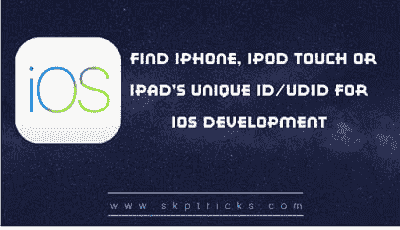

# 查找 iPhone、iPod touch 或 iPad 的唯一 ID (UDID)用于 iOS 开发

> 原文：<https://dev.to/skptricks/find-iphone-ipod-touch-or-ipad-s-unique-id-udid-for-ios-development-44n>

来源:[为 iOS 开发寻找 iPhone、iPod touch 或 iPad 的唯一 ID(UDID)](https://www.skptricks.com/2019/07/find-iphone-ipod-touch-or-ipads-unique-id-or-udid.html)

本教程解释了如何为 iOS 开发找到 iPhone、iPod touch 或 iPad 的唯一 ID (UDID)。每部 iPhone、iPod touch 和 iPad 都有一个与之相关的唯一标识号，称为 UDID(唯一设备 ID)。您的 UDID 是由字母和数字组成的 40 位序列，如下所示:0 e 83 ff 56 a 12 a 9 cf 0 c 7290 cbb 08 ab 6752181 FB 54b。开发者索要你的 UDID 是很常见的，因为他们需要给你 iOS 应用的测试版。

点击此处阅读更多内容...