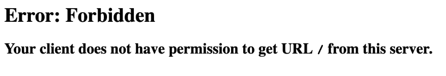
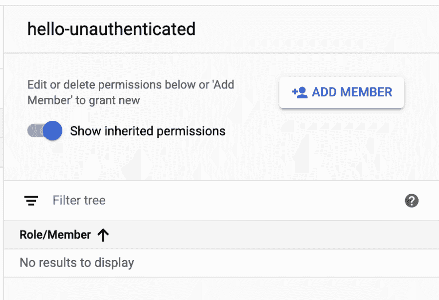
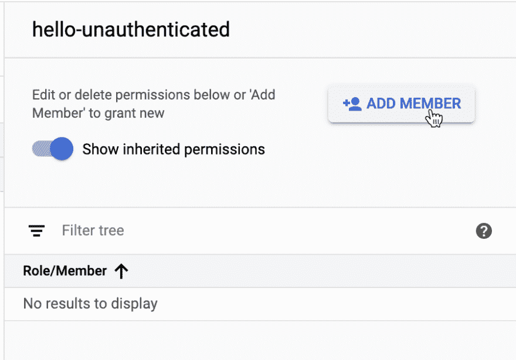
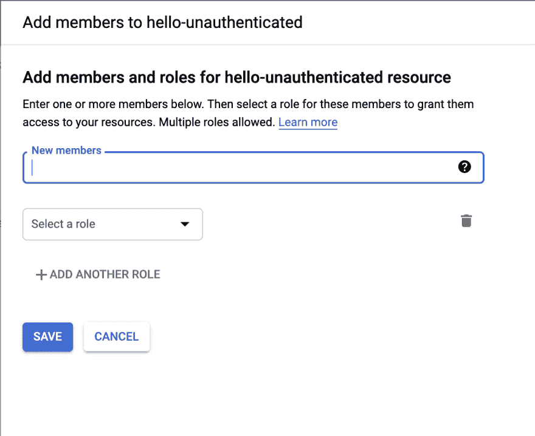
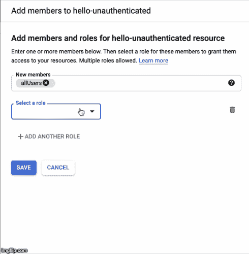
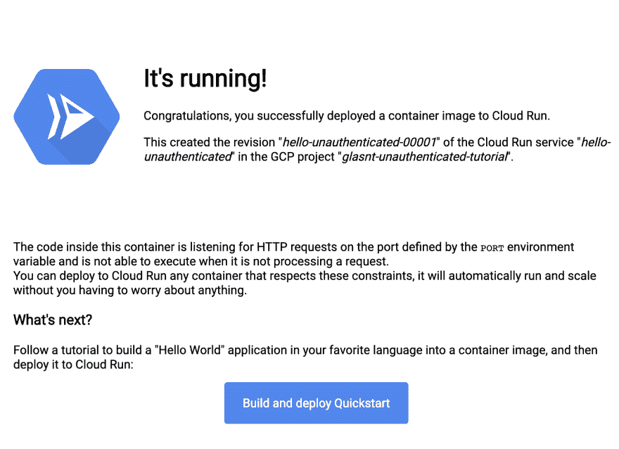

# 救命啊！我忘了在 Google Cloud Run 上点击“允许未认证调用”了！😱

> 原文：<https://dev.to/googlecloud/help-i-forgot-to-click-allow-unauthenticated-invocations-on-google-cloud-run-2hoj>

不要害怕，亲爱的互联网公民！您不必创建新的服务，我们可以修复现有的服务！

怎么会？借助身份和访问管理的强大功能(IAM！) 🦸🏻‍♀️

### 我的云运行服务上的“允许未认证调用”是什么意思？

每当你使用谷歌云平台控制台创建一个新的云运行服务(在这种情况下，建议的[gcr.io/cloudrun/hello](https://gcr.io/cloudrun/hello)容器)时，你会看到这个小复选框:

* * *

 
<small>*图片:云运行创建屏幕中的“允许未经验证的调用”复选框。*</small>

* * *

如果您在创建服务时忘记检查这一点，那么当您尝试导航到服务 URL 时，您最终会得到一条可爱的 HTTP 403 消息:

* * *

 
<small>*图片:如果您不允许未经验证的调用，则出现 Sad 403 错误消息。*</small>

* * *

那么这到底是怎么回事呢？

### 权限获得

如果您查看复选框关于服务创建的扩展帮助文本，您会看到这个小提示:

> 这是将云运行调用者角色分配给`allUsers`成员类型的快捷方式。创建服务后，可以使用 IAM 来管理访问。

这意味着本质上它所说的:有一个小的 IAM 规则是在创建时添加的，允许任何人访问服务。

因此，如果您在创建服务时忘记了检查“允许未经验证的调用”,我们可以手动添加这个角色，并修复服务！

* * *

#### 但是为什么您首先想要经过身份验证的调用呢？🤔

有许多设计原因导致您不希望允许任何人访问您的服务，包括只允许经过身份验证的调用/用户甚至只允许 GCP 组件访问您的服务。云运行服务不一定要公开！🌈

* * *

在[云运行仪表板](https://console.cloud.google.com/run)上，您将看到您的服务列表。选择一个将在屏幕右侧的信息面板中显示服务详情。(提示:如果您以后不再需要此面板，可以通过单击“隐藏信息面板”来隐藏它)

 <small> *图片:hello-unauthenticated 服务的信息面板。*</small>

你会想要点击 **[+👤添加成员]** 来获得我们想要的对话框。

 <small> *图片:点击添加会员按钮。*</small>

在那里，我们看到一个对话框，允许我们向服务添加成员。

 <small> *图片:新成员对话框*</small>

我们要的新成员叫`allUsers`(任何人)。我们可以搜索`all`，该值将出现在建议的下拉列表中。

 <small> *图片:成员对话框建议为‘全部’*</small>

*提示:点击`(?)`将显示其他可能选项的列表，以及它们的含义。*

对于角色，我们想将其添加到`Cloud Run Invoker`角色(一个可以调用云运行的角色)。

 
<small>*动画形象:逐步添加云运行调用者角色的过程*</small>

对于这两个选项，我们指定是的，我们希望任何人都能够运行我们的服务。

保存后可以去原服务网址，huzzah！有用！今天得救了！

 <small> *图片:gcr.io/cloudrun/hello 服务成功登陆页面。*</small>

我们不仅能够在创建时恢复我们丢失的复选框，而且我们还能够做到这一点，而不必推送我们服务的新版本！`$K_REVISION`值(一个有用的环境变量！)显示我们仍在使用`hello-unauthenticated-00001`，所以即使你第一次部署了错误的可见性，*你也可以修复它，没人会知道！*

# 🏻‍♀️