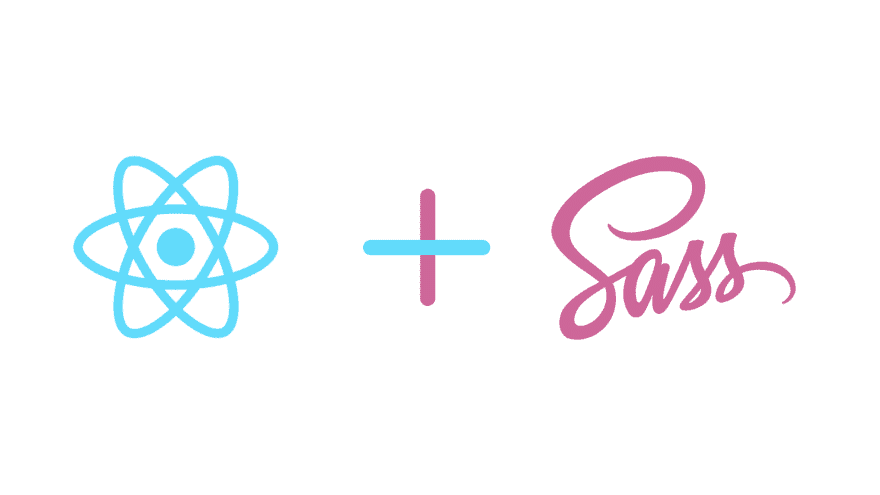

# 如何去 SCSS

> 原文：<https://dev.to/robghchen/how-to-scss-i1j>

通过简单的创建-反应-应用程序了解 SCSS 的功能

[](https://medium.com/@robghchen/how-to-scss-59d5adbad601?source=rss-1a2b6738cba4------2)

1)在终端:

```
create-react-app scss-demo
cd scss-demo
npm i node-sass
npm start 
```

<svg width="20px" height="20px" viewBox="0 0 24 24" class="highlight-action crayons-icon highlight-action--fullscreen-on"><title>Enter fullscreen mode</title></svg> <svg width="20px" height="20px" viewBox="0 0 24 24" class="highlight-action crayons-icon highlight-action--fullscreen-off"><title>Exit fullscreen mode</title></svg>

2)将`App.css`重命名为`App.scss`

3)在`App.js`中，将第 3 行的`import './App.css';`改为`import 'App.scss';`

4)看一下`App.scss`，然后将`App.scss`中的代码替换为:

请注意，在下面的 scss 代码中，我们可以:
**a)使用$符号**
**制作变量 b)使用嵌套的元素标签来反映我们的 HTML 层次结构**