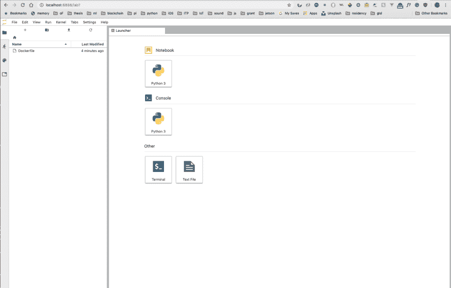

# 学习 Docker 002 ~图片~

> 原文：<https://dev.to/0xkoji/learning-docker-002-images-5deb>

### 超级简单的 Dockerfile

busybox[【https://hub . docker . com/_/busybox](https://hub.docker.com/_/busybox)

```
FROM busybox
RUN echo "building simple docker image!!!"
CMD echo "hello container" 
```

Enter fullscreen mode Exit fullscreen mode

#### 打造

```
$ docker build -t hello .
Sending build context to Docker daemon  2.048kB
Step 1/3 : FROM busybox
latest: Pulling from library/busybox
8e674ad76dce: Pull complete Digest: sha256:c94cf1b87ccb80f2e6414ef913c748b105060debda482058d2b8d0fce39f11b9
Status: Downloaded newer image for busybox:latest
 ---> e4db68de4ff2
Step 2/3 : RUN echo "building simple docker image!!!"
 ---> Running in 1df5fbc4c964
building simple docker image!!!
Removing intermediate container 1df5fbc4c964
 ---> 1ee1020b4fdc
Step 3/3 : CMD echo "hello container"
 ---> Running in ac28127a38e0
Removing intermediate container ac28127a38e0
 ---> 6a252581664b
Successfully built 6a252581664b
Successfully tagged hello:latest 
```

Enter fullscreen mode Exit fullscreen mode

#### 图像

```
$ docker images
REPOSITORY              TAG                 IMAGE ID            CREATED             SIZE
hello                   latest              6a252581664b        25 seconds ago      1.22MB 
```

Enter fullscreen mode Exit fullscreen mode

#### 运行容器

```
$ docker run --rm hello
hello container 
```

Enter fullscreen mode Exit fullscreen mode

### 简单的 Ubuntu 图片

1.  安装 vim
2.  install git
3.  安装卷曲
4.  运行容器时显示 git 版本

Dockerfile

```
FROM ubuntu:18.04
RUN apt-get update && apt-get upgrade -y && apt-get autoremove -y
RUN apt-get install vim -y
RUN apt-get install git -y
RUN apt-get install curl -y
CMD [ "git", "--version"] 
```

Enter fullscreen mode Exit fullscreen mode

```
$ docker build -t my_test .

$ docker run --rm -it my_test
git version 2.17.1 
```

Enter fullscreen mode Exit fullscreen mode

# 创建好 Dockerfile 的方法(针对初学者)

我认为以下可能是一个安全的方法

1.  选择基础图像
2.  在容器上运行命令
3.  记下步骤 2 中使用的所有命令
4.  如果完成了步骤 3，制作一个文档

#### 第一步

我们可以找出好的图像[https://hub.docker.com/](https://hub.docker.com/)

#### 第二步

在容器上运行命令。当我们尝试命令时，我们需要使用`-y`

#### 第三步

如果命令运行成功，记下来，在某个时候，我们需要提交，因为如果其中一个命令打乱了我们所做的事情，我们将需要再次做同样的事情，这很痛苦。或者我们可以创建一个图像，然后添加更多的命令。

#### 第四步

记下所有测试和修改的命令`Dockerfile`

### 我造了什么

安装一些软件& python 包

`Dockerfile`

```
# base image
FROM continuumio/anaconda3:2019.03
MAINTAINER Koji Kanao <koji.kanao@nyu.edu>

RUN apt-get update && apt-get upgrade -y && apt-get autoremove -y
RUN apt-get install vim -y
RUN apt-get install git -y
RUN apt-get install curl -y
RUN apt-get install ffmpeg -y
RUN apt-get install imagemagick -y
RUN conda install pytorch torchvision cudatoolkit=9.0 -c pytorch -y

# python packages
RUN pip install --upgrade \
    pip==19.1.1 \
    && pip install \
    autopep8==1.4.4 \
    setuptools>=41.0.0 \
    opencv-python==3.4.3.18 \
    opencv-contrib-python==3.4.3.18 \
    Pillow \
    numpy \
    pandas \
    scipy \
    matplotlib \
    h5py \
    Keras==2.2.4 \
    scikit-learn \
    scikit-image \
    six \
    sklearn \
    spacy \
    requests \
    beautifulsoup4 \
    tensorflow==1.14.0 

# create work dir
WORKDIR /workdir

# expose port
EXPOSE 8888

# start jupyter notebook
ENTRYPOINT ["jupyter-lab", "--ip=0.0.0.0", "--port=8888", "--no-browser", "--allow-root", "--NotebookApp.token=''"]

# set workdir as notbook dir
CMD ["--notebook-dir=/workdir"] 
```

Enter fullscreen mode Exit fullscreen mode

构建图像

```
$ docker build -t conda_docker . 
```

Enter fullscreen mode Exit fullscreen mode

运行容器

```
$ docker run -it -p 8888:8888 --name doconda --mount type=bind,src=`pwd`,dst=/workdir  conda_docker 
```

Enter fullscreen mode Exit fullscreen mode

打开 localhost:8888
[](https://res.cloudinary.com/practicaldev/image/fetch/s--Fjk0sMmn--/c_limit%2Cf_auto%2Cfl_progressive%2Cq_auto%2Cw_880/https://thepracticaldev.s3.amazonaws.com/i/dtb4y28c4fji7zcecmr5.png)

```
$ ls Dockerfile     Untitled.ipynb 
```

Enter fullscreen mode Exit fullscreen mode

这个容器可以在我的主机上保存一个笔记本。

你可以从这里拉这张图片
[https://hub.docker.com/r/kojikno/conda_docker](https://hub.docker.com/r/kojikno/conda_docker)

我认为 Docker 很棒，因为我花了几个小时用 VirtualBox 创建了这个 env。实际上我们可以使用流浪者来节省时间，但它仍然使用虚拟机，所以一般来说如此沉重和 Mac 的球迷将需要非常努力 lol。然而，Docker 并不笨重，很容易重新创建同样的 env，这是非常好的。我想我会更多地使用 Docker，但仍需要不断学习。尤其是`docker-compose`