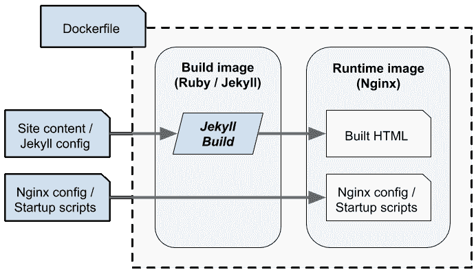

# 将我的博客部署到谷歌云运行

> 原文：<https://dev.to/dazuma/deploying-my-blog-to-google-cloud-run-kkl>

在过去的几年里，我的博客(在 https://daniel-azuma.com/blog 的规范副本)被托管在一个个人的 T2 Kubernetes 集群上。除了我的博客，我还使用集群托管了一些其他网站，并偶尔运行一些计算任务。Kubernetes 是一项非常棒、非常灵活的技术，而且由于(完全公开)我在 Google 工作，在服务器基础设施上使用容器图像对我来说感觉非常自然。但是维护一个 Kubernetes 集群意味着要为虚拟机付费，最近我一直在想是否可以避免这些成本。

所以我开始把我的网站和工作从 Kubernetes 上移走，最终，一个月前，我完全关闭了集群。我把这个博客迁移到了 [Cloud Run](https://cloud.google.com/run) 上，这是一个基于容器的无服务器环境，谷歌在 4 月份推出了这个环境。到目前为止，它一直运行得很好，而且因为它很容易就被归入免费层，我的成本实际上已经降到了零。我知道如果我被划上斜线…这是谷歌:他们会根据需要放大我。

在本文中，我将讨论无服务器平台是否适合静态网站。然后我将提供一个教程来部署一个基于 [Jekyll](https://jekyllrb.com) 的静态站点到云运行。在这个过程中，您还将学习一些静态站点容器化的良好实践。将这些指令适用于其他静态站点生成器，如[雨果](https://gohugo.io/)，应该不会太难。

## 为什么静态网站要无服务器？

如今，我们有很多选择来托管静态站点。最简单的方法之一是使用云存储服务，如亚马逊 S3 或 T2 的谷歌云存储。只要把你的静态内容上传到一个存储桶，配置几个旋钮，你就有了一个网站。像 [GitHub](https://pages.github.com/) 和 [Bitbucket](https://confluence.atlassian.com/bitbucket/publishing-a-website-on-bitbucket-cloud-221449776.html) 这样的源码控制服务也经常为推送到它们的存储库的内容提供网络托管。对于简单的静态站点，像这样的选择通常是简单而廉价的。

随着无服务器云的出现，我们现在有了第三个便宜的选择。对于许多无服务器平台，您不必为容器或虚拟机或存储付费，只需支付您实际使用的计算资源。对于一个静态站点，你不会用到很多。

但是，为什么要选择通用的无服务器平台，而不是基于存储或源代码控制的托管平台呢？

不同的部署选项总是各有利弊。然而，通用无服务器的主要好处之一是*灵活性*。静态站点几乎从来都不是“纯粹”静态的。也许你需要定制的错误处理和错误文档。也许你需要更复杂的重定向。也许你需要在认证背后隐藏一些内容。也许你的站点大部分是静态的，但是在一些情况下你仍然需要服务器端脚本。简单的基于内容的主机通常提供一些配置旋钮来帮助这些额外的东西，但是它们不能总是处理每一种情况。

在我的博客中，我有大量的重定向，以及一些由特制的 Nginx 配置处理的特殊情况。所以对我来说，Google Cloud Run 最大的吸引力之一就是能够为我自己的容器提供我自己的 Nginx 配置文件。

当然，没有放之四海而皆准的标准。但是，如果你在让 S3 按照你需要的方式处理你的网站方面有困难，或者如果你目前在虚拟机或自己的服务器上运行，并且想要削减成本，无服务器平台可能也是你的最佳选择。

## 哲基尔在云上奔跑

本文的其余部分是一个将基于 Jekyll 的站点部署到 T2 Google Cloud Run 的教程。Cloud Run 对静态网站特别有效，因为它使用容器，允许您为静态内容配置自己的 web 服务器。(相比之下，基于“函数”或“lambda”的平台通常是为特定的动态 web 语言或框架定制的，可能根本不支持静态站点。)

请注意，云运行有两种“风格”:一种是直接在谷歌的基础设施中运行的完全托管风格，另一种是在您自己的 [Kubernetes 引擎](https://cloud.google.com/kubernetes-engine/)集群上运行的风格。对于静态网站，您可能会更喜欢前者，因为它提供了非常便宜的按使用付费模式。(对我来说，整个目的的一部分是摆脱我的 Kubernetes 集群。)然而，如果您想要对基础设施进行更多的控制，仍然很容易调整这些指令以部署到 GKE 上的云运行。[这个视频](https://www.youtube.com/watch?v=RVdhyprptTQ)有更多关于两种云运行风格之间差异的信息。

杰基尔是用红宝石写的。我假设你已经安装了 Ruby 和 Jekyll，但是如果你需要帮助，Jekyll 文档有详细的说明。

### 创建和测试 Jekyll 项目

我们将从创建一个新的 Jekyll 项目开始。(如果您有现有的项目，请随意使用它。)

```
$ jekyll new mysite
$ cd mysite 
```

<svg width="20px" height="20px" viewBox="0 0 24 24" class="highlight-action crayons-icon highlight-action--fullscreen-on"><title>Enter fullscreen mode</title></svg> <svg width="20px" height="20px" viewBox="0 0 24 24" class="highlight-action crayons-icon highlight-action--fullscreen-off"><title>Exit fullscreen mode</title></svg>

现在在本地运行您的站点:

```
$ bundle exec jekyll serve 
```

<svg width="20px" height="20px" viewBox="0 0 24 24" class="highlight-action crayons-icon highlight-action--fullscreen-on"><title>Enter fullscreen mode</title></svg> <svg width="20px" height="20px" viewBox="0 0 24 24" class="highlight-action crayons-icon highlight-action--fullscreen-off"><title>Exit fullscreen mode</title></svg>

Jekyll 将在本地构建您的站点，并在 4000 端口上提供服务。将您的 web 浏览器指向 localhost:4000 以查看。

您可以通过编辑`_posts`目录中的帖子，或者更改配置和布局来编辑您的站点。当您进行更改时，`jekyll serve`会注意到文件编辑并自动重建您的站点。我们不会在这里讨论如何使用 Jekyll 的所有细节，但是在 Jekyll 文档中有一个很好的[教程](https://jekyllrb.com/docs/step-by-step/01-setup/)。

键入`CTRL` - `C`停止服务器。

使用`jekyll serve`是在开发过程中查看站点的一种便捷方式，但在生产中不应该这样运行。事实上，正如我们将看到的，您根本不需要在最终的产品容器中安装 Jekyll，甚至 Ruby。因此，让我们来探索如何创建一个高效的网站形象。

### 创建生产对接图像

[Docker](https://www.docker.com/) 已经成为*事实上的*打包应用进行部署的标准方式，Cloud Run 方便地使用 Docker 映像作为其输入格式。在这里，我们将创建一个 Docker 映像来部署您的站点。

我们想要的图像将直接从一个高性能的 web 服务器 [Nginx](https://www.nginx.com/) 提供给我们的静态站点。这是一个静态站点，所以我们在运行时不需要 Jekyll 甚至 Ruby。然而，我们确实需要 Jekyll 来*构建*静态站点。也就是说，*构建*和*运行*有不同的需求，所以我们将它们分成不同的阶段，如下图所示。

[](https://res.cloudinary.com/practicaldev/image/fetch/s--J8zrLlFj--/c_limit%2Cf_auto%2Cfl_progressive%2Cq_auto%2Cw_880/https://daniel-azuma.com/img/posts/jekyll-cloud-run-diagram.png)

我们将把项目写在蓝框中:

*   站点内容和 Jekyll 配置作为 Jekyll 的输入
*   用正确的配置启动 Nginx 的 Nginx 配置文件和启动脚本。
*   描述构建过程的 Dockerfile 文件。

然后当我们执行一个`docker build`时，它将分两个阶段进行。首先，运行构建阶段，获取我们的博客文章和 Jekyll 配置，并运行 Jekyll 来产生 HTML 输出。其次，构建的 HTML，连同 Nginx 配置和启动脚本一起，被安装到运行时映像中。

#### 配置 Nginx

在我们的`mysite`目录中，创建一个名为`_app`的子目录。这个目录将包含我们的 Nginx 配置文件和启动脚本。因为它以下划线开头，Jekyll 不会试图将其构建为您的站点 html 的一部分。它将直接传递到您的最终运行时映像中。

```
$ mkdir _app
$ cd _app 
```

<svg width="20px" height="20px" viewBox="0 0 24 24" class="highlight-action crayons-icon highlight-action--fullscreen-on"><title>Enter fullscreen mode</title></svg> <svg width="20px" height="20px" viewBox="0 0 24 24" class="highlight-action crayons-icon highlight-action--fullscreen-off"><title>Exit fullscreen mode</title></svg>

让我们来编写 Nginx 配置。创建一个名为`_app/nginx.conf.in`的文件，内容如下:

```
worker_processes 1;
working_directory /app;
daemon off;

events {
  worker_connections 80;
}

http {
  include /etc/nginx/mime.types;

  server {
    listen $PORT;
    root /app/site;

    location / {
      try_files $uri $uri.html $uri/ /404.html;
    }
  }
} 
```

<svg width="20px" height="20px" viewBox="0 0 24 24" class="highlight-action crayons-icon highlight-action--fullscreen-on"><title>Enter fullscreen mode</title></svg> <svg width="20px" height="20px" viewBox="0 0 24 24" class="highlight-action crayons-icon highlight-action--fullscreen-off"><title>Exit fullscreen mode</title></svg>

这不是 Nginx 教程，所以我不会在这里详细讨论。然而，我要指出几件事。

首先，我们有意将`worker_connections`设置为 80。Cloud Run 目前的最大并发数为 80(这意味着它将允许每个实例最多有 80 个并发连接)。Nginx 通常可以处理更多，但因为 Cloud Run 目前有这个限制，我们将把这些信息传递给 Nginx，以便它可以优化自己。

其次，注意我们正在监听端口`$PORT`。这本身实际上不是“有效的”Nginx 配置语法。相反，我们将编写一个启动脚本，将这个 Nginx 配置视为一个*模板*，并在运行时替换这里的实际端口号。这是因为 Cloud Run 的[运行时规范](https://cloud.google.com/run/docs/reference/container-contract)声明端口实际上直到运行时才知道:它会通过`PORT`环境变量告诉你监听哪个端口。

因此，我们的下一个任务是编写一个脚本来读取环境变量，并将正确的值代入配置模板。创建一个名为`_app/start.sh`的文件，内容如下:

```
#!/bin/bash

[[-z "$PORT"]] && export PORT=8080
envsubst '$PORT' < /app/nginx.conf.in > /app/nginx.conf

exec nginx -c /app/nginx.conf 
```

<svg width="20px" height="20px" viewBox="0 0 24 24" class="highlight-action crayons-icon highlight-action--fullscreen-on"><title>Enter fullscreen mode</title></svg> <svg width="20px" height="20px" viewBox="0 0 24 24" class="highlight-action crayons-icon highlight-action--fullscreen-off"><title>Exit fullscreen mode</title></svg>

让我们仔细分析一下这是怎么回事。首先，它检查是否设置了`PORT`变量，如果没有，它将其设置为默认值`8080`。云运行总是设置变量，但是我们也将在云运行之外本地测试这个映像，所以我们将确保它在这种情况下有一个值。

接下来，我们替换`nginx.conf.in`文件中`PORT`环境变量的值，并将结果写入我们将使用的最终`nginx.conf`。最后，我们启动 Nginx。

告诉`envsubst`只替换`PORT`环境变量是很重要的(因为我们的 Nginx 配置文件也包括像`$uri`这样的语法，我们希望`envsubst`不要去管它。)

给 Nginx 命令加上前缀`exec`也很重要。这导致 Nginx*替换*脚本进程，以便它接收信号。这对于云运行能够有效地控制容器是很重要的。

保存这两个文件，并在您的启动脚本上设置 execute 位:

```
$ chmod a+x start.sh 
```

<svg width="20px" height="20px" viewBox="0 0 24 24" class="highlight-action crayons-icon highlight-action--fullscreen-on"><title>Enter fullscreen mode</title></svg> <svg width="20px" height="20px" viewBox="0 0 24 24" class="highlight-action crayons-icon highlight-action--fullscreen-off"><title>Exit fullscreen mode</title></svg>

您现在应该在您的`mysite`项目的`_app`目录中有两个文件`nginx.conf.in`和`start.sh`。

#### 编写 Dockerfile

接下来，我们将编写一个 Docker 文件来构建您的站点的 Docker 图像。

回到您的`mysite`项目目录，并创建另一个名为`_build`的子目录。同样，因为这个名称以下划线开头，Jekyll 不会试图将其任何文件视为站点内容。

```
$ cd /path/to/mysite
$ mkdir _build
$ cd _build 
```

<svg width="20px" height="20px" viewBox="0 0 24 24" class="highlight-action crayons-icon highlight-action--fullscreen-on"><title>Enter fullscreen mode</title></svg> <svg width="20px" height="20px" viewBox="0 0 24 24" class="highlight-action crayons-icon highlight-action--fullscreen-off"><title>Exit fullscreen mode</title></svg>

创建一个名为`_build/Dockerfile`的文件，内容如下:

```
FROM ruby:2 AS build

RUN gem install bundler

WORKDIR /workspace
COPY Gemfile* /workspace/
RUN bundle install

COPY . /workspace
ENV JEKYLL_ENV=production
RUN bundle exec jekyll build

FROM nginx:1

WORKDIR /app
COPY _app /app
COPY --from=build /workspace/_site /app/site

CMD ["/app/start.sh"] 
```

<svg width="20px" height="20px" viewBox="0 0 24 24" class="highlight-action crayons-icon highlight-action--fullscreen-on"><title>Enter fullscreen mode</title></svg> <svg width="20px" height="20px" viewBox="0 0 24 24" class="highlight-action crayons-icon highlight-action--fullscreen-off"><title>Exit fullscreen mode</title></svg>

这看起来可能比您可能见过的其他“入门”other 文件要复杂一些，所以让我们仔细看看它在做什么。

请记住，我们的构建过程将分两个阶段进行。你现在可以在这个多阶段 Dockerfile 文件中看到。第一阶段 stage 从标准的 [Ruby-Debian 基础映像](https://hub.docker.com/_/ruby)开始，安装你的包(应该包括 Jekyll)，并执行一个产品 Jekyll 构建。结果保存在`/workspace/_site`目录中。

然后，第二阶段创建我们将部署到云运行的最终映像。它从标准的 [Nginx 基础映像](https://hub.docker.com/_/nginx)开始，复制到我们的 Nginx 配置文件和启动脚本中，还复制到第一阶段构建的 html 文件中。请注意，最终的图像只包括服务于您的站点所需的内容:Nginx，但不包括 Ruby 或 Jekyll。这种[两阶段](https://docs.docker.com/develop/develop-images/multistage-build/)策略是构建 Docker 形象时常见的最佳实践。

#### 在本地测试您的映像

现在我们有了 Dockerfile 文件，我们可以在本地构建映像。返回到您的`mysite`目录，执行 docker 构建，指向我们的 docker 文件。

```
$ cd /path/to/mysite
$ docker build -t mysite -f _build/Dockerfile . 
```

<svg width="20px" height="20px" viewBox="0 0 24 24" class="highlight-action crayons-icon highlight-action--fullscreen-on"><title>Enter fullscreen mode</title></svg> <svg width="20px" height="20px" viewBox="0 0 24 24" class="highlight-action crayons-icon highlight-action--fullscreen-off"><title>Exit fullscreen mode</title></svg>

这将把你的站点构建成一个 Docker 图片，并用名称`mysite`标记它。我们现在可以尝试运行它。

```
$ docker run --rm -it -p 8080:8080 mysite 
```

<svg width="20px" height="20px" viewBox="0 0 24 24" class="highlight-action crayons-icon highlight-action--fullscreen-on"><title>Enter fullscreen mode</title></svg> <svg width="20px" height="20px" viewBox="0 0 24 24" class="highlight-action crayons-icon highlight-action--fullscreen-off"><title>Exit fullscreen mode</title></svg>

这将使用静态站点运行您的映像，并公开端口 8080。现在，您可以通过将 web 浏览器指向 localhost:8080 来测试它。

点击`CTRL` - `C`停止你的 Docker 镜像。

### 部署到云运行

现在我们有了一个工作的 Docker 映像，是时候部署到 Cloud Run 了。

#### 设置谷歌云

如果你还没有谷歌云项目，去[控制台](https://console.cloud.google.com/)创建一个。您需要启用计费才能使用云运行。但是不要担心——除非你的网站有很大的流量，否则你很容易就能进入本教程的免费层。

如果您尚未在项目中启用云构建和云运行，请执行以下操作:

*   在控制台中导航到[云构建](https://console.cloud.google.com/cloud-build)，点击“启用云构建 API”。
*   在控制台中导航到[云运行](https://console.cloud.google.com/run)，点击“开始使用云运行”。

你还需要安装[谷歌云软件开发套件](https://cloud.google.com/sdk/)。如下设置默认项目(用您的项目 ID 代替`$MY_PROJECT_ID` )

```
$ gcloud config set project $MY_PROJECT_ID 
```

<svg width="20px" height="20px" viewBox="0 0 24 24" class="highlight-action crayons-icon highlight-action--fullscreen-on"><title>Enter fullscreen mode</title></svg> <svg width="20px" height="20px" viewBox="0 0 24 24" class="highlight-action crayons-icon highlight-action--fullscreen-off"><title>Exit fullscreen mode</title></svg>

#### 云中建筑

您可以将本地映像推送到云中，以准备部署到 Cloud Run，但是在云中构建更容易也更安全。我们将在 [Google Cloud Build](https://cloud.google.com/cloud-build/) 中创建一个简单的配置来构建您的站点图像。

创建一个文件`_build/cloudbuild.yaml`。将以下内容复制到其中:

```
steps:
  - name: 'gcr.io/cloud-builders/docker'
    args: ['build', '--no-cache', '--pull',
      '--file', '_build/Dockerfile',
      '--tag', '$_IMAGE',
      '.']

images:
  - '$_IMAGE' 
```

<svg width="20px" height="20px" viewBox="0 0 24 24" class="highlight-action crayons-icon highlight-action--fullscreen-on"><title>Enter fullscreen mode</title></svg> <svg width="20px" height="20px" viewBox="0 0 24 24" class="highlight-action crayons-icon highlight-action--fullscreen-off"><title>Exit fullscreen mode</title></svg>

这个配置使用您创建的`_build/Dockerfile`来执行 Docker 构建，并使用您需要在调用构建时指定的映像名来标记它。

移回 Jekyll 站点的根目录，使用这个命令进行编译(用您的项目 ID 代替`$MY_PROJECT_ID`)。

```
$ cd /path/to/mysite
$ gcloud builds submit --config _build/cloudbuild.yaml \
    --substitutions _IMAGE=gcr.io/$MY_PROJECT_ID/mysite:v1 
```

<svg width="20px" height="20px" viewBox="0 0 24 24" class="highlight-action crayons-icon highlight-action--fullscreen-on"><title>Enter fullscreen mode</title></svg> <svg width="20px" height="20px" viewBox="0 0 24 24" class="highlight-action crayons-icon highlight-action--fullscreen-off"><title>Exit fullscreen mode</title></svg>

这将构建你的站点的 Docker 图像，并将其上传到 [Google 容器注册表](https://cloud.google.com/container-registry/)。如果你愿意，你可以通过访问云控制台中的[容器注册表](https://console.cloud.google.com/gcr)来查看你的图片。您还可以在控制台中查看您的[构建结果和日志](https://console.cloud.google.com/cloud-build/builds)。

您作为值`_IMAGE`提供的图像名称应该是`gcr.io/$MY_PROJECT_ID/$SITE_NAME:$TAG`的形式，以便上传到 Google 容器注册表。在这个名称中，`$MY_PROJECT_ID`必须是您的项目 ID。`$SITE_NAME`应该是该图像的某个识别名称。(在这种情况下，我们使用了`mysite`。)`$TAG`应该是这个 build 的名字。(我们在这里使用了`v1`,但是您可能会考虑使用时间戳、git hash 或者其他生成构建 id 的系统。)

#### 部署到云运行

现在，要部署到云运行，输入这个命令(用您的项目 ID 代替`$MY_PROJECT_ID`)。

```
$ gcloud beta run deploy mysite \
    --platform managed --region us-central1 \
    --image gcr.io/$MY_PROJECT_ID/mysite:v1 \
    --allow-unauthenticated --concurrency 80 
```

<svg width="20px" height="20px" viewBox="0 0 24 24" class="highlight-action crayons-icon highlight-action--fullscreen-on"><title>Enter fullscreen mode</title></svg> <svg width="20px" height="20px" viewBox="0 0 24 24" class="highlight-action crayons-icon highlight-action--fullscreen-off"><title>Exit fullscreen mode</title></svg>

除非你有一个非常大的网站，这应该只需要几秒钟。部署完成后，该命令将输出您站点的 URL。它看起来有点像`https://mysite-somecode.a.run.app`。在 web 浏览器中打开该 URL 以查看您的站点。

如果这是一个真实的网站，你可能会想把你自己的域名指向它。您可以在控制台中执行此操作。转到[云运行部分](https://console.cloud.google.com/run)，点击“管理自定义域”。

#### 部署更新

当您有更新时，您应该重复上面的构建和运行步骤。我建议每次更新使用不同的`$TAG`。这将让您唯一地识别每个构建，使您的站点根据需要向前和向后滚动变得容易。

例如，我们最初的部署使用了标签`v1`。对你的站点做一些编辑(可能添加或编辑一篇文章)，并使用`jekyll serve`在本地测试它。然后，让我们建造`v2` :

```
$ gcloud builds submit --config _build/cloudbuild.yaml \
    --substitutions _IMAGE=gcr.io/$MY_PROJECT_ID/mysite:v2
$ gcloud beta run deploy mysite \
    --platform managed --region us-central1 \
    --image gcr.io/$MY_PROJECT_ID/mysite:v2 \
    --allow-unauthenticated --concurrency 80 
```

<svg width="20px" height="20px" viewBox="0 0 24 24" class="highlight-action crayons-icon highlight-action--fullscreen-on"><title>Enter fullscreen mode</title></svg> <svg width="20px" height="20px" viewBox="0 0 24 24" class="highlight-action crayons-icon highlight-action--fullscreen-off"><title>Exit fullscreen mode</title></svg>

当您使用您的站点时，您可能想要创建一个 rake 任务或类似的脚本来生成新的标签并自动执行这些命令。为此我使用了[玩具](https://github.com/dazuma/toys)，我的`.toys.rb`文件看起来像这样:

```
LOCAL_IMAGE = "mysite"
PROJECT = "my-project-id"
SERVICE = "mysite"

tool "run-local" do
  flag :no_cache
  include :exec, exit_on_nonzero_status: true
  def run
    cache_args = no_cache ? ["--pull", "--no-cache"] : []
    exec ["docker", "build"] + cache_args +
         ["-t", LOCAL_IMAGE, "-f", "_build/Dockerfile", "."]
    puts "Running on http://localhost:8080"
    exec ["docker", "run", "--rm", "-it", "-p", "8080:8080", LOCAL_IMAGE]
  end
end

tool "deploy" do
  flag :tag, default: Time.new.strftime("%Y-%m-%d-%H%M%S")
  include :exec, exit_on_nonzero_status: true
  def run
    image = "gcr.io/#{PROJECT}/#{SERVICE}:#{tag}"
    exec ["gcloud", "builds", "submit", "--project", PROJECT,
          "--config", "_build/cloudbuild.yaml",
          "--substitutions", "_IMAGE=#{image}"]
    exec ["gcloud", "beta", "run", "deploy", SERVICE,
          "--project", PROJECT, "--platform", "managed",
          "--region", "us-central1", "--allow-unauthenticated",
          "--image", image, "--concurrency", "80"]
  end
end 
```

<svg width="20px" height="20px" viewBox="0 0 24 24" class="highlight-action crayons-icon highlight-action--fullscreen-on"><title>Enter fullscreen mode</title></svg> <svg width="20px" height="20px" viewBox="0 0 24 24" class="highlight-action crayons-icon highlight-action--fullscreen-off"><title>Exit fullscreen mode</title></svg>

### 打扫卫生

当您完成本教程后，如果您不想继续为您的网站服务，您可以删除该项目，这样您就不会产生任何相关费用。

请注意，删除项目将删除与其相关的所有资源，包括任何虚拟机、数据库、存储和网络资源。如果您仍在使用项目的一些资源，并且不想删除整个项目，则可以在本教程结束后通过以下方式进行清理:

*   转到[云运行控制台](https://console.cloud.google.com/run)并删除您为站点部署的服务。(它可能被称为“我的网站”。)
*   在控制台中转到您的[容器注册表](https://console.cloud.google.com/gcr)并删除您站点的图像。

## 何去何从

云运行文档包括许多关于部署和运行站点的[附加信息](https://cloud.google.com/run/docs/how-to)。特别令人感兴趣的是:

*   [如何映射自定义域](https://cloud.google.com/run/docs/mapping-custom-domains)
*   [从云构建](https://cloud.google.com/run/docs/continuous-deployment)和[中设置持续部署，触发对 GitHub 的推送](https://cloud.google.com/cloud-build/docs/running-builds/automate-builds)
*   [监控你的网站](https://cloud.google.com/run/docs/monitoring)
*   [定价](https://cloud.google.com/run/pricing)和[配额](https://cloud.google.com/run/quotas)。

关于运行时环境的更多信息，或者如果你想进一步定制你的容器，你应该参考[容器运行时契约](https://cloud.google.com/run/docs/reference/container-contract)。

这些天有很多关于无服务器的炒作，但并不是所有的都是合理的。对我来说，Cloud Run 是第一个让我感到兴奋的产品，因为它成功地将无服务器与容器融合在一起，也因为它在静态网站等常见用例中表现出色。