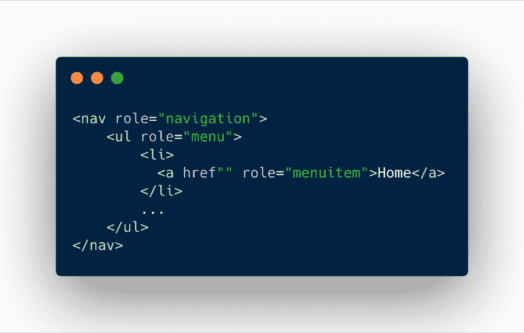
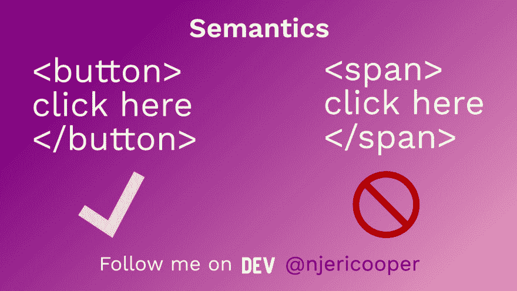
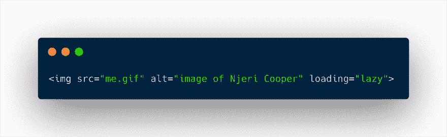
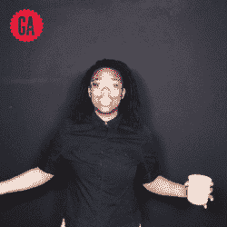

# 7 Must Haves for Web Accessible HTML in Your Site ❤️️ [Template]

> 原文：[https://dev.to/njericooper/7-must-haves-for-html-in-your-site-template-578i](https://dev.to/njericooper/7-must-haves-for-html-in-your-site-template-578i)

Lots of developers are building their own personal blogs, brands, and working on side projects. What better way to strengthen development skills than incorporating the best web accessibility practices into each web app? At the time of writing, these are some of the best ways to make a site accessible to the visually and physically impaired:

### 1\. Aria Roles, States, and Properties

[](https://res.cloudinary.com/practicaldev/image/fetch/s--KcVZRNiW--/c_limit%2Cf_auto%2Cfl_progressive%2Cq_auto%2Cw_880/https://thepracticaldev.s3.amazonaws.com/i/4h1fiuxoj1gdgknhxgt7.png)

ARIA stands for accessible rich internet applications. These applications are a list of attributes that communicate with a subset of the DOM called the accessibility tree. The accessibility tree is a more simplified rendering of a website. Some may call this the "shadow DOM". This version is readable by screen readers and focusable for keyboard users.

Assigning the correct role property to an HTML tag lets ARIA file its intended function. It's important to not use abstract terms when defining roles. There are a few types of roles that serve the purpose of structuring a site for the DOM and the accessibility tree. The types of roles and a few examples of them are:

*   #### Landmarks

*   #### Widgets

*   #### Document Structure

An alphabetical list of all ARIA roles and their definitions can be found in [section 5.4 of The Roles Model by w3](https://www.w3.org/WAI/PF/aria-1.1/roles). Below is an example of what appropriate roles would look like for a nav bar.

```
<nav role="navigation">

    <ul role="menu">

        <li>

        <a href="" role="menuitem">Home</a>

        </li>

        <li>

        <a href="" role="menuitem">About</a>

        </li>

        <li>

        <a href="" role="menuitem">Contact</a>

        </li>

    </ul>

</nav> 
```

In addition to ARIA roles, there are states and properties which have values that give HTML tags characteristics. These values can be a boolean, number, token, etc., and globally define elements on the DOM. For example, a menuitem widget can have the state of "hidden" that is changed on hover. A use case for this may be a dropdown menu that becomes visible when focused on with a mouse or keyboard selection. Here's what would be placed inside of the html tag

```
aria-hidden="true" 
```

Another ARIA attribute that may be used in a nav bar is aria-owns. To let the DOM now that the menu item has a parent child relationship with the menu items nested under it.

```
<nav role="navigation">

    <ul role="menu">

        <li>

            <a href="" role="menuitem">Home</a>

        </li>

        <li aria-owns="child-item">

            <a href="" role="menuitem">About</a>

        </li>

            <ul id="child-item">

                <li>

                    <a href="" role="menuitem">My Mission</a>

                </li>

                <li>

                    <a href="" role="menuitem">Portfolio</a>

                </li>

            </ul>

        <li>

            <a href="" role="menuitem">Contact</a>

        </li>

    </ul>

</nav> 
```

Assigning ownership would help to set the DOM and accessibility tree structure. This is useful in the event that some of the HTML becomes unordered.

Here's a [list of all official aria states and properties](https://www.w3.org/WAI/PF/aria-1.1/states_and_properties).

### 2\. Semantics

One of the dangers of ARIA is that developers can make the whole accessibility thing a catch 22.

Sometimes, we create elements on a website just to get it up and working. The thought of completing a project with urgency is appealing. Doing this results in poorly written code that just "works". It will boost user experience if the HTML tags correspond with its intended function. The most common example of what I mean is using a span, div, or text element as a button instead of using the button tag. This is a misuse that overrides the accessibility definitions already in place. To quote Steve Faulkner "No ARIA is better than Bad ARIA".

[](https://res.cloudinary.com/practicaldev/image/fetch/s--Xgnany8R--/c_limit%2Cf_auto%2Cfl_progressive%2Cq_auto%2Cw_880/https://thepracticaldev.s3.amazonaws.com/i/lb289nfzxm87qw8lh5su.png)

> Steve Faulkner@stevefaulkner📢 No ARIA is better than Bad ARIA
> Principal 1: A role is a promise
> Principle 2: ARIA Can Both Cloak and Enhance, Creating Both Power and Danger
> [w3.org/TR/wai-aria-pr…](https://t.co/Vlp8fqFdcf)13:20 PM - 28 Dec 2017[ ](https://twitter.com/intent/tweet?in_reply_to=946370347389128704) [  ](https://twitter.com/intent/retweet?tweet_id=946370347389128704) 49 [  ](https://twitter.com/intent/like?tweet_id=946370347389128704) 62

### 3\. Alt Text

Alt text is short for alternative text. The alternative text is not visible to the user, but holds information about its link or image. It can be a description or an attribute. It is available to screen readers and search engines to index images and links.

On my website, I add alt text with my name, what I do, and image descriptions.

### 4\. Media with Lazy Loading

[](https://res.cloudinary.com/practicaldev/image/fetch/s--06wwTTby--/c_limit%2Cf_auto%2Cfl_progressive%2Cq_auto%2Cw_880/https://thepracticaldev.s3.amazonaws.com/i/8mohvzcxazvz2ayniiqr.png)

Lazy loading is a native feature in the Google Chrome browser. It allows for images to be loaded only when you look at them. This is awesome because images and videos don't pre-load and down the page’s speed. To use the lazy loading feature use this code in image HTML tags:

```
loading="lazy" 
```

There is Javascript that adds cross-browser support. To learn more about lazy loading for other browsers, [check out this article by Addy Osmani](https://addyosmani.com/blog/lazy-loading/).

### 5\. Sections

Implementing sections into a website helps to separate the different types of content. Sections could be landmark tags like search, side bars, main content. Section tags let assistive technologies know that the developer is making a "region" on a page. On my website, I use it to make "about me" separate from "what I do". The structure looks like this:

```
<div role="main">
<section class="section section-1" id="who" >
  <div class="who" >
    <h2 class="title">Who TF is Coop?</h2>
    <p>Demo Text</p>
  </div>
</section>
<section class="section section-2" >
  <div class="what" >
    <h2 class="title">What</h2>
  </div>
</section> 
```

To learn more about the region role and how it's used and classified by ARIA, [check out this MDN page](https://developer.mozilla.org/en-US/docs/Web/Accessibility/ARIA/Roles/Region_role).

### 6\. Tab Index

Some web users navigate a website by only using a keyboard. Up and down arrows scroll, the tab key focuses on links, buttons, and selectable page elements and the enter key selects. Modern browsers have keyboard focus built in. If a web browser cannot detect the portions on a website that should be clicked on or hovered over, use tabindex. Tabindex sets an order or hierarchy to selectable items on a page. The default value is 0\. This means that everything is equally important and will be ordered from left to right for rows, then up and down for side menus or columns. Change the value of tab index to match the page's layout and ensure for the easiest navigation

### 7\. Inclusive Design

I've learned that the best way to make sure a website is accessible is to use all the features. Try turning on voice over, screen readers, or using your keyboard to get around your website. Being aware is the only way that we as humans can make sure our web apps are accessible to everyone.

## Full Homepage Code Template

[https://codepen.io/njericooper/embed/MMQBgz?height=600&default-tab=result&embed-version=2](https://codepen.io/njericooper/embed/MMQBgz?height=600&default-tab=result&embed-version=2)

```
<!--begin nav bar-->
  <nav id="nav" class="nav" role="navigation" >
    <ul class="navbar" role="menu">
      <li>
        <a href="#home" role="menuitem" alt="home" tabindex="0">Home</a>
      </li>
      <li>
        <a href="#who" role="menuitem" alt="Who is Njeri Cooper?" tabindex="1">Who</a>
      </li>
      <li>
        <a href="#what" role="menuitem" alt="What does Njeri Cooper Do?" tabindex="2">What</a>
    </li>
    <li>
      <a href="#contact" role="menuitem" alt="Contact Njeri Cooper" tabindex="3">Contact</a>
    </li>
  </ul>
</nav>
<!--begin main content section-->
<div role="main">
<section class="section section-1" id="who" >
  <div class="who" >
    <h2 class="title">Who TF is Coop?</h2>
    <p>Njeri Cooper is a front end web and iOS developer. Lorem Khaled Ipsum is a major key to success.</p>
    <p>They don’t want us to win. I’m giving you cloth talk, cloth. Special cloth alert, cut from a special cloth.</p>
  </div>
</section>
<section class="section section-2" id="what" background="https://vignette.wikia.nocookie.net/steven-univerimg/e/ed/Steven_the_Swordfighter_Cloud_Temple_Background.jpg/" loading="lazy" alt="Cloud Temple Image From Steven Universe">
  <div class="what">
    <h2 class="title">What</h2>
    <div class="links" id="contact">
      <a href="http://github.com/njericooper" alt="Njeri's Github" tabindex="4">git</a>
      <a href="https://dev.to/njericooper" alt="Njeri's tech blog" tabindex="5">dev to</a>
      <a href="https://twitter.com/njericooper" class="last" alt="Njeri's Twitter" tabindex="6">twitter</a>
    </div>
  </div>
</section>
</div> <!--end main content section-->
<div class="email-container">
  <div class="email_container">
      <form id="singular-form" role="form">
          <button class="shown" type="button" id="trigger" role="button" tabindex="7">Notify me</button>
          <div id="input-container">
              <input type="text" placeholder="E-mail">
              <button type="button" role="button" tabindex="8">Send</button>
          </div>
          <div id="success">Thank you!</div>
      </form>
  </div>            
<!--Footer-->
<footer class="footer" role="contentinfo">
    <p>©2019 OG Codes</p>
</footer> 
```

* * *

[](https://res.cloudinary.com/practicaldev/image/fetch/s--afhIFhtA--/c_limit%2Cf_auto%2Cfl_progressive%2Cq_66%2Cw_880/https://thepracticaldev.s3.amazonaws.com/i/e1ncu5hc613igd9xocrp.gif)

#### Njeri Cooper

Njeri uses the web to educate, innovate, and create. Read her authentic student to freelance dev [story](https://www.instagram.com/p/BiYDvvxhWKH/). Feel free to send Njeri a message [here](https://twitter.com/messages/compose?recipient_id=1039157808468578305).

[Twitter](https://www.twitter.com/njericooper) | | [Pinterest](https://www.pinterest.com/njericooper) | | [Instagram](https://www.instagram.com/ogcoopknowscrypto)