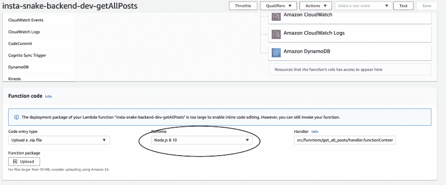
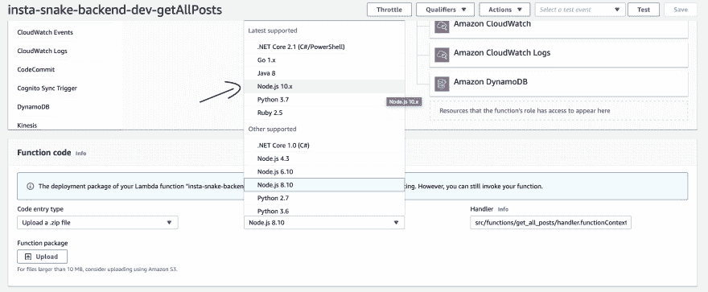
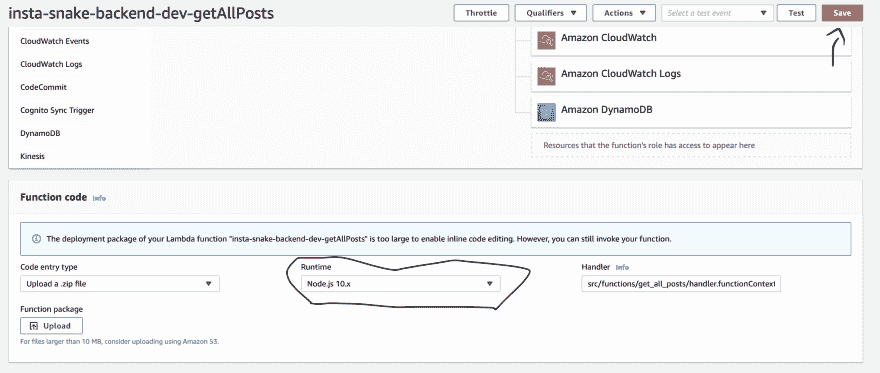

# 您现在可以将舔的 AWS 升级到 Node.js 10 LTS

> [https://dev . to/collabcode/voice-yes-can-update-its-AWS-lambdas-to-o-node-js-10-lts-207 l](https://dev.to/collabcode/voce-ja-pode-atualizar-suas-aws-lambdas-para-o-node-js-10-lts-207l)；

不久前，“t0”AWS 宣布其最常用的服务之一(AWS Lambda)将支持 Node.js 10 LTS 运行时，这很可能是该公司计划在其服务中越来越多地支持现代平台的一部分。

当前已支持来自其他平台(如 Python、Java、C#、Ruby 和 go)的代码。

你还在使用 Node.js 6.x 吗？

## 你需要退出 Node.js 6.x

Node.js 6.x 自 2016 年以来一直保持为 lt(长期支持)，其生命周期于 2019 年 4 月 30 日结束。很快，此版本将不会收到新的关键错误更新、安全修补程序、修补程序或其他重要更新。

添加 Node.js 10.x 后，AWS Lambda 继续支持两次 JavaScript 平台运行时间。Node.js 8.10 仍受支持，但它正进入到 2020 年的最终维护和支持阶段，而 10.x 目前正处于 LTS 阶段。

通过围绕此公告关注无服务器社区，我发现许多人仍然担心升级到 10.x 版，因为他们认为这一新运行时在 AWS 上是 beta 版。

我得到的印象是，许多人还没有适应新的文化，他们的开发/生产环境不是他们的责任，而是服务提供商的责任。AWS 未能将此支持作为测试版发布，这足以证明我需要更新我的受支持 AWS。

## 是的，我已经在使用 Node.js 10.x

Node.js 10.x 引入了较新版本的“[V8](http://v8.dev)”。这就对我们的代码的编译、缓存和执行方式进行了一些更改。

现在，您可以在不更改代码的情况下升级到新版本，以确保兼容性，只需将 AWS Lambda 设置升级到新版本即可。此外，Node.js 10.x 已在所有提供服务的区域实施。

## node . js 6 . x 与 Node.js 10.x 的主要区别

由 node . js 基准测试提供的测量结果强调了将 Node.js 6 升级到最新版本 lts(node . js 10 . x)的性能优势:

*   Node.js 10.x 上每秒的操作数几乎是其两倍；
*   Node.js 10.x 上的延迟减少了 65%；
*   在 Node.js 10.x 中，容器的装载重量减少了 35%，从而在出现[cold start](https://docs.aws.amazon.com/pt_br/lambda/latest/dg/running-lambda-code.html)的情况下提高了性能；
*   Node.js 10.x 是 OpenSSL 1.1.0 的第一个更新运行时。
*   [原生 HTTP 2 支援，最初新增至 node . js 8 . x lts，现已稳定于 Node.js 10.x，透过 HTTP 1 提供效能提升(包括缩短延迟和最小化通讯协定超载)，并新增伺服器优先顺序要求和推入支援](http://hipsters.tech/http2-magia-com-o-novo-protocolo/)
*   10.x 版引入了新的 JavaScript 语言功能，例如 Function.prototype.toString()和 async-await。

## 通过 AWS 控制台更新运行时

[](https://res.cloudinary.com/practicaldev/image/fetch/s--vlgcyD6r--/c_limit%2Cf_auto%2Cfl_progressive%2Cq_auto%2Cw_880/https://i.ibb.co/64F7xCT/Screen-Shot-2019-06-23-at-09-20-38.png)

[](https://res.cloudinary.com/practicaldev/image/fetch/s--m80cCl4B--/c_limit%2Cf_auto%2Cfl_progressive%2Cq_auto%2Cw_880/https://i.ibb.co/rFjtz2h/Screen-Shot-2019-06-23-at-09-20-50.png)

[](https://res.cloudinary.com/practicaldev/image/fetch/s--b-R699JS--/c_limit%2Cf_auto%2Cfl_progressive%2Cq_auto%2Cw_880/https://i.ibb.co/XWbQ1vJ/Screen-Shot-2019-06-23-at-09-21-00.png)

## 通过无服务器框架更新运行时

在更新 Serverless Framework 中的运行时之前，您必须在计算机上安装 Node.js 10.x 版本，对于我来说，维护多个版本的 Node.js 的最佳方法是使用 NVM，我已经在文章“[如何在 Linux](https://malaquias.dev/posts/como-instalar-o-nodejs-corretamente-no-linux/)上正确安装 node . js]”中讨论了如何安装和使用 NVM。

我们确定已安装 NVM，然后再安装版本 10.x:

```
nvm install 10 
```

<svg width="20px" height="20px" viewBox="0 0 24 24" class="highlight-action crayons-icon highlight-action--fullscreen-on"><title>Enter fullscreen mode</title></svg> <svg width="20px" height="20px" viewBox="0 0 24 24" class="highlight-action crayons-icon highlight-action--fullscreen-off"><title>Exit fullscreen mode</title></svg>

并更新了文件**中的运行时无服务器。yml** ，如下例所示:

```
provider:
  name: aws
  runtime: nodejs10.x 
```

<svg width="20px" height="20px" viewBox="0 0 24 24" class="highlight-action crayons-icon highlight-action--fullscreen-on"><title>Enter fullscreen mode</title></svg> <svg width="20px" height="20px" viewBox="0 0 24 24" class="highlight-action crayons-icon highlight-action--fullscreen-off"><title>Exit fullscreen mode</title></svg>

好了，现在我们做个部署，喝杯咖啡，放松一下。

## 结论

大多数使用 Node.js 创建的生产应用程序都使用 LTS 版本，因此强烈建议您将任何当前使用 Node.js 6.x 版本的 Lambda 应用程序或 AWS 升级到 Node.js 10.x(当前的最新版本)。

创建这样一种文化:不仅使节点保持最新，而且使其依赖项保持最新，从而避免出现版本中断和安全问题等意外情况。

* * *

## 完成…

如果你喜欢这个帖子，不要忘了给喜欢和分享

如果你想知道我在做什么，或者想问什么，请随时到社交网站来找我，比如@[【malakasdev】](https://twitter.com/malaquiasdev)。

为了多读我的帖子访问[【马拉喀什 DEV |生命，代码等】](http://malaquias.dev)。