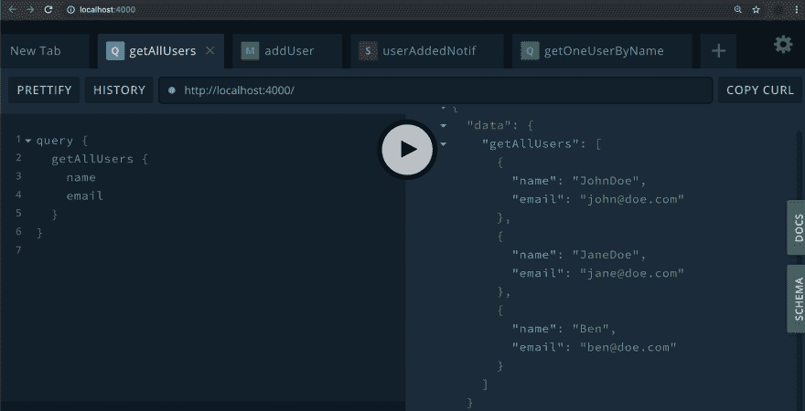
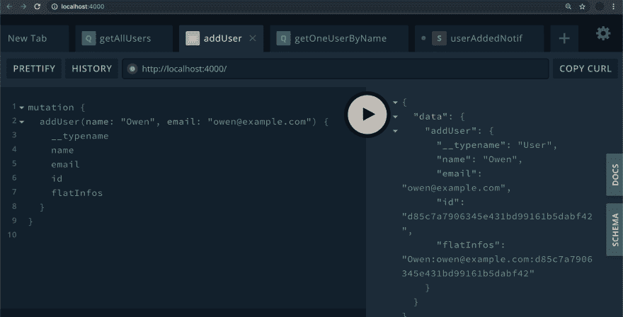
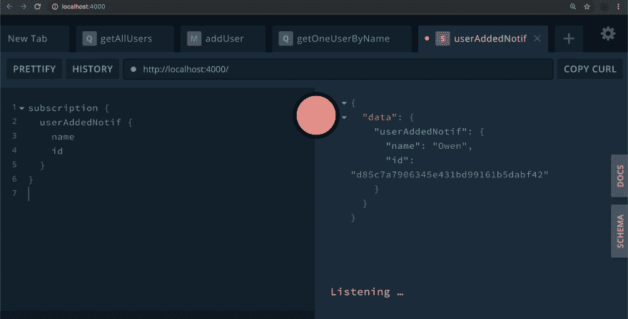

# GraphQL:使用带有 Rakkit 的 TypeScript 和 decorators 创建 API

> 原文：<https://dev.to/daven/graphql-create-your-api-using-typescript-and-decorators-with-rakkit-2koo>

# 什么？

**好吧，这与我之前的[篇关于 T2 的文章有关。所以我建议你去周围看看😊。](https://dev.to/owen/rakkit-create-your-graphql-and-rest-apis-with-typescript-and-decorators-cnj)**

因此，在这里我将向您展示一个更具体的例子，您可以使用 Rakkit 创建一个带有用户管理系统的 GraphQL API。

# 但首先:安装 Rakkit💾

因此，我们必须安装一些依赖项才能继续:

> 在这里，我会使用`apollo-server`，但是如果你使用 Rakkit for REST 和 GraphQL 来链接上下文，也可以安装`apollo-server-koa`。

只需运行这个命令来安装所需的依赖项:

```
npm i rakkit graphql @types/graphql apollo-server reflect-metadata 
```

<svg width="20px" height="20px" viewBox="0 0 24 24" class="highlight-action crayons-icon highlight-action--fullscreen-on"><title>Enter fullscreen mode</title></svg> <svg width="20px" height="20px" viewBox="0 0 24 24" class="highlight-action crayons-icon highlight-action--fullscreen-off"><title>Exit fullscreen mode</title></svg>

> reflect-metadata 允许我们在 TypeScript 中使用 decorators

很好，现在我们只需要配置 TypeScript 来启用装饰器，方法是在项目的根目录下创建一个 *tsconfig.json* 文件，包含这个:

```
{  "compileOptions":  {  "emitDecoratorMetadata":  true,  "experimentalDecorators":  true,  "module":  "commonjs",  "target":  "es2016",  "noImplicitAny":  false,  "sourceMap":  true,  "outDir":  "build",  "declaration":  true,  "importHelpers":  true,  "forceConsistentCasingInFileNames":  true,  "lib":  [  "es2016",  "esnext.asyncitable"  ],  "moduleResolution":  "node"  }  } 
```

<svg width="20px" height="20px" viewBox="0 0 24 24" class="highlight-action crayons-icon highlight-action--fullscreen-on"><title>Enter fullscreen mode</title></svg> <svg width="20px" height="20px" viewBox="0 0 24 24" class="highlight-action crayons-icon highlight-action--fullscreen-off"><title>Exit fullscreen mode</title></svg>

*。/tsconfig.json*

# 类型的定义🚻

好的，那么让我们从创建我们的`User`类开始，我们必须用`@ObjectType()` :
来装饰它

```
import { ObjectType, Field } from "rakkit";
import * as Crypto from "crypto";

@ObjectType()
export class User {
  @Field()
  username: string;

  @Field()
  email: string;

  @Field()
  id: string;

  // Just to show a computed property:
  @Field(type => String)
  get flatInfos(): string {
    return [this.name, this.email, this.id].join(":");
  }

  constructor(username: string, email: string) {
    this.username = username;
    this.email = email;
    this.id = Crypto.randomBytes(16).toString("hex");
  }
} 
```

<svg width="20px" height="20px" viewBox="0 0 24 24" class="highlight-action crayons-icon highlight-action--fullscreen-on"><title>Enter fullscreen mode</title></svg> <svg width="20px" height="20px" viewBox="0 0 24 24" class="highlight-action crayons-icon highlight-action--fullscreen-off"><title>Exit fullscreen mode</title></svg>

*。/types/User.ts*

# 你需要一个小小的“🗂数据库”

因此，为了测试我们的应用程序，我们将不得不与一些用户一起玩，所以我将创建一个用户实例列表，以使其更加清晰:

> 你可以为你的项目
> 使用一个真正的数据库和一个类似[类型的 ORM](//typeorm.io)

```
import { User } from "../types/User";

export const users = [
  new User("JohnDoe", "john@doe.com"),
  new User("JaneDoe", "jane@doe.com"),
  new User("Ben", "ben@doe.com")
]; 
```

<svg width="20px" height="20px" viewBox="0 0 24 24" class="highlight-action crayons-icon highlight-action--fullscreen-on"><title>Enter fullscreen mode</title></svg> <svg width="20px" height="20px" viewBox="0 0 24 24" class="highlight-action crayons-icon highlight-action--fullscreen-off"><title>Exit fullscreen mode</title></svg>

*。/db/users.ts*

# 解析器(查询、变异、订阅)🚀

我们将在下面的类中定义我们的查询/变异/订阅。它将包含一个简单的 CRUD 和一个用户注册时要通知的订阅:

```
import {
  Resolve,
  Query,
  Mutation,
  Subscription,
  IContext,
  Arg
} from "rakkit";
import { User } from "../types/User";
import { users } from "../db/users";

@Resolver()
export class UserResolver {
  @Query(returns => [User])
  getAllUsers() { {
    return users;
  }

  @Query({ nullable: true })
  getOneUserByName(@Arg("name") name: string): User {
    return users.find((user) => user.name ==== name);
  }

  @Mutation()
  addUser(
    // Defining the mutation arguments
    @Arg("name") name: string,
    @Arg("email") email: string,
    context: IContext
  ): User {
    const user = new User(name, email);
    users.push(user);
    // Publish the event for subscriptions with the created user
    context.gql.pubSub.publish("USER_ADDED", user);
    return user;
  }

  @Subscription({ topics: "USER_ADDED" })
  userAddedNotif(createdUser: User): User {
    // Send the created user to the client
    return createdUser;
  }
} 
```

<svg width="20px" height="20px" viewBox="0 0 24 24" class="highlight-action crayons-icon highlight-action--fullscreen-on"><title>Enter fullscreen mode</title></svg> <svg width="20px" height="20px" viewBox="0 0 24 24" class="highlight-action crayons-icon highlight-action--fullscreen-off"><title>Exit fullscreen mode</title></svg>

*。/resolvers/UserResolver.ts*

# 切入点🚪

现在我们需要为我们的应用程序设置一个入口点:

```
// It allows us to use decorators:
import "reflect-metadata";

import { Rakkit } from "rakkit";
import { ApolloServer } from "apollo-server";

async function bootstrap() {
  await Rakkit.start({
    gql: {
      // You give an array of glob string:
      resolvers: [`${__dirname}/resolvers/*Resolver.ts`]
    }
  });
  // Retrieve the GraphQL compiled schema:
  const schema = Rakkit.MetadataStorage.Gql.Schema;

  const server = new ApolloServer({
    schema
  });

  server.listen();
}

bootstrap(); 
```

<svg width="20px" height="20px" viewBox="0 0 24 24" class="highlight-action crayons-icon highlight-action--fullscreen-on"><title>Enter fullscreen mode</title></svg> <svg width="20px" height="20px" viewBox="0 0 24 24" class="highlight-action crayons-icon highlight-action--fullscreen-off"><title>Exit fullscreen mode</title></svg>

*。/bootstrap.ts*

# 搞定了，那就开始测试吧！🎉

要启动它，你必须全局安装`ts-node`来直接运行你的 TypeScript 应用:

```
npm i -g ts-node 
```

<svg width="20px" height="20px" viewBox="0 0 24 24" class="highlight-action crayons-icon highlight-action--fullscreen-on"><title>Enter fullscreen mode</title></svg> <svg width="20px" height="20px" viewBox="0 0 24 24" class="highlight-action crayons-icon highlight-action--fullscreen-off"><title>Exit fullscreen mode</title></svg>

然后运行这个:

```
ts-node relative-path-to/bootstrap.ts 
```

<svg width="20px" height="20px" viewBox="0 0 24 24" class="highlight-action crayons-icon highlight-action--fullscreen-on"><title>Enter fullscreen mode</title></svg> <svg width="20px" height="20px" viewBox="0 0 24 24" class="highlight-action crayons-icon highlight-action--fullscreen-off"><title>Exit fullscreen mode</title></svg>

只需使用您最喜欢的浏览器进入 [http://localhost:4000](http://localhost:4000) 进行一些 GraphQL 查询！🔥

**getAllUsers** -获取所有用户:
[](https://res.cloudinary.com/practicaldev/image/fetch/s--ANeW3g2r--/c_limit%2Cf_auto%2Cfl_progressive%2Cq_auto%2Cw_880/https://thepracticaldev.s3.amazonaws.com/i/0t475yrvb22no391rdet.png)

**getOneUserByName** -根据名称获取特定用户:
[](https://res.cloudinary.com/practicaldev/image/fetch/s--z7UEowQK--/c_limit%2Cf_auto%2Cfl_progressive%2Cq_auto%2Cw_880/https://thepracticaldev.s3.amazonaws.com/i/t9woq8td8n9g5dgv2w5w.png)

**addUser** -添加用户:
[](https://res.cloudinary.com/practicaldev/image/fetch/s--7zOrVkk0--/c_limit%2Cf_auto%2Cfl_progressive%2Cq_auto%2Cw_880/https://thepracticaldev.s3.amazonaws.com/i/ny8bbw3993ynrb7vcenc.png)

**userAddedNotif** -监听用户创建事件:
[](https://res.cloudinary.com/practicaldev/image/fetch/s--iSBYI2PQ--/c_limit%2Cf_auto%2Cfl_progressive%2Cq_auto%2Cw_880/https://thepracticaldev.s3.amazonaws.com/i/8xt2lbt6zxg0a5ouo6eu.png)

# 就这样！[这个例子可以在 GitHub](https://github.com/OwenCalvin/RakkitExamples/tree/graphql) 上找到😊，谢谢！