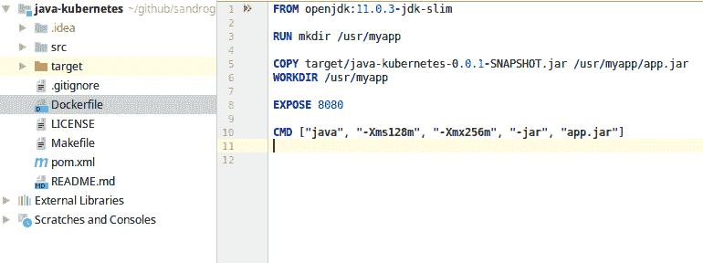
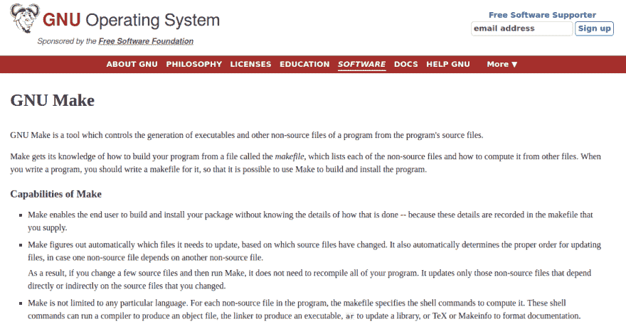
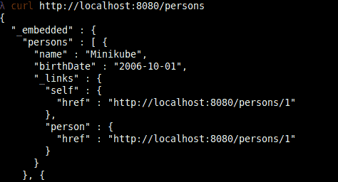

# 面向 Java 开发人员的 Kubernetes 创建 docker 映像

> 原文：<https://dev.to/sandrogiacom/kubernetes-for-java-developers-creating-a-docker-image-1g36>

## 欢迎回来

在本系列的第一篇教程中，我们将学习如何建立一个本地的 kubernetes 环境。
现在，我们有了一个 Java 应用程序，它使用了运行在 docker 上的 mysql 数据库。
要将我们的应用程序打包到 docker 映像中，我们需要创建一个 docker 文件。

## 创建 Dockerfile

Dockerfile 定义:

```
FROM openjdk:11.0.3-jdk-slim
RUN mkdir /usr/myapp
COPY target/java-kubernetes-0.0.1-SNAPSHOT.jar /usr/myapp/app.jar
WORKDIR /usr/myapp
EXPOSE 8080
CMD ["java", "-Xms128m", "-Xmx256m", "-jar", "app.jar"] 
```

[](https://res.cloudinary.com/practicaldev/image/fetch/s--q8dymLwX--/c_limit%2Cf_auto%2Cfl_progressive%2Cq_auto%2Cw_880/https://thepracticaldev.s3.amazonaws.com/i/s2t7fpe3km25lse8t01s.png)

## 使用 Make 自动完成任务

[Make](https://www.gnu.org/software/make/) 是一个工具，它控制从程序的源文件生成程序的可执行文件和其他非源文件。
在这个项目中，我们将使用 make 来自动化 maven 和 docker 命令。
检查你的 make 安装。在终端上键入`make --version`。如果没有发生，请在继续之前安装 make。

[](https://res.cloudinary.com/practicaldev/image/fetch/s--L2VsJHfw--/c_limit%2Cf_auto%2Cfl_progressive%2Cq_auto%2Cw_880/https://thepracticaldev.s3.amazonaws.com/i/cw53xs3nk7py6zyvxyhz.png)

## 创建 Makefile 文件

在同一个 Dockerfile 目录下创建 Makefile。
在 github 上查看完整的 Makefile:[https://github . com/sandrogiacom/Java-kubernetes/blob/master/Makefile](https://github.com/sandrogiacom/java-kubernetes/blob/master/Makefile)

重要部分有:

```
build:
    mvn clean install; \
    docker build --force-rm -t java-k8s .

run-db:
    make stop-db; \
    make rm-db; \
    docker run --name mysql57 -p 3306:3306 -e MYSQL_ROOT_PASSWORD=123456 -e MYSQL_USER=java -e MYSQL_PASSWORD=1234 -e MYSQL_DATABASE=k8s_java -d mysql/mysql-server:5.7

run-app:
    make stop-app; \
    make rm-app; \
    docker run --name myapp -p 8080:8080 -d -e DATABASE_SERVER_NAME=mysql57 --link mysql57:mysql57 java-k8s:latest 
```

**build:** 运行 maven，创建一个 docker 镜像，名字为“Java-k8s”
**Run-db:**启动一个新的 mysql 数据库容器
**run-app:** 启动一个新的应用容器

按此顺序，键入:

```
make build
make run-db
make run-app 
```

**Obs:** 在`run:db`和`run:app`之间等待 30 秒，以便有时间启动数据库。

要查看应用程序的日志，请键入:

```
docker logs -f myapp 
```

和`CTRL+C`退出日志模式。

键入`docker ps`查看容器运行

**查看**
[http://localhost:8080/persons](http://localhost:8080/persons)

[](https://res.cloudinary.com/practicaldev/image/fetch/s--oQBNKR4i--/c_limit%2Cf_auto%2Cfl_progressive%2Cq_auto%2Cw_880/https://thepracticaldev.s3.amazonaws.com/i/2he81bpf770359qmwfmf.png)

要停止应用程序和数据库，请键入:

```
make stop-app
make stop-db 
```

请在以下位置克隆完整的演示应用程序:

[https://github . com/sandrogiacom/Java-kubrites](https://github.com/sandrogiacom/java-kubernetes)

玩得开心！

下一部分见。将您的应用部署到 kubernetes 集群中。

[](https://twitter.com/sandrogiacom)