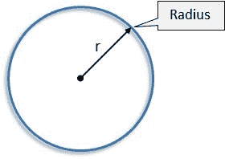

# CSS Quickies:边框半径

> 原文：<https://dev.to/lampewebdev/css-quickies-border-radius-2p6l>

### 什么是 CSS Quickes？

我开始在 Instagram 上问我心爱的社区:“有哪些 CSS 属性让你感到困惑？”

在“CSS Quickies”中，我将深入解释一个 CSS 属性。这些是社区请求的属性。如果你也对 CSS 属性感到困惑，那么给我写信，在 Instagram 或者 T2 的 Twitter 或者下面的评论里。我回答所有问题。

我还一边在 [twitch.tv](https://www.twitch.tv/lampewebdev/) 上编码一边直播。如果你想直接找我谈！

### 基础知识

让我们来谈谈边界半径。

简单的回答是:你可以给 HTML 元素加圆角，只有当背景颜色与 HTML 元素不同或者 HTML 元素有边框颜色时，你才能看到这一点。

最基本的语法是:

```
.radius {
  border-radius: 10px;
} 
```

[https://codepen.io/lampewebdev/embed/ydvpNN?height=600&default-tab=result&embed-version=2](https://codepen.io/lampewebdev/embed/ydvpNN?height=600&default-tab=result&embed-version=2)

是时候理解半径的含义了。所以你必须想象一个圆。每个圆都有半径。半径是从圆心到任意边界点的长度。
[](https://res.cloudinary.com/practicaldev/image/fetch/s--Fx0Izgvk--/c_limit%2Cf_auto%2Cfl_progressive%2Cq_auto%2Cw_880/https://www.mathematics-monster.com/images5/radius.jpg)

现在你知道半径是什么了。假设您沿着 HTML 元素的圆的边缘切掉了一个角！就是这样！只是一个有人用剪刀剪开的圆圈。

### 越陷越深

你可以用不同的方式来使用它。

```
.border{
    /* top-left-and-bottom-right | top-right-and-bottom-left */
    border-radius: 10px 10px;

    /* top-left | top-right-and-bottom-left | bottom-right */
    border-radius: 10px 10px 10px;

    /* top-left | top-right | bottom-right | bottom-left */
    border-radius: 10px 10px 10px 10px;
} 
```

你可以看到，我们可以设置每一个角落，赋予良好的灵活性，以创建精美的网站。

### 支持的值

您可以使用 px、em 和%值。

[https://codepen.io/lampewebdev/embed/dBddro?height=600&default-tab=result&embed-version=2](https://codepen.io/lampewebdev/embed/dBddro?height=600&default-tab=result&embed-version=2)

### 第二半径

还有一个`border-radius`的高级用法，可以定义第二个半径。想象一下，现在每个角都有两个圆！你可以让他们独立。

```
.radius{
    border-radius: 50px 50px 50px 50px / 50px 50px 50px 50px;
    /* you can read this like this: */
    border-radius: 
       top-left-up top-right-up bottom-right-down bottom left-down /
       top-left-left top-right-right bottom-right-right bottom-left-left
} 
```

下面是一些例子:
[https://codepen.io/lampewebdev/embed/JQpLLK?height=600&default-tab=result&embed-version=2](https://codepen.io/lampewebdev/embed/JQpLLK?height=600&default-tab=result&embed-version=2)

### 创建圆形元素

边界半径也用于创建圆形元素。

就是这样！关于`border-radius`没有更多要学习的了。
这是直白的；你必须有一个元素具有相同的`width`和`height`，并将`border-radius`设置为 50%。

[https://codepen.io/lampewebdev/embed/bPLvJO?height=600&default-tab=result&embed-version=2](https://codepen.io/lampewebdev/embed/bPLvJO?height=600&default-tab=result&embed-version=2)

### 压轴思绪

这是我正在尝试的一种新形式。你觉得它怎么样？
你错过了什么？
请在下面评论下来！

### 资源

*   [边界半径生成器](https://9elements.github.io/fancy-border-radius/)

*   [CSS Border-Radius 能做到吗？](https://www.webdesignerdepot.com/2018/10/css-border-radius-can-do-that/)

*   [MDN](https://developer.mozilla.org/en-US/docs/Web/CSS/border-radius)

**感谢阅读！**

说你好！[insta gram](https://www.instagram.com/lampewebdev/)|[Twitter](https://twitter.com/lampewebdev)|[LinkedIn](https://www.linkedin.com/in/michael-lazarski-25725a87)|[Medium](https://medium.com/@lampewebdevelopment)