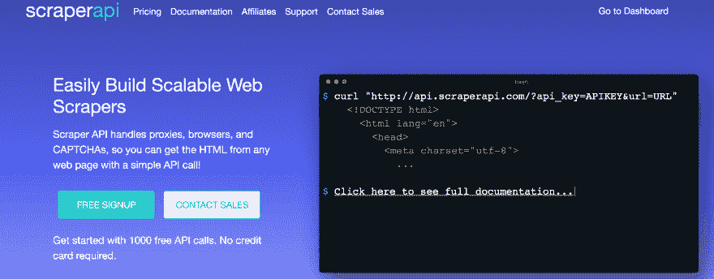
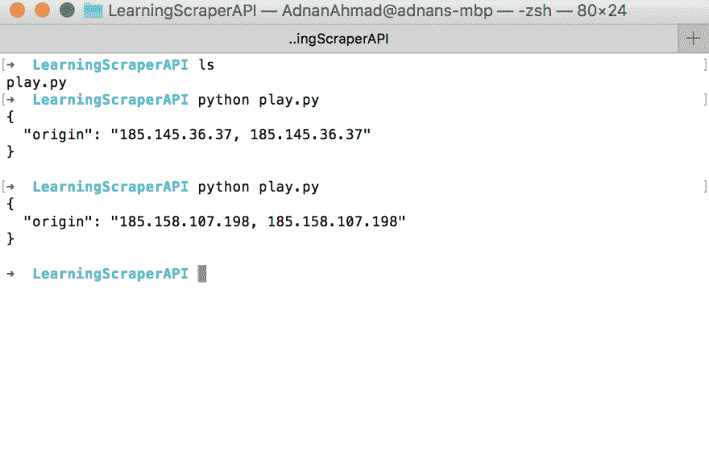
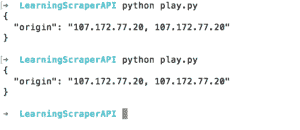

# 使用 Scraper API 和 Python 创建您的第一个 web scraper

> 原文：<https://dev.to/kadnan/create-your-first-web-scraper-with-scraper-api-and-python-5dlk>

最近，我遇到了一个工具，它可以解决你在浏览网站时通常会遇到的许多问题。这个工具叫做 [Scraper API](https://www.scraperapi.com/?fp_ref=adnan22) ，它提供了一个易于使用的 REST API 来轻松抓取不同类型的网站(Simple、JS enabled、Captcha 等)。在我继续之前，请允许我介绍一下*刮刀 API* 。

## 什么是刮刀 API

如果你访问他们的网站，你会发现他们的使命宣言:

> Scraper API 处理代理、浏览器和验证码，因此您可以通过简单的 API 调用从任何网页获取 HTML！

[](https://res.cloudinary.com/practicaldev/image/fetch/s--wmmydisY--/c_limit%2Cf_auto%2Cfl_progressive%2Cq_auto%2Cw_880/http://blog.adnansiddiqi.me/wp-content/uploads/2019/06/Screen-Shot-2019-06-27-at-12.25.17-PM.png)

正如它所暗示的，它为你提供了所有的东西来处理你在写文章时经常遇到的问题。

## 发展

Scraper API 提供了一个可以在任何语言中使用的 REST API。因为这篇文章与 Python 有关，所以我将主要关注使用这个工具的`requests`库。

你必须首先向他们注册，作为回报，他们会给你一个 API 密匙来使用他们的平台。他们提供了 1000 个免费的 API 调用，足以测试他们的平台。此外，他们提供不同的计划，从开始到企业，你可以在这里查看。

让我们尝试一个简单的例子，它也在[文档](https://www.scraperapi.com/documentation)中给出。

```
import requests if \_\_name\_\_ == '\_\_main\_\_': API\_KEY = '\<YOUR API KEY\>' URL\_TO\_SCRAPE = 'https://httpbin.org/ip' payload = {'api\_key': API\_KEY, 'url': URL\_TO\_SCRAPE} r = requests.get('http://api.scraperapi.com', params=payload, timeout=60) print(r.text) 
```

<svg width="20px" height="20px" viewBox="0 0 24 24" class="highlight-action crayons-icon highlight-action--fullscreen-on"><title>Enter fullscreen mode</title></svg> <svg width="20px" height="20px" viewBox="0 0 24 24" class="highlight-action crayons-icon highlight-action--fullscreen-off"><title>Exit fullscreen mode</title></svg>

假设您已经注册并获得了一个 API，您可以在[仪表板](https://www.scraperapi.com/dashboard)上找到它，您可以在获得它后立即开始工作。当你运行这个程序时，它会显示你请求的 IP 地址。

[](https://res.cloudinary.com/practicaldev/image/fetch/s--6bntWL6N--/c_limit%2Cf_auto%2Cfl_progressive%2Cq_auto%2Cw_880/http://blog.adnansiddiqi.me/wp-content/uploads/2019/06/Screen-Shot-2019-06-27-at-12.56.43-PM.png)

你看到了吗，每次它都返回一个新的 IP 地址，很酷吧？

在某些情况下，您希望使用同一个代理给人一种感觉，好像单个用户正在访问网站的不同部分。为此，您可以在上面的`payload`变量中传递`session_number`参数。

```
URL\_TO\_SCRAPE = 'https://httpbin.org/ip' payload = {'api\_key': API\_KEY, 'url': URL\_TO\_SCRAPE,'session\_number': '123'} r = requests.get('http://api.scraperapi.com', params=payload, timeout=60) print(r.text) 
```

<svg width="20px" height="20px" viewBox="0 0 24 24" class="highlight-action crayons-icon highlight-action--fullscreen-on"><title>Enter fullscreen mode</title></svg> <svg width="20px" height="20px" viewBox="0 0 24 24" class="highlight-action crayons-icon highlight-action--fullscreen-off"><title>Exit fullscreen mode</title></svg>

它会产生以下结果:

[](http://blog.adnansiddiqi.me/wp-content/uploads/2019/06/Screen-Shot-2019-06-28-at-7.33.58-PM.png)

你能注意到这里有相同的代理 IP 吗？

## 创造 OLX 的废品

就像之前的[刮相关帖子](http://blog.adnansiddiqi.me/tag/scraping/)一样，我将再次选择 OLX 来发表这篇帖子。我将首先迭代列表，然后将刮个别项目。下面是完整的代码。

```
payload = {'api\_key': API\_KEY, 'url': URL\_TO\_SCRAPE, 'session\_number': '123'} r = requests.get('http://api.scraperapi.com', params=payload, timeout=60) if r.status\_code == 200: html = r.text.strip() soup = BeautifulSoup(html, 'lxml') links = soup.select('.EIR5N \> a') for l in links: all\_links.append('https://www.olx.com.pk' + l['href']) idx = 0 if len(all\_links) \> 0: for link in all\_links: sleep(5) payload = {'api\_key': API\_KEY, 'url': link, 'session\_number': '123'} if idx \> 1: break r = requests.get('http://api.scraperapi.com', params=payload, timeout=60) if r.status\_code == 200: html = r.text.strip() soup = BeautifulSoup(html, 'lxml') price\_section = soup.find('span', {'data-aut-id': 'itemPrice'}) print(price\_section.text) idx += 1 
```

<svg width="20px" height="20px" viewBox="0 0 24 24" class="highlight-action crayons-icon highlight-action--fullscreen-on"><title>Enter fullscreen mode</title></svg> <svg width="20px" height="20px" viewBox="0 0 24 24" class="highlight-action crayons-icon highlight-action--fullscreen-off"><title>Exit fullscreen mode</title></svg>

我使用`Beautifulsoup`来解析 HTML。我在这里只提取了价格，因为目的是讲述 API 本身，而不是 *Beautifulsoup* 。如果你是抓取和 Python 的新手，你应该在这里看我的帖子[。](https://dev.to/kadnan/write-your-first-web-scraper-in-python-with-beautifulsoup-p2b)

## 结论

在这篇文章中，你学习了如何使用 Scraper API 进行抓取。无论你用这个 API 做什么，你也可以用其他方法来做；这个 API 为您提供了一切，特别是通过 Javascript 呈现页面，您需要无头浏览器，有时在远程机器上设置无头抓取会变得很麻烦。Scraper API 正在照顾它，并对个人和企业收取象征性的费用。我工作的公司每月花费 100 美元用于代理 IP。

哦，如果你用我的推荐链接在这里注册[或者输入促销代码 **SCRAPE156980** ，你将得到 **10%的折扣**。如果你没有得到折扣，那么就在我的网站上通过电子邮件让我知道，我一定会帮助你。](https://www.scraperapi.com/pricing?fp_ref=adnan98)

在接下来的日子里，我会写更多关于 Scraper API 的帖子，讨论更多的特性。