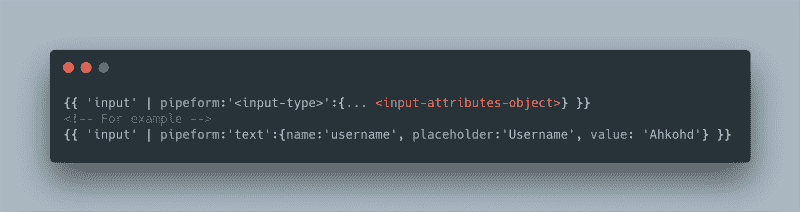
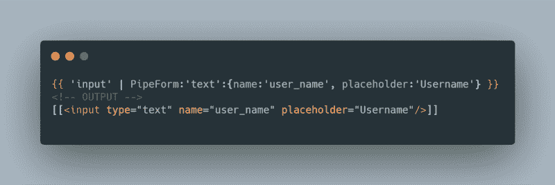
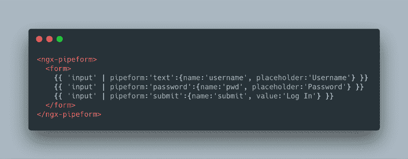

# 利用角形管创造形体的思考

> 原文：<https://dev.to/ahkohd/thoughts-on-creating-forms-using-angular-pipes-3a7h>

在我最后一个角度项目中。我不禁注意到，当大量 HTML 输入标签跨越我正在处理的组件模板代码时，我感到多么不安。“应该有一个更简洁的方法来抽象这些输入标签”，我喃喃地说。

之后，我决定起草一些我认为抽象应该是什么样子的语法。啊哈！这项工作的最佳工具是什么？**管道**，神圣的烟雾是的！管道。

角形管道提供了一个非常圆滑的抽象，一个适合抽象探索的工具。所以我想到了下面的管道语法。

> 快速声明:我只是想尝试一下。

[](https://res.cloudinary.com/practicaldev/image/fetch/s--n7eG1YN7--/c_limit%2Cf_auto%2Cfl_progressive%2Cq_auto%2Cw_880/https://cdn-images-1.medium.com/max/800/1%2AX4_9NZTOIYM6tQbnQ1wlSQ.png)

现在我们有了一个有效的管道语法，它包含了创建输入标记所需的足够的参数。是时候编写一个管道，将我们的语法转换成一个**伪** HTML 标签了。管道将返回一个结果，该结果包含一个用双方括号括起来的输入标记语法。

[](https://res.cloudinary.com/practicaldev/image/fetch/s--JI5TOjme--/c_limit%2Cf_auto%2Cfl_progressive%2Cq_auto%2Cw_880/https://cdn-images-1.medium.com/max/800/1%2Ap6nGiqzmSt807GVrNLl8OQ.png)

下面是代码管道代码的样子。

 **```
import {
  Pipe,
  PipeTransform
} from '@angular/core';

@Pipe({
  name: 'PipeForm'
})
export class FormPipe implements PipeTransform {
  // transforms the pipe input and returns a string following this format `[[<input/>]]`
  transform(elem: string, type: string, options ? : object): string {
    // declare output container..
    let out: string;
    // switch between the type if element we want to create
    switch (elem) {
      case 'input':
        // case input tag, 
        out = `[[<input type="${type}"`;
        // loop through the options parameter and format it into the out variable like HTML attributes.
        Object.entries(options).forEach((value: string[]) => {
          out += ` ${value[0]}="${value[1]}"`;
        });
        break;
    }
    // append the final, ending string.
    out += '/>]]';
    // we done here ;-)
    return out;
  }

} 
```

<svg width="20px" height="20px" viewBox="0 0 24 24" class="highlight-action crayons-icon highlight-action--fullscreen-on"><title>Enter fullscreen mode</title></svg> <svg width="20px" height="20px" viewBox="0 0 24 24" class="highlight-action crayons-icon highlight-action--fullscreen-off"><title>Exit fullscreen mode</title></svg>

是啊！这可以工作，但只是返回一个伪字符串，对吗？最后，我意识到我需要某种**容器**，我可以用它来解析管道返回的结果，创建实际的输入元素，然后使用**呈现器 2** 将它们注入到 **DOM** 中。所以我需要更新我最初的语法。要使用管道表单，您必须将其包装在 **ngx-pipeform** 组件中，该组件将充当管道表单的呈现器。所以更新后的语法看起来像这样👇

[](https://res.cloudinary.com/practicaldev/image/fetch/s--46gcGZG1--/c_limit%2Cf_auto%2Cfl_progressive%2Cq_auto%2Cw_880/https://cdn-images-1.medium.com/max/800/1%2AbRF1VnCBbWrprVc4CuIctw.png)

现在让我们创建一个组件，作为管道表单的包装器。这里有一个关于它如何工作的简介。

1.  它获取由 **pipeform pipe** 返回的结果，然后解析它。
2.  创建输入标签元素，然后将它们注入到 **DOM** 中。

下面是代码的样子。**pipe form . component . ts**

```
import {
  Component,
  ViewContainerRef,
  AfterViewInit,
  Renderer2
} from '@angular/core';

@Component({
  selector: 'ngx-pipeform',
  template: `<ng-content></ng-content>`,
})
export class PipeformComponent implements AfterViewInit {

  constructor(private viewRef: ViewContainerRef, private rd: Renderer2) {}

  ngAfterViewInit(): void {
    // after view init, lets get things done..
    // filter node type of text..
    // if text matches pipeform syntax, replace it with the input tag
    // the create the element and inject it into the dom with Renderer2.
    // lets travel through the DOM..
    this.recurseDomChildren(this.viewRef.element.nativeElement);
  }

  recurseDomChildren(start) {
    let nodes;
    if (start.childNodes) {
      nodes = start.childNodes;
      this.loopNodeChildren(nodes);
    }
  }

  loopNodeChildren(nodes) {
    let node;
    for (let i = 0; i < nodes.length; i++) {
      node = nodes[i];
      // try to parse each node..
      this.pipeFormParse(node);
      if (node.childNodes) {
        this.recurseDomChildren(node);
      }
    }
  }

  pipeFormParse(node) {
    // if the content of this node is a text node
    if (node.nodeType === 3) {
      // get its text content
      const textContent = node.textContent;
      // match the occurence of the pipe-form syntax, if found return an array of the result.
      const pipeForms = textContent.match(/\[\[(.*?)]]/gi);
      if (pipeForms) {
        // strip the double square brackets from all of the results.
        const readyElements = pipeForms.map(item => item.split('[[')[1].split(']]')[0]);
        // create a div container with Renderer2
        let elem = this.rd.createElement('div');
        // insert the prepaired input tag into the div.
        elem.innerHTML = readyElements.join('  ');
        // replace this current node with the new div node we just created.
        node.parentElement.replaceChild(elem, node);
      }
    }
  }
} 
```

<svg width="20px" height="20px" viewBox="0 0 24 24" class="highlight-action crayons-icon highlight-action--fullscreen-on"><title>Enter fullscreen mode</title></svg> <svg width="20px" height="20px" viewBox="0 0 24 24" class="highlight-action crayons-icon highlight-action--fullscreen-off"><title>Exit fullscreen mode</title></svg>

干杯！它工作了😂🍻，但仍有许多改进、问题和评论需要我们仔细检查。我将让你来决定。

### stack blitz 上托管的例子

[https://stackblitz.com/edit/angular-pipe-form?](https://stackblitz.com/edit/angular-pipe-form?)
stack blitz 上的现场演示-[https://angular-pipe-form.stackblitz.io/](https://angular-pipe-form.stackblitz.io/)随意查看源代码[https://stackblitz.com/edit/angular-pipe-form](https://stackblitz.com/edit/angular-pipe-form)

### 我的问题

1.  这是可行的，但是值得努力吗？
2.  它的成本是多少，我指的是生产环境中的性能？
3.  语法看起来更好还是更干净？

### 改进

1.  设计管道模板。
2.  让它与角模型一起工作，我还没有尝试过。
3.  请进行表单验证！
4.  也许是对 DOM 遍历逻辑的一个很好的优化。

### 最终裁决

非常好😉我在这里的目的只是想看看我们是否可以使用管道来创建表单。是的，我们可以！但是这是一个好的方法吗？这不是脱离了管道的意义吗？朋友，我不知道，只是在尝试新的做事方法。在下面的评论中用文字表达你的想法。

下次见！再见。💜**