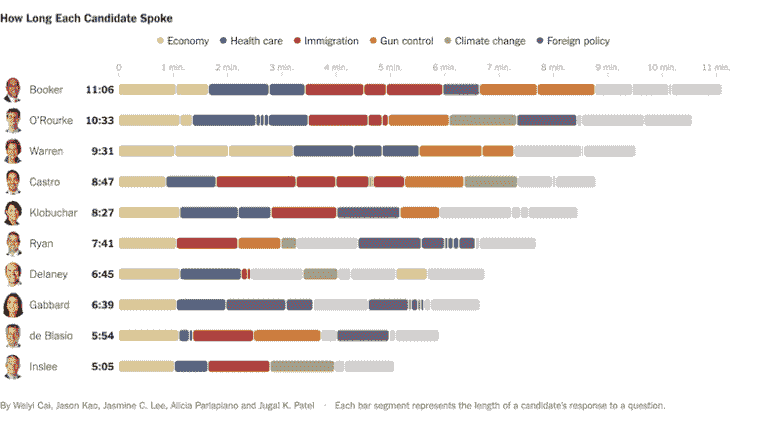
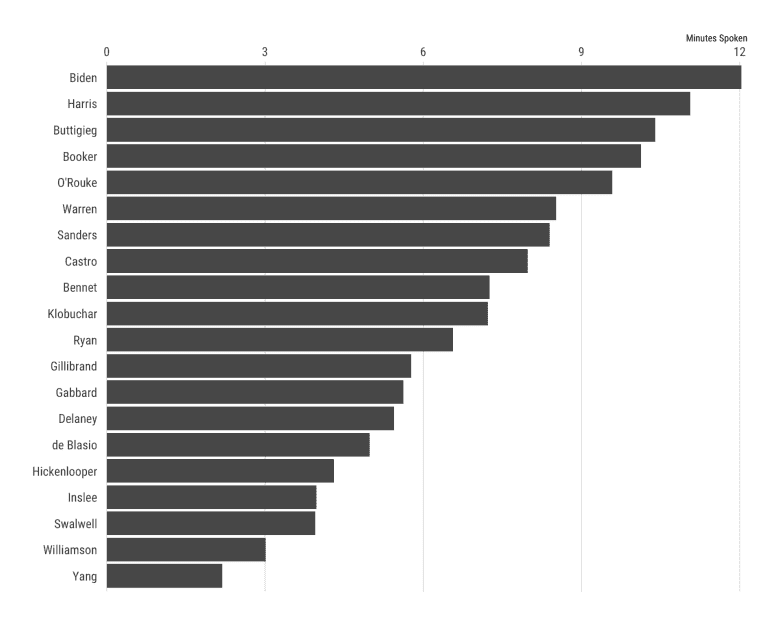
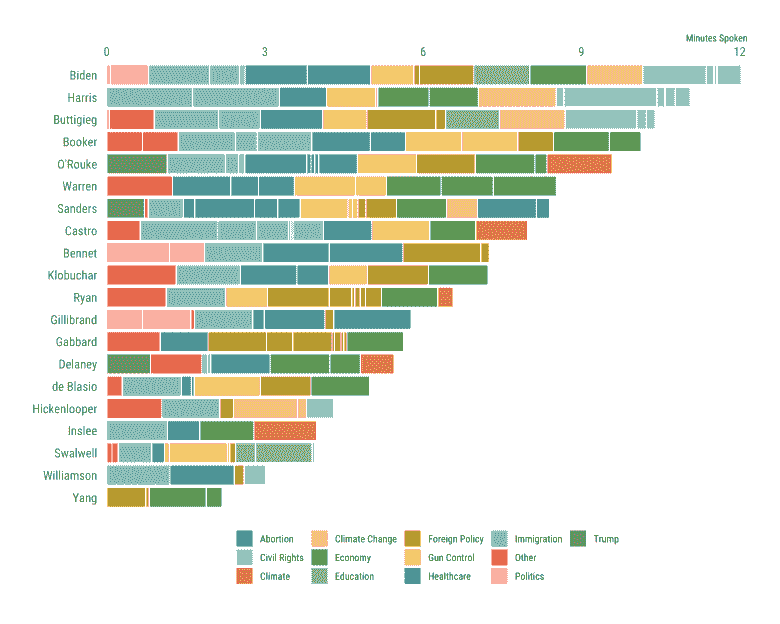
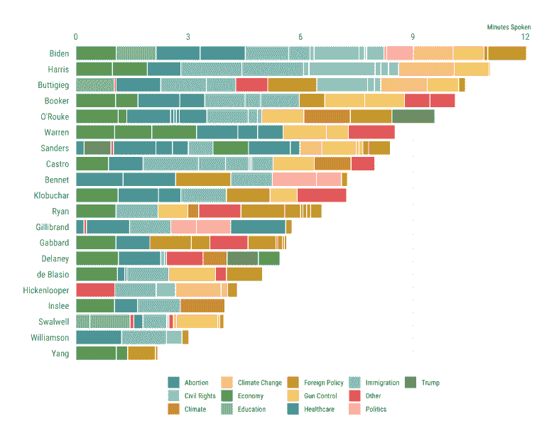
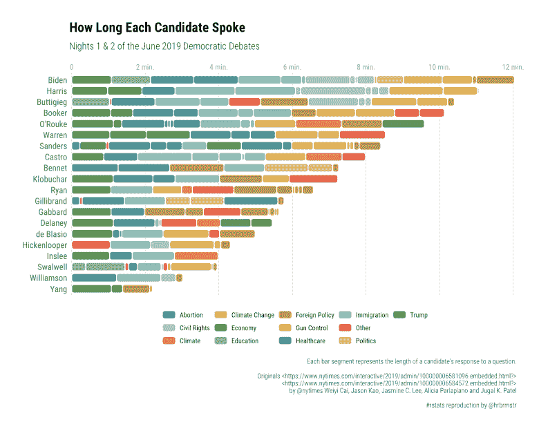
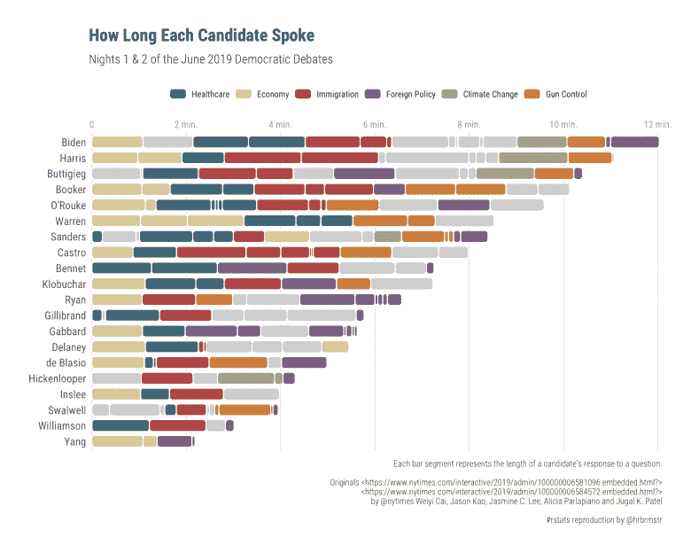

# 用{ggchicklet}制作刷新的分段柱形图

> 原文：<https://dev.to/hrbrmstr/make-refreshing-segmented-column-charts-with-ggchicklet-55h7>

由于大量候选人竞选总统，2020 年选举季的第一场美国民主党辩论在过去一周的两个晚上举行。漂亮的人们记录了每个演讲者/话题所花的时间，并制作了按演讲时间排序的圆角矩形分段条形图(这些不是真正的辩论，它们是为表演而松散准备的)，我称之为“chicklet”图表，因为它与半流行的口香糖/糖果有着模糊的相似之处。

你可以在这里看到每天的实时 javascript 创建的纽约时报图表:

*   [https://www . nytimes . com/interactive/2019/admin/100000006581096 . embedded . html](https://www.nytimes.com/interactive/2019/admin/100000006581096.embedded.html)
*   [https://www . nytimes . com/interactive/2019/admin/100000006584572 . embedded . html](https://www.nytimes.com/interactive/2019/admin/100000006584572.embedded.html)

这是其中一个的 PNG 快照:

[](https://i2.wp.com/rud.is/b/wp-content/uploads/2019/06/nytimes.png?ssl=1)

我非常喜欢 chicklet 的美学，所以制作了一个新的{ggplot2} `geom_chicklet()`来帮助人们制作它们。为了节省一些博客空间，你可以在 https://cinc.rud.is/web/packages/ggchicklet/阅读如何安装包。

### 制作鹰嘴图

自从 [@NYTimes](http://twitter.com/NYTimes) 选择使用 javascript 制作他们的图表以来，他们也提供了一些数据(查看前面提到的两个 URL 的来源),我对此争论了一下，并将其放入了{ggchicklet}包中。我们将使用它从制作基本的棒线到制作 chicklets，并比较两天内的所有候选者。

虽然 [@Nytimes](http://twitter.com/Nytimes) 的图表提供了大量的信息，但大多数媒体关注的是每位候选人能获得多少闲聊时间。我们不需要比条形图或表格更花哨的东西来做到这一点:

```
library(hrbrthemes)
library(ggchicklet)
library(tidyverse)

data("debates2019")

count(debates2019, speaker, wt=elapsed, sort=TRUE) %>%
  mutate(speaker = fct_reorder(speaker, n, sum, .desc=FALSE)) %>%
  mutate(speaker = fct_inorder(speaker) %>% fct_rev()) %>%
  ggplot(aes(speaker,n)) +
  geom_col() +
  scale_y_comma(position = "right") +
  coord_flip() +
  labs(x = NULL, y = "Minutes Spoken") +
  theme_ipsum_rc(grid="X") 
```

<svg width="20px" height="20px" viewBox="0 0 24 24" class="highlight-action crayons-icon highlight-action--fullscreen-on"><title>Enter fullscreen mode</title></svg> <svg width="20px" height="20px" viewBox="0 0 24 24" class="highlight-action crayons-icon highlight-action--fullscreen-off"><title>Exit fullscreen mode</title></svg>

[](https://i0.wp.com/rud.is/b/wp-content/uploads/2019/06/chicklet-01-1.png?ssl=1)

如果我们想看到相同的基本视图，但包括每个发言人在每个主题上花了多少时间，我们也可以很容易地做到

```
count(debates2019, speaker, topic, wt=elapsed, sort=TRUE) %>%
  mutate(speaker = fct_reorder(speaker, n, sum, .desc=FALSE)) %>%
  ggplot(aes(speaker, n , fill = topic)) +
  geom_col() +
  scale_y_comma(position = "right") +
  ggthemes::scale_fill_tableau("Tableau 20", name = NULL) +
  coord_flip() +
  labs(x = NULL, y = "Minutes Spoken") +
  theme_ipsum_rc(grid="X") +
  theme(legend.position = "bottom") 
```

<svg width="20px" height="20px" viewBox="0 0 24 24" class="highlight-action crayons-icon highlight-action--fullscreen-on"><title>Enter fullscreen mode</title></svg> <svg width="20px" height="20px" viewBox="0 0 24 24" class="highlight-action crayons-icon highlight-action--fullscreen-off"><title>Exit fullscreen mode</title></svg>

[](https://i2.wp.com/rud.is/b/wp-content/uploads/2019/06/chicklet-02-1.png?ssl=1)

默认情况下,`geom_col()`将使用`fill`美学来对条进行分组，并使用默认的排序顺序将它们堆叠在一起。

我们也可以通过不做`count()`来得到一个分解视图，只是让这些片段组合在一起，并使用一个白色的线条轮廓来保持它们的不同:

```
debates2019 %>%
  mutate(speaker = fct_reorder(speaker, elapsed, sum, .desc=FALSE)) %>%
  ggplot(aes(speaker, elapsed, fill = topic)) +
  geom_col(color = "white") +
  scale_y_comma(position = "right") +
  ggthemes::scale_fill_tableau("Tableau 20", name = NULL) +
  coord_flip() +
  labs(x = NULL, y = "Minutes Spoken") +
  theme_ipsum_rc(grid="X") +
  theme(legend.position = "bottom") 
```

<svg width="20px" height="20px" viewBox="0 0 24 24" class="highlight-action crayons-icon highlight-action--fullscreen-on"><title>Enter fullscreen mode</title></svg> <svg width="20px" height="20px" viewBox="0 0 24 24" class="highlight-action crayons-icon highlight-action--fullscreen-off"><title>Exit fullscreen mode</title></svg>

[](https://i1.wp.com/rud.is/b/wp-content/uploads/2019/06/chicklet-03-1.png?ssl=1)

虽然我喜欢圆角矩形的美感，但我也很喜欢 [@nytimes](http://twitter.com/nytimes) 在辩论中根据话题出现的时间对片段进行排序的方式。对于其他类型的 chicklet 图表，您不需要将变量分组为一个时间-y whime-y 列，只需尝试使用具有合理排序特征的东西:

```
debates2019 %>%
  mutate(speaker = fct_reorder(speaker, elapsed, sum, .desc=FALSE)) %>%
  ggplot(aes(speaker, elapsed, group = timestamp, fill = topic)) +
  geom_col(color = "white", position = position_stack(reverse = TRUE)) +
  scale_y_comma(position = "right") +
  ggthemes::scale_fill_tableau("Tableau 20", name = NULL) +
  coord_flip() +
  labs(x = NULL, y = "Minutes Spoken") +
  theme_ipsum_rc(grid="X") +
  theme(legend.position = "bottom") 
```

<svg width="20px" height="20px" viewBox="0 0 24 24" class="highlight-action crayons-icon highlight-action--fullscreen-on"><title>Enter fullscreen mode</title></svg> <svg width="20px" height="20px" viewBox="0 0 24 24" class="highlight-action crayons-icon highlight-action--fullscreen-off"><title>Exit fullscreen mode</title></svg>

[](https://i2.wp.com/rud.is/b/wp-content/uploads/2019/06/chicklet-04-1.png?ssl=1)

最后一张图表是在不经过一些严肃的 gg-hoops 的情况下，你能复制的最大限度的外观和感觉。

我制作了一个圆角矩形隐藏几何体来为 [`{statebins} package`](https://git.rud.is/hrbrmstr/statebins) 制作圆角刻录机拼贴，所以制作一个版本的`ggplot2::geom_col()`(我也将它添加到了{ggplot2})非常简单。`geom_chicklet()`的默认设置有一些关键区别:

*   一个“`white`”笔划用于 chicklet/segment ( `geom_col()`有`NA`用于笔划)
*   自动反转`group`顺序(`geom_col()`使用标准排序顺序)
*   `unit(3, "px")`的半径设置(根据需要更改)
*   chicklet legend geom (b/c 它们不是条或点)

你可能只是想看看它的运行，所以这里就不再赘述了:

```
debates2019 %>%
  mutate(speaker = fct_reorder(speaker, elapsed, sum, .desc=FALSE)) %>%
  ggplot(aes(speaker, elapsed, group = timestamp, fill = topic)) +
  geom_chicklet(width = 0.75) +
  scale_y_continuous(
    expand = c(0, 0.0625),
    position = "right",
    breaks = seq(0, 14, 2),
    labels = c(0, sprintf("%d min.", seq(2, 14, 2)))
  ) +
  ggthemes::scale_fill_tableau("Tableau 20", name = NULL) +
  coord_flip() +
  labs(
    x = NULL, y = NULL, fill = NULL,
    title = "How Long Each Candidate Spoke",
    subtitle = "Nights 1 & 2 of the June 2019 Democratic Debates",
    caption = "Each bar segment represents the length of a candidate’s response to a question.\n\nOriginals <https://www.nytimes.com/interactive/2019/admin/100000006581096.embedded.html?>\n<https://www.nytimes.com/interactive/2019/admin/100000006584572.embedded.html?>\nby @nytimes Weiyi Cai, Jason Kao, Jasmine C. Lee, Alicia Parlapiano and Jugal K. Patel\n\n#rstats reproduction by @hrbrmstr"
  ) +
  theme_ipsum_rc(grid="X") +
  theme(axis.text.x = element_text(color = "gray60", size = 10)) +
  theme(legend.position = "bottom") 
```

<svg width="20px" height="20px" viewBox="0 0 24 24" class="highlight-action crayons-icon highlight-action--fullscreen-on"><title>Enter fullscreen mode</title></svg> <svg width="20px" height="20px" viewBox="0 0 24 24" class="highlight-action crayons-icon highlight-action--fullscreen-off"><title>Exit fullscreen mode</title></svg>

[](https://i2.wp.com/rud.is/b/wp-content/uploads/2019/06/chicklet-06-1.png?ssl=1)

是的，我将 ggplot2 调整了一点，以更接近 [@nytimes](http://twitter.com/nytimes) (FWIW 我喜欢 Y 网格线，YMMV)，但没有做太多其他事情来用`geom_chicket()`替换`geom_col()`。你需要根据你自己的大小，使用不同的图段`width`值来获得最佳效果(就像你使用其他几何图形一样)。

精明无畏的读者会注意到上面的图表包含了所有的主题，而[@纽约时报](http://twitter.com/nytimes)只有几个。我们可以使用`forcats::fct_other()`将非显著的主题分组到“其他”类别中，并从 [@nytimes](http://twitter.com/nytimes) :
中使用的从窃取的值~~中手动填充比例~~

```
debates2019 %>%
  mutate(speaker = fct_reorder(speaker, elapsed, sum, .desc=FALSE)) %>%
  mutate(topic = fct_other(
    topic,
    c("Immigration", "Economy", "Climate Change", "Gun Control", "Healthcare", "Foreign Policy"))
  ) %>%
  ggplot(aes(speaker, elapsed, group = timestamp, fill = topic)) +
  geom_chicklet(width = 0.75) +
  scale_y_continuous(
    expand = c(0, 0.0625),
    position = "right",
    breaks = seq(0, 14, 2),
    labels = c(0, sprintf("%d min.", seq(2, 14, 2)))
  ) +
  scale_fill_manual(
    name = NULL,
    values = c(
      "Immigration" = "#ae4544",
      "Economy" = "#d8cb98",
      "Climate Change" = "#a4ad6f",
      "Gun Control" = "#cc7c3a",
      "Healthcare" = "#436f82",
      "Foreign Policy" = "#7c5981",
      "Other" = "#cccccc"
    ),
    breaks = setdiff(unique(debates2019$topic), "Other")
  ) +
  guides(
    fill = guide_legend(nrow = 1)
  ) +
  coord_flip() +
  labs(
    x = NULL, y = NULL, fill = NULL,
    title = "How Long Each Candidate Spoke",
    subtitle = "Nights 1 & 2 of the June 2019 Democratic Debates",
    caption = "Each bar segment represents the length of a candidate’s response to a question.\n\nOriginals <https://www.nytimes.com/interactive/2019/admin/100000006581096.embedded.html?>\n<https://www.nytimes.com/interactive/2019/admin/100000006584572.embedded.html?>\nby @nytimes Weiyi Cai, Jason Kao, Jasmine C. Lee, Alicia Parlapiano and Jugal K. Patel\n\n#rstats reproduction by @hrbrmstr"
  ) +
  theme_ipsum_rc(grid="X") +
  theme(axis.text.x = element_text(color = "gray60", size = 10)) +
  theme(legend.position = "top") 
```

<svg width="20px" height="20px" viewBox="0 0 24 24" class="highlight-action crayons-icon highlight-action--fullscreen-on"><title>Enter fullscreen mode</title></svg> <svg width="20px" height="20px" viewBox="0 0 24 24" class="highlight-action crayons-icon highlight-action--fullscreen-off"><title>Exit fullscreen mode</title></svg>

[](https://i1.wp.com/rud.is/b/wp-content/uploads/2019/06/chicklet-07-1.png?ssl=1)

### 鳍

请记住，您可以在[https://cinc.rud.is/web/packages/ggchicklet/](https://cinc.rud.is/web/packages/ggchicklet/)找到如何安装{ggchicklet}以及在哪里提交问题或 PRs。这个包有完整的文档，包括一个小插图，但是如果缺少任何使用帮助，一定要提交一个问题。

如果你使用这个包，不要犹豫，在评论或 Twitter 上分享你的创作，这样其他人可以看到如何在不同的环境中使用这个包。