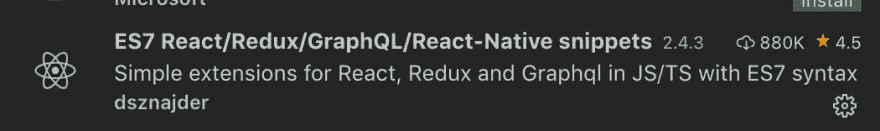
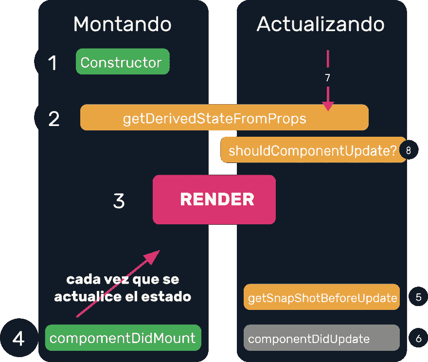

# 反应能力 2 级组件

> 原文：<https://dev.to/ecudevs/react-capitulo-2-classcomponents-461m>

## 什么也没有。

在 React 中，你有两种创造成分的方法
**【functionalcomponents】**是返回某物的函数。
**【class component】**就像他们的名字所说的是一个班级，他们也返回一些东西。

`No hay ciencia detrás de esto.`

## 定义 un ClassComponent

定义为 javascript 中的类。
我假设您的 **VSCODE** 中安装了以下扩展:

它将允许我们通过在我们的新文件中写入以下快捷方式**【RCC】**来自动生成一个类组件的基本代码

## 班级成分有何区别？

与只返回一个元素的**泛函元件**不同，**类元件**由两个主要元素组成:

1.  **状态**:是在我们班构造器中初始化的对象。它也是读和写的。
2.  **生命周期**:元件具有生命周期，即在**将元件彩现为**之前完成多个步骤，这还允许状态变更后在某个时间点重复生命周期，使视图变为

 **## 什么是状态

react 状态是一个对象，它存储由于调度程序调用服务器或用户与视图中的元素进行交互而更改的变量。

1.  共同定义一个状态
    `constructor(props) {
    super(props);
    this.state = {
    videos:[],
    logged:false};
    }` 

2.  生命周期示例

    *   即使视频阵列是空的，视图也要加载:

*   与此同时，正在提取将带来视频列表的任何 web 服务，完成视图更新

## Ciclo de vida de los class components en REACT

## 函数和绑定

绑定函数有两种方法:

1.  传统的

    *   定义构造函数:

        `constructor(props) {
        super(props);
        this.AgregarAmigo = this.AgregarAmigo.bind(this);
        }` 

    *   声明函数:

        `AgregarAmigo(nombres) {
        debugger
        alert('Está seguro de que va a agregar a ' + nombres)
        }`

    *   在需要
        的组件中进行函数调用:

        `<Carta fnPrincipal={this.AgregarAmigo.bind(this,
        elemento.nombres)}/>`

2.  使用箭头特征

    *   声明函数

        `AgregarAmigo(nombres) {
        debugger
        alert('Está seguro de que va a agregar a ' + nombres)
        }`

    *   使用
        箭在我们需要的地方进行函数调用

        `<Carta fnPrincipal={() => this.AgregarAmigo(elemento.nombres)}
        />`

练习(执行功能)

创建商店

全球状态**