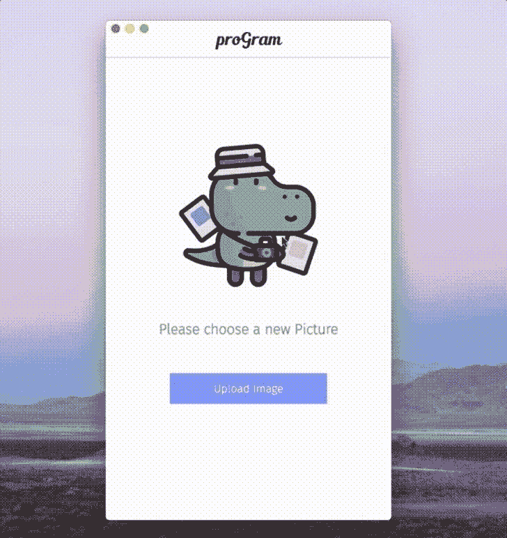

# 介绍程序:一个开源的，自我托管的 Instagram

> 原文：<https://dev.to/xenoxdev/introducing-program-an-open-source-self-hosted-instagram-2fij>

大家好！按照传统，现在是我们每月产品发布的时间了。这个月，我们一直在为开发者开发另一个很酷的开源产品，它叫做 ProGram。

但是在我向你们介绍这个项目之前，现在是讲故事时间。

如果你还记得的话，几个月前，我开始讨论谷歌在互联网上无可挑战的垄断地位，以及开发者社区如何帮助它变得更加强大。

[](/sarthology) [## 我们这些开发者是在帮助谷歌建立一个不可阻挡的垄断吗？

### sart hak Sharma 11 月 14 日 181 分钟阅读

#discuss #google #webdev](/sarthology/are-we-developers-helping-google-build-an-unstoppable-monopoly--39ki)

是这样的，伙计们。我一直认为开发人员在成为变革推动者方面拥有很大的权力。我们帮助建立互联网和我们周围看到的所有技术。我们是自由世界的开发者！

开发社区非常强大。但是...

[](https://i.giphy.com/media/MCZ39lz83o5lC/giphy.gif)

我说的是什么样的责任？帮助保持自由互联网精神的责任。这不仅包括能够访问您想要的任何内容，还包括能够访问它而不用担心操纵或数据泄露或其他一百万个问题。

像脸书和谷歌这样的大公司对我们拥有太多的权力，我们让他们这样做是因为这样做更容易。我明白了:选择阻力最小的道路是人类的天性。当一些东西很容易免费获得时，为什么要寻找替代品呢？

但是我一直相信我们应该有更高的标准。我们必须找到替代方案，打破脸书和谷歌等巨头的垄断。这是唯一的出路。这就是为什么我总是试图创造新的开源产品，帮助免费互联网蓬勃发展。而**节目**的制作也正是出于这个原因。

想想看，你的大多数互联网个人资料都有添加 Instagram 链接的选项，我们大多数人都会这样做。但是为什么会这样呢？有很多其他的平台可以让你免费托管你的东西。为什么人们不去追求这些？我能想到几个原因:

*   Instagram 个人资料看起来很漂亮。
*   你不必从头开始创建一个画廊。Instagram 会帮你做到。
*   一个业余爱好者想要做的大部分编辑工作都可以在 IG 应用程序中找到。
*   对许多人来说，随之而来的以赞和评论形式出现的社会认可可能是最重要的事情。

记住这些因素，我知道我必须做什么。我想为那些希望保持数据安全和可访问性，同时又能以酷酷的画廊风格展示自己最佳照片的程序员提供一个 Instagram 替代方案。所以我做了一个程序。

程序是一个基于 CLI 的应用程序，让您上传和编辑照片，应用酷过滤器，然后您可以将它们保存到您的个人资料。一旦你这样做了，你可以在任何地方托管你的个人资料，无论是 GitHub 还是 Heroku，或者任何你想托管的地方。

无论何时你想给别人看你的作品，只要把链接发给他们就行了。我认为 Instagram 过滤器非常酷，所以我在其他一些开源项目的帮助下，将它们结合起来，将其中的大部分添加到程序中。这里最关键的区别是你没有得到别人的认可。没有人喜欢你，没有人评论你，也没有人追随你——所有这些都让你在短暂的几秒钟内感受到甜蜜的多巴胺激增。我认为它们并不重要，我也不认为你应该依赖它们来获得外部的认可。为你创造的东西感到高兴，并自豪地展示它们。一个简单的网页就足够了，这正是程序为你做的。

大型科技巨头利用了我们对外部认可的需求，当我们得不到认可时，我们会感到痛苦。打破循环。不要痛苦。以更高的标准要求自己。这是通向幸福生活的唯一途径，我的朋友们。

好了，启蒙谈话到此为止。我希望我不会表现得太势利眼哈哈。😉

让我告诉你一些很酷的程序特性。

## 程序超级好用！

在安装程序之前，你需要的只是节点和电子。如果需要，只需运行下面的代码:

```
$ npm i -g programcli
$ program 
```

Enter fullscreen mode Exit fullscreen mode

一旦它运行，创建您的个人资料，并开始上传照片在几秒钟内。

## 编辑你的照片，添加酷炫滤镜！

目前，程序中可用的编辑是非常基本的。您可以裁剪照片并添加滤镜。然而，有很多很酷的滤镜可用，你可能会从 Instagram 上认出其中的一些。😉

## 一切控制在*你的*手中！

程序生成一个基于 HTML/CSS 和 Javascript 的文件，您可以根据自己的喜好进行定制。让它成为深色或浅色的主题。或者添加自定义背景。不喜欢布局？想怎么改就怎么改。为之疯狂。

## 让人探索你是谁。

您可以将多个链接添加到您的计划配置文件中。链接到您的 Dribbble 或 Behance 个人资料，展示您的创意组合。将人们发送到您的 Twitter 个人资料，甚至您的 Reddit。链接你的在线简历或者你的个人网站。天空是这里的极限。

## 随处托管！

程序最大的好处是你拥有你的数据。你可以把它放在任何你想放的地方，不需要像他们说的那样建在借来的土地上。

## 为项目做贡献！

如果你喜欢程序，就把它变成你自己的。这是 Github 回购，去叉吧！

这里有一些我脑海中的想法。你可以在这些方面下功夫，或者提出一些你自己的建议。

*   可变过滤强度
*   视频编辑
*   GIF 编辑(因为我们都爱 GIFS！)
*   故事
*   基本编辑选项，如亮度、锐化、饱和度等。

##  [解剖学](https://github.com/sarthology) / [程序学](https://github.com/sarthology/proGramCLI)

### 🦖自托管的 Instagram 风格图库，可存放您的所有照片

<article class="markdown-body entry-content container-lg" itemprop="text">

[](https://camo.githubusercontent.com/4d7564e9f11e7e162d2c95ab3153c9a88435c4bd26775296f6a76497de66012a/68747470733a2f2f692e696d6775722e636f6d2f685677573852342e706e67)

## 程序 CLI

程序是一个基于 CLI 的，自我托管的照片共享应用程序。你可以把它想象成 Instagram，它是为那些既想保证数据安全，又能以酷炫的图库风格展示自己最佳照片的程序员准备的。

## 截屏

[](https://camo.githubusercontent.com/530edd4d575304e8b1e48fd0a316d237b904a9e6a9d99749e8fa963862702059/68747470733a2f2f692e696d6775722e636f6d2f704576676855332e676966)

## 先决条件

在本地运行之前，您必须安装这些程序。

*   结节
*   电子

## 安装

```
$ npm i -g programcli
$ program 
```

## 发展

这真的很简单，只要按照下面的步骤做就行了

```
$ git clone https://github.com/sarthology/proGramCLI.git
$ cd proGramCLI
$ npm install
$ npm link
```

Enter fullscreen mode Exit fullscreen mode

现在要运行程序，你可以选择`npm run dev`或者简单地输入`program`

就是这样。

## 贡献的

请随意参与这个项目，并像对待自己的项目一样对待它。<g-emoji class="g-emoji" alias="blush" fallback-src="https://github.githubassets.cimg/icons/emoji/unicode/1f60a.png">😊</g-emoji>

## 有用的链接

*   网址:[https://sarthology.github.io/proGramCLI/](https://sarthology.github.io/proGramCLI/)

## 许可证

带许可证

## 作者

萨尔塔克·夏尔马

## 承认

从[平面图标](https://flaticon.com)使用的图标。

</article>

[View on GitHub](https://github.com/sarthology/proGramCLI)

# 上 ProductHunt 了！所以请给它一些爱！😻

[](https://www.producthunt.com/posts/program)

我们刚刚也在 [ProductHunt](https://www.producthunt.com/posts/program) 上启动了程序。如果你喜欢，请拿出点爱心，在 ProductHunt 上留下你的想法。我很想听听你的想法。

* * *

如果你真的喜欢这个想法，请随时在 Twitter 上给我发消息，我们可以合作。我计划在程序中添加其他功能。

如果你还没有意识到这一点，团队 XenoX 是一个开发团队，他们远程工作，为酷的开源项目做出贡献。我们总是欢迎热情的新成员，所以加入我们，让世界变得更美好。你的技术水平如何并不重要。新手和老手，我们的大门向所有人敞开。嘿，我们从来没有用完很酷的想法。

再见！

[](https://i.giphy.com/media/QM5lHSyFjz1XW/giphy.gif)