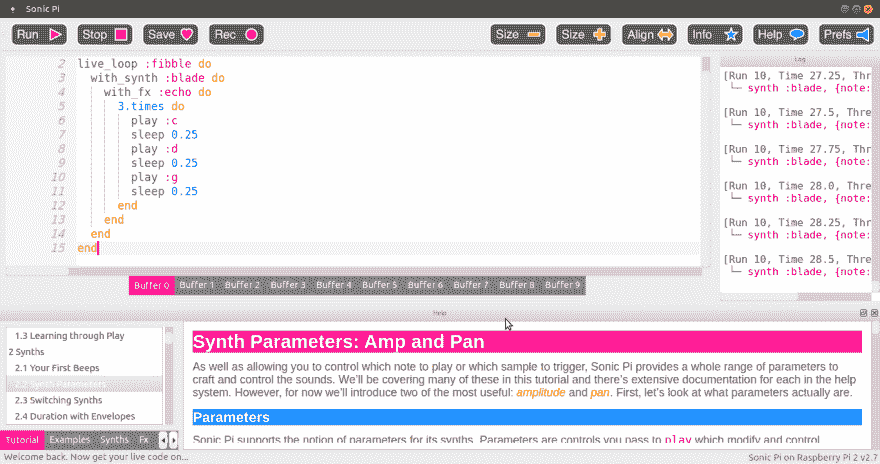
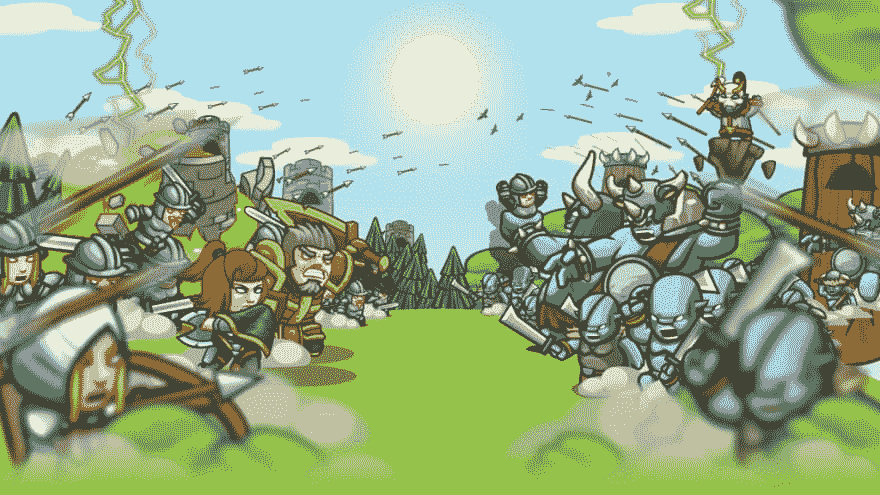
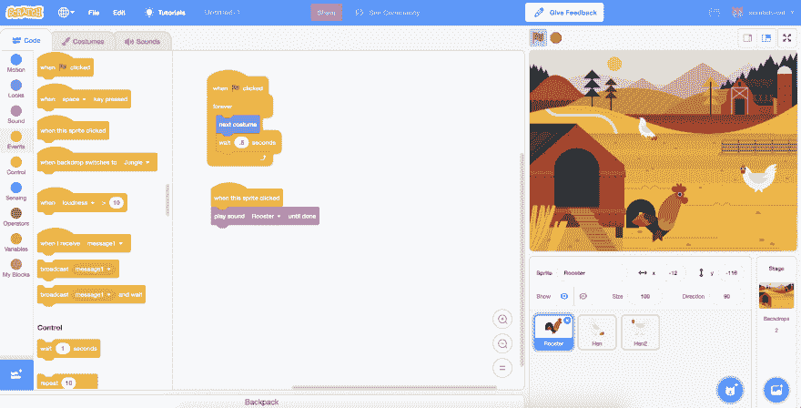

# 如何激励下一代开发者

> 原文：<https://dev.to/raoulmeyer/how-to-inspire-the-next-generation-of-developers-5fd>

上周，我的公司举办了一场名为`Techvriendjes`或`TechBuddies`的活动，旨在以有趣和令人兴奋的方式向 10-14 岁的孩子介绍编程的基础知识。

我在一个教授 Python 基础知识的课程中帮忙。看到所有孩子这么快就习惯了语法真是太棒了。更重要的是，当他们最终发现如何解决他们一直在努力解决的问题时，他们变得多么兴奋。他们玩得很开心，我相信他们中的一些人会继续享受编程的乐趣。

## 工具

我们举办了三个不同的研讨会，在每个研讨会中，孩子们使用不同的应用程序来编程。我将通过它们来解释它们是做什么的，是什么让它们变得令人敬畏。

### SonicPi

SonicPi 是一个非常酷的程序，它允许任何人使用代码创作自己的音乐。语法基于 Ruby。您可以轻松弹奏单个音符和音阶，并且可以使用广泛的样本。你可以在这里找到[的大量文档。](https://sonic-pi.net/tutorial.html#section-1)

SonicPi 的创始人 Sam Aaron 的一次演讲让我深受启发。他真正明白了一点，软件在很多时候被用于无聊的商业事务。他表演的这段视频很好地展示了这个工具的强大之处:

[https://www.youtube.com/embed/G1m0aX9Lpts](https://www.youtube.com/embed/G1m0aX9Lpts)

### 代码战斗

[CodeCombat](https://codecombat.com/) 是一款浏览器游戏，可以教授一整套编程语言，包括 HTML、CSS、Javascript 和 Python。在游戏中，你需要通过让你的英雄行走、攻击、开门等等来击败关卡。你的代码指示你的英雄按照一定的顺序完成动作。

就像 SonicPi 一样，您需要编写的通过关卡的代码是完全有效的代码(但在这种情况下是 Python/Javascript)。不用花太多时间，我们就已经了解了更高级的语法。这些关卡创造了一种非常好的前进感。这就像一个有趣的教程，你只想继续做下去。

### 刮痕

有了 [Scratch](https://scratch.mit.edu/) 你可以轻松地制作出很酷的动画和游戏。与 SonicPi 和 CodeCombat 不同，Scratch 并不直接教授语法。相反，您可以拖放行为类似于循环、条件等的控制元素。您仍将习惯于编程的基础，但是没有键入错误的风险，这是其他两个工具受挫的常见原因。不要让我从 Python 缩进开始。

Scratch 的视觉特性可以更容易理解元素之间的交互方式。孩子们尤其可以用这个来释放他们的创造力。

## 为什么这很重要

虽然这些程序可能是针对孩子的，但它们也是成年人学习语法的一种非常有趣和有效的方式。我的产品负责人通过做大量的 CodeCombat 挑战学习了 HTML、CSS 和 Python 的基础知识。玩游戏永远不嫌老，学习新事物也永远不嫌老。

编程技能在未来可能会变得越来越重要。据估计，在过去几年的任何时候，大约 50%的开发人员只有不到 5 年的经验。这是由全球新开发人员的大量涌入造成的。自动化可以在几乎所有的工作中发挥巨大的作用，这使得编程成为一项非常重要的技能。

像 SonicPi 和 CodeCombat 这样的工具降低了编程的门槛，不幸的是这个门槛仍然很高。开始可能感觉像是一件苦差事，需要知道的东西太多了。只是有一些结构和界限可能会有很大帮助。对我来说，一个 100 级的游戏似乎比一个 100 部分的教程要轻松得多。

我们在这里有一个很好的机会来激励孩子们，甚至帮助他们找到自己的激情。否则，孩子们甚至不会尝试，因为他们会觉得他们不符合程序员的刻板印象。

## 如何入门

有多种方法可以激励下一代程序员:

*   为开源项目做贡献，如 [SonicPi](https://sonic-pi.net/) 和 [Scratch](https://scratch.mit.edu/) 。这些项目通常非常感谢你贡献你的时间和金钱。
*   在教室或营地教孩子。一些有趣的例子(我还没有验证这些倡议):[代码的乐趣](https://www.codeforfun.com/volunteering)和 [TEALS](https://code.org/volunteer/guide) 。
*   为一个活动做贡献或者自己组织一个活动。

如果你知道任何其他好的资源，请在评论中分享！