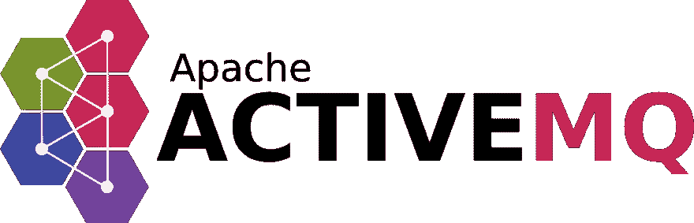
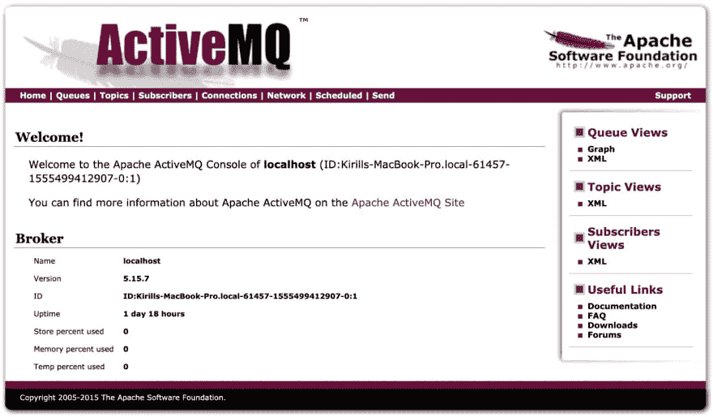
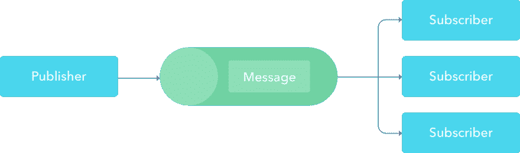
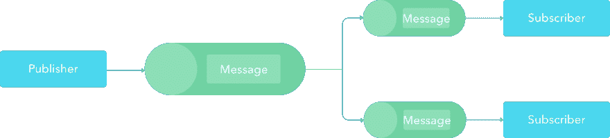
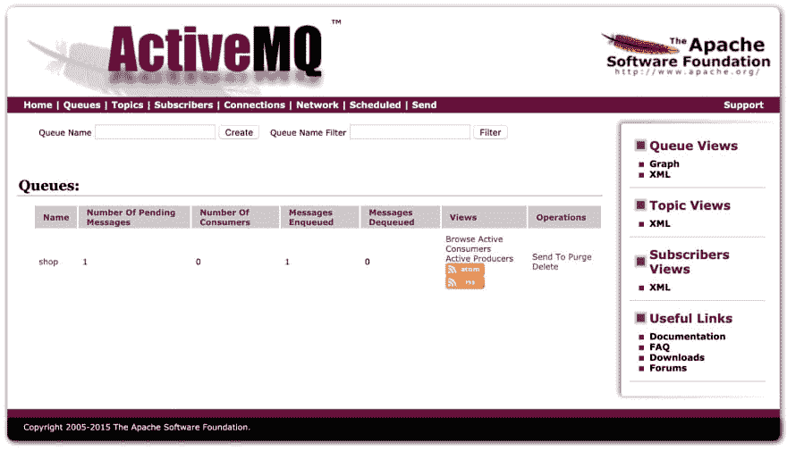
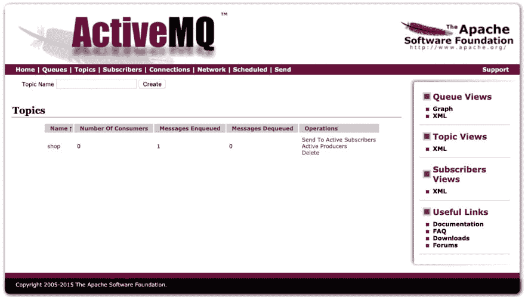
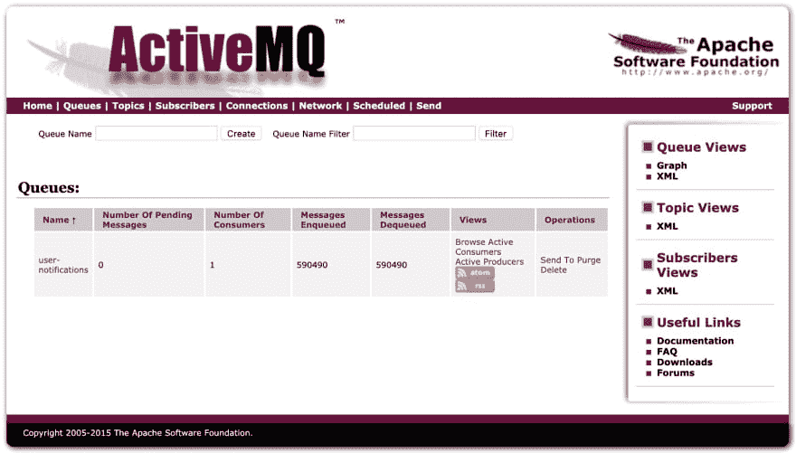
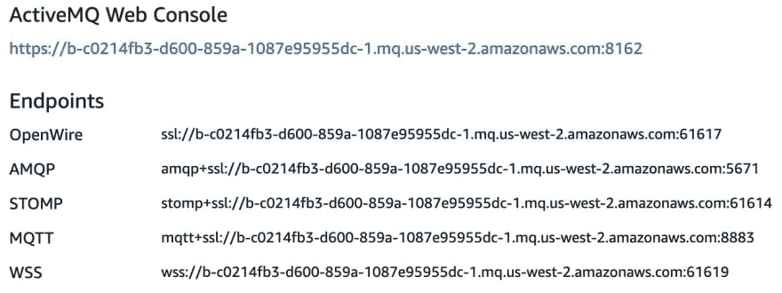

# 用 ActiveMQ 构建 Ruby/Rails 应用程序之间的消息传递

> 原文：<https://dev.to/kirillshevch/build-messaging-between-ruby-rails-applications-with-activemq-4fin>

Ruby/Rails 世界中很少涉及的工具之一是消息代理(可能是因为它们大部分是用 Java 编写的)。每个人都非常熟悉[后台作业处理](https://medium.com/@kirill_shevch/how-to-make-simple-background-jobs-processing-in-rails-with-sucker-punch-9e7128f4db13)，但是消息代理提供了一种更加灵活的异步执行方法。例如，您可以从一个应用程序创建一条消息，在另一个应用程序中处理它，然后继续执行而不等待响应。

您在架构级别获得的一些好处:容错、有保证的交付、异步通信(通过发布/订阅模式)、松散耦合等。

我使用的消息代理之一是 ActiveMQ。ActiveMQ 提供了这些特性中的大部分，我将考虑使用这个代理作为例子来建立通信。

## **【ActiveMQ】**

开源多协议消息代理。

[](https://res.cloudinary.com/practicaldev/image/fetch/s--3oeMwkqe--/c_limit%2Cf_auto%2Cfl_progressive%2Cq_auto%2Cw_880/https://cdn-images-1.medium.com/max/1600/1%2A_E9ptw7tizFxZYFc_y-B8Q.png)

### 优点:

*   支持许多[跨语言客户端和协议](http://activemq.apache.org/cross-language-clients)
*   使用共享存储的高可用性(主/从)
*   卡哈德和 JDBC 的持久性选择

### **安装**

ActiveMQ 需要 Java 7 来运行和构建。

### Brew(在 MacOS 上)

更简单的安装方式

```
brew install apache-activemq
activemq start 
```

<svg width="20px" height="20px" viewBox="0 0 24 24" class="highlight-action crayons-icon highlight-action--fullscreen-on"><title>Enter fullscreen mode</title></svg> <svg width="20px" height="20px" viewBox="0 0 24 24" class="highlight-action crayons-icon highlight-action--fullscreen-off"><title>Exit fullscreen mode</title></svg>

### Unix 二进制安装

在此下载最新版本[并跟进](http://activemq.apache.org/components/classic/download/)[文档](http://activemq.apache.org/version-5-getting-started.html)。

### 码头工人

不幸的是，ActiveMQ 没有官方的 docker 图像。我
查过的一个我可以推荐的是[https://hub.docker.com/r/rmohr/activemq](https://hub.docker.com/r/rmohr/activemq)

```
docker pull rmohr/activemq
docker run -p 61616:61616 -p 8161:8161 rmohr/activemq 
```

<svg width="20px" height="20px" viewBox="0 0 24 24" class="highlight-action crayons-icon highlight-action--fullscreen-on"><title>Enter fullscreen mode</title></svg> <svg width="20px" height="20px" viewBox="0 0 24 24" class="highlight-action crayons-icon highlight-action--fullscreen-off"><title>Exit fullscreen mode</title></svg>

### CLI 命令

以下是开始时最有用的三个命令:

`activemq start` —使用配置文件创建并启动代理。

`activemq stop` —停止正在运行的代理。

`activemq restart` —重新启动正在运行的代理。

要查看所有命令，只需在终端中调用`activemq`。

### **启动 ActiveMQ**

```
activemq

INFO: Loading '/usr/local/Cellar/activemq/5.15.9/libexec//bin/env'INFO: Using java '/Library/Java/JavaVirtualMachines/jdk1.8.0_102.jdk/Contents/Home/bin/java'INFO: Starting - inspect logfiles specified in logging.properties and log4j.properties to get detailsINFO: pidfile created : '/usr/local/Cellar/activemq/5.15.9/libexec//data/activemq.pid' (pid '61388') 
```

<svg width="20px" height="20px" viewBox="0 0 24 24" class="highlight-action crayons-icon highlight-action--fullscreen-on"><title>Enter fullscreen mode</title></svg> <svg width="20px" height="20px" viewBox="0 0 24 24" class="highlight-action crayons-icon highlight-action--fullscreen-off"><title>Exit fullscreen mode</title></svg>

### **监控 ActiveMQ**

您可以通过将浏览器指向`http://localhost:8161/admin`来使用 Web 控制台监控 ActiveMQ。默认凭证:`login: admin, pass: admin`

[](https://res.cloudinary.com/practicaldev/image/fetch/s--0wzoz9BR--/c_limit%2Cf_auto%2Cfl_progressive%2Cq_auto%2Cw_880/https://cdn-images-1.medium.com/max/1600/0%2A_Ol08RnDsDOjyiub)

## **消息模式**

消息传递代理的使用很简单，只包含两个概念—
**主题**和**队列**。但是现代工具也提供了这些方法的组合，并提供了额外的特性，如发布/订阅模式的实现、故障转移等。但首先，让我们了解一下主要概念。

**队列**
队列是基本的消息传递模式。它们提供了发布者和订阅者之间的直接沟通。发布者创建
信息，而消费者一个接一个地阅读。消息被阅读后，它就从队列中消失了。**如果队列中有多个用户，只有其中一个会收到消息**。

[](https://res.cloudinary.com/practicaldev/image/fetch/s---GlOZgaj--/c_limit%2Cf_auto%2Cfl_progressive%2Cq_auto%2Cw_880/https://cdn-images-1.medium.com/max/1600/1%2AFTuQb21kXVhqBhE3154QUg.png)

**话题**
话题实现一对多交流。与队列不同，每个订阅者都将收到发布者发送的消息。**而且主要问题是消息不能为单个监听器**恢复(例如，如果服务与阅读主题断开)。

[](https://res.cloudinary.com/practicaldev/image/fetch/s--YAG1q4M5--/c_limit%2Cf_auto%2Cfl_progressive%2Cq_auto%2Cw_880/https://cdn-images-1.medium.com/max/1600/1%2Aoriu2K2G60oHaqXa_vaFMg.png)

**虚拟话题**
虚拟话题结合了这两种方法。当发布者向主题发送消息时，订阅者将在他们自己的相关队列中收到消息的副本。

[](https://res.cloudinary.com/practicaldev/image/fetch/s--lnl1Yl-n--/c_limit%2Cf_auto%2Cfl_progressive%2Cq_auto%2Cw_880/https://cdn-images-1.medium.com/max/1600/1%2A-uKsDe1ziGvpdxFXzX1Uyg.png)

## **协议**

ActiveMQ 支持大部分通信[协议](https://activemq.apache.org/protocols.html)如 **MQTT、
OpenWire、REST、RSS 和 Atom、Stomp、WSIF、web socket**T5 和 XMPP。

### **入门**

最简单的方法是从一个熟悉的协议 HTTP 开始特性审查。

### **休息**

ActiveMQ 实现了一个 RESTful 消息传递 API，它允许任何支持 web 的设备使用常规的 HTTP POST 或 GET 发布消息。

**发布到队列**

```
curl -u admin:admin -d "body=order_id" http://localhost:8161/api/message/shop?type=queue 
```

<svg width="20px" height="20px" viewBox="0 0 24 24" class="highlight-action crayons-icon highlight-action--fullscreen-on"><title>Enter fullscreen mode</title></svg> <svg width="20px" height="20px" viewBox="0 0 24 24" class="highlight-action crayons-icon highlight-action--fullscreen-off"><title>Exit fullscreen mode</title></svg>

[](https://res.cloudinary.com/practicaldev/image/fetch/s--kao0lKao--/c_limit%2Cf_auto%2Cfl_progressive%2Cq_auto%2Cw_880/https://cdn-images-1.medium.com/max/1600/0%2AnEUURbVLerHWGa4K)

**发布到主题**

```
curl -u admin:admin -d "body=order_id” http://localhost:8161/api/message/shop?type=topic 
```

<svg width="20px" height="20px" viewBox="0 0 24 24" class="highlight-action crayons-icon highlight-action--fullscreen-on"><title>Enter fullscreen mode</title></svg> <svg width="20px" height="20px" viewBox="0 0 24 24" class="highlight-action crayons-icon highlight-action--fullscreen-off"><title>Exit fullscreen mode</title></svg>

[](https://res.cloudinary.com/practicaldev/image/fetch/s--PeKNyuCl--/c_limit%2Cf_auto%2Cfl_progressive%2Cq_auto%2Cw_880/https://cdn-images-1.medium.com/max/1600/0%2AbNegezcMgiCRA49L)

### **与红宝石整合**

我将考虑的协议— **STOMP (** 面向简单文本的
消息协议)。STOMP 提供了一种可互操作的有线格式，因此 STOMP 客户端可以与任何 STOMP 消息代理通信，从而在多种语言、平台和代理之间提供简单而广泛的消息互操作性。

有一个很棒的 [gem](https://github.com/stompgem/stomp) 与这个协议一起工作，从一个 Stomp 协议兼容的消息队列中发送和接收消息。包括:故障转移逻辑、SSL 支持。

```
gem 'stomp'

bundle install 
```

<svg width="20px" height="20px" viewBox="0 0 24 24" class="highlight-action crayons-icon highlight-action--fullscreen-on"><title>Enter fullscreen mode</title></svg> <svg width="20px" height="20px" viewBox="0 0 24 24" class="highlight-action crayons-icon highlight-action--fullscreen-off"><title>Exit fullscreen mode</title></svg>

**初始化连接**

```
def config_hash 
  { 
    hosts: [ 
      { 
        login: 'admin',
        passcode: 'admin',
        host: '0.0.0.0',
        port: 61613,
        ssl: false 
      } 
    ] 
  }
end

client = Stomp::Client.new(config_hash) 
```

<svg width="20px" height="20px" viewBox="0 0 24 24" class="highlight-action crayons-icon highlight-action--fullscreen-on"><title>Enter fullscreen mode</title></svg> <svg width="20px" height="20px" viewBox="0 0 24 24" class="highlight-action crayons-icon highlight-action--fullscreen-off"><title>Exit fullscreen mode</title></svg>

### **队列**

STOMP 的队列接口非常简单。只需用配置列表初始化连接，并在发布消息后关闭。

**发送消息到队列**

```
client = Stomp::Client.new(config_hash)

data = { order_id: 1, command: :paid }

client.publish('/queue/user-notifications', data.to_json)

client.close 
```

<svg width="20px" height="20px" viewBox="0 0 24 24" class="highlight-action crayons-icon highlight-action--fullscreen-on"><title>Enter fullscreen mode</title></svg> <svg width="20px" height="20px" viewBox="0 0 24 24" class="highlight-action crayons-icon highlight-action--fullscreen-off"><title>Exit fullscreen mode</title></svg>

**从队列**接收消息

```
client = Stomp::Client.new(config_hash)

Thread.new do
  client.subscribe('/queue/user-notifications') do |msg|
    begin
      msg = JSON.parse(msg.body)

      # message processing...
    rescue StandardError => e
      Raven.capture_exception(e)
    end
  end
end 
```

<svg width="20px" height="20px" viewBox="0 0 24 24" class="highlight-action crayons-icon highlight-action--fullscreen-on"><title>Enter fullscreen mode</title></svg> <svg width="20px" height="20px" viewBox="0 0 24 24" class="highlight-action crayons-icon highlight-action--fullscreen-off"><title>Exit fullscreen mode</title></svg>

注意:使用异常处理来及时响应它们。例如，这里我使用[乌鸦](https://github.com/getsentry/raven-ruby)——哨兵包装器。

[](https://res.cloudinary.com/practicaldev/image/fetch/s--gdw1CsAD--/c_limit%2Cf_auto%2Cfl_progressive%2Cq_auto%2Cw_880/https://cdn-images-1.medium.com/max/1600/1%2A2SBhEKXLd8QP1PbbyeGW4Q.jpeg)

### **话题**

主题有一个类似于队列的接口。下面是一些例子。

**发送消息到话题**

```
client = Stomp::Client.new(config_hash)

data = { order_id: 1, command: :paid }

client.publish('/topic/user-notifications', data.to_json)

client.close 
```

<svg width="20px" height="20px" viewBox="0 0 24 24" class="highlight-action crayons-icon highlight-action--fullscreen-on"><title>Enter fullscreen mode</title></svg> <svg width="20px" height="20px" viewBox="0 0 24 24" class="highlight-action crayons-icon highlight-action--fullscreen-off"><title>Exit fullscreen mode</title></svg>

**收到来自话题**的消息

```
client = Stomp::Client.new(config_hash)

Thread.new do
  client.subscribe('/topic/user-notifications') do |msg|
    begin
      msg = JSON.parse(msg.body)

      # message processing...
    rescue StandardError => e
      Raven.capture_exception(e)
    end
  end
end 
```

<svg width="20px" height="20px" viewBox="0 0 24 24" class="highlight-action crayons-icon highlight-action--fullscreen-on"><title>Enter fullscreen mode</title></svg> <svg width="20px" height="20px" viewBox="0 0 24 24" class="highlight-action crayons-icon highlight-action--fullscreen-off"><title>Exit fullscreen mode</title></svg>

### **与导轨集成**

[ActiveMessaging](https://github.com/kookster/activemessaging) —尝试将 rails 开发的简单和优雅引入消息传递领域。

为 Rails 5+
的`Gemfile`版本添加一个 gem

```
gem 'activemessaging', github: 'kookster/activemessaging', branch: 'feat/rails5' 
```

<svg width="20px" height="20px" viewBox="0 0 24 24" class="highlight-action crayons-icon highlight-action--fullscreen-on"><title>Enter fullscreen mode</title></svg> <svg width="20px" height="20px" viewBox="0 0 24 24" class="highlight-action crayons-icon highlight-action--fullscreen-off"><title>Exit fullscreen mode</title></svg>

然后执行:

```
bundle install 
```

<svg width="20px" height="20px" viewBox="0 0 24 24" class="highlight-action crayons-icon highlight-action--fullscreen-on"><title>Enter fullscreen mode</title></svg> <svg width="20px" height="20px" viewBox="0 0 24 24" class="highlight-action crayons-icon highlight-action--fullscreen-off"><title>Exit fullscreen mode</title></svg>

### **正在初始化**

添加 ActiveMessaging 后的以下命令(添加一个基类用于定义监听器和轮询服务器)

```
rails g active_messaging:install

  create  app/processors/application_processor.rb
  create  script/poller
    chmod script/poller
  create  script/threaded_poller
    chmod script/threaded_poller
  create  lib/poller.rb
  create  config/broker.yml
  gemfile  daemons 
```

<svg width="20px" height="20px" viewBox="0 0 24 24" class="highlight-action crayons-icon highlight-action--fullscreen-on"><title>Enter fullscreen mode</title></svg> <svg width="20px" height="20px" viewBox="0 0 24 24" class="highlight-action crayons-icon highlight-action--fullscreen-off"><title>Exit fullscreen mode</title></svg>

**生成一个监听器**

```
rails g active_messaging:processor RailsQueue

  create  app/processors/rails_queue_processor.rb
  create  config/messaging.rb  
  invoke  rspec  
  create    spec/functional/rails_queue_processor_spec.rb 
```

<svg width="20px" height="20px" viewBox="0 0 24 24" class="highlight-action crayons-icon highlight-action--fullscreen-on"><title>Enter fullscreen mode</title></svg> <svg width="20px" height="20px" viewBox="0 0 24 24" class="highlight-action crayons-icon highlight-action--fullscreen-off"><title>Exit fullscreen mode</title></svg>

**处理器**
在这里你指定哪个会被`subscribes_to`监听。当消息发布到`RailsQueue`时，`on_message`以第一个参数作为消息体执行。

```
class RailsQueueProcessor < ApplicationProcessor
  subscribes_to :rails_queue

  def on_message(message)
    logger.debug 'RailsQueueProcessor received: ' + message
  end
end 
```

<svg width="20px" height="20px" viewBox="0 0 24 24" class="highlight-action crayons-icon highlight-action--fullscreen-on"><title>Enter fullscreen mode</title></svg> <svg width="20px" height="20px" viewBox="0 0 24 24" class="highlight-action crayons-icon highlight-action--fullscreen-off"><title>Exit fullscreen mode</title></svg>

**目的地配置**
在初始化式中，我们描述了队列的目的地。

```
ActiveMessaging::Gateway.define do |s|
  s.destination :rails_queue, '/queue/RailsQueue'
end 
```

<svg width="20px" height="20px" viewBox="0 0 24 24" class="highlight-action crayons-icon highlight-action--fullscreen-on"><title>Enter fullscreen mode</title></svg> <svg width="20px" height="20px" viewBox="0 0 24 24" class="highlight-action crayons-icon highlight-action--fullscreen-off"><title>Exit fullscreen mode</title></svg>

**运行应用程序**

```
script/poller run 
```

<svg width="20px" height="20px" viewBox="0 0 24 24" class="highlight-action crayons-icon highlight-action--fullscreen-on"><title>Enter fullscreen mode</title></svg> <svg width="20px" height="20px" viewBox="0 0 24 24" class="highlight-action crayons-icon highlight-action--fullscreen-off"><title>Exit fullscreen mode</title></svg>

现在您可以发布到`RailsQueue`，Rails 实例将接收消息。

## **生产**

首先，你要考虑部署和维护。因此，对于小型团队(没有开发运维/SRE/系统管理员角色)，我建议考虑云解决方案。

### **AmazonMQ**

[https://aws.amazon.com/amazon-mq](https://aws.amazon.com/amazon-mq)

一些功能:

*   使用 Apache KahaDB 作为其数据存储。不支持其他数据存储，如 JDBC 和 LevelDB
*   提供低延迟消息传递，通常低至一位数毫秒
*   开箱即用的持久性
*   备份

不需要使用额外的 API，只需遵循亚马逊提供的 STOMP 协议(或任何其他协议)。

[](https://res.cloudinary.com/practicaldev/image/fetch/s--oNPF8fs2--/c_limit%2Cf_auto%2Cfl_progressive%2Cq_auto%2Cw_880/https://cdn-images-1.medium.com/max/1600/0%2AieuurqUK5i-UyQsA)

### **【先进先出】**

为了能够保存消息的交付顺序，您需要在代理配置中添加总排序。

```
<destinationPolicy>
  <policyMap>
    <policyEntries>
      <policyEntry topic="&gt;">
      <!--
      The constantPendingMessageLimitStrategy is used to prevent
      slow topic consumers to block producers and affect other 
      consumers by limiting the number of messages that are retained
      For more information, see: 
      -->
        <dispatchPolicy>
          <strictOrderDispatchPolicy/>
        </dispatchPolicy>
      </policyEntry>
    </policyEntries>
  </policyMap>
</destinationPolicy> 
```

<svg width="20px" height="20px" viewBox="0 0 24 24" class="highlight-action crayons-icon highlight-action--fullscreen-on"><title>Enter fullscreen mode</title></svg> <svg width="20px" height="20px" viewBox="0 0 24 24" class="highlight-action crayons-icon highlight-action--fullscreen-off"><title>Exit fullscreen mode</title></svg>

## 引用

这篇文章与我上一次在 [Ruby Wine#1](https://www.eventbrite.com/e/ruby-wine-tickets-51645298478#) 上关于 Ruby 微服务的事件驱动架构和消息模式的演讲有关。【T2[https://www.youtube.com/embed/e9AAUy4kkek](https://www.youtube.com/embed/e9AAUy4kkek)

[扬声器平台](https://speakerdeck.com/kirillshevch/rubywine-number-1-event-driven-architecture-and-messaging-patterns-for-ruby-microservices)上提供幻灯片。【T2[https://speakerdeck.com/player/0414383a451d45afac939c0391bce2a6](https://speakerdeck.com/player/0414383a451d45afac939c0391bce2a6)

## 结论

对于简单的项目，使用队列可能是不合理的，因为添加一个额外的架构层来负责消息排队并不是一件容易的事情。在使用之前，您必须权衡利弊(例如，您准备花时间寻求支持)。排队允许您更灵活地扩展应用程序，并解决大多数与语言无关但与架构有关的性能问题。