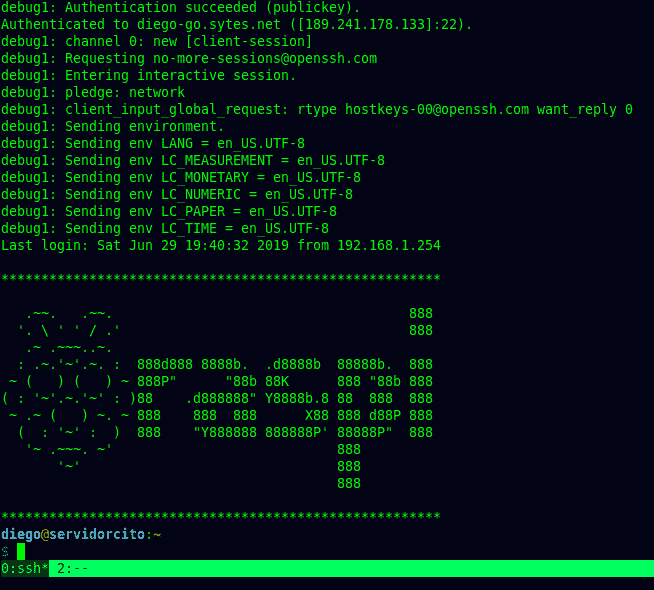
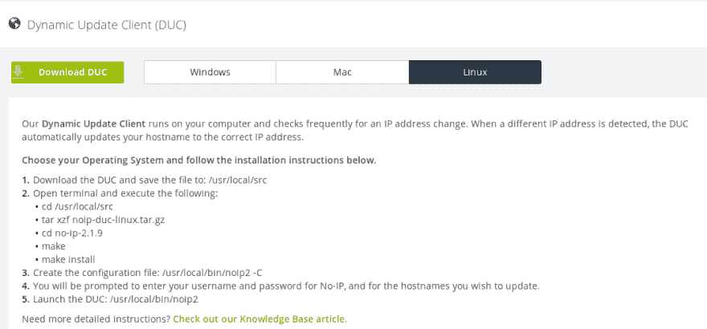
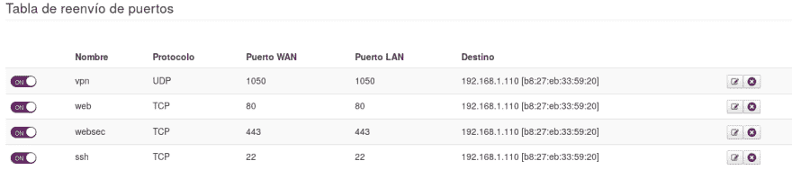
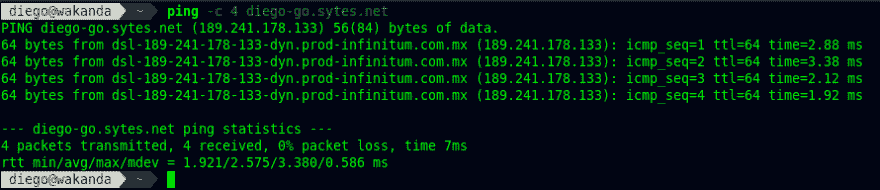
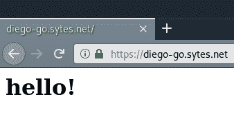

# 覆盆子拯救你的隐私-第一部分

> 原文：<https://dev.to/dieg0la/raspberry-to-the-rescue-of-your-privacy-5f47>

> *这篇文章的主要目的是展示你可以在树莓上运行的许多服务，我也分享了我提到的做所有事情和配置的链接*。

我坚信，我们为自己所做的事情应该得到认可，也许不是对他人的公开认可，而是对工作本身的认可。

我决定把这篇文章分成两部分，一部分是设置基本的 web 服务器，第二部分是设置我的其他服务。如果你已经运行了一个安全的 web 服务器，你可以检查第二部分。

# 那么，我从哪里得到这一切呢？

如今，我们的数据存储在某个提供商的远程计算机中，我不想显得有点偏执，但考虑到互联网上存在的风险，我更喜欢拥有自己的基础设施，无论我在哪里，都可以随时随地访问。

好吧，好吧，也许不会是最好的基础设施，最快的，容量最大的，但至少它将是我的，我是它的所有者，最棒的是我是控制它的人。

# 为什么要用覆盆子？

正如你们许多人所知，Raspberry 是一款基于 ARM 架构的低成本计算机，有许多令人惊叹的项目可以用它来完成，比如 domotic、maker stuff、IoT 等等。但在这篇文章中，我将特别关注对我们自己的服务器、我们自己的云、我们自己的存储设备和我尝试体验过的其他东西使用覆盆子。

# 第一步

我们需要做的第一件事，当然是给 Raspi 安装一个操作系统，有很多风格可供选择。我选择安装“默认”风格的 Raspbian，也许你会说为什么是这个，为什么不是纯 Debian(顺便说一句，我在我的笔记本电脑 XD 上使用 Debian 测试)但这是我的第一选择，也许以后我会把 Debian 放在上面。

登录 Raspbian 后，我们需要配置一个静态 ip 来连接 vía SSH(之前安装的)以管理设备。我们不打算使用 Raspbian 图形环境，因此我们可以禁止它进入终端并写入:

`# systemctl set-default multi-user.target`

该命令将关闭图形环境，并将系统置于多用户命令行中。

总结这一部分，我们需要做的事情是:

*   安装操作系统。
*   设置一个静态 IP。
*   打开终端以禁用图形环境。

# SSH 连接

我们使用 SSH 连接到我们的设备。当我们安装 SSH 时，默认配置是打开的，我们可以使用密码认证登录设备，但这有点冒险，请记住，设备将暴露在互联网上，会有一些坏人，大多数情况下，机器人会试图访问我们的设备，我们将在下面看到。

因此，我们将更改 SSH 配置文件，我们将对我们的设备使用基于 SSH 密钥的身份认证，并使用密钥进行访问，我们将使用。

此外，我们可以遵循基本的良好安全实践，如禁用 root 密码，设置将要进行身份验证的用户名，禁用 de X11 转发。

[如何在 Linux 服务器上配置基于 SSH 密钥的认证](https://www.digitalocean.com/community/tutorials/how-to-configure-ssh-key-based-authentication-on-a-linux-server)

总结本节内容:

*   更改 SSH 配置。
*   禁用密码验证。
*   设置基于密钥的身份验证。

# 设置

所以在这一点上没有什么特别的事情发生，只有基本的管理和配置。正如我在开始时所说，我们需要将设备暴露在互联网上。以我为例，我有一个 ISP，它给了我一个动态 IP，所以当公共 IP 改变时，我需要一些东西来帮助我连接到 Rasp。
为了让这成为可能，我使用了一种叫做 [NoIp](https://www.noip.com/) 的服务，这种服务将帮助我们随时随地访问我们的设备。

NoIp 是一个免费的服务，它为我们提供了一个动态更新的客户端，这是一个运行在我们的计算机上的服务，当我们的 Ip 地址发生变化时，它会频繁地检查，所以当这种情况发生时，这个客户端会检测到这种变化，并自动更新我们的主机名来纠正 IP 地址。

这真的很容易设置，我们唯一要做的就是注册(没有广告，没有什么)，设置我们想要的主机名，并按照说明在我们的机器上安装动态更新客户端。

当 NoIp 检测到已经过了 30 天时，他们会向您发送一封电子邮件来刷新您的主机名。

### 向我们的设备打开世界

一旦我们在 Raspi 上配置了 NoIp 服务，我们就需要打开通往互联网的大门，我们将在进入我们的家庭路由器时这样做，选择 Ip 设备并将端口转发设置为远程访问。

如你所见，由于我在 Raspi 上运行的服务，我已经设置了一些其他端口。我将涵盖所有内容，并根据具体的服务来讨论每一项内容。

此时，无论我们在哪里，我们都将能够通过 SSH 访问我们网络之外的内容。

当你在 NoIp 上设置主机名时，你会看到有一个域名直接指向你公共 Ip。以我在 diego-go.sytes.net 的情况为例，如果我们对这个地址执行 ping 操作，我们将能够看到这是我的公共地址(可能会在 24 小时或更长时间内发生变化)。

记住这一点，让我们继续。

总结本节内容:

*   在 NoIp [NoIp](https://www.noip.com/) 注册
*   安装 NoIp 的 DUC。
*   在我们的路由器上配置端口转发。
*   测试 NoIp 主机名

# 设置 web 服务器

我知道有许多 web 服务器，有轻型的，也有“重型”的。也许你会想为什么是 Apache，如果还有其他的(比如 Nginx，Lighttpd)，但是为了这个目的我使用我知道并且一直在使用的 Apache(不得不仍然学习我知道的 Nginx，不要担心:-D)。

安装将会非常容易，只需输入

`# apt install apache2`

这将安装我们的网络服务器。

[如何在 Debian 9 上安装 Apache Web 服务器](https://www.digitalocean.com/community/tutorials/how-to-install-the-apache-web-server-on-debian-9#step-5-%E2%80%94-setting-up-virtual-hosts-(recommended))

下一步，我们将按照本页中的一些步骤来保护我们的 web 服务器。

[13 Apache Web 服务器安全和加固技巧](https://www.tecmint.com/apache-security-tips/)

我设置的内容是:

*   如何从错误中隐藏 Apache 版本和操作系统身份？
*   禁用目录列表。
*   禁用不必要的模块。
*   使用 SSL 证书保护 Apache。

显然这是开放给你的选择。

### 使用 SSL 证书保护 Apache

下面我将解释如何安装 Owncloud，这是一项拥有我们自己的存储服务的服务，类似于 Dropbox、Google Drive，但这是由我们控制和管理的。

为了在我们的 web 服务器中安装 SSL 证书和 https，我将使用“让我们加密”,这是一个证书颁发机构，它为我们提供了一种获取和安装证书的简单方法。

我参考了 DigitalOcean 的博客来跟踪我们的 Raspi 中的 Let's Encrypt 的安装。

[如何在 Debian 9 上用 Let's Encrypt 保护 Apache](https://www.digitalocean.com/community/tutorials/how-to-secure-apache-with-let-s-encrypt-on-debian-9)

另外，你可以参考 [certbot 网站](https://certbot.eff.org)，它会一步一步地告诉你如何安装证书

### 开通新端口

此时，我们安装了一个 web 服务器和一个证书，因此我们需要在 homer 路由器上打开新的端口，以便从外部访问 web 服务器，正如我们在 SSH 部分中所做的那样，我们需要指定本地 ip 并设置端口 80 和 443，它将对应于 web 服务和安全 web 服务。这样，我们将能够从外部访问我们的服务器，甚至使用 https 协议。

*注意:我强制 Apache 使用 a2enmod 把 http 重定向到 https[如何在 Apache 上把 HTTP 重定向到 HTTPS](https://www.tecmint.com/redirect-http-to-https-on-apache/)T3】*

总结本节内容:

*   设置阿帕奇。
*   保护 web 服务器的某些方面。
*   安装证书。
*   在家用路由器上打开新端口。

继续第二部分...