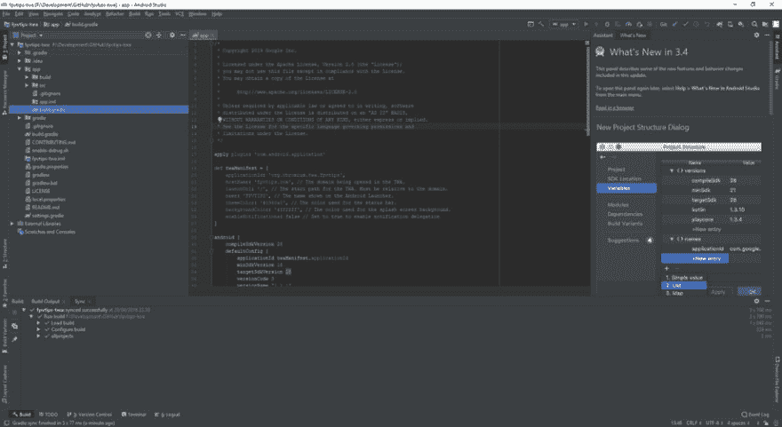
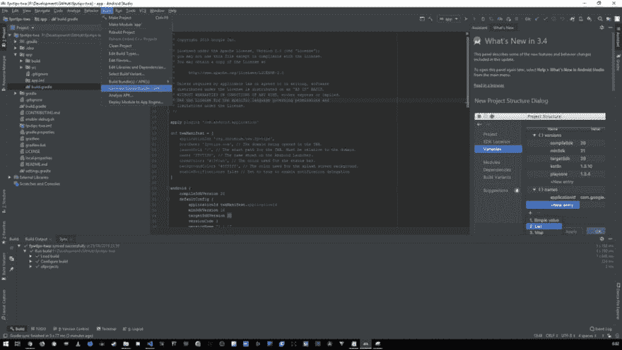
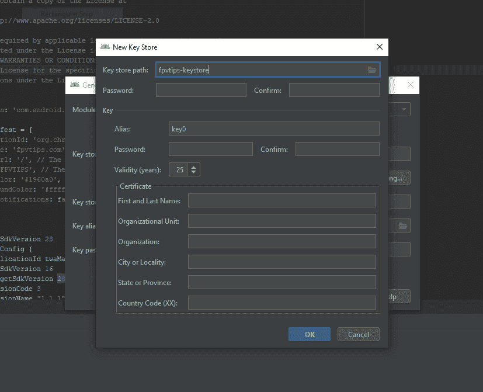
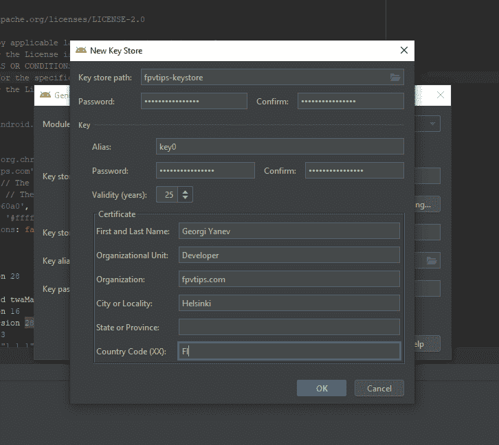
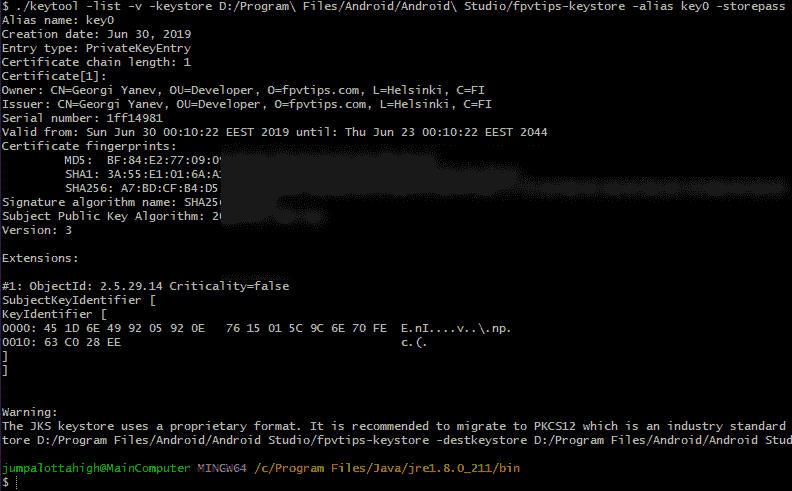
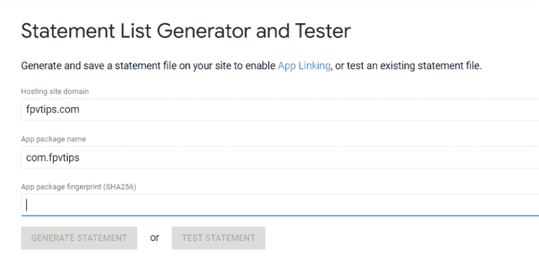
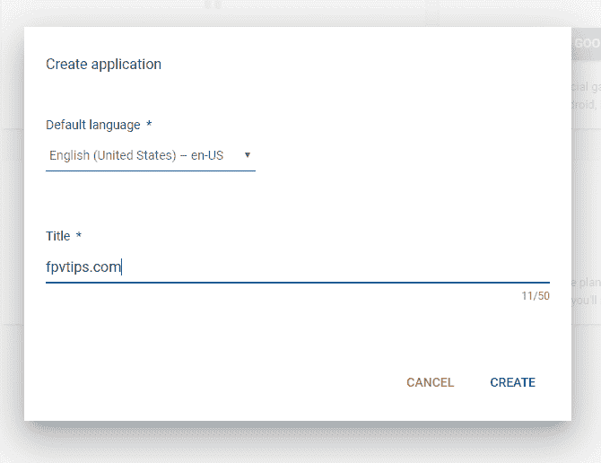
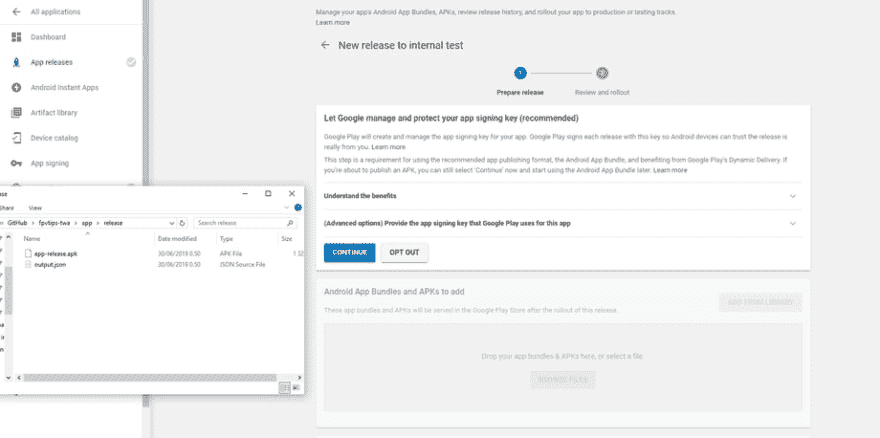
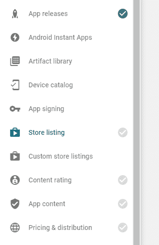
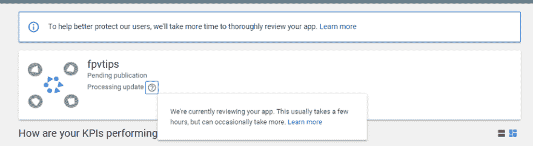

# 如何在 Google Play 商店发布 PWA

> 原文：<https://dev.to/jumpalottahigh/how-to-publish-a-pwa-on-the-google-play-store-2bid>

如果你从事网络开发，你可能听说过这个术语[渐进式网络应用(PWA)](https://codelabs.developers.google.com/codelabs/your-first-pwapp/#0) 。它已经流传了很长时间，肯定不再被认为是新奇的了。事实上，许多大型出版物和网站已经实现了被视为 PWA 所需的功能。这篇博客文章的目的不是让你熟悉 PWAs 或向你推销这个想法，但在我们进入如何在 Google Play 商店上发布这样一个应用程序之前，我想至少用一段话来揭开我们正在谈论的核心思想的神秘面纱。

> 如果你熟悉 PWA 或者不关心“为什么”,直接跳到在 Google Play 上发布 PWA。
> 
> **如果你只是想看看最终的结果——Google Play 中的 [fpvtips。基于 PWA at-](https://play.google.com/store/apps/details?id=com.fpvtips&hl=en)[www.fpvtips.com](https://www.fpvtips.com)T5】**

### 渐进式网络应用

拥有 PWA 有什么好处？很多。从网站整体性能的提升、在用户离线时提供内容的能力、通过 HTTPS 保护内容、在许多设备上安装应用的能力，包括最近登陆的桌面安装的[支持](https://developers.google.com/web/progressive-web-apps/desktop)。

简而言之，PWA 必须有一个清单文件和一个服务人员(以及[许多其他东西，这里是完整的清单](https://developers.google.com/web/progressive-web-apps/checklist))。manifest 文件(名为`manifest.webmanifest`)描述了许多 app 细节，比如不同的 logo 资产、主题颜色、背景颜色、app 名称等。你可以在这里阅读更多关于清单文件的信息。

下面是我的 PWA-[www.fpvtips.com](https://www.fpvtips.com)
的清单文件

```
{  "name":  "fpvtips.com",  "short_name":  "FPVtips",  "start_url":  "/",  "background_color":  "#ffffff",  "theme_color":  "#1960a0",  "display":  "minimal-ui",  "icons":  [  {  "src":  "icons/icon-48x48.png?v=3b3221797eeeddae218baf403c63f18d",  "sizes":  "48x48",  "type":  "image/png"  },  {  "src":  "icons/icon-72x72.png?v=3b3221797eeeddae218baf403c63f18d",  "sizes":  "72x72",  "type":  "image/png"  },  {  "src":  "icons/icon-96x96.png?v=3b3221797eeeddae218baf403c63f18d",  "sizes":  "96x96",  "type":  "image/png"  },  {  "src":  "icons/icon-144x144.png?v=3b3221797eeeddae218baf403c63f18d",  "sizes":  "144x144",  "type":  "image/png"  },  {  "src":  "icons/icon-192x192.png?v=3b3221797eeeddae218baf403c63f18d",  "sizes":  "192x192",  "type":  "image/png"  },  {  "src":  "icons/icon-256x256.png?v=3b3221797eeeddae218baf403c63f18d",  "sizes":  "256x256",  "type":  "image/png"  },  {  "src":  "icons/icon-384x384.png?v=3b3221797eeeddae218baf403c63f18d",  "sizes":  "384x384",  "type":  "image/png"  },  {  "src":  "icons/icon-512x512.png?v=3b3221797eeeddae218baf403c63f18d",  "sizes":  "512x512",  "type":  "image/png"  }  ]  } 
```

<svg width="20px" height="20px" viewBox="0 0 24 24" class="highlight-action crayons-icon highlight-action--fullscreen-on"><title>Enter fullscreen mode</title></svg> <svg width="20px" height="20px" viewBox="0 0 24 24" class="highlight-action crayons-icon highlight-action--fullscreen-off"><title>Exit fullscreen mode</title></svg>

服务工作者本质上是允许你支持网上离线体验的脚本。如果用户没有互联网连接，他们试图在你的应用程序上访问一条路线，他们通常会遇到问题，得不到任何内容。服务人员所做的是，他们在第一次访问时安装自己，并且他们可以在随后的访问中，通过在请求到达网络之前拦截请求，自己提供内容。我说的太简单了，有很多策略你可以应用，总的来说，至少对我来说，服务人员可以很快变得非常复杂。我想我只是一个普通的开发者，而不是一个忍者/摇滚明星开发者😉。你可以在谷歌开发者基础网站上阅读更多关于服务人员的信息。

幸运的是，有一个项目可以帮助您设置一个服务人员，这比您自己从头开始编写整个功能要容易得多。如果这是你想采用的方法，请查看[工具箱](https://developers.google.com/web/tools/workbox/)。

更幸运的是，许多现代 web 框架支持为您创建 pwa，因此您不必手动做太多工作。真是油嘴滑舌！React 领域有一些项目，如 [Gatsby](https://www.gatsbyjs.org/docs/progressive-web-app/) 和 [Create React App](https://facebook.github.io/create-react-app/docs/making-a-progressive-web-app) (仅举几个例子)，它们使得使用全新的 PWA 来启动和运行变得轻而易举。如果我没记错的话，Vue CLI 工具还允许您轻松创建 PWA。

这让我想到了我的项目，并结束了 PWA 的介绍。我将 www.fpvtips.com 作为一个公共工程协会，与 T2·盖茨比一起建造。我的项目的源代码是开放的，可以在 https://github.com/jumpalottahigh/fpvtips 的[获得。](https://github.com/jumpalottahigh/fpvtips)

我非常喜欢用 Gatsby 构建东西，因为它允许我使用 React、GraphQL、部署性能优先构建的体验、为早餐创建 pwa，而且用它来构建东西是一种乐趣。你可以在这里阅读更多关于为什么[我喜欢 JAMstack，Gatsby 和 Netlify】。](https://blog.georgi-yanev.com/learning/jamstack-with-gatsby-and-netlify/)

因此，您已经使用 Gatsby 完成了基本的 PWA 设置。你跑了:

```
npx gatsby new my-pwa 
```

<svg width="20px" height="20px" viewBox="0 0 24 24" class="highlight-action crayons-icon highlight-action--fullscreen-on"><title>Enter fullscreen mode</title></svg> <svg width="20px" height="20px" viewBox="0 0 24 24" class="highlight-action crayons-icon highlight-action--fullscreen-off"><title>Exit fullscreen mode</title></svg>

然后你通过取消注释启用了`gatsby-config.js`中的离线插件。是的，这真的很重要💜。运行`gatsby build`并把名为`public`的输出文件夹拖放到 [Netlify](https://www.netlify.com/) 的奖励点，有效地在几秒钟内在互联网上启动并运行。很疯狂，对吧？而且他们说 2019 年 web dev 很难。

现在说点好的。现在，你可以将一个网站打包在一个浏览器中，然后将这个混合应用程序部署到 Google Play 商店。但是，如果用户没有互联网连接，你就不走运了。现在，有一种更好的方法，不需要任何网络浏览诡计。输入，[可信网络活动(TWA)](https://developers.google.com/web/updates/2019/02/using-twa) 。我不会说太多细节，如果你想知道更多，可以读一下。

简单地说，我偶然发现了斯文·布达克的这篇文章和 Fireship.io 的这个 T2 视频，这两个视频详细描述了如何使用 TWA 来设置发布到 Google Play 的 PWA。

但是，在我们深入研究我在斯文的文章中概述的设置方法的经验(以及从那以后我不得不添加的一些变化)之前，请注意，有一种更简单的方法可以做到这一点，那就是使用名为 [pwa2apk](https://pwa2apk.com/) 的服务。

### 让我们向 Google Play 发送一个 PWA

1.  首先，去拿一份安卓工作室的拷贝，把它安装在你的电脑上，和它想下载的任何包放在一起。

2.  向谷歌支付 25 美元，获得被称为谷歌安卓开发者的权利。

3.  克隆这个库-[https://github.com/GoogleChromeLabs/svgomg-twa](https://github.com/GoogleChromeLabs/svgomg-twa)。这才是这部剧真正的明星。这个样板文件已经完全设置好了，所以除了修改几个字符串之外，我们不需要做任何事情。

4.  在 Android Studio 中打开该项目，找到文件`app/src/build.gradle`，并根据您的项目编辑以下位:

```
def twaManifest = [
    applicationId: 'com.fpvtips',
    hostName: 'fpvtips.com', // The domain being opened in the TWA.
    launchUrl: '/', // The start path for the TWA. Must be relative to the domain.
    name: 'FPVTIPS', // The name shown on the Android Launcher.
    themeColor: '#1960a0', // The color used for the status bar.
    backgroundColor: '#ffffff', // The color used for the splash screen background.
    enableNotifications: false // Set to true to enable notification delegation
] 
```

<svg width="20px" height="20px" viewBox="0 0 24 24" class="highlight-action crayons-icon highlight-action--fullscreen-on"><title>Enter fullscreen mode</title></svg> <svg width="20px" height="20px" viewBox="0 0 24 24" class="highlight-action crayons-icon highlight-action--fullscreen-off"><title>Exit fullscreen mode</title></svg>

 [<source type="image/webp">
<source type="image/png">
](///static/c4aa500fd1568ba2bcd90ae08c9f4688/23205/how-to-publish-a-pwa-on-google-play-1.png) 

5.创建一个签名的构建 apk。

 [<source type="image/webp">
<source type="image/png">
](///static/c263e7bcb0b8480bf9f4baa6065ad462/23205/how-to-publish-a-pwa-on-google-play-2.png) 

第一次，您必须创建一个新的密钥库。

 [<source type="image/webp">
<source type="image/png">
](///static/ef3410fc0353a089a6a3f5d828bc426a/250c6/how-to-publish-a-pwa-on-google-play-3.png) 

填写所有细节并记住密码，因为我们稍后会用到它。

 [<source type="image/webp">
<source type="image/png">
](///static/a52a8930b931ede9f95751b330252aea/98bb9/how-to-publish-a-pwa-on-google-play-4.png) 

在终端中运行此命令:

```
keytool -list -v -keystore PATH_TO_YOUR_KEYSTORE -alias KEYSTORE_ALIAS -storepass YOUR_PASSWORD -keypass YOUR_PASSWORD 
```

<svg width="20px" height="20px" viewBox="0 0 24 24" class="highlight-action crayons-icon highlight-action--fullscreen-on"><title>Enter fullscreen mode</title></svg> <svg width="20px" height="20px" viewBox="0 0 24 24" class="highlight-action crayons-icon highlight-action--fullscreen-off"><title>Exit fullscreen mode</title></svg>

对我来说，在这一点上很多事情都出错了。如果您得到一个消息`keytool is not recognized`，您可能必须将 Java 添加到您的路径中，或者如果您很懒(像我一样)，只需从您的 Java 安装的 bin 目录调用 keytool，或者，只需将目录更改到您的 Java 安装下的/bin/目录并从那里运行它。

这是我如何运行我的命令的(我只是修改了我的密码，但是你已经明白了):

```
cd C:/Program\ Files/Java/jre1.8.0_211/bin/
 ./keytool -list -v -keystore D:/Program\ Files/Android/Android\ Studio/fpvtips-keystore -alias key0 -storepass MY_PASSWORD -keypass MY_PASSWORD 
```

<svg width="20px" height="20px" viewBox="0 0 24 24" class="highlight-action crayons-icon highlight-action--fullscreen-on"><title>Enter fullscreen mode</title></svg> <svg width="20px" height="20px" viewBox="0 0 24 24" class="highlight-action crayons-icon highlight-action--fullscreen-off"><title>Exit fullscreen mode</title></svg>

如果一切顺利，你将得到一个`SHA256`，你需要复制它用于下一步。复制字符串时，要小心字符串前面的危险空格。

 [<source type="image/webp">
<source type="image/png">
](///static/c80404ab5d8388beb89f585d62c3fd51/b87cb/how-to-publish-a-pwa-on-google-play-5.png) 

6.去[谷歌数字资产链接](https://developers.google.com/digital-asset-links/tools/generator)并使用他们的声明列表生成器和测试工具。填写信息。粘贴`SHA256`，点击`Generate Statement`。复制输出 JSON。

 [<source type="image/webp">
<source type="image/png">
](///static/e2eb9d51efbfb57bcb025ebf7d4df1ab/442b3/how-to-publish-a-pwa-on-google-play-6.png) 

7.在站点的根目录下创建一个名为`.well-known`的文件，文件名为`assetlinks.json`。将上一步中的 JSON 粘贴到该文件中。发布此文件，使其处于活动状态。在 Gatsby 的例子中，您将在名为`static`的目录下创建目录和文件。这将被复制到生产站点的根目录。

 [<source type="image/webp">
<source type="image/png">
](///static/c96c7b8976d305d2218832bccb8dc268/b3818/how-to-publish-a-pwa-on-google-play-7.png) 

8.再次构建一个签名的 apk，并在`/app/release/app-release.apk`或类似的目录下找到该文件。

9.前往控制台，在 [Google Play 中创建一个新应用。](https://play.google.com/apps/publish/)

 [<source type="image/webp">
<source type="image/png">
](///static/266d7036f1b34fb9403fffb59daabad2/c3783/how-to-publish-a-pwa-on-google-play-8.png) 

10.转到`App releases`并将 APK 拖放到拖放区，上传您的 APK 文件。

 [<source type="image/webp">
<source type="image/png">
](///static/2a419d31182b5e42d3bd4346e64e25ca/d2046/how-to-publish-a-pwa-on-google-play-9.png) 

11.填写所有必需的信息，并等待审查。

从应用发布选项卡，您最终可以发布应用的测试版本或生产版本。我直接去生产了。不管是哪种情况，你都必须填写一堆信息，这实际上比你一开始想象的要少，但还是有点麻烦。

一个很好的指示器是灰色的复选标记图标，当您完成一个部分时，它会变成绿色。

 [<source type="image/webp">
<source type="image/png">
](///static/e73fb3ac3258bbbef575a655e581c171/5155a/how-to-publish-a-pwa-on-google-play-10.png) 

如果你已经完成了所有事情，在某些情况下，你可能需要等待几分钟(对我来说不到一个小时)才能进行审核，然后你的应用程序才可以在 Google Play 商店中使用。

 [<source type="image/webp">
<source type="image/png">
](///static/d4148df3fc112802b13c78c56f102c8b/33fe4/how-to-publish-a-pwa-on-google-play-11.png) 

如果你需要快速生成大量图像(你有点需要)，你可以依靠这个神奇的工具- [Android Asset Studio](https://romannurik.github.io/AndroidAssetStudio/index.html) 。如果您想解决在 Google Play 控制台中收到的关于资产优化的警告，请创建一个新版本，但选择应用捆绑包而不是 APK。这将创建一个优化的包。

就这些:)恭喜你！你把一个 PWA 运到了 Google Play 商店！大起来！如果你想联系，请在 [Twitter](https://twitter.com/jumpalottahigh) 或 [Github](https://github.com/jumpalottahigh) 上关注我。